<div align="center">
    <h3>Universidad Peruana de Ciencias Aplicadas</h3>
    </img><br>
    <strong>Ingeniería de Software</strong><br><br>
    <strong>2025-2</strong><br><br>
    <strong>Arquitecturas De Software Emergentes</strong><br>
    1ASI0728
    <br><strong>NRC: 7295</strong><br>
    <br><strong>Profesor: Royer Edelwer Rojas Malasquez</strong><br>
    <br><strong>"Informe de Trabajo Parcial"</strong><br>
    <br><strong>BestWin Startup</strong><br>
    <strong>Betalyze</strong>
    <br><h3> Integrantes: </h3>
</div>

<div align="center">

| Member                              |    Code    |
| :---------------------------------- | :--------: |
| Bernaola Pérez, André Arturo        | U202114192 |
| Loli Ruiz Renzo, Javier             | U20161c993 |
| Soriano Medrano, Diego              | U202114793 |

</div>

<h3 align="center">Setiembre, 2025</h3>

<br><br>

<div align="justify">


## Registro de Versiones del Informe

En esta sección se resumen los avances y modificaciones realizadas durante el ciclo de vida de desarrollo del proyecto equivalente a un semestre.

<table>
  <thead>
    <tr>
      <th>Versión</th>
      <th>Fecha</th>
      <th>Autor</th>
      <th>Descripción de modificación</th>
    </tr>
  </thead>
  <tbody>
    <tr>
      <td>1.0</td>
      <td>10/09/2025</td>
      <td>BestWin</td>
      <td>Desarrollo de la primera versión del informe e inicio de la documentación para el desarrollo de nuestra solución elaborando la presentación, obtención de requisitos, especificación de requerimientos y diseño de nuestra solución. </td>
    </tr>
    <tr>
      <td>2.0</td>
      <td>01/10/2025</td>
      <td>BestWin</td>
      <td> Elaboración de la segunda versión del informe que comprende el diseño, para la estandarización y calidad de la interfaz de usuario. Se cubre el Diseño de Software Táctico y la creación de las directrices clave como guías de estilo, de diseño y de arquitectura de información. Describiendo las guías visuales para la producción de los wireframes y mockups de los productos de la solución. </td>
    </tr>
    <tr>
      <td>3.0</td>
      <td>11/11/2025</td>
      <td>BestWin</td>
      <td> Elaboración de la segunda versión del informe que comprende la implementación de productos Web, Móvil y los Servicios Web. Las funcionalidades principales, como Dashboard, Value Bets, Filtros, Favoritos y Detalles de Partido, fueron desarrolladas para ambas plataformas, a la par de realizar la documentación del desarrollo realizado en el reporte. Finalmente, se describieron las entrevistas de validación y se redactó la evaluación según heurísticas para los productos. </td>
    </tr>
    <!--
    <tr>
      <td>4.0</td>
      <td>Fecha</td>
      <td>BestWin</td>
      <td>...</td>
    </tr>
    -->
  </tbody>
</table>
<br>


# Project Report Collaboration Insights

<br>

Se utilizaron Git y Github para el versionamiento y gestión del proyecto, lo cual permite una mejor colaboración y visualización de cambios en tiempo real. A continuación, se proporcionan los siguientes enlaces del proyecto:

| **Descripción**                  | **Enlace**                                                                 |
| :------------------------------: | :------------------------------------------------------------------------: |
| Organización del proyecto        | https://github.com/upc-pre-202520-7295             |
| Repositorio de la documentación  | https://github.com/upc-pre-202520-7295/Report      |

<br>

- Evidencia en imagen de los analíticos de colaboración y commits en GitHub:

  - **TB1:**
  
  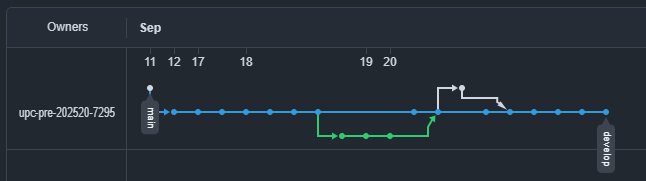

- Evidencia en imagen de los analíticos de colaboración y commits en GitHub:

  - **TB2:**
  
  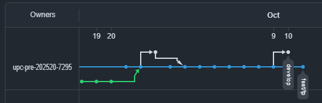

<br>


# Contenido

## Tabla de Contenidos

### [Registro de Versiones del Informe](#registro-de-versiones-del-informe)

### [Project Report Collaboration Insights](#project-report-collaboration-insights)

### [Contenido](#contenido)

### [Student Outcomes](#student-outcome)

### [Capítulo I: Introducción](#capítulo-i-introducción)
  - [1.1. Startup Profile](#11-startup-profile)
    - [1.1.1. Descripción de la Startup](#111-descripción-de-la-startup)
    - [1.1.2. Perfiles de integrantes del equipo](#112-perfiles-de-integrantes-del-equipo)
  - [1.2. Solution Profile](#12-solution-profile)
    - [1.2.1. Antecedentes y problemática](#121-antecedentes-y-problemática)
    - [1.2.2. Lean UX Process](#122-lean-ux-process)
      - [1.2.2.1. Lean UX Problem Statements](#1221-lean-ux-problem-statements)
      - [1.2.2.2. Lean UX Assumptions](#1222-lean-ux-assumptions)
      - [1.2.2.3. Lean UX Hypothesis Statements](#1223-lean-ux-hypothesis-statements)
      - [1.2.2.4. Lean UX Canvas](#1224-lean-ux-canvas)
  - [1.3. Segmentos objetivo](#13-segmentos-objetivo)

### [Capítulo II: Requirements Elicitation & Analysis](#capítulo-ii-requirements-elicitation--analysis)
- [2.1. Competidores](#21-competidores)
  - [2.1.1. Análisis competitivo](#211-análisis-competitivo)
  - [2.1.2. Estrategias y tácticas frente a competidores](#212-estrategias-y-tácticas-frente-a-competidores)
- [2.2. Entrevistas](#22-entrevistas)
  - [2.2.1. Diseño de entrevistas](#221-diseño-de-entrevistas)
  - [2.2.2. Registro de entrevistas](#222-registro-de-entrevistas)
  - [2.2.3. Análisis de entrevistas](#223-análisis-de-entrevistas)
- [2.3. Needfinding](#23-needfinding)
  - [2.3.1. User Personas](#231-user-personas)
  - [2.3.2. User Task Matrix](#232-user-task-matrix)
  - [2.3.3. Empathy Mapping](#234-empathy-mapping)
  - [2.3.4. As-is Scenario Mapping](#235-as-is-scenario-mapping)
- [2.4. Ubiquitous Language](#24-ubiquitous-language)

### [Capítulo III: Requirements Specification](#capítulo-iii-requirements-specification)
- [3.1. To-Be Scenario Mapping](#31-to-be-scenario-mapping)
- [3.2. User Stories](#32-user-stories)
- [3.3. Impact Mapping](#33-impact-mapping)
- [3.4. Product Backlog](#34-product-backlog)

### [Capítulo IV: Strategic-Level Software Design](#capítulo-iv-strategic-level-software-design)
- [4.1. Strategic-Level Attribute-Driven Design](#41-strategic-level-attribute-driven-design)
  - [4.1.1. Design Purpose](#411-design-purpose)
  - [4.1.2. Attribute-Driven Design Inputs](#412-attribute-driven-design-inputs)
    - [4.1.2.1. Primary Functionality (Primary User Stories)](#4121-primary-functionality-primary-user-stories)
    - [4.1.2.2. Quality attribute Scenarios](#4122-quality-attribute-scenarios)
    - [4.1.2.3. Constraints](#4123-constraints)
- [4.1.3. Architectural Drivers Backlog](#413-architectural-drivers-backlog)
  - [4.1.4. Architectural Design Decisions](#414-architectural-design-decisions)
  - [4.1.5. Quality Attribute Scenario Refinements](#415-quality-attribute-scenario-refinements)
- [4.2. Strategic-Level Domain-Driven Design](#42-strategic-level-domain-driven-design)
  - [4.2.1. EventStorming](#421-eventstorming)
  - [4.2.2. Candidate Context Discovery](#422-candidate-context-discovery)
  - [4.2.3. Domain Message Flows Modeling](#423-domain-message-flows-modeling)
  - [4.2.4. Bounded Context Canvases](#424-bounded-context-canvases)
  - [4.2.5. Context Mapping](#425-context-mapping)
- [4.3. Software Architecture](#43-software-architecture)
  - [4.3.1. Software Architecture System Landscape Diagram](#431-software-architecture-system-landscape-diagram)
  - [4.3.2. Software Architecture Context Level Diagrams](#432-software-architecture-context-level-diagrams)
  - [4.3.3. Software Architecture Container Level Diagrams](#433-software-architecture-container-level-diagrams)
  - [4.3.4. Software Architecture Deployment Diagrams](#434-software-architecture-deployment-diagrams)

### [Capítulo V: Tactical-Level Software Design](#capítulo-v-tactical-level-software-design)
- [5.1. Bounded Context: Data Retrieval](#51-bounded-context-data-retrieval)
  - [5.1.1. Domain Layer](#511-domain-layer)
  - [5.1.2. Interface Layer](#512-interface-layer)
  - [5.1.3. Application Layer](#513-application-layer)
  - [5.1.4. Infrastructure Layer](#514-infrastructure-layer)
  - [5.1.6. Bounded Context Software Architecture Component Level Diagrams](#516-bounded-context-software-architecture-component-level-diagrams)
  - [5.1.7. Bounded Context Software Architecture Code Level Diagrams](#517-bounded-context-software-architecture-code-level-diagrams)
    - [5.1.7.1. Bounded Context Domain Layer Class Diagrams](#5171-bounded-context-domain-layer-class-diagrams)
    - [5.1.7.2. Bounded Context Database Design Diagram](#5172-bounded-context-database-design-diagram)
- [5.2. Bounded Context: Prediction & Analytics](#52-bounded-context-prediction-analytics)
  - [5.2.1. Domain Layer](#521-domain-layer)
  - [5.2.2. Interface Layer](#522-interface-layer)
  - [5.2.3. Application Layer](#523-application-layer)
  - [5.2.4. Infrastructure Layer](#524-infrastructure-layer)
  - [5.2.6. Bounded Context Software Architecture Component Level Diagrams](#526-bounded-context-software-architecture-component-level-diagrams)
  - [5.2.7. Bounded Context Software Architecture Code Level Diagrams](#527-bounded-context-software-architecture-code-level-diagrams)
    - [5.2.7.1. Bounded Context Domain Layer Class Diagrams](#5271-bounded-context-domain-layer-class-diagrams)
    - [5.2.7.2. Bounded Context Database Design Diagram](#5272-bounded-context-database-design-diagram)
- [5.3. Bounded Context: Betting Insights](#53-bounded-context-betting-insights)
  - [5.3.1. Domain Layer](#531-domain-layer)
  - [5.3.2. Interface Layer](#532-interface-layer)
  - [5.3.3. Application Layer](#533-application-layer)
  - [5.3.4. Infrastructure Layer](#534-infrastructure-layer)
  - [5.3.6. Bounded Context Software Architecture Component Level Diagrams](#536-bounded-context-software-architecture-component-level-diagrams)
  - [5.3.7. Bounded Context Software Architecture Code Level Diagrams](#537-bounded-context-software-architecture-code-level-diagrams)
    - [5.3.7.1. Bounded Context Domain Layer Class Diagrams](#5371-bounded-context-domain-layer-class-diagrams)
    - [5.3.7.2. Bounded Context Database Design Diagram](#5372-bounded-context-database-design-diagram)
- [5.4. Bounded Context: Notification](#54-bounded-context-notification)
  - [5.4.1. Domain Layer](#541-domain-layer)
  - [5.4.2. Interface Layer](#542-interface-layer)
  - [5.4.3. Application Layer](#543-application-layer)
  - [5.4.4. Infrastructure Layer](#544-infrastructure-layer)
  - [5.4.6. Bounded Context Software Architecture Component Level Diagrams](#546-bounded-context-software-architecture-component-level-diagrams)
  - [5.4.7. Bounded Context Software Architecture Code Level Diagrams](#547-bounded-context-software-architecture-code-level-diagrams)
    - [5.4.7.1. Bounded Context Domain Layer Class Diagrams](#5471-bounded-context-domain-layer-class-diagrams)
    - [5.4.7.2. Bounded Context Database Design Diagram](#5472-bounded-context-database-design-diagram)
- [5.5. Bounded Context: User Management](#55-bounded-context-user-management)
  - [5.5.1. Domain Layer](#551-domain-layer)
  - [5.5.2. Interface Layer](#552-interface-layer)
  - [5.5.3. Application Layer](#553-application-layer)
  - [5.5.4. Infrastructure Layer](#554-infrastructure-layer)
  - [5.5.6. Bounded Context Software Architecture Component Level Diagrams](#556-bounded-context-software-architecture-component-level-diagrams)
  - [5.5.7. Bounded Context Software Architecture Code Level Diagrams](#557-bounded-context-software-architecture-code-level-diagrams)
    - [5.5.7.1. Bounded Context Domain Layer Class Diagrams](#5571-bounded-context-domain-layer-class-diagrams)
    - [5.5.7.2. Bounded Context Database Design Diagram](#5572-bounded-context-database-design-diagram)
- [5.6. Bounded Context: Favorite User Teams](#56-bounded-context-favorite-user-teams)
  - [5.6.1. Domain Layer](#561-domain-layer)
  - [5.6.2. Interface Layer](#562-interface-layer)
  - [5.6.3. Application Layer](#563-application-layer)
  - [5.6.4. Infrastructure Layer](#564-infrastructure-layer)
  - [5.6.6. Bounded Context Software Architecture Component Level Diagrams](#566-bounded-context-software-architecture-component-level-diagrams)
  - [5.6.7. Bounded Context Software Architecture Code Level Diagrams](#567-bounded-context-software-architecture-code-level-diagrams)
    - [5.6.7.1. Bounded Context Domain Layer Class Diagrams](#5671-bounded-context-domain-layer-class-diagrams)
    - [5.6.7.2. Bounded Context Database Design Diagram](#5672-bounded-context-database-design-diagram)

### [Capítulo VI: Solution UX Design](#capítulo-vi-solution-ux-design)
- [6.1. Style Guidelines](#61-style-guidelines)
  - [6.1.1. General Style Guidelines](#611-general-style-guidelines)
  - [6.1.2. Web, Mobile & Devices Style Guidelines](#612-web-mobile-devices-style-guidelines)
- [6.2. Information Architecture](#62-information-architecture)
  - [6.2.2. Labeling Systems](#622-labeling-systems)
  - [6.2.3. Searching Systems](#623-searching-systems)
  - [6.2.4. SEO Tags and Meta Tags](#624-seo-tags-and-meta-tags)
  - [6.2.5. Navigation Systems](#625-navigation-systems)
- [6.3. Landing Page UI Design](#63-landing-page-ui-design)
  - [6.3.1. Landing Page Wireframe](#631-landing-page-wireframe)
  - [6.3.2. Landing Page Mock-up](#632-landing-page-mock-up)
- [6.4. Applications UX/UI Design](#64-applications-uxui-design)
  - [6.4.1. Applications Wireframes](#641-applications-wireframes)
  - [6.4.2. Applications Wireflow Diagrams](#642-applications-wireflow-diagrams)
  - [6.4.2. Applications Mock-ups](#642-applications-mock-ups)
  - [6.4.3. Applications User Flow Diagrams](#643-applications-user-flow-diagrams)
- [6.5. Applications Prototyping](#65-applications-prototyping)

### [Capítulo VII: Product Implementation, Validation & Deployment](#capítulo-vii-product-implementation-validation-deployment)
- [7.1. Software Configuration Management](#71-software-configuration-management)
  - [7.1.1. Software Development Environment Configuration](#711-software-development-environment-configuration)
  - [7.1.2. Source Code Management](#712-source-code-management)
  - [7.1.3. Source Code Style Guide & Conventions](#713-source-code-style-guide-conventions)
  - [7.1.4. Software Deployment Configuration](#714-software-deployment-configuration)
- [7.2. Solution Implementation](#72-solution-implementation)
  - [7.2.1. Sprint 1](#721-sprint-1)
    - [7.2.1.1. Sprint Planning 1](#7211-sprint-planning-1)
    - [7.2.1.2. Sprint Backlog 1](#7212-sprint-backlog-1)
    - [7.2.1.3. Development Evidence for Sprint Review](#7213-development-evidence-for-sprint-review)
    - [7.2.1.4. Testing Suite Evidence for Sprint Review](#7214-testing-suite-evidence-for-sprint-review)
    - [7.2.1.5. Execution Evidence for Sprint Review](#7215-execution-evidence-for-sprint-review)
    - [7.2.1.6. Services Documentation Evidence for Sprint Review](#7216-services-documentation-evidence-for-sprint-review)
    - [7.2.1.7. Software Deployment Evidence for Sprint Review](#7217-software-deployment-evidence-for-sprint-review)
    - [7.2.1.8. Team Collaboration Insights during Sprint](#7218-team-collaboration-insights-during-sprint)
- [7.3. Validation Interviews](#73-validation-interviews)
  - [7.3.1. Diseño de Entrevistas](#731-diseño-de-entrevistas)
  - [7.3.2. Registro de Entrevistas](#732-registro-de-entrevistas)
  - [7.3.3. Evaluaciones según heurísticas](#733-evaluaciones-según-heurísticas)
- [7.4. Video About-the-Product](#74-video-about-the-product)

<br>

### [Conclusiones](#conclusiones)
### [Bibliografía](#bibliografía)
### [Anexos](#anexos)

---

# Student Outcome

Criterio: Capacidad de comunicarse efectivamente con un rango de audiencias. En el siguiente cuadro se describe las acciones realizadas y enunciados de conclusiones por parte del grupo, que permiten sustentar el haber alcanzado el logro del ABET – EAC - Student Outcome 3.

| **Criterio específico** | **Acciones realizadas** | **Conclusiones** |
|---------------------|---------------------|--------------|
| Comunica oralmente sus ideas y/o resultados con objetividad a público de diferentes especialidades y niveles jerarquicos, en el marco del desarrollo de un proyecto en ingeniería. | **Bernaola Pérez, André Arturo**<br>*TB1*<br>  Durante el proyecto comuniqué de forma oral mis ideas y resultados al equipo, presentando los diagramas de arquitectura y explicando los hallazgos de las entrevistas. Esto permitió que todos comprendieran las decisiones técnicas y de análisis, facilitando la coordinación y el trabajo en conjunto.  <br><br>*TP*<br> Aseguré la coordinación entre el diseño de software y la implementación al documentar los diagramas de arquitectura de componentes y de código, facilitando la comunicación técnica con el equipo de desarrollo. <br><br>*TB2*<br> Para esta entrega establecí los sistemas de búsqueda y navegación como parte de la solución Móvil. La navegación es intuitiva entre el Dashboard y Value Bets, y la vista Filters and Search. Permitiendo la gestión visual de equipos y partidos.  <br><br> **Loli Ruiz, Renzo Javier**<br>*TB1*<br> En esta fase del proyecto comuniqué de forma oral las decisiones de diseño basadas en el proceso de DDD a todo el equipo detallando los contextos delimitados y los Lenguajes Ubicuos para modelar el dominio del negocio.  <br><br>*TP*<br>   Para esta entrega establecí los sistemas de búsqueda, etiquetado y navegación como parte de la Arquitectura de Información de la solución. <br><br>*TB2*<br> Desarrollo de funcionalidades definidas para el Sprint 1 de la implementación de Betalyze. Se estableció la integración y obtención de datos de APIs externas para proveer información. Paralelamente, se desarrollaron los servicios esenciales basados en Spring Boot para gestión de equipos favoritos y la administración de notificaciones. <br><br> **Soriano Medrano, Diego**<br>*TB1*<br>  En esta primera fase del proyecto comuniqué en reuniones del equipo temas relacionados a los escenarios de atributos de calidad, permitiendo que el equipo pueda plantear el diseño arquitectónico. <br><br>*TP*<br> Para esta entrega se coordinó los wireframes y mock-ups tanto para la Landing Page como para las pantallas principales de las Aplicaciones.  <br><br>*TB2*<br> Establecí los sistemas de búsqueda y navegación como parte de la solución Web. Esto se logró con el desarrollo de cards informativas y etiquetas en vistas como Dashboard y Value Bets, optimizando la forma en que los usuarios acceden y procesan la información de los partidos.  <br><br> | <br><br>*TB1*<br> En el desarrollo de estos primeros capítulos, la comunicación oral fue fundamental para alinear al equipo y realizar el proceso de Domain-Driven Design (DDD) y detallar los escenarios de calidad clave. Explicar conceptos complejos como los Contextos Delimitados, el proceso de ADD y la elaboración de la arquitectura de nuestra solución aseguró que todos comprendieran y apoyaran el planteamiento de la solución, facilitando así una ejecución más fluida del proyecto.  <br><br>*TP*<br> La comunicación oral fue esencial para alinear al equipo y asegurar el avance del proyecto. Se presentaron y explicaron de forma clara los diagramas de arquitectura, el enfoque DDD y las decisiones de diseño UX/UI, logrando que todo el equipo entendiera y validara la estructura y el progreso de la solución.  <br><br>*TB2*<br> Se establece que, durante el primer sprint del proyecto Betalyze, el equipo de desarrollo alcanzó la implementación de los productos mínimos viables para las plataformas Web y Móvil, cubriendo las funcionalidades esenciales como Dashboard, Value Bets, Filters and Search, Metrics and History, y Favorites. Además, de realizar el desarrollo de los Servicios Web, logrando la integración con APIs externas para la obtención de datos, asegurando así la obtención de información para ambas aplicaciones.  <br><br> |
| Comunica en forma escrita ideas y/o resultados con objetividad a público de diferentes especialidades y niveles jerarquicos, en el marco del desarrollo de un proyecto en ingeniería. | **Bernaola Pérez, André Arturo**<br>*TB1*<br> Aporté en la comunicación escrita mediante la redacción de los primeros capítulos del informe, donde incluí el análisis del problema y el registro de entrevistas, además de documentar los diagramas de arquitectura. Con ello aseguré que la información se presentara de manera clara y objetiva para distintos públicos. <br><br>*TP*<br>  Para esta entrega aporté con la definición de las Guías de Estilo visuales y para dispositivos para la futura aplicación web y móvil.  <br><br>*TB2*<br> Para esta entrega aporte con la descripción de los sistemas de búsqueda y navegación. La usabilidad fue validada mediante entrevistas, confirmando que la información soporta efectivamente el acceso a los datos de predicción en dispositivos móviles.  <br><br> **Loli Ruiz, Renzo Javier**<br>*TB1*<br> Aporté a la comunicación escrita en el proyecto redacción de los contextos delimitados y sus mapas de contexto, aporté con el equipo describiendo las entidades, agregados y servicios de cada módulo clave para el negocio.   <br><br>*TP*<br> Presenté oralmente los diagramas de arquitectura de software y las decisiones técnicas basadas en Domain-Driven Design (DDD) para alinear la estrategia de desarrollo con el equipo.  <br><br>*TB2*<br> Aporte la descripción de la implementación de los servicios para la entrega de datos de partidos, la gestión de favoritos y las notificaciones, sentando la base de datos necesaria para el funcionamiento coherente de las aplicaciones frontend.  <br><br> **Soriano Medrano, Diego**<br>*TB1*<br> Aporté en la documentación de los escenarios de calidad, redacté información relacionada y los cuadros necesarios para el análisis de atributos de calidad, aportando a las decisiones arquitectónicas. <br><br>*TP*<br>  Facilité la comprensión de conceptos complejos como los Contextos Delimitados y los escenarios de atributos de calidad mediante presentaciones orales, asegurando el apoyo del equipo al planteamiento arquitectónico.    <br><br>*TB2*<br> Como resultado se describió la implementación de las páginas de la aplicación Web. El desarrollo cubrió la funcionalidad de visualización y filtrado de partidos, con una evaluación que garantiza una interfaz web clara y funcional.  <br><br> | <br><br>*TB1*<br>  A través de una comunicación escrita clara y objetiva, se aseguró que el equipo comprenda la información más importante y crítica del nuestra solución. La documentación detallada de los escenarios de calidad y los mapas de contexto de DDD sirvieron como una referencia, garantizando que las desiciones arquitectónicas estuvieran alineadas con los objetivos de nuestra solución.   <br><br>*TP*<br> La documentación escrita del informe técnico fue clave para comunicar con objetividad los resultados del proyecto. Al formalizar el Diseño Táctico y las Guías de Estilo y Arquitectura, se estableció una referencia única y clara que alineó al equipo, asegurando la consistencia y la toma de decisiones informada.   <br><br>*TB2*<br> El Sprint 1 de Betalyze aseguró la integración de datos externos y la exposición de información de partidos, favoritos y notificaciones. Paralelamente, se entregaron las funcionalidades centrales en la Aplicación Web y la Aplicación Móvil. Los productos fueron validados mediante entrevistas, confirmando la usabilidad y la entrega de información para el acceso efectivo a las predicciones y datos de partidos de fútbol.  <br><br> |

<br>


---
# Capítulo I: Introducción

## 1.1. Startup Profile

### 1.1.1. Descripción de la Startup

Somos una startup tecnológica enfocada en el mundo de las apuestas deportivas de fútbol, que busca transformar la manera en que los usuarios toman decisiones al apostar. Desarrollamos una aplicación que ofrece probabilidades claras, precisas y fáciles de entender, generadas a partir de datos estadísticos y algoritmos y machine learning, para que cada usuario pueda evaluar mejor sus opciones antes de apostar.<br>
Nos dirigimos principalmente a apostadores frecuentes que buscan eficiencia en su análisis y a fanáticos del fútbol que desean una guía objetiva y rápida. Nuestra propuesta de valor se basa en la simplicidad, confiabilidad y enfoque exclusivo en el fútbol, garantizando que la experiencia sea directa, sin sobrecarga de información y optimizada para uso web y móvil.

Misión:

- Ofrecer a los apostadores de fútbol una herramienta simple y confiable que presente probabilidades claras basadas en estadísticas, ayudando a tomar mejores decisiones y elevando la experiencia de apostar de manera más informada.

Visión:

- Convertirnos en la plataforma líder de predicciones de fútbol en Latinoamérica, reconocida por su precisión, facilidad de uso y capacidad de generar confianza en los usuarios al momento de apostar.


### 1.1.2. Perfiles de integrantes del equipo

|   Photo   |   Description    |
| :-------: | :--------------: |
| [](https://postimg.cc/hJycN98Y) | **Bernaola Pérez, André Arturo** <br> Estoy cursando la carrera de Ingeniería de Software, me gusta jugar videojuegos y aprender cosas nuevas en mis ratos libres. Aspiro a trabajar como desarrollador fullstack y me interesa mantenerme actualizado en nuevas tecnologías, buenas prácticas de programación y metodologías ágiles. |
|  | **Loli Ruiz, Renzo Javier** <br>  Soy Renzo Loli, tengo 26 años y soy de la carrera de Ingeniería de Software. Curso el 8vo ciclo. Tengo conocimientos en lenguages como javascript y python y base en arquitecturas cloud como aws. Me desemboco mejor en el ambito de identificar y resolver problemas. |
| [](https://postimg.cc/TKcDL4GW) | **Soriano Medrano, Diego** <br>  Estudio la carrera de ingeniería de software. Me considero una persona creativa y paciente. Tengo conocimiento en el uso de diferentes herramientas informáticas y lenguajes de programación. que ayudan a realizar distintos tipos de trabajo y a resolver problemas. Parte de mis habilidades blandas es siempre tomar en cuenta la opinión de mis compañeros, lo cual me facilita el poder trabajar en equipo, para agilizar diferentes actividades. |


## 1.2. Solution Profile

### 1.2.1. Antecedentes y problemática

**Aplicación de técnica The 5 'W's y 2'H's:**

- **What ¿Qué?**<br>
 El problema radica en que los apostadores frecuentes y fanáticos del fútbol en Perú toman decisiones de apuesta basadas en intuición, datos incompletos o fuentes poco confiables. Las plataformas disponibles ofrecen información dispersa, difícil de interpretar o enfocada en múltiples deportes, lo que genera sobrecarga de datos, baja precisión y mayor riesgo económico al apostar. 

- **When ¿Cuándo?**<br> 
 El problema surge en el momento en que los usuarios deben decidir por quién apostar antes o durante los partidos de fútbol. En ese proceso, se enfrentan a información confusa, poco adaptada a su contexto y sin un análisis claro que facilite la toma de decisiones. 

- **Where ¿Dónde?**<br>
 El cliente suele usar estas plataformas desde su celular o computadora, en cualquier lugar donde tenga acceso a internet: en casa, en bares deportivos, en el estadio o mientras se traslada. El problema aparece principalmente en entornos cotidianos de apuesta, donde la rapidez y la claridad de la información son clave. 

- **Who ¿Quién?**<br>
 Los principales involucrados son los apostadores frecuentes (que buscan aumentar sus probabilidades de ganar y reducir pérdidas) y los fanáticos del fútbol, que buscan disfrutar más de su experiencia con predicciones confiables y fáciles de entender. 

- **Why ¿Por qué?**<br>
 Las causas del problema están en la falta de herramientas locales y especializadas que simplifiquen el análisis de datos deportivos. Aunque existen plataformas internacionales, estas suelen enfocarse en múltiples deportes, presentan interfaces complejas y no están adaptadas al contexto peruano. Esto provoca que muchos usuarios sigan confiando en corazonadas, rumores o grupos informales, lo que limita la eficiencia de sus apuestas. 

- **How ¿Cómo?**<br>
 Los clientes terminan usando las casas de apuestas en línea de forma directa o consultando páginas de estadísticas sin mayor procesamiento de datos. Estas condiciones dificultan que logren una estrategia informada y aumentan la dependencia de la suerte o de recomendaciones externas poco confiables. 

- **How much ¿Cuánto?**<br>
La magnitud del problema es alta. Según la Asociación Peruana de Apuestas Deportivas (APADELA), el mercado de apuestas deportivas en Perú mueve millones de soles cada mes, y el 70% de las apuestas se realizan en fútbol. Sin embargo, más del 60% de apostadores señala que no confía del todo en la información que consulta antes de apostar, lo que confirma la falta de soluciones confiables y adaptadas a sus necesidades reales. 

<br>

**Descripción de los antecedentes y problemática:**

En el mercado de apuestas deportivas en Perú, muchos fanáticos del fútbol toman decisiones basadas principalmente en la intuición o en datos fragmentados obtenidos de redes sociales, grupos informales o páginas poco especializadas. Esto genera un alto nivel de incertidumbre y deja a los usuarios expuestos a predicciones poco confiables que no responden de manera real a las dinámicas del deporte.<br>
A la vez, las plataformas internacionales ofrecen gran cantidad de información, pero de forma dispersa, compleja y sin un enfoque exclusivo en el fútbol, lo que provoca sobrecarga de datos y dificulta identificar qué es realmente útil. Esto lleva a que los apostadores enfrenten mayor riesgo económico y baja eficiencia al apostar, evidenciando la necesidad de una herramienta local y especializada que simplifique y fortalezca el proceso de decisión.

<br>

---
### 1.2.2. Lean UX Process

#### 1.2.2.1. Lean UX Problem Statements

- **Problem statement 1: Decisiones de apuesta poco informadas y baja confianza en las predicciones**

  Nuestra plataforma busca permitir que los apostadores frecuentes de fútbol tomen decisiones respaldadas por datos y análisis avanzados, maximizando su rentabilidad y minimizando los riesgos inherentes a las apuestas. Observamos que la mayoría de los usuarios confían en intuiciones, rumores o información fragmentada y poco confiable, lo que genera incertidumbre, pérdidas y menor satisfacción con la experiencia. Además, la variedad de información dispersa en plataformas internacionales contribuye a la sobrecarga y dificulta identificar oportunidades verdaderamente valiosas (“apuestas de valor”). 

  **¿Cómo podemos ofrecer a los usuarios una guía predictiva sencilla, confiable y respaldada por machine learning, para que su experiencia de apuesta sea más rentable, transparente y con mayor confianza en los resultados generados por la plataforma?**

<br>
 
- **Problem statement 2: Información complicada y poco adaptada al contexto local de los fanáticos del fútbol**

  Betalyze tiene como objetivo ayudar a los fanáticos del fútbol en Perú (incluyendo a fanáticos que no apuestan) a comprender el análisis y las proyecciones de los partidos, eliminando la complejidad de datos y terminología poco relevante. Vemos que los usuarios perciben las plataformas existentes como saturadas de información y difíciles de usar, lo que limita la adopción y el disfrute de los pronósticos deportivos. El enfoque en varios deportes y la falta de adaptación local provoca que la información no resulte relevante ni fácil de entender, restando valor a la experiencia. 

  **¿Cómo podemos brindar a los fanáticos peruanos de fútbol información predictiva clara, objetiva y contextualizada, para que cada usuario pueda visualizar rápidamente los factores clave de un partido y tomar decisiones informadas de forma sencilla ya sea que apuesten o solo busquen profundizar su experiencia futbolística?**

#### 1.2.2.2. Lean UX Assumptions

**Business Assumptions**

1. **Creo que mis clientes necesitan** herramientas efectivas para tomar decisiones informadas con datos precisos al memento de realizar apuestas por sus equipos favoritos. 

2. **Estas necesidades se pueden resolver con** el acceso a información accesible y entendible sobre estadísticas detalladas de jugadores y equipos, resultados de encuentros pasados, lesiones, y factores contextuales para generar mayor confiabilidad en los usuarios y mostrando esta información de manera adecuada. 

3. **Mis clientes iniciales serán** apostadores frecuentes de fútbol que buscan maximizar rentabilidad y minimizar riesgo y fanáticos del fútbol interesados en obtener predicciones objetivas y mejorar su experiencia, incluso si no realizan apuestas directamente. 

4. **El valor #1 que un cliente quiere de mi servicio es** identificar oportunidades de apuestas de valor, permitiéndoles apostar con mayor conocimiento y confianza que cualquier solución tradicional basada solo en cuotas del mercado, aumentando la rentabilidad de nuestros usuarios apostadores. 

5. **El cliente también puede obtener servicios adicionales como** información sobre sus equipos favoritos, recursos informativos sobre apuestas responsables, análisis de datos deportivos y visualización de estadísticas de parámetros específicos. 

6. **Voy a adquirir la mayoría de mis clientes a través de** la difusión de la reputación de Betalyze en redes de apostadores y comunidades futbolísticas, además del posicionamiento como solución especializada y fácil de usar para predicciones futbolísticas confiables 

7. **Haré dinero a través de** funciones premium de análisis, suscripciones mensuales, alertas personalizadas y ofreciendo un sistema predictivo funcional. 

8. **Mi competencia principal en el mercado son** plataformas internacionales que ofrecen estadísticas y pronósticos, pero suelen ser complejas, dispersas y carecen de adaptación local para los usuarios peruanos. 

9. **Los venceremos debido a que nuestro** valor agregado en nuestra solución será la capacidad de ofrecer análisis personalizados utilizando Machine Learning (ML), información relevante en un solo sitio, presentación clara, enfoque local y servicios adaptados a las necesidades de apostadores frecuentes y fanáticos del fútbol peruano. 

10. **Mi mayor riesgo de producto es** no lograr que la plataforma genere la confianza suficiente en los apostadores y fanáticos del fútbol, como su herramienta principal para tomar decisiones y disminuiría la cantidad de usuarios necesarios para garantizar la sostenibilidad del negocio a la vez que no obtener los datos necesarios para entrenar nuestro modelo basado en Machine Learning. 

11. **Resolveremos esto a través del** mediante el diseño de una interfaz intuitiva, la publicación de métricas de precisión de nuestro modelo predictivo, la generación de contenido educativo sobre apuestas de valor, posicionando a Betalyze como una plataforma confiable, clara y especializada en el deporte que más les interesa. 

12. **¿Qué otras suposiciones tenemos? ¿Eso, si se prueba que es falso, causará que nuestro negocio / proyecto no funcione?**

- Generar interés en apostadores frecuentes y fanáticos del fútbol en Perú, que confíen en los resultados generados por machine learning.
- Contar con suficientes datos históricos, estadísticas confiables y fuentes de información actualizadas para entrenar y mantener el modelo predictivo.
- Lograr que los usuarios perciban que nuestras predicciones mejoran significativamente sus decisiones frente a confiar solo en cuotas de mercado o intuición, así como su rentabilidad.  

  Si alguna de estas suposiciones resulta falsa, podría comprometer la viabilidad del proyecto, ya que la plataforma perdería su valor diferencial, no generaría la confianza necesaria y no se alcanzaría una masa crítica de usuarios que justifique el mantenimiento y evolución de la solución. 

<br>

**User Assumptions**

**¿Quién es el usuario?**

- Apostadores frecuentes de fútbol que buscan optimizar su rentabilidad, reducir riesgos y tomar decisiones informadas con respaldo de datos en lugar de intuición. En este contexto también considerando a fanáticos del fútbol que no necesariamente apuestan, pero que quieren comprender mejor el desempeño de equipos y jugadores, disfrutar de predicciones claras y enriquecer su experiencia futbolística. 

**¿Dónde encaja nuestro producto en su trabajo o vida?**

- Betalyze se integrará en la vida de los usuarios durante los momentos previos y durante los partidos, cuando vayan a necesitar información rápida, precisa y relevante para decidir en qué apostar o simplemente anticipar resultados. Para los apostadores frecuentes, la plataforma se convertirá herramienta de análisis confiable. Para los fanáticos, en una guía que complementa la emoción del juego con datos fáciles de interpretar. 

**¿Qué problemas tiene nuestro producto y cómo se pueden resolver?**

- Sobrecarga de información: algunos usuarios pueden sentirse abrumados si mostramos demasiados datos sin priorización. Solución: usar visualizaciones simples, resúmenes claros y permitir filtrar la información según nivel de detalle.
- Desconfianza en el modelo predictivo: los usuarios pueden dudar de la precisión de nuestras predicciones. Solución: mostrar métricas de precisión histórica, explicar de manera sencilla el funcionamiento del modelo y ofrecer transparencia en los resultados.
- Diferentes niveles de conocimiento: algunos usuarios son expertos en apuestas, otros son principiantes o solo fanáticos.

**¿Cuándo y cómo es usado nuestro producto?**

- Cuando: Antes de los partidos para planificar apuestas, durante los partidos para apuestas en vivo, y después de los partidos para analizar resultados y ajustar estrategias futuras.
- Cómo: Los usuarios ingresan desde sus celulares o computadoras, revisan las predicciones generadas por el modelo, consultan análisis de valor y toman decisiones informadas. Algunos usuarios pueden recibir alertas o notificaciones de oportunidades detectadas en tiempo real. 

**¿Qué características son importantes?**

- Predicciones basadas en machine learning, fáciles de entender y con métricas de precisión. 
- Detección automática de apuestas de valor frente a las cuotas del mercado. 
- Interfaz intuitiva, rápida y responsive (optimizada para web y móvil). 
- Segmentación de contenido para apostadores expertos y usuarios principiantes. 
- Información confiable y adaptada al contexto local. 
- Sistema de notificaciones para alertar sobre oportunidades en tiempo real. 

**¿Cómo debe verse nuestro producto y cómo debe comportarse?**

- Betalyze debe tener un diseño moderno, claro y centrado en datos, mostrando las predicciones de forma visual (porcentajes, indicadores de valor, gráficos simples). La plataforma debe comportarse de forma rápida, confiable y consistente, transmitiendo profesionalismo y confianza. El usuario deberá sentir que cada interacción lo acercará a tomar una mejor decisión, sin saturarlo con información innecesaria.

<br>

#### 1.2.2.3. Lean UX Hypothesis Statements

- **H1:** Creemos que si mostramos a los usuarios predicciones generadas por machine learning junto con métricas de precisión histórica y explicaciones simples de cómo funcionan, entonces confiarán más en los resultados y usarán Betalyze como su fuente de información principal. 

  **Sabremos que hemos tenido** éxito 

  **Cuando**
  - Más del 75% de los usuarios declara en encuestas que confía en las predicciones de Betalyze. 
  - El porcentaje de usuarios recurrentes que vuelven a usar la plataforma supera el 60% después de un mes. 

<br>

- **H2:** Creemos que si mostramos datos adecuados en base a detección automática de apuestas de valor y análisis claros de probabilidades frente a las cuotas de mercado, entonces los apostadores al utilizar la información proporcionada por nuestra solución tendrán la oportunidad de mejorar su rentabilidad y reducirán pérdidas. 

  **Sabremos que hemos tenido** éxito 

  **Cuando**
  - Aumenta el tiempo promedio de uso en las secciones de análisis de valor en un 20%. 
  - Al menos el 80 % de los usuarios califiquen las predicciones como “claras y útiles” dentro de la plataforma.

<br>

#### 1.2.2.4. Lean UX Canvas

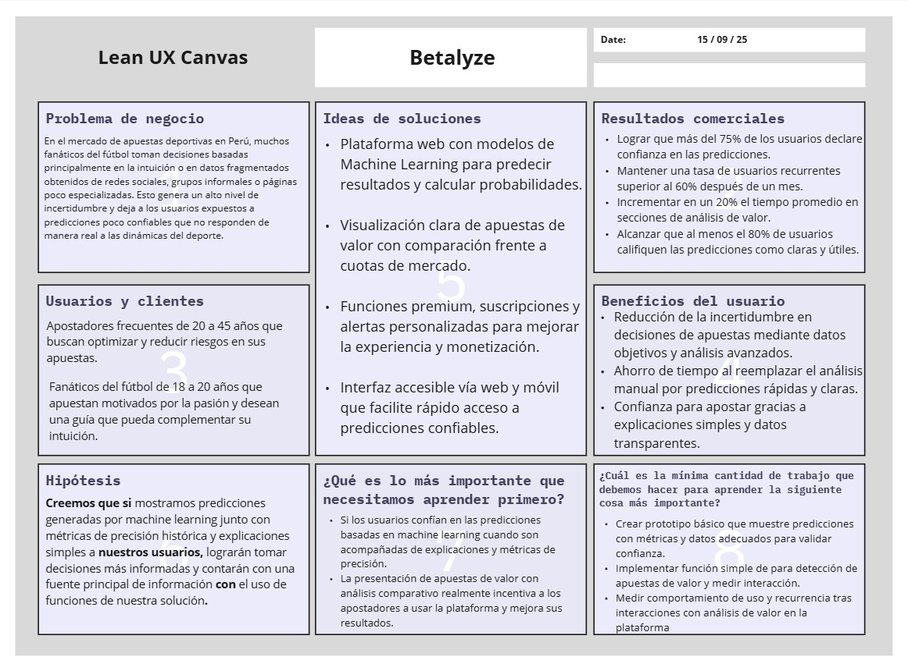

<br>

## 1.3. Segmentos objetivo

**Segmento 1: Apostadores frecuentes**

Características demográficas:

- Edad: Adultos jóvenes y de mediana edad, entre 20 y 45 años.

- Uso tecnológico: Alta disposición a usar herramientas digitales y aplicaciones recurrentemente.

- Comportamiento: Apuestas constantes varias veces por semana, interesados en optimizar decisiones y reducir riesgos.

- Necesidades: Probabilidades claras y rápidas que faciliten el análisis eficiente y la identificación de valor en apuestas.

- Perfil socioeconómico: Probablemente activos laboralmente, con ingresos disponibles para apostar regularmente.

  **Detalle**: Son usuarios que realizan apuestas de manera constante, varias veces por semana, y buscan optimizar sus decisiones para reducir riesgos. Este segmento necesita probabilidades claras y rápidas que les permitan ahorrar tiempo en el análisis de partidos y encontrar valor en sus apuestas. Constituyen un público dispuesto a usar herramientas digitales de manera recurrente y a convertirse en usuarios activos de la aplicación.

**Segmento 2: Fanáticos del fútbol**

Características demográficas:

- Edad: Jóvenes adultos, entre 18 y 20 años.

- Perfil: Seguidores apasionados de equipos y ligas de fútbol, principalmente motivados por la pasión y el interés deportivo.

- Comportamiento de apuesta: Decisiones basadas en intuición, aunque valoran una referencia objetiva para complementar su criterio.

- Adopción tecnológica: Alta probabilidad de adoptar nuevas plataformas digitales, especialmente en un contexto deportivo nacional popular.

- Contexto cultural: Fútbol como deporte más popular en Perú, con alta concentración de apuestas entre este grupo juvenil.

  **Detalle**: Son hinchas que siguen de cerca a sus equipos y ligas favoritas, y que apuestan motivados por su pasión. Aunque suelen decidir en base a la intuición, valoran contar con una referencia objetiva que complemente su criterio. Este segmento asegura una alta adopción, dado que el fútbol es el deporte más popular en Perú y concentra la mayoría de las apuestas deportivas.

<br>

---


# Capítulo II: Requirements Elicitation & Analysis

## 2.1. Competidores

**Forebet**

- Es una aplicación web que ofrece predicciones de fútbol basadas en algoritmos estadísticos y modelos matemáticos que analizan grandes volúmenes de datos deportivos para generar pronósticos precisos. Cubre más de 1200 ligas en diversos deportes, especialmente fútbol, y provee estadísticas detalladas y análisis para ayudar a los usuarios a tomar decisiones informadas en apuestas. Opera desde 2009, destacándose por la precisión de sus modelos estadísticos.

  Características principales:
  - Cobertura de ligas a nivel mundial.
  - Tipos de apuestas: 1X2, over/under, hándicap, marcador exacto, etc.
  - Estadísticas históricas y comparaciones entre equipos.

<div align="center">
  </img>
</div>

**Betmines**

- Es una aplicación enfocada en pronósticos y alertas en tiempo real para partidos de fútbol que combina estadísticas detalladas, filtros avanzados y algoritmos de inteligencia artificial para identificar oportunidades rentables en tiempo real, incluyendo alertas personalizadas via Telegram. 

  Características principales:   
  - Notificaciones push de resultados y cambios.
  - Interfaz móvil sencilla y personalizada.
  - Pronósticos y consejos de apuestas deportivos.

<div align="center">
  </img>
</div>

**PredictZ**

- Es una aplicación web que proporciona predicciones gratuitas de fútbol, análisis y estadísticas que respaldan los pronósticos. Su enfoque es ofrecer datos y resultados para que los usuarios estudien y refuercen sus decisiones de apuestas. Aunque no garantiza apuestas seguras, se presenta como una herramienta de apoyo para apostadores y fanáticos que desean un respaldo analítico.

  Características principales:
  - Probabilidades rápidas y fáciles de entender.
  - Datos de forma reciente y enfrentamientos previos.
  - Opciones de visualización y personalización básica.

<div align="center">
  </img>
</div>

### 2.1.1. Análisis competitivo

<table>
    <thead>
        <tr>
            <th colspan="6" style="text-align: center">Competitive Analysis Landscape</th>
        </tr>
        <tr>
            <th rowspan="2">¿Por qué llevar a cabo este análisis?</th>
            <th colspan="5">¿Qué características o funciones puedo implementar que mis competidores no tengan?</th>
        </tr>
        <tr>
            <th colspan="5">¿Qué debo tomar como ejemplo de mis competidores?</th>
        </tr>
        <tr>
            <th colspan="2">Empresa / APP</th>
            <th> <div align="center"> Betalyze <br> <!--</img>--> </div> </th>
            <th> <div align="center"> Forebet <br> </img> </div> </th>
            <th> <div align="center"> Betmines <br> </img> </div> </th>
            <th> <div align="center"> PredictZ <br> </img> </div> </th>
        </tr>
    </thead>
    <tbody>
        <tr>
            <th rowspan="3">Perfil</th>
            <tr>
                <td>Overview</td>
                <td> Plataforma web que usa modelos de Machine Learning para generar predicciones deportivas especializadas en fútbol, identificando apuestas de valor mediante análisis detallado de estadísticas, lesiones y factores contextuales. </td>
                <td> Plataforma con más de 15 años en el mercado que ofrece predicciones matemáticas basadas en algoritmos avanzados y machine learning, que cubre ligas y múltiples deportes, incluyendo fútbol, baloncesto y tenis. </td>
                <td> Plataforma que ofrece predicciones deportivas de fútbol usando algoritmos y AI, análisis en tiempo real, filtros y alertas mediante Telegram, centrada en optimizar apuestas con datos historicos. </td>
                <td> Sitio que ofrece predicciones gratuitas de fútbol, con análisis y estadísticas para apoyar decisiones de apuestas, sin garantía de resultados seguros, orientado a usuarios que buscan respaldo analítico accesible. </td>
            </tr>
            <tr>
                <td>Ventaja competitiva ¿Qué valor ofrece a los clientes?</td>
                <td> Predicciones más precisas y confiables en base a cuotas del mercado, ofreciendo una ventaja objetiva para mejorar la rentabilidad de apostadores, fanáticos del futbol y acceso a información clara. </td>
                <td> Buena cobertura deportiva global y acceso gratuito a predicciones basadas en datos y análisis estadístico. </td>
                <td> Fuerte enfoque en análisis en vivo, combinando predicciones automáticas con alertas para usuarios. </td>
                <td> Predicciones y datos gratuitos con alcance global, facilitando el análisis para usuarios que prefieren una base objetiva para realizar apuestas. </td>
            </tr>
        </tr>
        <tr>
            <th rowspan="3">Perfil de Marketing</th>
            <tr>
                <td>Mercado objetivo</td>
                <td> Apostadores frecuentes que buscan optimizar decisiones y fanáticos del fútbol entre 18 y 45 años en Perú, interesados en una combinación de análisis objetivo y pasión deportiva.</td>
                <td> Apostadores deportivos globales, interesados en predicciones gratuitas y análisis detallados de diferentes deportes. </td>
                <td> Apostadores de fútbol activos que buscan herramientas avanzadas y alertas para mejorar su toma de decisiones en tiempo real. </td>
                <td> Apostadores casuales y aficionados que valoran el acceso gratuito a análisis y predicciones deportivas, especialmente en fútbol. </td>
            </tr>
            <tr>
                <td>Estrategias de marketing</td>
                <td> Enfocadas en contenido digital, promoción en redes sociales, suscripciones premium, alertas personalizadas y posicionamiento como la herramienta confiable y local de referencia en Perú.</td>
                <td> Promoción gratuita con fuerte presencia en redes sociales, apps móviles, blogs deportivos y alianzas estratégicas para posicionamiento global. </td>
                <td> Uso de grupos VIP, bots de apuestas, suscripciones a funciones premium y comunidades en Telegram. </td>
                <td> Monetización basada en publicidad, alianzas comerciales y posicionamiento SEO para captar tráfico web. </td>
            </tr>
        </tr>
        <tr>
            <th rowspan="4">Perfil de Producto</th>
            <tr>
                <td>Productos & Servicios</td>
                <td> Plataforma web y móvil con predicciones, análisis de valor, métricas explicativas, alertas personalizadas y funciones premium de análisis avanzados.</td>
                <td> Predicciones, estadísticas, análisis detallados, live scores, tendencias y contenido complementario. </td>
                <td> Predicciones diarias, filtros en vivo, alertas, acceso gratuito y planes premium con análisis. </td>
                <td> Predicciones, estadísticas y análisis en formato gratuito, soporte básico. </td>
            </tr>
            <tr>
                <td>Precios y Costos</td>
                <td> Modelo freemium con suscripciones mensuales y funciones premium pagadas</td>
                <td> Acceso gratuito a la mayoría del contenido, monetización vía publicidad y funcionalidades en apps móviles. </td>
                <td> Modelo freemium con funciones básicas, gratuitas y servicios avanzados por suscripción. </td>
                <td> Totalmente gratuito, ingresos generados por publicidad y acuerdos comerciales. </td>
            </tr>
            <tr>
                <td>Canales de distribución (Web y/o Móvil)</td>
                <td> Web y aplicaciones móviles para acceso rápido y frecuente</td>
                <td> Web y aplicaciones móviles iOS y Android </td>
                <td> Web y plataforma de mensajería Telegram para alertas. </td>
                <td> Principalmente web. </td>
            </tr>
        </tr>        
    </tbody>
</table>

<br>
    
<table>
    <tbody>
        <tr>
            <th rowspan=10>Análisis SWOT</th>
            <tr>
                <th>Fortalezas</th>
                <td>
                  <ul>
                        <li> Uso de machine learning avanzado con datos específicos sobre fútbol en Perú. </li>
                        <li> Enfoque en apuestas de valor con explicaciones claras y visualización de métricas precisas. </li>
                        <li> Diseño enfocado en usuarios frecuentes y fanáticos locales, con funciones premium y alertas personalizadas. </li>
                  </ul>
                </td>
                <td>
                  <ul>
                        <li> Plataforma con más de 15 años en el mercado y gran reconocimiento global. </li>
                        <li> Cobertura de ligas y deportes, con acceso gratuito y modelos estadísticos. </li>
                        <li> Gran base de usuarios y presencia en apps móviles. </li>
                  </ul>
                </td>
                <td>
                  <ul>
                        <li> Enfoque en análisis en vivo y alertas personalizadas vía Telegram. </li>
                        <li> Combinación de IA con interacción en comunidades VIP y bots para apuestas de valor. </li>
                        <li> Modelo freemium que atrae y fideliza apostadores activos. </li>
                  </ul>
                </td>
                <td>
                  <ul>
                        <li> Acceso gratuito y fácil para usuarios casuales. </li>
                        <li> Base de datos accesible y orientada principalmente a fútbol. </li>
                        <li> Posicionamiento SEO que atrae tráfico web. </li>
                  </ul>
                </td>
            </tr>
            <tr>
                <th>Debilidades</th>
                <td>
                  <ul>
                        <li> Plataforma nueva con menor reconocimiento frente a competidores consolidados. </li>
                        <li> Mercado con limites geográficos por la concentración a nuestro segmento objetivo. </li>
                        <li> Dependencia en suscripciones para monetización y demostración rápida de valor rápidamente. </li>
                  </ul>
                </td>
                <td>
                  <ul>
                        <li> Predicciones generalistas con menor enfoque local específico en Perú. </li>
                        <li> Experiencia de usuario menos personalizada, sin funciones premium destacadas. </li>
                        <li> Modelo de negocio basado principalmente en publicidad, menos diversidad de ingresos. </li>
                  </ul>
                </td>
                <td>
                  <ul>
                        <li> Dependencia de plataformas externas como Telegram para alertas. </li>
                        <li> Puede resultar complejo para usuarios menos tecnológicos o principiantes. </li>
                        <li> Cobertura limitada a fútbol principalmente. </li>
                  </ul>
                </td>
                <td>
                  <ul>
                        <li> Falta de funciones premium o diferenciación de valor premium. </li>
                        <li> Menor precisión y soporte comparado con plataformas pagas. </li>
                        <li> Modelo de negocio dependiente de publicidad. </li>
                  </ul>
                </td>
            </tr>
            <tr>
                <th>Oportunidades</th>
                <td>
                  <ul>
                        <li> Creciente interés en apuestas deportivas y creciente adopción de Machine Learning aplicada. </li>
                        <li> Expansión de funciones y alcance a otros deportes o regiones. </li>
                        <li> Potenciar estrategias de marketing digital para fortalecerse como solución local confiable. </li>
                  </ul>
                </td>
                <td>
                  <ul>
                        <li> Ampliar servicios premium y personalización para captar nuevos segmentos. </li>
                        <li> Integrar funciones de machine learning más avanzadas para mejorar precisión. </li>
                        <li> Expandirse a mercados emergentes con soporte local. </li>
                  </ul>
                </td>
                <td>
                  <ul>
                        <li> Potenciar automatización y personalización para usuarios avanzados. </li>
                        <li> Integrar más deportes o implementar versiones más amigables para usuarios inexpertos. </li>
                        <li> Crecimiento de comunidades y marketing mediante contenido exclusivo. </li>
                  </ul>
                </td>
                <td>
                  <ul>
                        <li> Introducir funciones premium o planes de suscripción. </li>
                        <li> Expandir contenido analítico y personalización para usuarios más exigentes. </li>
                        <li> Alianzas con plataformas de apuestas para generar ingresos complementarios. </li>
                  </ul>
                </td>
            </tr>
            <tr>
                <th>Amenazas</th>
                <td>
                  <ul>
                        <li> Competencia consolidada con amplio mercado y recursos. </li>
                        <li> Cambios regulatorios en apuestas deportivas en Perú. </li>
                        <li> Usuarios escépticos a confiar en sistemas automatizados o nuevas plataformas sin historial. </li>
                  </ul>
                </td>
                <td>
                  <ul>
                        <li> Competencia local más especializada puede arrebatar usuarios exigentes. </li>
                        <li> Saturación del mercado con predicciones gratuitas que pueden reducir percepción de valor. </li>
                        <li> Cambios en políticas de apps o publicidad digital que afecten ingresos. </li>
                  </ul>
                </td>
                <td>
                  <ul>
                        <li> Competencia con plataformas todo en uno que no dependen de servicios externos. </li>
                        <li> Regulaciones en el uso de bots o mensajería para apuestas. </li>
                        <li> Cambios en accesibilidad o políticas de Telegram o canales similares. </li>
                  </ul>
                </td>
                <td>
                  <ul>
                        <li> Competencia con plataformas gratuitas más especializadas. </li>
                        <li> Cambios en políticas de publicidad digital que reduzcan ingresos. </li>
                        <li> Pérdida de usuarios por servicios pagos con mejor soporte. </li>
                  </ul>
                </td>
            </tr>
        </tr>
    </tbody>
</table>

<br>


### 2.1.2. Estrategias y tácticas frente a competidores

<table>
  <thead>
        <tr>
            <th>  </th>
            <th> <div align="center"> Estrategias </div> </th>
            <th> <div align="center"> Tácticas </div> </th>
        </tr>
    </thead>
    <tbody>
        <tr>
            <tr>
                <th>Fortalezas</th>
                <td>
                  <ul>
                        <li> Potenciar comunicación, descipción de predicciones y diferenciación local </li>
                        <li> Destacar funciones freemium y alertas personalizadas según el tipo de usuario </li>
                  </ul>
                </td>
                <td>
                  <ul>
                        <li> Explicar claramente el uso de Machine Learning y precisión que se puede lograr. Resaltar enfoque en fútbol peruano. </li>
                        <li> Promocionar funciones exclusivas y beneficios para nuestros usuarios más frecuentes. </li>
                  </ul>
                </td>
            </tr>
            <tr>
                <th>Debilidades</th>
                <td>
                  <ul>
                        <li> Intensificar promoción y publicidad digital local para ganar más base de usuarios </li>
                        <li> Validar con pilotos y testimonios en base a la experiencia de los usuarios al utilizar la plataforma </li>
                        <li> Ofrecer versiones pruebas gratuitas, funcione y predicciones destacables de la competencia </li>
                  </ul>
                </td>
                <td>
                  <ul>
                        <li> Campañas en redes sociales, publicidad, contenido educativo y descriptivo. </li>
                        <li> Pruebas de conceptos y uso para obtener feedback para generar confianza. </li>
                        <li> Invitar a probar funciones y personalización para fidelizar usuarios. </li>
                  </ul>
                </td>
            </tr>
            <tr>
                <th>Oportunidades</th>
                <td>
                  <ul>
                        <li> Alianzas estratégicas con comunidades deportivas y fanáticos del futbol </li>
                        <li> Comprobar los resultados de usuar Machine Learning y ampliar cobertura deportiva </li>
                        <li> Crear contenido descriptivo, enfocado y confiable </li>
                  </ul>
                </td>
                <td>
                  <ul>
                        <li> Negociar colaboraciones e iniciativas para promocionar el uso de predicciones descriptivas y accesibles. </li>
                        <li> Actualizar nuestro modelo con datos relevantes y explorar otros deportes. </li>
                        <li> Utilizar y mostrar guías y videos sobre uso de Machine Learning y apuestas responsables. </li>
                  </ul>
                </td>
            </tr>
            <tr>
                <th>Amenazas</th>
                <td>
                  <ul>
                        <li> Adaptación rapida y accesibilidad de la plataforma </li>
                        <li> Fortalecer soporte y enfoque en nuestros usuarios </li>
                        <li> Prestar atención en UX/UI para accesibilidad	y visualización de datos </li>
                  </ul>
                </td>
                <td>
                  <ul>
                        <li> Estar atentos a cambios legales y constante mantenimiento. </li>
                        <li> Soporte personalizado y descripciones claras para reducir dudas y escepticismo. </li>
                        <li> Priorizar una la plataforma intuitiva, simple y rápida frente a la competencia. </li>
                  </ul>
                </td>
            </tr>
        </tr>
    </tbody>
</table>

<br>

---

## 2.2. Entrevistas

### 2.2.1. Diseño de entrevistas

En esta sección se presenta la relación de preguntas principales y complementarias descritas para realizar las entrevistas, dirigidas a cada uno de los segmentos objetivos.

- **Información general requerida para ambos segmentos:**

  - Nombres
  - Apellidos
  - Edad
  - Distrito

- **Preguntas generales para ambos segmentos:**

1. ¿Qué tipo de información revisas antes de ver un partido (alineaciones, historial, noticias, lesiones, forma reciente)?
2. ¿Usas más el móvil o la web para seguir probabilidades y apuestas? ¿Cuál te resulta más cómodo?
3. ¿Qué tan satisfecho estás con las aplicaciones o webs actuales que usas para predicciones?
4. ¿Prefieres probabilidades expresadas como porcentajes o cuotas (ej. 65% vs cuota 1.55)?
5. ¿Te interesaría un historial visual de rendimiento de tu equipo (racha de victorias/derrotas, goles a favor y en contra)?

- **Preguntas para el segmento Apostadores frecuentes:**

1. ¿Qué deportes o equipos sigues más de cerca para apostar?
2. ¿Cuántas apuestas de fútbol realizas en promedio por semana?
3. ¿Qué tipo de apuestas prefieres (ganador, over/under, hándicap, combinadas)?
4. ¿Qué tan importante es para ti la rapidez en recibir pronósticos antes de un partido?
5. ¿Qué dificultades enfrentas al analizar varios partidos en poco tiempo? 
6. ¿Qué datos o métricas ayudan a mejorar tu presupuesto al momento de apostar y qué herramienta te ayudaría a controlarlo mejor?
7. ¿Qué mejorarías de las apps o servicios de predicciones que usas actualmente?
8. ¿Qué datos previos te interesan más (alineaciones, historial, noticias, lesiones)?
9. ¿Qué tan seguido apuestas solo por intuición o pasión, sin ver estadísticas


- **Preguntas para el segmento Fanáticos del futbol:**

1. ¿Qué ligas, equipos o selecciones sigues más de cerca?
2. ¿Qué tan interesante te resulta conocer probabilidades de victoria o rendimiento de tu equipo, aunque no apuestes?
3. ¿Cómo reaccionas cuando los datos o predicciones muestran que tu equipo tiene pocas chances de ganar?
4. ¿Te interesa ver probabilidades en ligas menores o prefieres solo las más populares?
5. ¿Prefieres probabilidades objetivas, aunque contradigan lo que sientes como hincha?


<br>

### 2.2.2. Registro de entrevistas

**Segmento Apostadores frecuentes:**

|     Entrevistado     |    Daniel Chipana    |
|:---------------------|----------------------|
| Edad                 | N/A  |
| Distrito             | N/A  |
| Screenshot           |  |
| Inicio de entrevista | Minuto 0:00 |
| Duración             | 3:19 minutos |
| Resumen              |  Prefiere apuestas combinadas. Considera fundamental la rapidez de pronósticos. Usa móvil como principal canal, consulta alineaciones y estadísticas previas. Personalidad racional y metódica.  |
| URL del video       | <https://upcedupe-my.sharepoint.com/:v:/g/personal/u202114192_upc_edu_pe/Ef5DB_6fv8RJi2odu1mgzFYBugr47Cs1b4XkvWy6UbCYjA?e=yiuKEv&nav=eyJyZWZlcnJhbEluZm8iOnsicmVmZXJyYWxBcHAiOiJTdHJlYW1XZWJBcHAiLCJyZWZlcnJhbFZpZXciOiJTaGFyZURpYWxvZy1MaW5rIiwicmVmZXJyYWxBcHBQbGF0Zm9ybSI6IldlYiIsInJlZmVycmFsTW9kZSI6InZpZXcifX0%3D> |

|     Entrevistado     |    Gerson Chanel     |
|:---------------------|----------------------|
| Edad                 | 20  |
| Distrito             | Callao  |
| Screenshot           |  |
| Inicio de entrevista | Minuto 3:19 |
| Duración             | 11:23 minutos |
| Resumen              |  Apuesta 3-4 veces por semana, en fútbol y basket. Prefiere combinadas, revisa alineaciones, usa móvil y PC pero prioriza móvil. Prefiere cuotas sobre porcentajes. Valora apps rápidas y simples.   |
| URL del video       | <https://upcedupe-my.sharepoint.com/:v:/g/personal/u202114192_upc_edu_pe/Ef5DB_6fv8RJi2odu1mgzFYBugr47Cs1b4XkvWy6UbCYjA?e=yiuKEv&nav=eyJyZWZlcnJhbEluZm8iOnsicmVmZXJyYWxBcHAiOiJTdHJlYW1XZWJBcHAiLCJyZWZlcnJhbFZpZXciOiJTaGFyZURpYWxvZy1MaW5rIiwicmVmZXJyYWxBcHBQbGF0Zm9ybSI6IldlYiIsInJlZmVycmFsTW9kZSI6InZpZXcifX0%3D> |

|     Entrevistado     |    Angelo Carrasco    |
|:---------------------|----------------------|
| Edad                 | 19  |
| Distrito             | Villa El Salvador  |
| Screenshot           |  |
| Inicio de entrevista | Minuto 14:42 |
| Duración             | 3:41 minutos |
| Resumen              |  Realiza 3-4 apuestas semanales, evalúa rápido, no siente gran dificultad en análisis. Usa móvil. Prefiere porcentajes. Apasionado, apuesta por intuición en algunos casos.  |
| URL del video       | <https://upcedupe-my.sharepoint.com/:v:/g/personal/u202114192_upc_edu_pe/Ef5DB_6fv8RJi2odu1mgzFYBugr47Cs1b4XkvWy6UbCYjA?e=yiuKEv&nav=eyJyZWZlcnJhbEluZm8iOnsicmVmZXJyYWxBcHAiOiJTdHJlYW1XZWJBcHAiLCJyZWZlcnJhbFZpZXciOiJTaGFyZURpYWxvZy1MaW5rIiwicmVmZXJyYWxBcHBQbGF0Zm9ybSI6IldlYiIsInJlZmVycmFsTW9kZSI6InZpZXcifX0%3D> |

<br>

**Segmento Fanáticos del fútbol:**

|     Entrevistado     |    David Rivas    |
|:---------------------|----------------------|
| Edad                 | 22  |
| Distrito             | San Martín de Porres  |
| Screenshot           |  |
| Inicio de entrevista | Minuto 18:23 |
| Duración             | 4:46 minutos |
| Resumen              |  Usa Inkabet y Stake. Quiere métricas objetivas e historial visual. Busca estadísticas detalladas de equipos. Usa móvil para análisis.  |
| URL del video       | <https://upcedupe-my.sharepoint.com/:v:/g/personal/u202114192_upc_edu_pe/Ef5DB_6fv8RJi2odu1mgzFYBugr47Cs1b4XkvWy6UbCYjA?e=yiuKEv&nav=eyJyZWZlcnJhbEluZm8iOnsicmVmZXJyYWxBcHAiOiJTdHJlYW1XZWJBcHAiLCJyZWZlcnJhbFZpZXciOiJTaGFyZURpYWxvZy1MaW5rIiwicmVmZXJyYWxBcHBQbGF0Zm9ybSI6IldlYiIsInJlZmVycmFsTW9kZSI6InZpZXcifX0%3D> |

|     Entrevistado     |    Daniel Sebastián    |
|:---------------------|----------------------|
| Edad                 | N/A  |
| Distrito             | Lima  |
| Screenshot           | 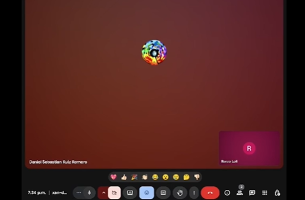 |
| Inicio de entrevista | Minuto 23:09 |
| Duración             | 4:46 minutos |
| Resumen              |  No apuesta frecuentemente, pero quiere probabilidades objetivas y simples. Usa móvil. Considera las plataformas actuales complejas. Busca datos claros y alineaciones antes de ver un partido.  |
| URL del video       | <https://upcedupe-my.sharepoint.com/:v:/g/personal/u202114192_upc_edu_pe/Ef5DB_6fv8RJi2odu1mgzFYBugr47Cs1b4XkvWy6UbCYjA?e=yiuKEv&nav=eyJyZWZlcnJhbEluZm8iOnsicmVmZXJyYWxBcHAiOiJTdHJlYW1XZWJBcHAiLCJyZWZlcnJhbFZpZXciOiJTaGFyZURpYWxvZy1MaW5rIiwicmVmZXJyYWxBcHBQbGF0Zm9ybSI6IldlYiIsInJlZmVycmFsTW9kZSI6InZpZXcifX0%3D> |

|     Entrevistado     |    Rodrigo Chirinos    |
|:---------------------|----------------------|
| Edad                 | 21  |
| Distrito             | Puente Piedra  |
| Screenshot           |  |
| Inicio de entrevista | Minuto 27:55 |
| Duración             | 4:66 minutos |
| Resumen              |  Sigue ligas europeas principales. Prefiere cuotas. Usa móvil para consumir datos. Quiere historial visual de desempeño.  |
| URL del video       | <https://upcedupe-my.sharepoint.com/:v:/g/personal/u202114192_upc_edu_pe/Ef5DB_6fv8RJi2odu1mgzFYBugr47Cs1b4XkvWy6UbCYjA?e=yiuKEv&nav=eyJyZWZlcnJhbEluZm8iOnsicmVmZXJyYWxBcHAiOiJTdHJlYW1XZWJBcHAiLCJyZWZlcnJhbFZpZXciOiJTaGFyZURpYWxvZy1MaW5rIiwicmVmZXJyYWxBcHBQbGF0Zm9ybSI6IldlYiIsInJlZmVycmFsTW9kZSI6InZpZXcifX0%3D> |

<br>

### 2.2.3. Análisis de entrevistas

En esta sección se presenta el análisis basado en las entrevistas registradas para cada segmento objetivo. Se identifican los porcentajes que reflejan las características más comunes según los datos obtenidos, las cuales son fundamentales para la construcción de los arquetipos.

| Característica                                     | % por entrevistados |   Observación   |
|----------------------------------------------------|:--------------------|-----------------|
| Deporte principal: Fútbol                          | 100%                | Algunos también siguen el básquet (Gerson) |
| Frecuencia de apuestas: 3-4 veces por semana       | 60%                 | Segmento “apostadores frecuentes” muy consistente. |
| Tipo de apuesta preferida: combinadas / over-under | 60%                 | Confirman preferencia por pronósticos complejos pero rentables. |
| Uso principal de móvil                             | 80%                 | PC usado solo para análisis más detallado. |
| Necesidad de rapidez en pronósticos                | 80%                 | Mencionado como factor decisivo. |
| Frustración por sobrecarga de información          | 60%                 | UX y simplicidad deben ser prioridad. |
| Datos más valorados: alineaciones y lesiones       | 80                  | Se confirma que es el input principal antes de apostar. |
| Preferencia de formato: cuotas                     | 60%                 | Aunque un 40% prefiere porcentajes. |
| Interés en historial visual de equipos             | 80%                 | Sugiere incluir dashboard simple de rachas. |

<br>

**Patrones Identificados:**

- Deporte principal: 100% fútbol (con algunos interesados en básquet en torneos relevantes).
- Frecuencia de apuestas: 60% apuesta entre 3-4 veces por semana.
- Tipo de apuesta preferida: 60% combinadas y over/under; 20% ganador; 20% no apuesta frecuentemente.
- Importancia de la rapidez de pronósticos: 80% considera muy importante recibir pronósticos rápido.
- Dificultades principales: 60% menciona sobrecarga de información en apps/webs, 40% indica poco tiempo para analizar partidos.
- Datos más valorados: 80% alineaciones y lesiones; 60% estadísticas de partidos pasados (tiros, córners, goles).
- Uso de tecnología: 80% prefiere móvil como principal dispositivo; 40% usa también web en PC.
- Formato de probabilidades preferido: 60% cuotas, 40% porcentajes.
- Necesidades detectadas: 80% quiere historial visual de rendimiento de equipos, 60% desea interfaz simple y directa.

**Insights Clave**

- Experiencia de Usuario (UX): Se requiere una interfaz simple, rápida y sin sobrecarga de información, con filtros contextuales que muestren solo lo relevante (local/visita, ligas, equipos).
- Velocidad de Acceso: La rapidez en la entrega de pronósticos y datos es crítica para que los usuarios tomen decisiones a tiempo.
- Visualización de Datos: Los usuarios quieren historial visual de desempeño, métricas de rachas y datos clave presentados en gráficos claros y fáciles de interpretar.
- Confianza y Transparencia: Es fundamental mostrar métricas objetivas, precisión histórica del modelo de machine learning y explicar de forma sencilla cómo se generan las probabilidades.
- Valor para Apostadores y Fanáticos: Tanto los apostadores como los fanáticos valoran información confiable y objetiva que complemente su intuición y enriquezca su experiencia.
- Oportunidad de Innovación: Existe una brecha para superar plataformas internacionales con una solución enfocada al 100 % en fútbol, con diseño minimalista, optimizada para móvil y adaptada al contexto peruano. 

<br>


## 2.3. Needfinding

### 2.3.1. User Personas

Para Betalyze, se elaboraron dos User Personas en UXPressia: una para los apostadores frecuentes, quienes buscan optimizar su rentabilidad y requieren rapidez y claridad en los pronósticos, y otra para los fanáticos del fútbol, que valoran información objetiva y visual para enriquecer su experiencia, incluso si no apuestan. Estas representaciones son fundamentales para alinear las funcionalidades de la plataforma con las expectativas de los usuarios y asegurar que la experiencia propuesta sea relevante, simple y confiable.

**Segmento Apostadores frecuentes:**

- Arquetipo de usuario que apuesta varias veces por semana, utiliza principalmente su móvil y busca pronósticos rápidos, datos confiables y visualización clara de estadísticas para optimizar sus decisiones.

 

**Segmento Fanáticos del fútbol:**

- Arquetipo de hincha apasionado que sigue activamente ligas y selecciones, consulta estadísticas y probabilidades para entender el rendimiento de su equipo y enriquecer su experiencia, aunque no realice apuestas frecuentes.

 

<br>

### 2.3.2. User Task Matrix

Para la elaboración de nuestra solución se consideran dos segmentos objetivos con afinidad en el uso de plataformas de predicciones, ya recurren a los datos de estas plataformas para realizar apuestas informadas:

- **Apostadores frecuentes:** Usuarios que apuestan varias veces por semana, usan principalmente móviles y buscan pronósticos rápidos y claros para optimizar decisiones.
- **Fanáticos del fútbol:** Hinchas que siguen activamente el fútbol para entender mejor el rendimiento de sus equipos, consultan estadísticas y probabilidades, pero apuestan poco o no frecuentemente.

**User Task Matrix para Segmento 1: Apostadores frecuentes**

<table>
  <tr>
    <th rowspan=2> Task Matrix </th>
    <th colspan=2> Jerson Ambrosio </th>
  </tr>
  <tr>
    <th> Frecuencia </th>
    <th> Importancia </th>
  </tr>
  <tr>
    <td> Consultar pronósticos rápidos </td>
    <td> SIEMPRE </td>
    <td> ALTA </td>
  </tr>
  <tr>
    <td> Analizar visualizaciones de estadísticas </td>
    <td>SIEMPRE</td>
    <td>ALTA</td>
  </tr>
  <tr>
    <td> Revisar alineaciones y lesiones </td>
    <td>SIEMPRE</td>
    <td>ALTA</td>
  </tr>
  <tr>
    <td> Comparar cuotas y porcentajes </td>
    <td>USUALMENTE</td>
    <td>ALTA</td>
  </tr>
  <tr>
    <td> Realizar apuestas combinadas o over/under </td>
    <td>SIEMPRE</td>
    <td>ALTA</td>
  </tr>
  <tr>
    <td> Consultar historial visual de rendimiento </td>
    <td>SIEMPRE</td>
    <td>ALTA</td>
  </tr>
  <tr>
    <td> Navegar interfaz simple y directa </td>
    <td>SIEMPRE</td>
    <td>ALTA</td>
  </tr>
  <tr>
    <td> Gestionar tiempo limitado para análisis </td>
    <td>A VECES</td>
    <td>ALTA</td>
  </tr>
</table>

<br>

**User Task Matrix para Segmento 2: Fanáticos del fútbol**

<table>
  <tr>
    <th rowspan=2> Task Matrix </th>
    <th colspan=2> Rodrigo Chinos </th>
  </tr>
  <tr>
    <th> Frecuencia </th>
    <th> Importance </th>
  </tr>
  <tr>
    <td> Consultar pronósticos rápidos </td>
    <td> USUALMENTE </td>
    <td> ALTA </td>
  </tr>
  <tr>
    <td> Revisar estadísticas de partidos pasados </td>
    <td>SIEMPRE</td>
    <td>ALTA</td>
  </tr>
  <tr>
    <td> Consultar alineaciones y lesiones </td>
    <td>USUALMENTE</td>
    <td>ALTA</td>
  </tr>
  <tr>
    <td> Entender rendimiento del equipo </td>
    <td>SIEMPRE</td>
    <td>ALTA</td>
  </tr>
  <tr>
    <td> Explorar visualización de rendimiento </td>
    <td>USUALMENTE</td>
    <td>MEDIA</td>
  </tr>
  <tr>
    <td> Navegar en la interfas de los servicios </td>
    <td>USUALMENTE</td>
    <td>ALTA</td>
  </tr>
  <tr>
    <td> Usar móvil y web para consulta </td>
    <td>USUALMENTE</td>
    <td>MEDIA</td>
  </tr>
</table>

<br>

**Descripción de principales diferencias y coincidencias:**

- Las tareas con mayor frecuencia e importancia para Apostadores frecuentes son consultar pronósticos rápidos, analizar estadísticas visuales, revisar datos como alineaciones o lesiones, y realizar apuestas enfocadas en combinadas y over/under. Estos usuarios valoran mucho la rapidez y simplicidad para optimizar su toma de decisiones durante la semana.
- Los Fanáticos del fútbol se concentran en entender el rendimiento del equipo y revisar datos históricas y alineaciones con mayor frecuencia, aunque no realizan apuestas frecuentemente. Prefieren utilizar sus teléfonos móviles y apoyarse en plataformas web y que tengan una interfaz simple que no complique su experiencia al visualizar estos datos.
- Ambos segmentos tienen en común consultar alineaciones, lesiones, estadísticas y recibir pronósticos rápidos, pero difieren en la frecuencia y prioridad de tener como actividad principal realizar apuestas. La preferencia por interfaz simple y uso móvil también es fuerte en ambos, aunque el fanático del fútbol puede utilizar la web más como complemento.

<br>

### 2.3.3. Empathy Mapping

El Empathy Map es una herramienta que permite profundizar en la comprensión de cada segmento de usuario, sintetizando lo que ven, escuchan, piensan, sienten, dicen y hacen en relación con el problema identificado. Para Betalyze, se elaboraron mapas de empatía en la herramienta UXPressia, tomando como punto central a cada User Persona y discutiendo en equipo la información recolectada en el registro y análisis de entrevistas, así como en el análisis competitivo. Este ejercicio ayudó a identificar Pains  y Gains de los usuarios, los cuales guiarán la priorización de funcionalidades y decisiones de diseño de la solución.

**Empathy Mapping Segmento 1: Apostadores frecuentes**

 

<br>

**Empathy Mapping Segmento 2: Fanáticos del fútbol**


<br>

### 2.3.4. As-is Scenario Mapping

En esta etapa, el equipo realizó un mapeo de escenarios actuales para ambos segmentos objetivo: apostadores frecuentes y fanáticos del fútbol. El proceso comenzó con una lluvia de ideas individual para identificar cómo los usuarios viven actualmente la experiencia de buscar información, analizar datos y tomar decisiones relacionadas con apuestas o seguimiento de partidos. Luego se organizaron las fases de la experiencia en columnas y se agruparon observaciones sobre lo que hacen, piensan y sienten en cada etapa. Finalmente, se identificaron los puntos de fricción, emociones negativas y vacíos de información que dificultan la experiencia actual.

**As-is Scenario Mapping Segmento 1: Apostadores frecuentes**

 

- Actualmente, el apostador frecuente se enfrenta a una experiencia fragmentada y saturada. Debe consultar múltiples fuentes de datos, comparar manualmente cuotas y estadísticas, y tomar decisiones en un entorno de presión de tiempo. Esto genera frustración, inseguridad y ansiedad, lo que impacta en la eficiencia de sus apuestas.

<br>

**As-is Scenario Mapping Segmento 2: Fanáticos del fútbol**

 

- Para el fanático del fútbol, informarse antes de un partido implica revisar múltiples sitios y redes sociales sin una estructura clara. La experiencia se siente desordenada y poco amigable, lo que dificulta interpretar datos relevantes. Esto genera confusión, baja motivación y pérdida de oportunidad para enriquecer su experiencia antes y durante el partido.

<br>

## 2.4. Ubiquitous Language

| **Término (Inglés)**  | **Término (Español)**   | **Definición**   |
|:----------------------|:------------------------|:-----------------|
| Predictive Model      | Modelo Predictivo       | Algoritmo de machine learning que analiza datos históricos y factores contextuales para generar probabilidades. |
| Machine Learning      | Aprendizaje Automático  | Rama de la inteligencia artificial que permite a los sistemas aprender y mejorar a partir de datos sin ser programados explícitamente. |
| Value Bets            | Apuestas de Valor       | Oportunidades de apuesta donde la cuota ofrecida es mayor que la probabilidad real calculada por el modelo.  |
| Odds                  | Cuotas                  | Número que representa la probabilidad implícita de un resultado en una apuesta deportiva, también puede ser expresado en porcentaje. |
| Dashboard             | Panel de Control        | Vista central donde se muestran probabilidades, partidos y datos relevantes en tiempo real para el usuario.  |
| Filtering             | Filtrado                | Proceso de seleccionar cierta información basada en criterios específicos, como liga, hora o condición de juego. |
| Sorting               | Ordenamiento            | Modo de organizar datos, por ejemplo, por hora de partido o probabilidad, para facilitar la priorización. |
| Notifications         | Notificaciones          | Alertas enviadas al usuario para informar sobre eventos importantes, como apuestas de valor o inicio de partidos.  |
| User Favorites        | Equipos Favoritos       | Selección personalizada de equipos preferidos para acceso rápido y filtrado en la plataforma. |
| Performance Metrics   | Métricas de Desempeño   | Datos calculados que muestran promedios o tendencias de goles, tiros, córners y otros indicadores relevantes. |
| Injury Updates        | Actualizaciones de Lesiones | Información sobre jugadores lesionados que impacta en las predicciones y decisiones de apuesta. |
| Lineups               | Alineaciones            | Listado oficial de jugadores que participan en un partido.       |
| Betting Frequency     | Frecuencia de Apuestas  | Medida del número de veces que un usuario realiza apuestas en un período determinado.  |
| Over/Under Bets       | Apuestas Over/Under     | Tipo de apuesta basada en si la suma total de goles en un partido será superior o inferior a un número establecido.  |
| Combined Bets         | Apuestas Combinadas     | Apuestas que integran varios resultados en un solo ticket para aumentar el potencial retorno o riesgo. |
| Web Application       | Aplicación Web          | Versión accesible vía navegador para consulta y gestión de apuestas y estadísticas. |
| Accuracy Metrics      | Métricas de Precisión   | Indicadores del porcentaje de aciertos históricos del modelo predictivo con el fin de evaluar su confiabilidad. |
| Push Notifications    | Notificaciones Push     | Alertas enviadas automáticamente a dispositivos para informar eventos importantes, como apuestas de valor detectadas.|
| Error Handling        | Manejo de Errores       | Protocolos para informar al usuario cuando ocurren fallas de conexión, carga o sincronización en la plataforma.  |
| User Interface (UI)   | Interfaz de Usuario     | Diseño visual y funcionalidad del sistema con enfoque en simplicidad, accesibilidad y experiencia de usuario. |
| League Filter         | Filtro de Liga          | Herramienta para seleccionar y visualizar partidos de ligas o torneos específicos según preferencia del usuario. |

<br>

---

# Capítulo III: Requirements Specification

## 3.1. To-Be Scenario Mapping

El equipo generó un escenario ideal para cada segmento, partiendo de los hallazgos del As-Is. Para lograrlo, se reorganizaron las fases de interacción pensando en un flujo simplificado, rápido y confiable. Se buscó que los usuarios tengan toda la información en un solo lugar, con visualizaciones claras y herramientas que reduzcan la sobrecarga cognitiva. El To-Be enfatiza en una experiencia positiva, emociones de confianza y satisfacción, así como puntos de valor agregados que facilitan la adopción de Betalyze.

**To-Be Scenario Mapping Segmento 1: Apostador frecuente**

 

- El escenario ideal del apostador frecuente centraliza todas las herramientas en una sola plataforma, con pronósticos en tiempo real, filtros intuitivos y métricas de precisión que fortalecen la confianza. El usuario puede enfocarse en decisiones estratégicas en lugar de invertir tiempo en recopilar información manualmente. 

<br>

**To-Be Scenario Mapping Mapping Segmento 2: Fanático del fútbol**


- El To-Be del fanático del fútbol se enfoca en convertir la consulta de información en una experiencia simple y atractiva. Desde una sola plataforma puede ver el historial de rendimiento, las probabilidades y datos clave en formatos visuales, lo que lo motiva y mejora su disfrute del partido con mayor contexto y participación informada.

<br>

## 3.2. User Stories

| **Epic / User Story ID** | **Título** | **Descripción** | **Criterios de Aceptación** | **Relacionado con (Epic ID)** |
|:-------------------------|:-----------|:----------------|:----------------------------|:------------------------------|
| **EP01** | Dashboard y Probabilidades | Contiene todas las funcionalidades relacionadas con la visualización de partidos, cuotas y probabilidades en un solo lugar. |  |  |
| US01 | Visualizar probabilidades en el Dashboard | Como apostador frecuente quiero ver en un solo lugar las probabilidades de los partidos del día para ahorrar tiempo en mi análisis.            | Scenario 1: Carga exitosa – Dado que estoy en el dashboard, cuando se cargan los partidos, entonces veo probabilidades en tiempo real.<br><br>Scenario 2: Falla de conexión – Dado que no hay conexión, cuando intento cargar datos, entonces se muestra mensaje de error. | EP01 |
| US02                     | Identificar apuestas de valor    | Como apostador frecuente quiero que el sistema marque las apuestas de valor para detectar oportunidades de mayor rentabilidad.                | Scenario 1: Detección correcta – Dado que hay cuotas con valor, cuando abro el dashboard, entonces se resaltan los partidos.<br><br>Scenario 2: Sin datos – Dado que no se pueden calcular, cuando entro, entonces aparece aviso de “sin información disponible”. | EP01 |
| **EP02** | Filtros y Búsqueda  | Incluye filtros y herramientas de búsqueda que permiten al usuario encontrar rápidamente partidos según su interés (liga, local/visitante, equipo). |  |  |
| US03                     | Ordenar partidos                 | Como usuario quiero ordenar los partidos por hora o probabilidad para priorizar en qué apostar primero.                                       | Scenario 1: Orden exitoso – Dado que selecciono ordenar por hora, cuando confirmo, entonces se lista cronológicamente.<br><br>Scenario 2: Falla de orden – Dado que no hay datos, cuando aplico orden, entonces aparece mensaje de error. | EP02 |
| US04                     | Buscar partidos por nombre       | Como usuario quiero escribir el nombre del equipo para ubicar rápido el partido que me interesa.                                                | Scenario 1: Resultados encontrados – Dado que escribo un nombre válido, cuando presiono buscar, entonces aparecen partidos relacionados.<br><br>Scenario 2: Sin resultados – Dado que el equipo no existe, cuando busco, entonces se muestra mensaje “no se encontró información”. | EP02 |
| **EP03** | Historial y Métricas | Abarca la visualización de historial de rendimiento, métricas y estadísticas clave de equipos y partidos. |  |  |
| US05                     | Ver historial visual             | Como fanático del fútbol quiero ver un gráfico con los últimos resultados para analizar el estado de forma.                                    | Scenario 1: Historial cargado – Dado que abro el historial, cuando carga, entonces veo gráfico con resultados recientes.<br><br>Scenario 2: Sin datos – Dado que no hay historial disponible, cuando abro la sección, entonces aparece mensaje de vacío. | EP03 |
| US06                     | Ver métricas de desempeño        | Como usuario quiero ver métricas de goles, tiros y córners para entender el rendimiento.                                                        | Scenario 1: Métricas mostradas – Dado que selecciono últimos partidos, cuando carga, entonces se muestran promedios.<br><br>Scenario 2: Datos no encontrados – Dado que no hay métricas, cuando abro la sección, entonces aparece alerta. | EP03 |
| **EP04** | Alertas y Notificaciones  | Reúne las funciones de alertas y notificaciones en tiempo real para recordar partidos, alineaciones y oportunidades de apuestas de valor.  |  |  |
| US07                     | Recibir alertas antes del partido | Como usuario quiero recibir notificaciones diarias según mis equipos seleccionados como favoritos.  | Scenario 1: Alerta recibida – Dado que tengo alertas activas, cuando faltan 15 min, entonces recibo notificación push.<br><br>Scenario 2: Alerta no enviada – Dado que estoy sin conexión, cuando llega la hora, entonces se muestra alerta pendiente al reconectar. | EP04 |
| US08                     | Configurar alertas personalizadas | Como usuario quiero configurar las preferencias de notificaciones por equipo favorito para recibir notificaciones relevantes.  | Scenario 1: Configuración guardada – Dado que activo solo over/under, cuando guardo, entonces recibo solo esas alertas.<br><br>Scenario 2: Error de guardado – Dado que falla el servidor, cuando guardo, entonces aparece mensaje de error. | EP04 |
| **EP05** | Personalización y Experiencia  | Funcionalidades que permiten personalizar el dashboard, elegir ligas/equipos favoritos y mejorar la experiencia visual.  |  |  |
| US09                     | Guardar equipos favoritos        | Como usuario quiero marcar equipos como favoritos para acceder rápido a sus partidos.                                                         | Scenario 1: Favorito guardado – Dado que selecciono un equipo, cuando confirmo, entonces aparece en mi lista de favoritos.<br><br>Scenario 2: Error de guardado – Dado que el servidor falla, cuando confirmo, entonces aparece mensaje de error. | EP05 |
| **EP06** | Confianza y Transparencia | Muestra información que genera confianza: explicaciones del modelo de ML, métricas de precisión y datos de validación. |  |  |
| US10                     | Ver métricas de precisión         | Como apostador quiero ver el histórico de aciertos para evaluar si confiar en la predicción.                                                    | Scenario 1: Datos mostrados – Dado que entro a métricas, cuando carga, entonces veo % de acierto por liga.<br><br>Scenario 2: Sin información – Dado que no hay suficientes datos, cuando abro, entonces se muestra “no disponible”. | EP06 |
| **EP07** | Información Relevante | Centraliza noticias, alineaciones oficiales y comparativas de cuotas para brindar contexto útil antes de apostar. |  |  |
| US11                     | Ver detalles de partido          | Como usuario quiero abrir ficha de partido para ver datos específicos.                                                                         | Scenario 1: Ficha cargada – Dado que selecciono partido, cuando abro, entonces veo historial, cuotas y alineaciones.<br><br>Scenario 2: Error de carga – Dado que falla la API, cuando abro, entonces aparece mensaje de error. | EP07 |
| **EP08** | Experiencia Avanzada  | Engloba funcionalidades para usuarios avanzados como guardar pronósticos, simular combinadas y ajustar nivel de detalle. |  |  |
| US12                     | Exportar dashboard de predicciones | Como usuario quiero exportar dashboard de probabilidades en CSV o Excel para analizar mis resultados de manera externa.                                     | Scenario 1: Exportación exitosa – Dado que presiono exportar, cuando confirmo, entonces se descarga el archivo.<br><br>Scenario 2: Falla de exportación – Dado que hay error, cuando intento exportar, entonces se muestra alerta. | EP08 |
| **EP09** | Integración & Datos  | Maneja la conexión con APIs externas, Google Calendar y reportes de datos incorrectos. |  |  |
| US13                     | Integración con API de casas de apuestas | Como usuario quiero que las cuotas se actualicen automáticamente al menos una vez al día.                                     | Scenario 1: Actualización automática – Dado que hay cambio, cuando recargo, entonces se reflejan nuevas cuotas.<br><br>Scenario 2: Falla de API – Dado que la API no responde, cuando cargo, entonces se muestra mensaje de error. | EP09 |
| US14                     | Conexión con Google Calendar   | Como usuario quiero agregar partidos importantes a mi calendario para recibir recordatorios.                                                  | Scenario 1: Evento creado – Dado que presiono añadir, cuando confirmo, entonces aparece en mi calendario.<br><br>Scenario 2: Error de integración – Dado que la conexión falla, cuando confirmo, entonces se muestra error. | EP09 |
| **EP10** | Landing Page | Reúne las secciones públicas del sitio: información general, precios, FAQ y contacto para nuevos usuarios.  |  |  |
| US15                     | Identificación de la Propuesta de Valor | Como visitante general, quiero entender rápidamente qué es Betalyze, para decidir si me interesa explorar más sobre el producto.  | Scenario 1: Dado que el visitante accede a la landing page, Cuando visualiza la sección introductoria, Entonces comprende que Betalyze ofrece predicciones deportivas basadas en machine learning. <br><br> Scenario 2: Dado que el visitante está en la landing page, Cuando revisa los beneficios destacados, Entonces identifica que el producto tiene una alta precisión del y una gran base de usuarios. | EP10 |
| US16                     | Validación del Funcionamiento     | Como visitante del segmento Apostadores Frecuentes, quiero conocer cómo funciona el sistema de predicciones, para confiar en la calidad de los resultados antes de usar el producto.  | Scenario 1: Dado que el visitante accede a la sección “¿Cómo funciona?”, Cuando lee la descripción del proceso, Entonces entiende que las predicciones se generan mediante algoritmos de machine learning y análisis deportivo. <br><br> Scenario 2: Dado que el visitante busca información técnica, Cuando revisa la sección de características del producto, Entonces identifica que puede acceder a filtros avanzados y exportar reportes desde el dashboard web. | EP10 |
| US17                     | Disponibilidad y Acceso Móvil       | Como visitante del segmento Fanáticos del fútbol, quiero saber si puedo usar Betalyze desde mi celular, para acceder a las predicciones en cualquier momento.  | Scenario 1: Dado que el visitante revisa la información del producto, Cuando observa las plataformas disponibles, Entonces confirma que existe una app móvil para iOS y Android. <br><br> Scenario 2: Dado que el visitante busca flexibilidad de uso, Cuando revisa las funcionalidades, Entonces identifica que el sistema está disponible 24/7 y permite uso sin conexión. | EP10 |
| US18                     | Exploración de Acceso Gratuito       | Como visitante general, quiero saber si puedo probar Betalyze sin compromiso, para evaluar su funciones más atractivas.  | Scenario 1: Dado que el visitante está considerando registrarse, Cuando revisa la información de acceso, Entonces confirma que puede usar la versión web o descargar la app sin costo inicial. <br><br> Scenario 2: Dado que el visitante desea evitar riesgos, Cuando revisa las condiciones de uso, Entonces identifica que el acceso inicial es gratuito y sin necesidad de pago. | EP10 |
| US19                     |  Evaluación de Interfaz y Herramientas Avanzadas      | Como Apostador Frecuente, quiero visualizar las funcionalidades específicas y la interfaz del producto en móvil y web, para asegurarme de que la herramienta es lo suficientemente robusta y fácil de usar para mis análisis diarios.  | Scenario 1: Dado que el visitante del segmento Apostadores Frecuentes accede a la sección de capturas del Web Dashboard, cuando revisa las características específicas listadas bajo el encabezado "Web features", entonces confirma la disponibilidad de "Advanced filters" y "Interactive elements". <br><br> Scenario 2: Dado que el visitante revisa la sección de la Mobile App, cuando lee las características y los nombres de las vistas disponibles, entonces identifica funcionalidades cruciales para la operación diaria, como "Real-time notifications". | EP10 |

<br>

## 3.3. Impact Mapping

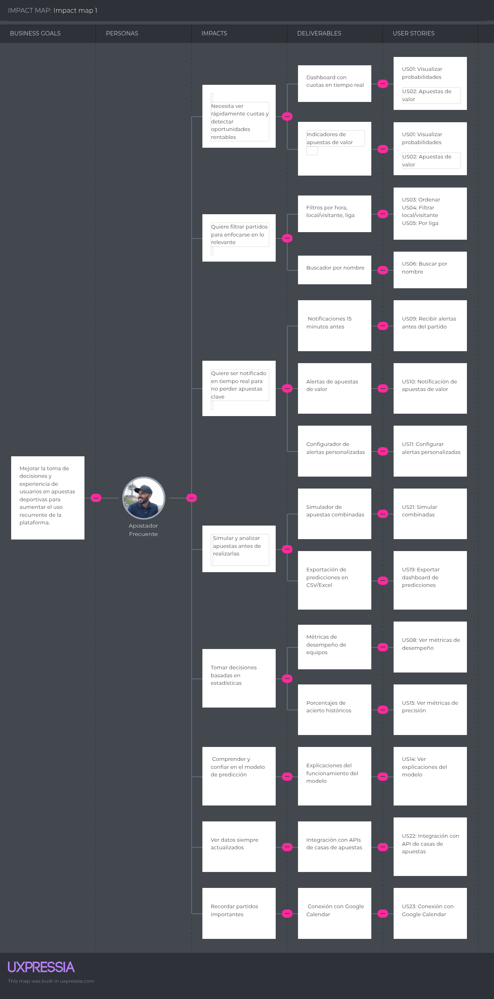
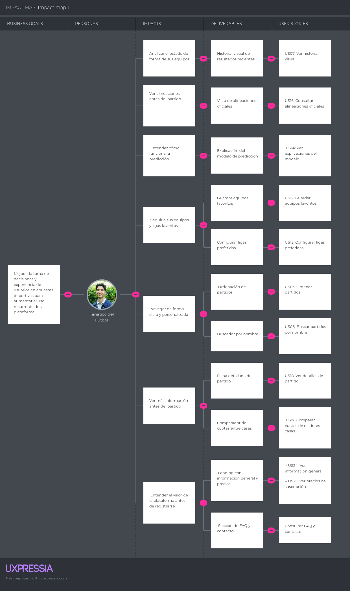

## 3.4. Product Backlog

|  # Orden  |  User Story Id  |  Título  |  Descripción  |  Story Points (1/2/3/5/8)  |
|:----------|:----------------|:---------|:--------------|:---------------------------|
| 1 | US13 | Integración con API de casas de apuestas | Como usuario quiero que las cuotas se actualicen automáticamente al menos una vez al día. | 5 |
| 2 | US02 | Identificar apuestas de valor | Como apostador frecuente quiero que el sistema marque las apuestas de valor para detectar oportunidades de mayor rentabilidad. | 5 |
| 3 | US01 | Visualizar probabilidades en el Dashboard | Como apostador frecuente quiero ver en un solo lugar las probabilidades de los partidos del día para ahorrar tiempo en mi análisis. | 3 |
| 4 | US07 | Recibir alertas antes del partido | Como usuario quiero recibir notificaciones diarias según mis equipos seleccionados como favoritos. | 3 |
| 5 | US09 | Guardar equipos favoritos | Como usuario quiero marcar equipos como favoritos para acceder rápido a sus partidos. | 2 |
| 6 | US03 | Ordenar partidos | Como usuario quiero ordenar los partidos por hora o probabilidad para priorizar en qué apostar primero. | 2 |
| 7 | US04 | Buscar partidos por nombre | Como usuario quiero escribir el nombre del equipo para ubicar rápido el partido que me interesa. | 2 |
| 8 | US05 | Ver historial visual | Como fanático del fútbol quiero ver un gráfico con los últimos resultados para analizar el estado de forma. | 3 |
| 9 | US06 | Ver métricas de desempeño | Como usuario quiero ver métricas de goles, tiros y córners para entender el rendimiento. | 3 |
| 10 | US08 | Configurar alertas personalizadas | Como usuario quiero configurar las preferencias de notificaciones por equipo favorito para recibir notificaciones relevantes. | 5 |
| 11 | US10 | Ver métricas de precisión | Como apostador quiero ver el histórico de aciertos para evaluar si confiar en la predicción. | 3 |
| 12 | US11 | Ver detalles de partido | Como usuario quiero abrir ficha de partido para ver datos específicos. | 3 |
| 13 | US12 | Exportar dashboard de predicciones | Como usuario quiero exportar dashboard de probabilidades en CSV o Excel para analizar mis resultados de manera externa. | 5 |
| 14 | US14 | Conexión con Google Calendar | Como usuario quiero agregar partidos importantes a mi calendario para recibir recordatorios. | 3 |
| 15 | US15 | Identificación de la Propuesta de Valor | Como visitante general, quiero entender rápidamente qué es Betalyze, para decidir si me interesa explorar más sobre el producto. | 1 |
| 16 | US16 | Validación del Funcionamiento | Como visitante del segmento Apostadores Frecuentes, quiero conocer cómo funciona el sistema de predicciones, para confiar en la calidad de los resultados antes de usar el producto. | 1 |
| 17 | US17 | Disponibilidad y Acceso Móvil | Como visitante del segmento Fanáticos del fútbol, quiero saber si puedo usar Betalyze desde mi celular, para acceder a las predicciones en cualquier momento. | 1 |
| 18 | US18 | Exploración de Acceso Gratuito | Como visitante general, quiero saber si puedo probar Betalyze sin compromiso, para evaluar su funciones más atractivas. | 1 |
| 19 | US19 | Evaluación de Interfaz y Herramientas Avanzadas | Como Apostador Frecuente, quiero visualizar las funcionalidades específicas y la interfaz del producto en móvil y web, para asegurarme de que la herramienta es lo suficientemente robusta y fácil de usar para mis análisis diarios. | 2 |

<br>

---

# Capítulo IV: Strategic-Level Software Design

## 4.1. Strategic-Level Attribute-Driven Design

### 4.1.1. Design Purpose

El diseño arquitectónico de Betalyze busca definir un sistema robusto, escalable y de alta disponibilidad que soporte el procesamiento de datos requerido utilizando un modelo de Machine Learning, garantizando la entrega de probabilidades y alertas para nuestros segmentos objetivos apostadores frecuentes y fanáticos del fútbol, además también considerando un equilibrio entre rendimiento y facilidad de mantenimiento en el proceso de diseño de nuestra arquitectura, al mismo tiempo de asegurar entregar una interfaz intuitiva.

<br>

### 4.1.2. Attribute-Driven Design Inputs

El proceso ADD comienza con la recopilación y análisis de atributos de calidad y requisitos funcionales, identificando la prioridad de atributos como escalabilidad para procesar grandes volúmenes de datos, disponibilidad para entrega de probabilidades y alertas, seguridad para protección de datos del usuario, y usabilidad para brindar una experiencia óptima a ambos segmentos de usuarios. A partir de estos recursos, se identifican decisiones arquitectónicas claves que guiarán la construcción del sistema.

<br>

#### 4.1.2.1. Primary Functionality (Primary User Stories)

- Las historias de usuario identificadas a continuación representan la funcionalidad principal del sistema y tienen un impacto directo en la arquitectura de la solución. Abordan la recolección y procesamiento de datos, la lógica central de negocio y la entrega de la información relevante a los usuarios, elementos que se consideran importantes para complir con el propósito de diseño de arquitectura de Betalyze.

| **Epic / User Story ID** | **Título** | **Descripción** | **Criterios de Aceptación** | **Relacionado con (Epic ID)** |
|:-------------------------|:-----------|:----------------|:----------------------------|:------------------------------|
| US01 | Visualizar probabilidades en el Dashboard | Como apostador frecuente quiero ver en un solo lugar las probabilidades de los partidos del día para ahorrar tiempo en mi análisis.            | Scenario 1: Carga exitosa – Dado que estoy en el dashboard, cuando se cargan los partidos, entonces veo probabilidades en tiempo real.<br><br>Scenario 2: Falla de conexión – Dado que no hay conexión, cuando intento cargar datos, entonces se muestra mensaje de error. | EP01 |
| US02                     | Identificar apuestas de valor    | Como apostador frecuente quiero que el sistema marque las apuestas de valor para detectar oportunidades de mayor rentabilidad.                | Scenario 1: Detección correcta – Dado que hay cuotas con valor, cuando abro el dashboard, entonces se resaltan los partidos.<br><br>Scenario 2: Sin datos – Dado que no se pueden calcular, cuando entro, entonces aparece aviso de “sin información disponible”. | EP01 |
| US08                     | Ver métricas de desempeño        | Como usuario quiero ver métricas de goles, tiros y córners para entender el rendimiento.                                                        | Scenario 1: Métricas mostradas – Dado que selecciono últimos partidos, cuando carga, entonces se muestran promedios.<br><br>Scenario 2: Datos no encontrados – Dado que no hay métricas, cuando abro la sección, entonces aparece alerta. | EP03 |
| US10                     | Notificación de apuestas de valor | Como usuario quiero que me avisen de apuestas de valor en mis equipos favoritos para no perder oportunidades.                                  | Scenario 1: Notificación enviada – Dado que hay apuesta de valor, cuando se detecta, entonces recibo aviso en tiempo real.<br><br>Scenario 2: Falla de sistema – Dado que el sistema está en mantenimiento, cuando debería llegar la alerta, entonces recibo mensaje de indisponibilidad.| EP04 |
| US15                     | Ver métricas de precisión         | Como apostador quiero ver el histórico de aciertos para evaluar si confiar en la predicción.                                                    | Scenario 1: Datos mostrados – Dado que entro a métricas, cuando carga, entonces veo % de acierto por liga.<br><br>Scenario 2: Sin información – Dado que no hay suficientes datos, cuando abro, entonces se muestra “no disponible”. | EP06 |
| US17                     | Comparar cuotas de distintas casas | Como apostador quiero ver comparativa de cuotas para elegir la más rentable.                                                                   | Scenario 1: Comparativa exitosa – Dado que hay varias casas, cuando abro la sección, entonces veo tabla comparativa.<br><br>Scenario 2: Faltan datos – Dado que una casa no responde, cuando cargo, entonces aparece nota “datos incompletos”. | EP07 |
| US22                     | Integración con API de casas de apuestas | Como usuario quiero que las cuotas se actualicen automáticamente al menos una vez al día.                                     | Scenario 1: Actualización automática – Dado que hay cambio, cuando recargo, entonces se reflejan nuevas cuotas.<br><br>Scenario 2: Falla de API – Dado que la API no responde, cuando cargo, entonces se muestra mensaje de error. | EP09 |


<br>

#### 4.1.2.2. Quality attribute Scenarios

- En esta sección realizamos la descripción de los escenarios de atributos de calidad que tienen un impacto significativo en la arquitectura, identificados a partir de las historias de usuario clave. Estos escenarios, centrados en el rendimiento, la disponibilidad y la modificabilidad, servirán como guía para la toma de decisiones de diseño. 

|  Atributo      |  Fuente  |  Estímulo  |  Artefacto  |  Entorno  |  Respuesta  |  Medida  |
|:---------------|:---------|:-----------|:------------|:----------|:------------|:---------|
| Rendimiento    | Usuario apostador frecuente | Solicitud de visualización de probabilidades | Sistema de procesamiento de probabilidades | Plataforma en operación continua | Responde con probabilidades actualizadas en máximo 9 segundos | Tiempo de respuesta ≤ 9 segundos |
| Disponibilidad | Usuario y sistema | Fallo en la conexión a API externa de cuotas | Módulo de integración API | Durante uso normal | Continúa operando con datos de otros proveedores y alerta al usuario sobre la interrupción | El sistema sigue operativo en un 99.9% del tiempo |
| Mantenibilidad | Un desarrollador. | Cambios en algoritmos de Machine Learning y UI | Módulo de Machine Learning (ML) y la base de datos de entrenamiento. | Entorno de desarrollo y despliegue | Cambios aplicados con mínimo impacto | Tiempo de despliegue ≤ 2 horas |
| Seguridad | Usuario | Intento de acceso no autorizado o manipulación de datos | Servicios de autenticación y base de datos | Cualquier acceso al sistema | Deniega acceso no autorizado | 0 incidentes de acceso no autorizado |
| Usabilidad | Usuarios | Interacción para visualizar probabilidades y cuotas | Interfaz de usuario | Uso en dispositivos móviles y web | Interfaz clara, accesible y responsiva, con notificaciones visibles | Nivel de satisfacción usuario > 80% |
| Robustez | Plataforma en producción | Fallas temporales en APIs externas | Todo el sistema | Uso regular y alta demanda | Maneja fallos sin caída total y recupera datos cuando posible | Tiempo medio de resputas a solicitudes < 1 minuto |
| Escalabilidad | Usuarios | Incremento en volumen de partidos y usuarios | Todo el sistema | Carga pico de usuarios y datos | Escala horizontal para atender carga adicional sin degradación perceptible | Capacidad de aumentar usuarios en x2 |

<br>

#### 4.1.2.3. Constraints

- Para el desarrollo de Betalyze, las restricciones definen los límites no negociables dentro de los cuales debe operar la solución, en nuestro contexto son impuestas por las necesidades del negocio. Las principales restricciones que consideramos son la obligatoriedad de operar en plataformas web y móviles, el tiempo de respuesta en el módulo de probabilidades y la necesidad para asegurar la disponibilidad de nuestra solución. A continuación se describe la especificación de las restricciones identificadas.

| Constraint ID | Título | Descripción | Criterios de Aceptación | Relacionado con (Epic ID) |
|:--------------|:-------|:------------|:------------------------|:--------------------------|
| CON-1 | Topología de la red | La arquitectura debe garantizar baja latencia y alta disponibilidad mediante una red distribuida en la nube, con balanceadores de carga y redundancia geográfica para evitar cuellos de botella y garantizar atender todas las solicitudes. | Dado que la plataforma Betalyze está operando bajo una alta carga de usuarios simultáneos, cuando un usuario solicita la visualización de probabilidades, entonces la red dirige la solicitud a un servidor disponible, garantizando una respuesta en menos de 9 segundos y manteniendo la disponibilidad. | EP01, EP04 |
| CON-2 | Desarrollo | Uso de Angular Framework del lado frontend web, Flutter para el desarrollo móvil y Spring Boot y servicios de terceros del lado backend, por la afinidad del equipo de desarrollo con estas tecnologías y las necesidades para la implementación que nos aseguren cumplir procesos del negocio. | Dado que el equipo de desarrollo necesita implementar una nueva funcionalidad, cuando se inicia la fase de codificación, entonces se utilizará Angular para la interfaz web, Flutter para la aplicación móvil y Spring Boot para los servicios del backend. | EP03, EP04, EP06, EP08 |
| CON-3 | Base de datos | PostgreSQL para la implementación de nuestra base de datos relacional, dada la afinidad del equipo de desarrollo y que nos permita asegurar el almacenamiento y consulta de datos de forma práctica. | Dado que una nueva funcionalidad requiere persistencia de datos relacionales, cuando el equipo de desarrollo diseña el modelo de datos, entonces la implementación debe realizarse exclusivamente sobre una base de datos PostgreSQL. | EP08 |
| CON-4 | Servidores | Uso de Servicios en la nube para montar nuestra infraestructura, que tenga las características y rendimiento necesario para garantizar la disponibilidad de la aplicación. | Dado que la aplicación Betalyze debe ser desplegada para producción, cuando el equipo de operaciones configura el entorno, entonces toda la infraestructura de servidores debe ser provisionada utilizando un proveedor de servicios en la nube. | EP08 |
| CON-5 | Software o servicios de terceros | Integración con APIs de terceros y uso de servicios de terceros para realizar el scrapeo de datos necesarios para cumplir con la adecuada actualización de la información y recolección de datos necesarios de fuentes externas. | Dado que el sistema requiere datos actualizados de cuotas y partidos, cuando el módulo de recolección de datos se ejecuta, entonces debe integrarse con las APIs de proveedores externos y servicios de web scraping definidos. | EP01, EP08, EP09 |
| CON-6 | Cumplimiento de normas | La aplicación debe cumplir con regulaciones y normativas legales para la protección de datos, publicidad y tratamiento de información. | Dado que la plataforma maneja datos personales de los usuarios, cuando se diseña o modifica cualquier funcionalidad que procese esta información, entonces se deben implementar todos los controles de seguridad y privacidad. | EP06, EP09 |

<br>

### 4.1.3. Architectural Drivers Backlog

- Para diseñar la arquitectura de Betalyze, el primer paso es identificar y priorizar los Architectural Drivers. Estos son los requisitos funcionales, atributos de calidad y restricciones técnicas que más influirán en las decisiones de diseño. El proceso consiste en analizar las historias de usuario clave, los escenarios de atributos de calidad y las restricciones impuestas por el negocio. Luego, cada uno de los drivers se evalúa según su importancia para los stakeholders y su impacto en la complejidad técnica de la arquitectura. A continuación, se presenta el backlog priorizado que sirve para asegurar que el diseño arquitectónico se centre en resolver los problemas más críticos y de mayor valor para nuestra solución.

| Driver ID | Título de Driver | Descripción | Importancia para Stakeholders (High, Medium, Low) | Impacto en Architecture Technical Complexity (High, Medium, Low) |
|:----------|:-----------------|:------------|:--------------------------------------------------|:-----------------------------------------------------------------|
| AD-01 | Rendimiento | El sistema debe responder con probabilidades actualizadas en tiempo definido tras la solicitud de un usuario. | High | High |
| AD-02 | Identificar apuestas de valor | El sistema debe procesar datos y usar Machine Learning para responder con la identificación de apuestas de valor. | High | High |
| AD-03 | Disponibilidad | El sistema debe mantenerse disponible y operativo la mayor parte del tiempo del tiempo, incluso si falla la conexión con APIs externas. | High | High |
| AD-04 | Integración con API y datos de terceros | El sistema debe ser capaz de recolectar datos y actualizar automáticamente las cuotas desde múltiples fuentes externas. | High | High |
| AD-05 | Topología de la red | La arquitectura debe usar una red en la nube que permita garantizar baja latencia y alta disponibilidad. | High | High |
| AD-06 | Escalabilidad | La arquitectura debe poder escalar horizontalmente para soportar el doble de usuarios y solicitudes de información sin decaer en el rendimiento. | High | Medium |
| AD-07 | Mantenibilidad | Los cambios en los algoritmos de Machine Learning o en la UI deben poder desplegarse en producción en un tiempo definido. | Medium | High |
| AD-08 | Desarrollo | El uso de Angular, Flutter y Spring Boot como tecnologías para la implementación de la solución. | Medium | High |
| AD-09 | Seguridad | El sistema debe ser capaz de mitigar intentos de acceso no autorizado y gestionar el acceso por roles. | Medium | Medium |


<br>

### 4.1.4. Architectural Design Decisions

**Iteración 1:**

- Como primera iteración para el diseño de arquitectura para Betalyze nos efocamos en definir la base para la primera versión de la solución. Teniendo como objetivo tomar decisiones que equilibren velocidad de desarrollo, simplicidad para la primera fase de implementación y alineación con los drivers más críticos de negocio y calidad, sentando las bases para futuras iteraciones del sistema.

- **Drivers Considerados**<br>
En esta fase inicial se consideran los siguientes drivers identificados con mayor relevancia para nuestra solución, tomando la identificación realizada en el Architectural Drivers Backlog:

  - AD-01 Rendimiento: Interacciones rápidas para una experiencia de usuario fluida.
  - AD-02 Identificar apuestas de valor: Núcleo de la lógica del sistema, basado en modelos de Machine Learning.
  - AD-03 Disponibilidad: El sistema debe ser tolerante a fallos, particularmente en componentes de terceros.
  - AD-04 Integración con APIs y datos de terceros: La plataforma depende de datos externos.
  - AD-05 Topología de red: Requiere desplegarse en una infraestructura cloud.
  - AD-06 Escalabilidad: Capacidad para manejar más carga sin degradar el rendimiento.

- **Tácticas y Patrones Evaluados**<br>
Para el la arquitectura de Betalyze hemos considerado dos estilos arquitectónicos principales:

  - Arquitectura Monolítica:
    - Toda la lógica del sistema como procesamiento, Machine Learning, recolección de datos y notificaciones reside en una base de código.
    - Considerar la modularidad y desacoplamiento interno.
    - Se despliega como una única unidad.

  - Arquitectura de Microservicios:
    - Se plantea dividir el sistema en servicios especializados.
    - Cada servicio se comunica de forma sincrónica a través de APIs REST.
    - Infraestructura más compleja, con múltiples bases de datos y despliegues.

<br>

**Candidate Pattern Evaluation Matrix**

<table>
  <tr>
    <th> Driver ID </th>
    <th> Título de Driver </th>
    <th colspan=2> Pattern 1: <br> <b>Monolito<b> </th>
    <th colspan=2> Pattern 2: <br> <b>Microservicios<b> </th>
  </tr>
  <tr>
    <td> AD-01, AD-03 </td>
    <td> Rendimiento y Disponibilidad </td>
    <td> Pro: <br> - Comunicación directa sin sobrecarga de red. <br> - Simplicidad de monitoreo y desarrollo en etapas iniciales. </td>
    <td> Con: <br> - Fallo de un componente afecta a todo el sistema. <br> - Escalado implica duplicar toda la aplicación. </td>
    <td> Pro: <br> - Fallos aislados por servicio. <br> - Servicios críticos pueden escalarse individualmente. </td>
    <td> Con: <br> - Comunicación sincrónica entre servicios puede introducir latencia. <br> - Mayor complejidad operativa y de despliegue. </td>
  </tr>
  <tr>
    <td> AD-02, AD-07 </td>
    <td> Machine Learning y Mantenibilidad </td>
    <td> Pro: <br> - Acceso directo a datos y lógica de negocio en una misma base. <br> - Permite colaboración más sencilla entre equipos. </td>
    <td> Con: <br> - El cambio en lógica de ML requiere desplegar todo. <br> - Dificultad para escalar la lógica de ML por separado. </td>
    <td> Pro: <br> - El servicio de ML puede desplegarse de forma independiente. <br> - Aislamiento promueve separación por equipos específicos. </td>
    <td> Con: <br> - Mayor complejidad en coordinación de cambios entre servicios. <br> - Necesita estrategia clara de gestión de comunicación entre APIs. </td>
  </tr>
  <tr>
    <td> AD-04, AD-05 </td>
    <td> Integración con APIs externas </td>
    <td> Pro: <br> Manejo de fallos centralizado en una misma base accesible al equipo. </td>
    <td> Con: <br> Fallo de una integración afecta a todo el sistema. </td>
    <td> Pro: <br> Cada integración puede implementarse y escalarse por separado. </td>
    <td> Con: <br> Riesgo de fallos en cascada si una API dependiente falla. </td>
  </tr>
  <tr>
    <td> AD-06 </td>
    <td> Escalabilidad </td>
    <td> Pro: <br> Puede escalar verticalmente o por réplicas completas. </td>
    <td> Con: <br> No es eficiente escalar solo una parte del sistema. </td>
    <td> Pro: <br> Escalado granular por servicio. </td>
    <td> Con: <br> Aumenta la complejidad de despliegue y monitoreo. </td>
  </tr>
</table>


- **Criterios de Decisión**<br>
Como primera iteración para la definición del diseño de arquitectura para Betalyze como equipo se optó por una arquitectura monolítica como punto de partida para el desarrollo, debido a que nos permite agilizar la primera fase de desarrollo MVP, disminuye la complejidad y facilita el desarrollo colaborativo en etapas tempranas del producto.

<br>

### 4.1.5. Quality Attribute Scenario Refinements

En el contexto de desarrollo de Betalyze, las decisiones tomadas al finalizar el Quality Attribute Workshop se centraron en refinar los escenarios de calidad para asegurar que la arquitectura del sistema estuviera alineada con los objetivos de negocio y las expectativas de los usuarios. Se priorizaron los atributos de rendimiento, disponibilidad y escalabilidad siendo parte de la primera iteración en los drivers considerados para las decisiones de diseño de arquitectura. A continuación, se presenta la versión final de los escenarios refinados.

1. **QAS: Rendimiento**

<table>
  <tr>
    <th colspan=3> Scenario Refinement for Scenario Rendimiento </th>
  </tr>
  <tr>
    <td colspan=2> Scenario(s): </td>
    <td> El usuario apostador frecuente solicita visualizar las probabilidades de un partido, y el sistema responde en un tiempo máximo de 9 segundos. </td>
  </tr>
  <tr>
    <td colspan=2> Business Goals: </td>
    <td> Asegurar la satisfacción del cliente y la competitividad del sistema al ofrecer información actualizada de manera rápida y eficiente. </td>
  </tr>
  <tr>
    <td colspan=2> Relevant Quality Attributes:  </td>
    <td> Rendimiento (tiempo de respuesta). </td>
  </tr>
  <tr>
    <td rowspan=7> Scenario Components </td>
  </tr>
  <tr>
    <td> Stimulus: </td>
    <td> Solicitud de visualización de probabilidades. </td>
  </tr>
  <tr>
    <td> Stimulus Source: </td>
    <td> Usuario apostador frecuente. </td>
  </tr>
  <tr>
    <td> Environment: </td>
    <td> La plataforma se encuentra en operación continua. </td>
  </tr>
  <tr>
    <td> Artifact (if Known) </td>
    <td> Módulo de procesamiento de probabilidades. </td>
  </tr>
  <tr>
    <td> Response: </td>
    <td> El sistema responde con las probabilidades actualizadas en un tiempo máximo de 9 segundos. </td>
  </tr>
  <tr>
    <td> Response Measure:  </td>
    <td> Tiempo de respuesta ≤ 9 segundos. </td>
  </tr>
  <tr>
    <td colspan=2> Questions:  </td>
    <td> ¿Cuál es la carga máxima esperada? ¿Qué factores pueden afectar la latencia? </td>
  </tr>
  <tr>
    <td colspan=2> Issues:  </td>
    <td> La latencia de las API externas y la optimización de la base de datos son puntos importantes a considerar. </td>
  </tr>
</table>

<br>

2. **QAS: Disponibilidad**

<table>
  <tr>
    <th colspan=3> Scenario Refinement for Scenario Disponibilidad </th>
  </tr>
  <tr>
    <td colspan=2> Scenario(s): </td>
    <td> Un fallo en la conexión a una API externa de cuotas provoca que el sistema siga operando con datos de otros proveedores. </td>
  </tr>
  <tr>
    <td colspan=2> Business Goals: </td>
    <td> Mantener la continuidad del servicio y la confiabilidad del sistema, minimizando el impacto de los fallos externos. </td>
  </tr>
  <tr>
    <td colspan=2> Relevant Quality Attributes:  </td>
    <td> Disponibilidad (tolerancia a fallos). </td>
  </tr>
  <tr>
    <td rowspan=7> Scenario Components </td>
  </tr>
  <tr>
    <td> Stimulus: </td>
    <td> Fallo en la conexión a una API externa de cuotas. </td>
  </tr>
  <tr>
    <td> Stimulus Source: </td>
    <td> Usuario y el propio sistema. </td>
  </tr>
  <tr>
    <td> Environment: </td>
    <td> Durante el uso normal del sistema. </td>
  </tr>
  <tr>
    <td> Artifact (if Known) </td>
    <td> El módulo de integración de API y datos. </td>
  </tr>
  <tr>
    <td> Response: </td>
    <td> El sistema continúa operando con datos de otros proveedores. </td>
  </tr>
  <tr>
    <td> Response Measure:  </td>
    <td> El sistema sigue operativo, sin presentar una mayor interrupción en su funcionamiento. </td>
  </tr>
  <tr>
    <td colspan=2> Questions:  </td>
    <td> ¿Se necesita un sistema de monitoreo? ¿Cómo se gestionará la redundancia de datos entre los proveedores? </td>
  </tr>
  <tr>
    <td colspan=2> Issues:  </td>
    <td> La dependencia de terceros y la sincronización de datos entre múltiples fuentes son los principales desafíos. </td>
  </tr>
</table>

<br>

3. **QAS: Escalabilidad**

<table>
  <tr>
    <th colspan=3> Scenario Refinement for Scenario Escalabilidad </th>
  </tr>
  <tr>
    <td colspan=2> Scenario(s): </td>
    <td> Un incremento en el volumen de usuarios durante un evento pico hace que el sistema escale. </td>
  </tr>
  <tr>
    <td colspan=2> Business Goals: </td>
    <td> Apoyar el crecimiento de la solución manteniendo un rendimiento estable en alta demanda. </td>
  </tr>
  <tr>
    <td colspan=2> Relevant Quality Attributes:  </td>
    <td> Escalabilidad </td>
  </tr>
  <tr>
    <td rowspan=7> Scenario Components </td>
  </tr>
  <tr>
    <td> Stimulus: </td>
    <td> Incremento en el volumen de partidos y usuarios. </td>
  </tr>
  <tr>
    <td> Stimulus Source: </td>
    <td> Usuarios </td>
  </tr>
  <tr>
    <td> Environment: </td>
    <td> Carga pico de usuarios y datos. </td>
  </tr>
  <tr>
    <td> Artifact (if Known) </td>
    <td> Todo el sistema. </td>
  </tr>
  <tr>
    <td> Response: </td>
    <td> El sistema escala horizontalmente para atender la carga adicional sin una degradación notable del servicio. </td>
  </tr>
  <tr>
    <td> Response Measure:  </td>
    <td> Capacidad para soportar el doble de la cantidad de usuarios habituales. </td>
  </tr>
  <tr>
    <td colspan=2> Questions:  </td>
    <td> ¿Qué componentes son más susceptibles a la carga? ¿Cómo se distribuirán las solicitudes? </td>
  </tr>
  <tr>
    <td colspan=2> Issues:  </td>
    <td> La gestión de sesiones y la coherencia de la base de datos en nuestro contexto. </td>
  </tr>
</table>

<br>

## 4.2. Strategic-Level Domain-Driven Design
El objetivo de este capítulo es documentar de manera formal el **descubrimiento de dominio** realizado para la plataforma Betalyze, orientada a proporcionar predicciones, métricas y alertas de apuestas deportivas en tiempo real.  
Se describe el proceso seguido, los eventos de dominio identificados, los contextos delimitados y la forma en que interactúan, así como las relaciones de dependencia y los mensajes que circulan entre ellos.

### 4.2.1. EventStorming
<!-- Contenido de EventStorming -->
Se realizaron varias sesiones colaborativas de **EventStorming**, en las cuales se convocó a expertos de negocio, analistas de datos, desarrolladores y representantes de operaciones.  
El objetivo fue **capturar todos los eventos significativos** que ocurren dentro del sistema, sin filtrar ni priorizar en la primera etapa.  
Estos eventos constituyen la materia prima para identificar los *bounded contexts* y las integraciones necesarias.

- Los eventos detectados se agrupan a continuación según la naturaleza del proceso que representan.

<p align="center">
    
</p>

- Una vez registrados los eventos, se procedió a su refinamiento dentro del dominio. Esto resultó en la identificación y la secuenciación lógica de eventos faltantes, lo cual proporcionó resultados consolidados.

<p align="center">
    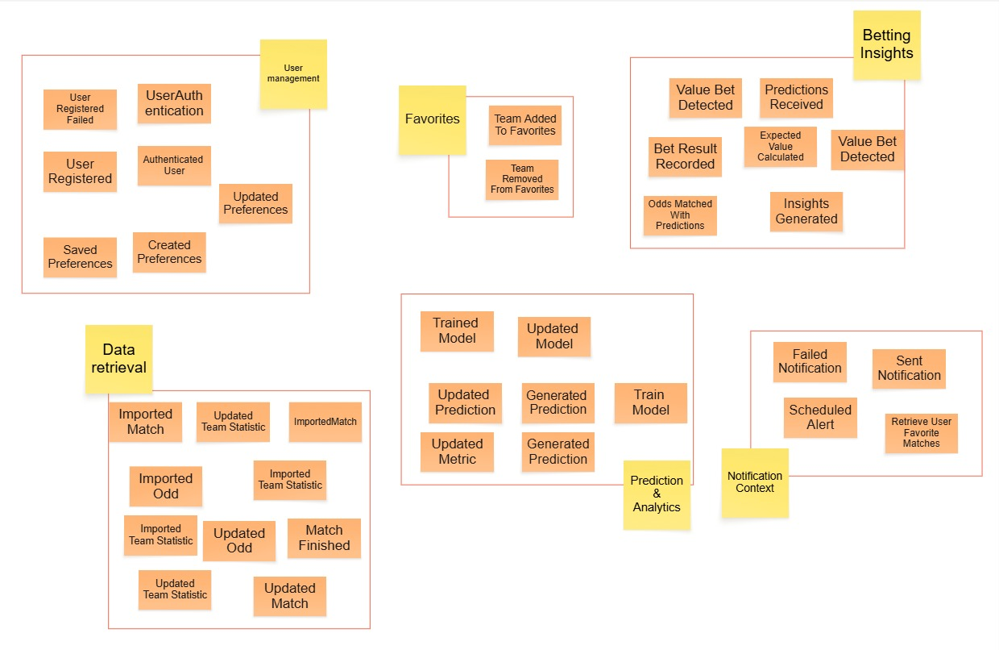
</p>

- Tras finalizar el refinamiento de los eventos, se procedió al registro de los factores desencadenantes, especificando los usuarios y sistemas involucrados en la generación de dichos eventos.

<p align="center">
    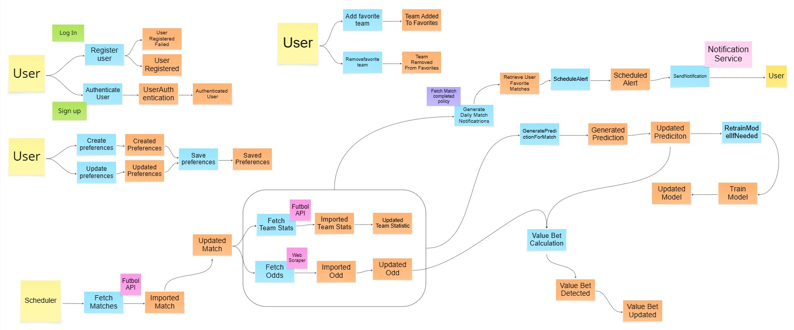
</p>

- Finalmente, se identificaron los agregados, se reordenaron y se delimitaron dentro de un contexto acotado que fue aplicado de manera específica a cada uno de ellos.

<p align="center">
    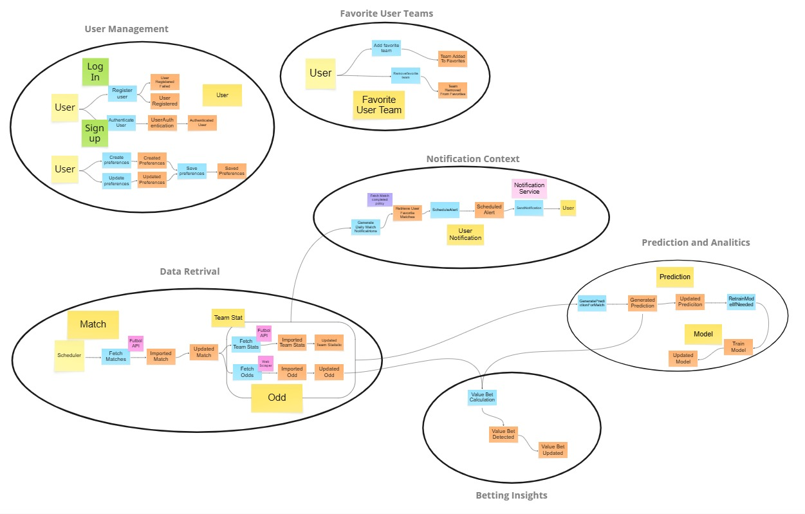
</p>

<br>

**URL Desarrollo de Event Storming en Miro:** <https://miro.com/app/board/uXjVM5kwB68=/?share_link_id=734768237007>

<br>

### 4.2.2. Candidate Context Discovery
<!-- Contenido de Candidate Context Discovery -->
A partir del mapeo de eventos se evaluó la criticidad de cada uno en la cadena de valor.  
Se priorizaron aquellos que impactan directamente la experiencia del usuario y la capacidad predictiva del sistema:

* **PartidoImportado / CuotaImportada**: Entrada primaria de datos, sin ellos no existe predicción.  
* **PrediccionGenerada**: Resultado central de la plataforma, motor de todas las métricas.  
* **ApuestaDeValorDetectada**: Determina las oportunidades más rentables.  
* **NotificacionEnviada**: Entrega la propuesta de valor al usuario en tiempo real.  
* **UsuarioRegistrado / PreferenciasGuardadas**: Permiten personalización y filtrado.  
* **MetricaActualizada / ModeloEntrenado**: Garantizan transparencia y calidad del algoritmo.

La segmentación resultante generó los **Bounded Contexts** principales:

1. **Data Retrieval** – adquisición de datos externos de partidos, cuotas y estadísticas.  
2. **Prediction & Analytics** – entrenamiento de modelos y generación de predicciones.  
3. **Betting Insights** – cálculo de métricas y detección de apuestas de valor.  
4. **Notification Context** – envío de alertas y notificaciones.  
5. **User Management** – registro, autenticación y manejo de preferencias.  
6. **Transparency & Trust** – exposición de métricas de precisión y explicaciones del modelo.

<br>


<br>

### 4.2.3. Domain Message Flows Modeling
<!-- Contenido de Domain Message Flows Modeling -->
Los eventos y comandos se organizaron en **flujos de mensajes** que describen cómo la información se mueve entre contextos.  
Cada fila indica origen, destino y el mensaje que dispara la interacción.

| Origen | Destino | Mensaje | Propósito |
|-------|---------|---------|-----------|
| Data Retrieval | Prediction & Analytics | PartidoImportado, CuotaImportada, EstadisticaEquipoImportada | Alimentar datos crudos para el motor de predicciones |
| Prediction & Analytics | Betting Insights | PrediccionGenerada | Permitir el cálculo de métricas y apuestas de valor |
| Betting Insights | Notification Context | ApuestaDeValorDetectada | Generar notificaciones de oportunidades |
| Prediction & Analytics | Transparency & Trust | ModeloEntrenado, MetricaActualizada | Publicar métricas de desempeño y evolución del modelo |
| Favorite User Teams | Notification Context | PreferenciasGuardadas | Configurar filtros y canales de notificación |
| User Management | Todos | UsuarioAutenticado | Autorización de consultas y acciones |
| Notification Context | Dispositivos de Usuario | NotificacionEnviada | Entrega de alertas en tiempo real |

<br>

- **Escenario: Registro de nuevo usuario**

  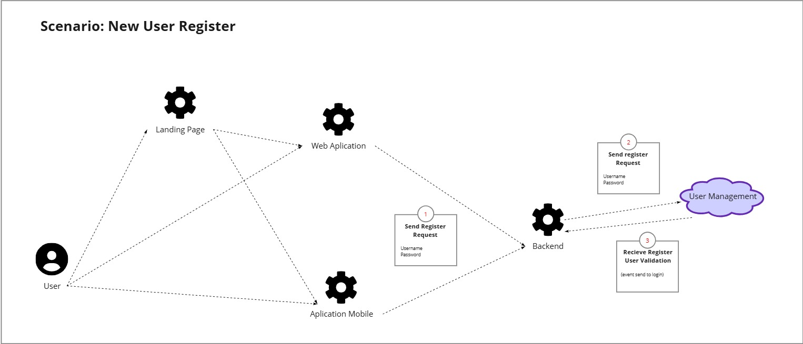

- **Escenario: Generar un pronóstico de los partidos diarios**

  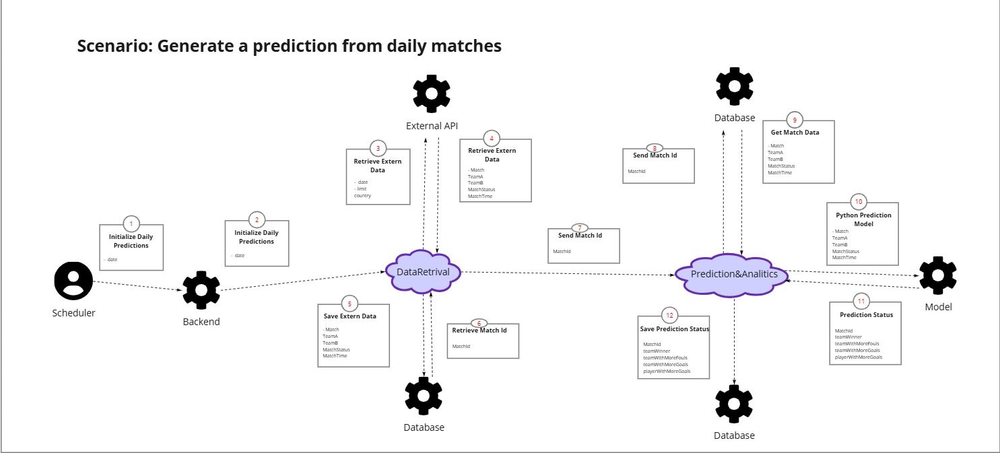

- **Escenario: Enviar notificación del partido de tu equipo favorito**

  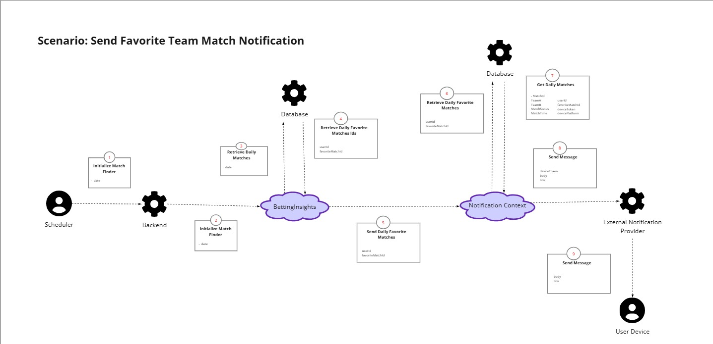

<br>

### 4.2.4. Bounded Context Canvases
<!-- Contenido de Bounded Context Canvases -->
Cada contexto se detalla en un **Context Canvas**, que documenta sus responsabilidades, mensajes y lenguaje ubicuo.

- **Data Retrieval**

| Campo | Descripción |
|------|-------------|
| **Responsabilidad** | Recolectar, validar y almacenar datos de partidos, cuotas y estadísticas desde proveedores externos. |
| **Mensajes Entrantes** | Command: `FetchMatches`, `FetchOdds`. |
| **Mensajes Salientes** | Event: `PartidoImportado`, `CuotaImportada`, `EstadisticaEquipoImportada`. |
| **Decisiones Clave** | Políticas de frecuencia de actualización, manejo de inconsistencias de API. |
| **Lenguaje Ubicuo** | Partido, Cuota, Estadística, Proveedor. |
| **Relaciones** | Proveedor de datos → Customer–Supplier con Prediction & Analytics. |

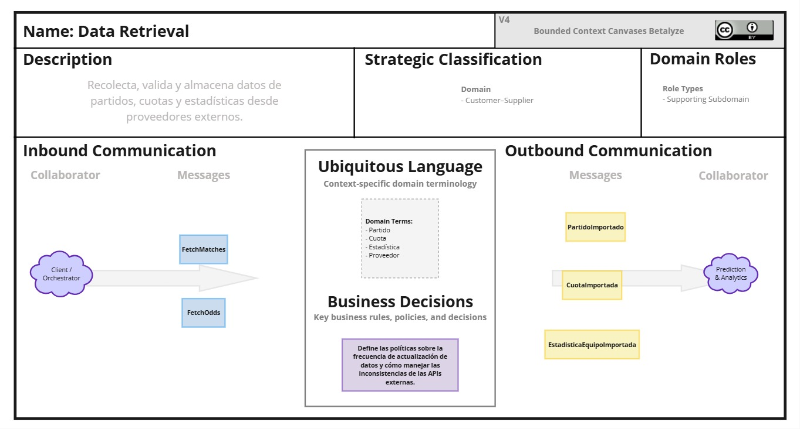

<br>

- **Prediction & Analytics**

| Campo | Descripción |
|------|-------------|
| **Responsabilidad** | Entrenar modelos de Machine Learning y generar predicciones de probabilidad de resultados. |
| **Mensajes Entrantes** | Event: `PartidoImportado`, `CuotaImportada`. |
| **Mensajes Salientes** | Event: `PrediccionGenerada`, `ModeloEntrenado`. |
| **Decisiones Clave** | Selección de variables, criterios de reentrenamiento. |
| **Lenguaje Ubicuo** | Predicción, Modelo, Probabilidad. |
| **Relaciones** | Customer de Data Retrieval; Supplier de Betting Insights y Transparency & Trust. |

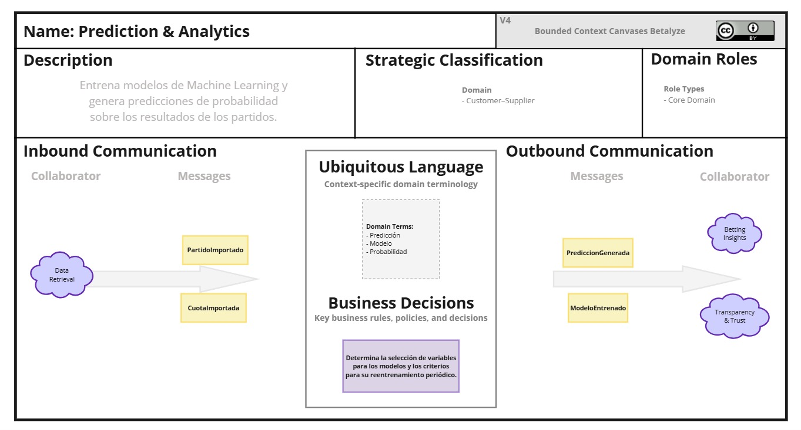

<br>

- **Betting Insights**

| Campo | Descripción |
|------|-------------|
| **Responsabilidad** | Evaluar predicciones y calcular métricas de valor esperado para identificar apuestas rentables. |
| **Mensajes Entrantes** | Event: `PrediccionGenerada`. |
| **Mensajes Salientes** | Event: `ApuestaDeValorDetectada`, `MetricaActualizada`. |
| **Decisiones Clave** | Algoritmos de valor esperado, reglas de filtrado. |
| **Lenguaje Ubicuo** | Apuesta de Valor, Métrica, Historial. |
| **Relaciones** | Customer de Prediction & Analytics; Supplier de Notification Context y Transparency & Trust. |


<br>

- **Notification Context**

| Campo | Descripción |
|------|-------------|
| **Responsabilidad** | Enviar notificaciones en tiempo real según las preferencias de usuario y la detección de oportunidades. |
| **Mensajes Entrantes** | Event: `ApuestaDeValorDetectada`, `PreferenciasGuardadas`. |
| **Mensajes Salientes** | Event: `NotificacionEnviada`, `NotificacionFallida`. |
| **Decisiones Clave** | Priorización de alertas, selección de canal (push, correo). |
| **Lenguaje Ubicuo** | Alerta, Notificación, Canal, Preferencia. |
| **Relaciones** | Publisher–Subscriber con Betting Insights; Shared Kernel con User Management. |

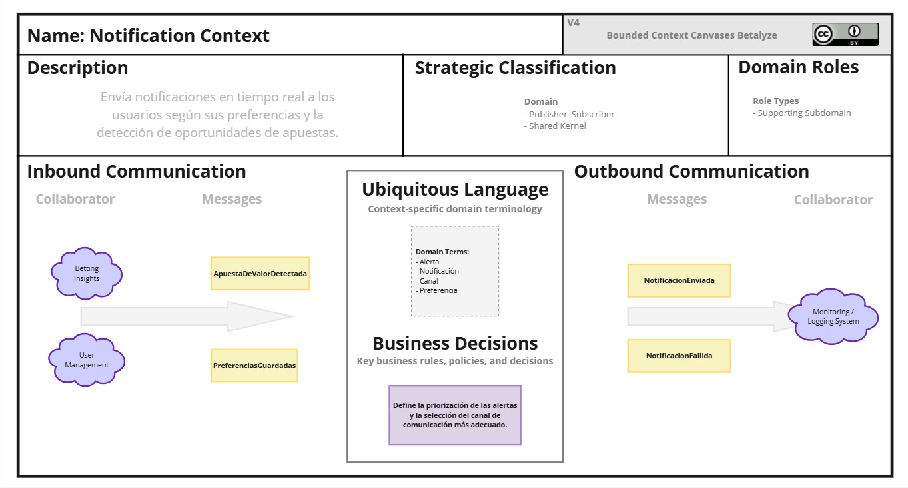

<br>

- **User Management**

| Campo | Descripción |
|------|-------------|
| **Responsabilidad** | Gestionar el ciclo de vida del usuario, autenticación y almacenamiento de preferencias. |
| **Mensajes Entrantes** | Command: `RegisterUser`, `UpdatePreferences`. |
| **Mensajes Salientes** | Event: `UsuarioRegistrado`, `PreferenciasGuardadas`. |
| **Decisiones Clave** | Validación de identidad, políticas de privacidad. |
| **Lenguaje Ubicuo** | Usuario, Preferencia, Suscripción. |
| **Relaciones** | ACL hacia todos los contextos para autenticación. |

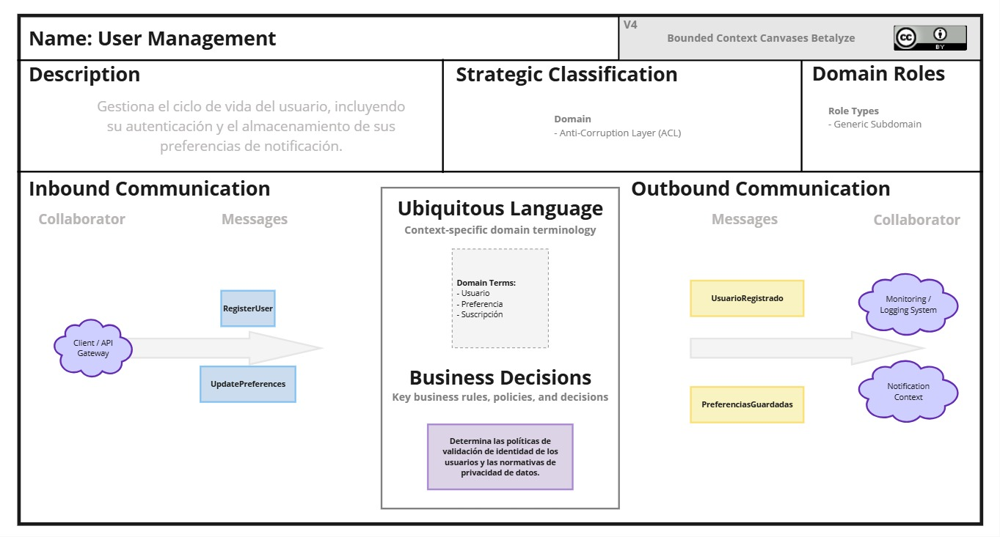

<br>

- **Transparency & Trust**

| Campo | Descripción |
|------|-------------|
| **Responsabilidad** | Publicar métricas de precisión y explicaciones del modelo para generar confianza en las predicciones. |
| **Mensajes Entrantes** | Event: `MetricaActualizada`, `ModeloEntrenado`. |
| **Mensajes Salientes** | Event: `ExplicacionPublicada`. |
| **Decisiones Clave** | Nivel de detalle de las métricas, retención de información histórica. |
| **Lenguaje Ubicuo** | Métrica de Precisión, Explicación de Modelo. |
| **Relaciones** | Open Host Service de Prediction & Analytics y Betting Insights. |

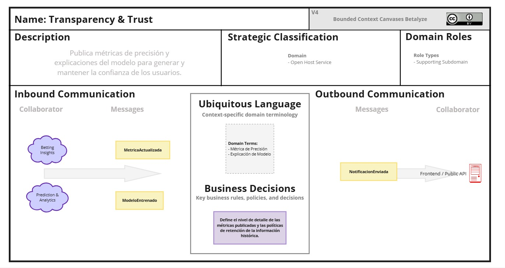

<br>

### 4.2.5. Context Mapping

- Para esta fase del proyecto, creamos mapas visuales que nos ayudaron a entender cómo se conectan las diferentes áreas del sistema. A partir de estos mapas, exploramos y evaluamos varias opciones de diseño, probando diferentes formas de organizar, dividir o agrupar las funcionalidades. Finalmente, para elegir la mejor arquitectura para Betalyze, analizamos cada propuesta usando estrategias de diseño conocidas, como la Capa Anticorrupción. A continuación, mostramos las alternativas que consideramos.


- **Opción 1:**

  

<br>

- **Opción 2:**

  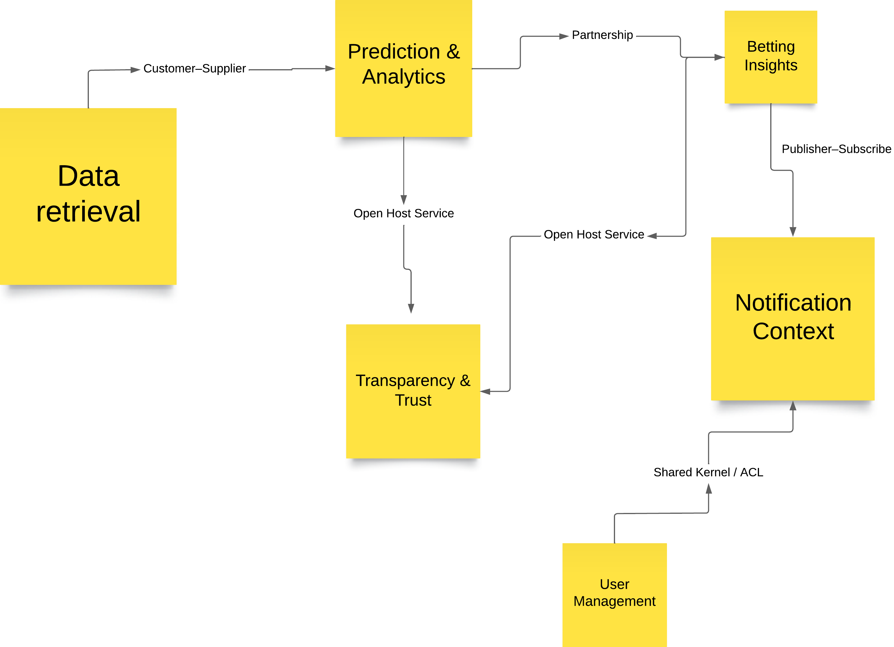

<br>

- El siguiente cuadro resume las **relaciones estratégicas** entre los contextos.

| Downstream | Upstream | Tipo de Relación | Observaciones |
|------------|----------|------------------|---------------|
| Prediction & Analytics | Data Retrieval | Customer–Supplier | Dependencia directa de datos externos. |
| Betting Insights | Prediction & Analytics | Customer–Supplier | Consumo de predicciones como contrato. |
| Transparency & Trust | Prediction & Analytics | Open Host Service | Exposición pública de métricas. |
| Transparency & Trust | Betting Insights | Open Host Service | Publicación de métricas de valor. |
| Notification Context | Betting Insights | Publisher–Subscriber | Comunicación asíncrona de alertas. |
| Notification Context | User Management | Shared Kernel | Uso compartido de esquema de preferencias. |
| Todos | User Management | ACL | Control de acceso a operaciones. |

<br>

## 4.3. Software Architecture


### 4.3.1. Software Architecture System Landscape Diagram

Este diagrama muestra la arquitectura general de Betalyze, destacando los principales componentes del sistema, como el motor de predicciones basado en Machine Learning, la base de datos de estadísticas deportivas y la interfaz de usuario. También ilustra cómo estos interactúan con servicios externos, como APIs deportivas y plataformas de mensajería.


### 4.3.2. Software Architecture Context Level Diagrams

El diagrama de nivel de contexto de Betalyze detalla las interacciones entre el sistema y sus actores externos, como apostadores frecuentes, fanáticos del fútbol, y proveedores de datos deportivos. Este nivel ayuda a identificar las dependencias clave y los límites del sistema.


### 4.3.3. Software Architecture Container Level Diagrams

El diagrama de nivel de contenedores de Betalyze describe los principales contenedores de software, como el backend para procesamiento de predicciones, el frontend para visualización de datos y el módulo de notificaciones. También muestra cómo estos contenedores se comunican entre sí y con servicios externos.


### 4.3.4. Software Architecture Deployment Diagrams

El diagrama de despliegue de Betalyze ilustra cómo los contenedores de software se asignan a la infraestructura, como servidores en la nube, contenedores Docker y servicios de mensajería. Este diagrama es crucial para planificar la implementación y garantizar la escalabilidad del sistema.


<br>

---

# Capítulo V: Tactical-Level Software Design

## 5.1. Bounded Context: Data Retrieval

Este bounded context se encarga de la adquisición, normalización y persistencia de datos de partidos, cuotas y estadísticas. Se integra directamente con APIs externas o scrapers y se implementará como módulos del monolito Spring.

### 5.1.1. Domain Layer

La capa de dominio modela las entidades y reglas de negocio puras relacionadas con ingestión y normalización de datos, definiendo los conceptos centrales que gobiernan la lógica del contexto.

- *Match* (Entity)  
  - Propósito: representar un partido.  
  - Atributos: matchId: UUID, homeTeamId: UUID, awayTeamId: UUID, startAt: DateTime, status: MatchStatus.  
  - Métodos: isUpcoming(): boolean, timeToStart(): Duration.

- *Team* (Entity)  
  - Propósito: datos de un equipo.  
  - Atributos: teamId: UUID, name: String, country: String, leagueId: UUID.  
  - Métodos: displayName(): String.

- *OddsSnapshot* (Entity)  
  - Propósito: snapshot de cuota obtenido de una fuente.  
  - Atributos: snapshotId: UUID, matchId: UUID, sourceName: String, market: Market, oddValue: Decimal, capturedAt: DateTime.  
  - Métodos: getOdd(): Decimal.

- *RawFeed* (Entity)  
  - Propósito: registrar payload crudo (API response o HTML scraper).  
  - Atributos: feedId: UUID, provider: String, payload: JSON, receivedAt: DateTime, status: FeedStatus, storedPath: String.  
  - Métodos: markProcessed(), markFailed(reason:String).

- *MatchAggregate* (Aggregate root)  
  - Propósito: agrupar Match, OddsSnapshot[], Statistics?.  
  - Métodos: applySnapshot(snapshot: OddsSnapshot), normalize().

*Value Objects*  
- Market (HOME_WIN, DRAW, AWAY_WIN, OVER_UNDER_X)  
- Endpoint (url: String, auth: AuthInfo)

*Interfaces / Domain Services*  
- IMatchRepository (save, findById, findByDateRange)  
- IDataNormalizer (normalize(raw: RawFeed): List<Match>)  
- IOddsSelector (selectBestOdds(matchId: UUID): List<OddsSnapshot>)

### 5.1.2. Interface Layer

La capa de interfaz expone los endpoints y los componentes de integración con proveedores externos. Todo se publica como endpoints y servicios dentro del monolito Spring.

- *MatchIngestController* (Spring REST Controller)  
  - Endpoints: POST /ingest/raw, GET /matches/{id}.  
  - Responsabilidad: ingest manual y validación.

- *PublicMatchesController* (Spring REST Controller)  
  - Endpoints: GET /matches/today, GET /matches/{id}/odds.  
  - Responsabilidad: servir datos al frontend.

- *ApiProviderClient* (component)  
  - Implementa llamadas HTTP a APIs externas con retries y rate limiting.

- *ScraperService* (component)  
  - Implementa scrapers para fuentes sin API.

- *Scheduler* (Spring @Scheduled)  
  - Responsabilidad: ejecutar sincronizaciones periódicas (syncOdds, dailyIngest).

### 5.1.3. Application Layer

La capa de aplicación orquesta los casos de uso del contexto. Contiene handlers que coordinan repositorios, normalizadores y adaptadores para realizar ingests y sincronizaciones.

- IngestRawFeedCommand / IngestRawFeedHandler  
  - Flujo: persistir RawFeed -> IDataNormalizer.normalize -> persistir Match y OddsSnapshot -> actualizar cache.

- SyncOddsFromProviderCommand / SyncOddsHandler  
  - Flujo: ApiProviderClient o ScraperService -> parseo -> generar OddsSnapshot -> persistir.

- GetMatchesQuery / GetMatchesHandler  
  - Flujo: consulta IMatchRepository -> mapear DTO -> devolver.

La coordinación se realiza con llamadas internas y jobs programados. No se usa message broker.

### 5.1.4. Infrastructure Layer

La capa de infraestructura provee adaptadores concretos para MySQL. Todas las implementaciones son adaptadores Spring listos para inyectar.

- ApiProviderClientHttp (RestTemplate/WebClient) con retry/backoff.  
- ScraperAdapter (Jsoup/HtmlUnit) para fuentes HTML.  
- MatchRepositoryJpa (Spring Data JPA / PostgreSql).  
- RawFeedStore (filesystem).  

### 5.1.6. Bounded Context Software Architecture Component Level Diagrams

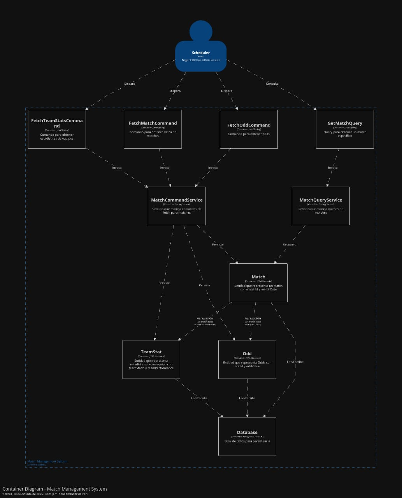

### 5.1.7. Bounded Context Software Architecture Code Level Diagrams


#### 5.1.7.1. Bounded Context Domain Layer Class Diagrams

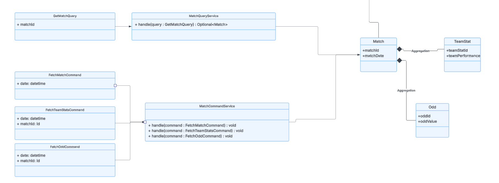

El diagrama presenta la arquitectura de gestión de matches, equipos y odds siguiendo el patrón Command Query Responsibility Segregation (CQRS). El Scheduler actúa como orquestador de tareas automáticas que dispara tres comandos independientes: FetchMatchCommand para obtener datos de matches, FetchTeamStatsCommand para recopilar estadísticas de equipos, y FetchOddCommand para actualizar las cuotas de apuestas. Estos comandos convergen en el MatchCommandService, que se encarga de persistir la información en las tres entidades del dominio: Match (con identificador y fecha), TeamStat (con identificador de equipo y rendimiento) y Odd (con identificador y valor de cuota). Paralelamente, el Scheduler consulta información a través de GetMatchQuery, que se comunica con MatchQueryService para recuperar datos de matches. Las entidades están relacionadas mediante agregaciones, donde un Match contiene múltiples TeamStats y Odds asociadas. Toda la información se persiste en una base de datos relacional, permitiendo que el sistema mantenga un registro integral de matches, rendimiento de equipos y cuotas disponibles en tiempo real.

#### 5.1.7.2. Bounded Context Database Design Diagram

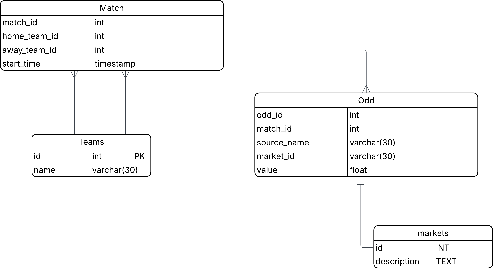

<br>

---

## 5.2. Bounded Context: Prediction & Analytics

### 5.2.1. Domain Layer

Este bounded context organiza la gestión de artefactos ML, la catalogación de versiones y la generación de predicciones. El entrenamiento se realiza en python; el monolito registra metadata, descarga o recibe referencias de artifacts y ejecuta predicciones. Toda la persistencia es en PosgreSql.
La capa de dominio modela modelos, versiones, trabajos de entrenamiento, sets de features y predicciones. Contiene las entidades que representan el estado y las reglas mínimas para validar metadatos y resultados.

- Model (Entity)  
  - Propósito: representar un modelo lógico disponible para inferencia.  
  - Atributos: +modelId: UUID, +name: String, +type: String, +currentVersionId: UUID.  
  - Métodos: +getCurrentVersion(): ModelVersion, +predict(features: FeatureSet): Prediction.

- ModelVersion (Entity)  
  - Propósito: versión registrada de un modelo con referencia al artifact.  
  - Atributos: +versionId: UUID, +modelId: UUID, +artifactPathOrId: String, +metrics: JSON, +createdAt: DateTime, +checksum: String.  
  - Métodos: +validateChecksum(): boolean.

- TrainingJob (Entity)  
  - Propósito: registrar metadatos de un entrenamiento realizado en Colab.  
  - Atributos: +jobId: UUID, +modelId: UUID, +status: String, +params: JSON, +startedAt: DateTime, +finishedAt: DateTime, +colabNoteUrl: String.  
  - Métodos: +markCompleted(versionId: UUID), +markFailed(reason: String).

- FeatureSet (Entity)  
  - Propósito: conjunto de features generadas para un match usadas en inferencia.  
  - Atributos: +featureSetId: UUID, +matchId: UUID, +featuresSerialized: TEXT, +generatedAt: DateTime.  
  - Métodos: +get(featureName: String): Any.

- Prediction (Entity)  
  - Propósito: resultado de una inferencia para un partido.  
  - Atributos: +predictionId: UUID, +matchId: UUID, +modelVersionId: UUID, +probabilitiesSerialized: TEXT, +generatedAt: DateTime, +confidence: DECIMAL(5,4).  
  - Métodos: +getProbability(outcome: String): Decimal.

*Interfaces / Domain Services*  
- IModelRepository (+saveVersion, +getLatest, +findById)  
- IModelArtifactLoader (+retrieve(artifactPathOrId): bytes|File)  
- IFeatureExtractor (+extract(matchId: UUID): FeatureSet)  
- IPredictor (+predict(modelVersionId, FeatureSet): Prediction)

### 5.2.2. Interface Layer

La capa de interfaz expone endpoints para registrar entrenamientos, publicar versiones desde python y solicitar predicciones. Los endpoints aceptan y devuelven DTOs simples.

- TrainingController  
  - Endpoints: POST /models/{id}/register-training (crea TrainingJob), GET /training/{jobId} (estado).

- ModelRegistryController  
  - Endpoints: POST /models/{id}/upload-version (Colab sube metadata de version y referencia del artifact), GET /models/{id}/versions.

- PredictionController  
  - Endpoints: POST /predict (body: matchId o featureSetId), GET /predictions/{matchId}.

### 5.2.3. Application Layer

La capa de aplicación orquesta la creación de TrainingJob, la importación de ModelVersion y la generación de predicciones. Maneja validaciones y transacciones con PosgreSql.

- RegisterTrainingCommand / RegisterTrainingHandler  
  - Flujo: crear TrainingJob en estado PENDING con parámetros

- ImportModelVersionCommand / ImportModelVersionHandler  
  - Flujo: recibir metadata desde python -> validar checksum (si aplica) -> persistir ModelVersion -> actualizar Model.currentVersionId.

- GeneratePredictionCommand / GeneratePredictionHandler  
  - Flujo: obtener ModelVersion -> IFeatureExtractor.extract(matchId) -> IPredictor.predict(modelVersionId, features) -> persistir Prediction.

- GetModelMetricsQuery / GetModelMetricsHandler  
  - Flujo: consultar métricas por ModelVersion y devolver resumen.

### 5.2.4. Infrastructure Layer

La capa de infraestructura implementa los adaptadores que trabajan exclusivamente con el monolito Spring y PosgreSql. No se emplean servicios externos adicionales para persistencia.

- ModelRepositoryJpa (Spring Data JPA / PosgreSql) para models, model_versions, training_jobs, predictions.  
- ArtifactStorageInPosgreSql (opcional): columna BLOB o artifact_path que referencia filesystem gestionado por el monolito.  
- PredictorAdapterLocal (carga artifact compatible en el servidor si el formato lo permite).  
- FeatureExtractorJpa (genera y persiste FeatureSet en PosgreSql).

### 5.2.6. Bounded Context Software Architecture Component Level Diagrams

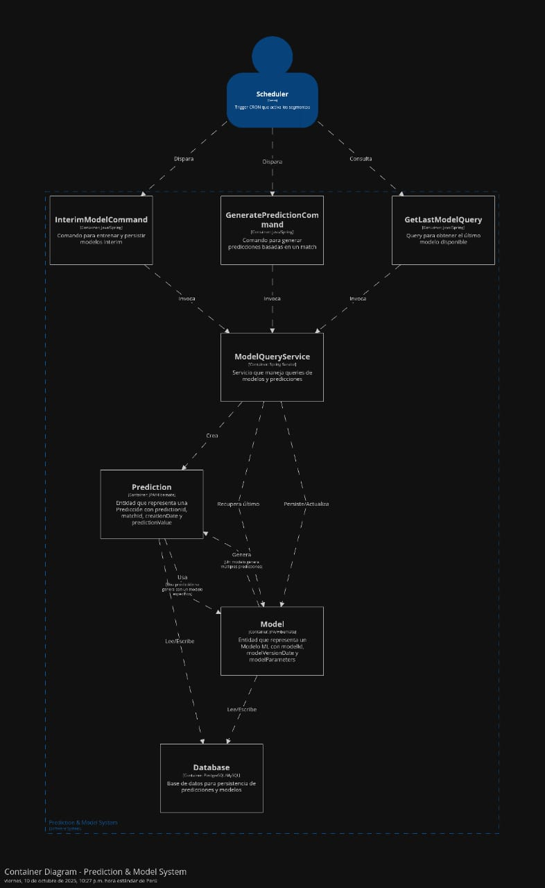

### 5.2.7. Bounded Context Software Architecture Code Level Diagrams

#### 5.2.7.1. Bounded Context Domain Layer Class Diagrams

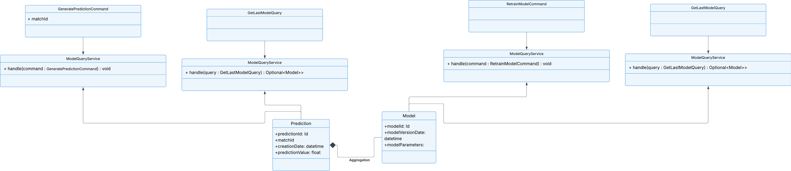

El diagrama ilustra un sistema de predicciones y gestión de modelos de machine learning que funciona de forma automatizada mediante el Scheduler. El sistema implementa un patrón donde el Scheduler dispara dos comandos principales: GeneratePredictionCommand para crear predicciones basadas en datos de matches, e InterimModelCommand para entrenar y actualizar modelos interim. Ambos comandos son procesados por ModelQueryService, que actúa como orquestador central del sistema. El servicio interactúa con dos entidades de dominio interconectadas: Model (que contiene el identificador del modelo, fecha de versión y parámetros) y Prediction (que registra el identificador de predicción, identificador del match, fecha de creación y valor predicho). La relación entre estas entidades es biunívoca: un modelo genera múltiples predicciones mientras que cada predicción es generada por un modelo específico. Además, el Scheduler puede consultar el último modelo disponible a través de GetLastModelQuery. Toda la información se persiste en la base de datos, permitiendo trazabilidad completa del historial de modelos y predicciones para auditoría y análisis posterior.

#### 5.2.7.2. Bounded Context Database Design Diagram

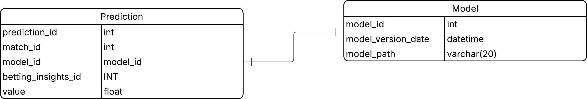

<br>

---

## 5.3. Bounded Context: Betting Insights

El bounded context **Betting Insights** se encarga de analizar los datos de los eventos deportivos para generar probabilidades y recomendaciones de apuestas basadas en diferentes mercados (1X2, total de goles, córners, faltas, etc.).  
Este módulo permite a los apostadores obtener *insights* cuantitativos a partir de información de mercado y probabilidades derivadas de diferentes *bookmakers*.  
El contexto aplica una arquitectura basada en **DDD (Domain-Driven Design)**, con el patrón **CQRS (Command Query Responsibility Segregation)** y una **arquitectura en capas** (Domain, Application, Infrastructure e Interface).

---

### 5.3.1. Domain Layer

La **capa de dominio** representa el núcleo del conocimiento de negocio y define los modelos conceptuales y reglas que gobiernan el contexto.  
Incluye:

- **Aggregates:**
  - `BettingInsight`: raíz del agregado que agrupa probabilidades, mercados y cuotas.
  - `Match`: representa un evento deportivo.
  - `Market`: define un tipo de apuesta (1X2, Over/Under, etc.).
  - `Outcome`: representa un posible resultado dentro de un mercado.

- **Value Objects:**
  - `ProbabilityValue`: representa el valor de una probabilidad calculada.
  - `OddValue`: representa una cuota asignada por un *bookmaker*.

- **Domain Services:**
  - `BettingInsightCommandService`
  - `BettingInsightQueryService`

- **Commands:**
  - `CreateBettingInsightCommand`
  - `CalculateProbabilitiesCommand`

- **Queries:**
  - `GetInsightsByMatchQuery`
  - `GetBestOddsByMarketQuery`

Estos elementos se definen de manera independiente a la infraestructura, manteniendo la lógica de negocio pura y reutilizable.

---

### 5.3.2. Interface Layer

La **capa de interfaz** (presentation layer) actúa como punto de entrada del bounded context, exponiendo las funcionalidades del dominio a través de APIs REST o eventos de mensajería.  
Sus responsabilidades incluyen:

- Recepción de peticiones externas y conversión a comandos o consultas.
- Validación de datos de entrada y salida (DTOs).
- Exposición de endpoints REST para registrar y consultar *betting insights*.
- Coordinación con la capa de aplicación para ejecutar los *use cases*.


### 5.3.3. Application Layer

La **capa de aplicación** orquesta los casos de uso de negocio, implementando el patrón CQRS para separar las operaciones de lectura y escritura.  
Define:

- **Command Handlers:** gestionan las operaciones de modificación del estado del dominio.
- **Query Handlers:** ejecutan operaciones de lectura o proyección de datos.
- **Application Services:** encapsulan la lógica de orquestación entre dominio e infraestructura.
- **Transactional Boundaries:** aseguran la consistencia de las operaciones dentro de un caso de uso.

Ejemplo: `CalculateProbabilitiesCommandHandler` puede invocar a `BettingInsightCommandService` y luego persistir los resultados mediante un repositorio de dominio.


### 5.3.4. Infrastructure Layer

La **capa de infraestructura** implementa los mecanismos de persistencia, comunicación y acceso a recursos externos.  
Incluye:

- **Repositories:** implementaciones concretas (por ejemplo, JPA/Hibernate) para las entidades del dominio.
- **Data Sources:** conexión con APIs deportivas o de *bookmakers*.
- **Adapters:** conversión entre modelos externos y del dominio.
- **Configuration:** definición de beans, contextos y servicios de persistencia.

Esta capa no contiene lógica de negocio, sino las implementaciones que soportan el funcionamiento del dominio y la aplicación.


### 5.3.6. Bounded Context Software Architecture Component Level Diagrams

El siguiente diagrama de componentes muestra la interacción entre las capas del contexto *Betting Insights*, evidenciando la separación de responsabilidades entre dominio, aplicación, infraestructura e interfaz.

[](https://postimg.cc/dZcNbLPG)

### 5.3.7. Bounded Context Software Architecture Code Level Diagrams

#### 5.3.7.1. Bounded Context Domain Layer Class Diagrams

El siguiente diagrama UML representa las clases de la capa de dominio, incluyendo agregados, objetos de valor, servicios de dominio, comandos y consultas, según el enfoque DDD y CQRS.

[](https://postimg.cc/ctBw6zpg)

#### 5.3.7.2. Bounded Context Database Design Diagram

El siguiente diagrama muestra el diseño de la base de datos del contexto *Betting Insights*, con las tablas normalizadas para almacenar partidos, mercados, resultados, probabilidades y cuotas asociadas a *bookmakers*.

[](https://postimg.cc/mPJwvvBW)


<br>

---

## 5.4. Bounded Context: Notification

El bounded context **Notification** tiene como propósito gestionar las notificaciones personalizadas de los usuarios sobre partidos o eventos deportivos, según sus preferencias de fecha y hora (`preferred_time`).  
Permite generar enlaces dinámicos de recordatorios compatibles con Google Calendar, sin depender de servicios externos.  
Se implementa bajo el enfoque **DDD + CQRS + arquitectura en capas**.


### 5.4.1. Domain Layer

La **capa de dominio** concentra la lógica de negocio y los modelos del contexto de notificaciones.  
Incluye:

- **Aggregates:**
  - `Notification`: raíz del agregado que representa una notificación programada.
  - `UserPreference`: define la configuración personal del usuario respecto a las alertas.

- **Value Objects:**
  - `PreferredTime`: representa el momento deseado por el usuario para recibir la notificación.
  - `NotificationMessage`: define el contenido del recordatorio.
  - `NotificationStatus`: indica el estado de la notificación (PENDING, SENT, FAILED).

- **Domain Services:**
  - `NotificationCommandService`
  - `NotificationQueryService`

- **Commands:**
  - `CreateNotificationCommand`
  - `MarkNotificationAsSentCommand`

- **Queries:**
  - `GetNotificationsByUserQuery`
  - `GetPendingNotificationsQuery`

---

### 5.4.2. Interface Layer

Esta capa actúa como punto de entrada para las operaciones de creación y consulta de notificaciones.  
Sus responsabilidades incluyen:

- Exponer endpoints RESTful.
- Transformar DTOs hacia comandos y consultas del dominio.
- Validar los datos de entrada.
- Gestionar las respuestas y excepciones de la capa de aplicación.

---

### 5.4.3. Application Layer

La **capa de aplicación** implementa la coordinación de los casos de uso, aplicando el patrón CQRS:
- **Command Handlers:** procesan las solicitudes de creación o actualización.
- **Query Handlers:** consultan notificaciones pendientes o enviadas.
- **Schedulers:** permiten ejecutar servicios de dominio en momentos específicos (según `preferred_time`).
- **Transactional Contexts:** aseguran la integridad del flujo de negocio.

---

### 5.4.4. Infrastructure Layer

Provee los mecanismos técnicos que soportan el dominio y la aplicación, incluyendo:

- Repositorios implementados con JPA o similar.
- Persistencia de datos en base relacional.
- Configuración de schedulers o cron jobs internos.
- Adaptadores para la generación de enlaces dinámicos a Google Calendar.


### 5.4.6. Bounded Context Software Architecture Component Level Diagrams

El siguiente diagrama ilustra la interacción de componentes internos (domain, application, infrastructure, interface) dentro del bounded context *Notification*.

[](https://postimg.cc/PvbfHsgT)

### 5.4.7. Bounded Context Software Architecture Code Level Diagrams

#### 5.4.7.1. Bounded Context Domain Layer Class Diagrams

El diagrama UML muestra la estructura de clases de la capa de dominio, incluyendo agregados, objetos de valor y servicios de dominio.

[](https://postimg.cc/ZCfjc9Q9)

#### 5.4.7.2. Bounded Context Database Design Diagram

El diagrama siguiente representa el diseño de la base de datos del bounded context *Notification*, mostrando las tablas y relaciones necesarias para la gestión de notificaciones, preferencias y estados.

[](https://postimg.cc/QK8kgsk0)


<br>

---

## 5.5. Bounded Context: User Management

Este bounded context agrupa todo lo necesario del usuario dentro del sistema como el registro **signup**, autenticación **login**, gestión y persistencia de preferencias, manejo de errores y eventos asociados, y la integración con base de datos. Su objetivo es encapsular las reglas de negocio centradas en el agregado User que contiene **identidad**, **credenciales** y **estado**, y brindando capacidades expuestas por ACL o REST para otros bounded contexts o consumidores.

### 5.5.1. Domain Layer

La Domain Layer de User Management encapsula la lógica de negocio relacionada con la autenticación y la gestión de usuarios. En esta capa se definen los elementos principales del dominio: agregados, entidades y objetos de valor que representan los conceptos clave del sistema.

**Entities**
- User extiende AuditableAbstractAggregateRoot
  - Responsabilidad: representar al usuario, su identidad, credenciales y estado de verificación.
  - Invariantes / reglas: email único, contraseña almacenada en forma segura, no permitir registro si faltan datos obligatorios.
  - Atributos principales: id, String email, String passwordHash, String fullName, UserStatus status, Set<Role> roles, UserPreferences preferences.

- UserPreferences
  - Responsabilidad: preferencias modificables por el usuario.
  - Reglas: valores por defecto aplicables en creación; validación de opciones permitidas.
  - Atributos: id, userId (FK), Boolean notifications, String language.

**Value Objects**

- Email (valida formato, inmutable).

**Aggregates**

- `User` es el aggregate root que controla modificaciones sobre preferencias y eventos de dominio.

**Repositories (interfaces)**

-  UserRepository (interface) extends JpaRepository(User)
  - Métodos relevantes: Optional(User) findByEmail(String email); boolean existsByEmail(String email)

**Eventos de Dominio**

- UserRegistered
- UserRegistrationFailed
- UserAuthenticated

### 5.5.2. Interface Layer

Capa de presentación que expone REST endpoints y, opcionalmente, consumidores para integrar eventos entrantes, permite la interacción con las entidades del dominio mediante solicitudes HTTP, facilitando la comunicación entre los clientes y el sistema y delega a application services / command handlers.

- **AuthenticationController** (@RestController)
  - Propósito: Gestiona las operaciones de autenticación y registro de usuarios.
  - Endpoints:
    - `POST /api/v1/authentication/sign-up`
    - `POST /api/v1/authentication/sign-in`

- **UserController** (@RestController)
  - Propósito: Gestiona las preferencias relacionadas con el usuario.
  - Endpoints:
    - `GET /api/v1/users/{id}`: obtener perfil

**Controller responsibilities:**
Validar entrada, mapear resultado a HTTP Response, manejar códigos HTTP y errores.

### 5.5.3. Application Layer

Actúa como un intermediario entre la Domain Layer y las capas externas, como la Interface Layer y la Infrastructure Layer. Su propósito principal es coordinar las operaciones de negocio relacionadas con el registro, autenticación y manejo de preferencias de usuario. Esta capa orquesta la ejecución de comandos y consultas, garantizando la correcta aplicación de las reglas del dominio sin exponer los detalles internos de implementación.

**Command Services**

Los servicios de comandos son responsables de ejecutar operaciones que modifican el estado del sistema, como registrar un nuevo usuario, autenticar credenciales o crear y actualizar preferencias. A continuación, se describen los principales servicios de comandos:

- **UserCommandServiceImpl**
  - **Propósito:** Gestiona las operaciones relacionadas con los usuarios, incluyendo el registro y la autenticación.
  - **Métodos principales:**
    - `handle(RegisterUserCommand command)`: Registra un nuevo usuario en el sistema, verificando la unicidad del correo electrónico y aplicando las reglas de seguridad para el almacenamiento de la contraseña.
    - `handle(AuthenticateUserCommand command)`: Autentica a un usuario validando sus credenciales y generando un token de acceso.
  - **Dependencias:**
    - `UserRepository`: Interactúa con la base de datos para guardar y recuperar información de usuarios.
    - `JwtTokenService`: Genera tokens JWT de autenticación para usuarios registrados.

**Query Services**

Los servicios de consultas son responsables de recuperar información del sistema sin modificar su estado, tales como obtener datos de usuarios o recuperar sus preferencias. A continuación, se describen los principales servicios de consultas:

- **UserQueryServiceImpl**
  - **Propósito**: Gestiona las consultas relacionadas con los usuarios.
  - **Métodos principales:**
    - `handle(GetUserByIdQuery query)`: Recupera un usuario específico mediante su identificador único.
  - **Dependencias:**
    - `UserRepository`: Interactúa con la base de datos para recuperar la información del usuario.

**Relaciones entre componentes**
- Los **Command Services** interactúan con los repositorios para modificar el estado del sistema para registrar usuarios o actualizar preferencias y con los servicios de soporte como JwtToken para operaciones auxiliares.
- Los **Query Services** interactúan exclusivamente con los repositorios para recuperar información existente sin alterar el estado.

Esta estructura asegura que la Application Layer sea modular, reutilizable y mantenible, con una clara separación de responsabilidades y una orquestación controlada de los procesos de negocio del bounded context.

### 5.5.4. Infrastructure Layer

La Infrastructure Layer del User Management Bounded Context proporciona las implementaciones técnicas necesarias para soportar las operaciones del sistema. Esta capa conecta la lógica de negocio con los recursos externos, como la base de datos y los servicios relacionados con la seguridad y persistencia de datos.

**Persistencia (JPA Repositories)**

- **UserRepository**
  - **Propósito**: Proporciona métodos para interactuar con la base de datos de usuarios.
  - **Métodos principales**:
    - `findByEmail(String email)`: Busca un usuario por su dirección de correo electrónico.
  - **Tecnología**: Implementado mediante Spring Data JPA, extendiendo JpaRepository(User).

**Relaciones entre componentes**

- **Persistencia**: El repositorio UserRepository proporciona acceso directo a las entidades del dominio almacenadas en la base de datos.

### 5.5.6. Bounded Context Software Architecture Component Level Diagrams

En esta sección se presenta el **diagrama de componentes** correspondiente al *Bounded Context User Management*, el cual ilustra los principales **módulos, servicios e interacciones internas** que conforman la arquitectura del sistema.  

El diagrama se desarrolla siguiendo los principios del **C4 Model (Nivel de Componentes)**, representando de manera clara la estructura y las relaciones entre los distintos elementos de la aplicación, tales como **controladores**, **servicios de aplicación**, **repositorios**, **servicios de dominio** y **bases de datos**.

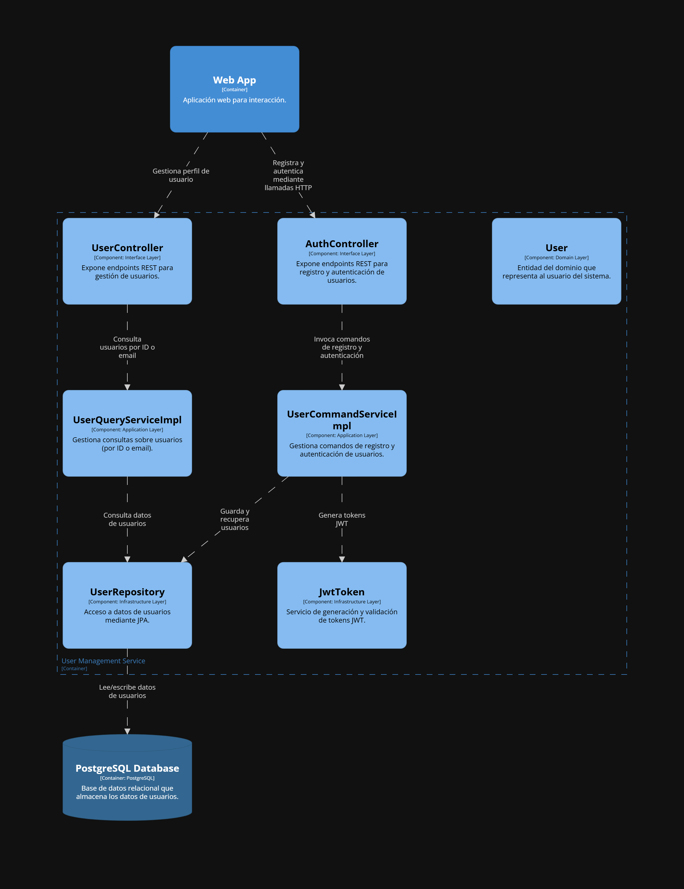

El diagrama muestra cómo *User Management*, implementada en **Spring Boot**, se integra en nuestra solución junto con nuestra aplicación **Web App** que actúa como interfaz de usuario. En el interior del servicio, se organizan los componentes en capas definidas como **controladores REST** que manejan las solicitudes externas; los **servicios de aplicación** que procesan la lógica de negocio mediante comandos y consultas; mientras que la **capa de infraestructura** gestiona la persistencia de datos a través de **repositorios JPA**. Finalmente, la **base de datos PostgreSQL** actúa como almacenamiento relacional que mantiene la información de usuarios y sus preferencias, completando la vista integral del flujo de datos y dependencias dentro del bounded context.

### 5.5.7. Bounded Context Software Architecture Code Level Diagrams

En esta sección se presentan los diagramas a nivel de código para el *Bounded Context User Management*, los cuales muestran con mayor detalle la **implementación interna de los componentes** que conforman el sistema. Estos diagramas describen la **estructura de clases, interfaces y sus relaciones** dentro de las distintas capas arquitectónicas, ofreciendo una visión técnica que facilita la comprensión del diseño, la implementación coherente de los módulos y el mantenimiento evolutivo del sistema.

#### 5.5.7.1. Bounded Context Domain Layer Class Diagrams

El **diagrama de clases del Dominio** para el *Bounded Context User Management* modela los elementos esenciales encargados de representar las reglas de negocio, la identidad de los usuarios y las operaciones que permiten su gestión dentro del sistema.  
Incluye **Agregados**, **Value Objects**, **Commands**, **Queries** y **Domain Services**, junto con sus relaciones y responsabilidades.

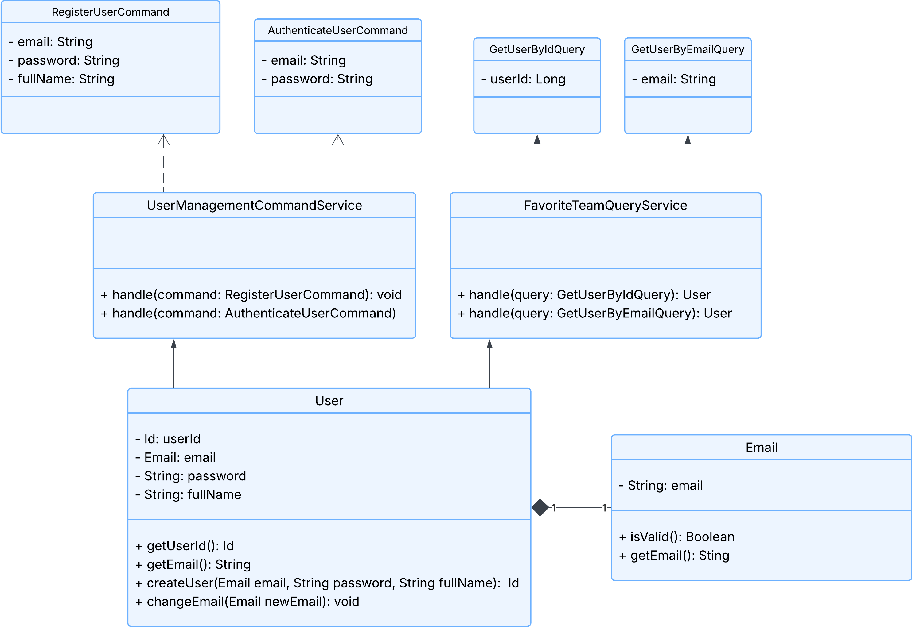

**Elementos del diagrama:**

- **Aggregate Root**

  - **User:** Representa el agregado principal del dominio encargado de la identidad y autenticación del usuario.

  - **Atributos:**
    - `private UserId userId`: Identificador único del usuario (Value Object).
    - `private Email email`: Correo electrónico del usuario (Value Object).
    - `private String password`: Contraseña cifrada.
    - `private String fullName`: Nombre completo del usuario.

  - **Métodos:**
    - `public UserId getUserId()`: Retorna el identificador del usuario.
    - `public Email getEmail()`: Retorna el email del usuario.
    - `public static User createUser(Email email, String password, String fullName)`: Crea una nueva instancia de usuario validando las reglas de negocio.
    - `public void changeEmail(Email newEmail)`: Permite actualizar el correo electrónico validando su formato y unicidad.

- **Value Objects**

  - **Email:** Objeto de valor que encapsula la validación y representación del correo electrónico.

  - **Atributos:**
    - `private String email`: Dirección de correo electrónico.

  - **Métodos:**
    - `public boolean isValid()`: Verifica que el formato del email sea correcto.
    - `public String getEmail()`: Retorna el valor del correo electrónico.

- **Domain Services**

  - **UserManagementCommandService:** Servicio de dominio responsable de manejar comandos que modifican el estado del sistema.
    - **Métodos:**
      - `public void handle(RegisterUserCommand command)`: Registra un nuevo usuario.
      - `public void handle(AuthenticateUserCommand command)`: Autentica un usuario existente.

  - **UserManagementQueryService:** Servicio de dominio encargado de ejecutar consultas sobre los usuarios.
    - **Métodos:**
      - `public User handle(GetUserByIdQuery query)`: Recupera un usuario mediante su identificador.
      - `public User handle(GetUserByEmailQuery query)`: Recupera un usuario mediante su correo electrónico.

**Relaciones:**

- `User` **compone** los objetos de valor `UserId` y `Email`.
- `UserManagementCommandService` **depende** de los comandos para ejecutar acciones de negocio.
- `UserManagementQueryService` **utiliza** los queries para recuperar información.
- `Commands` y `Queries` **interactúan** con el agregado `User` a través de los servicios de dominio.


#### 5.5.7.2. Bounded Context Database Design Diagram

El diseño de base de datos del *Bounded Context User Management* traduce la estructura conceptual del dominio a un modelo relacional para el almacenamiento y gestión de usuarios dentro del sistema.
Este modelo refleja la consistencia entre la capa de dominio y la capa de persistencia**, garantizando la integridad de los datos, la trazabilidad de las operaciones y la eficiencia en las consultas.
Cada tabla y campo ha sido definida considerando las reglas del dominio y las necesidades de auditoría.

<p align="center">
    
</p>

**Descripción:**

- **Tabla:** Usuarios
- **Atributos:**
  - `user_id`: Identificador único del usuario. Generado automáticamente.
  - `email`: Dirección de correo electrónico del usuario. Debe ser única y válida.
  - `password`: Contraseña cifrada utilizando algoritmo de hashing seguro.
  - `full_name`: Nombre completo del usuario.
  - `created_at`: Fecha y hora en que el registro fue creado.
  - `updated_at`: Fecha y hora de la última actualización del registro.

<br>

---

## 5.6. Bounded Context: Favorite User Teams

Este bounded context agrupa toda la funcionalidad relacionada con la selección, gestión y persistencia de los equipos de fútbol favoritos de los usuarios dentro de la aplicación. Su objetivo es permitir que cada usuario pueda elegir equipos disponibles y mantener actualizada su lista de favoritos, de modo que el sistema pueda enviar notificaciones personalizadas en función de dichas selecciones.  
El agregado central de este contexto es **FavoriteUserTeam**, encargado de representar la relación entre un usuario y los equipos que ha marcado como favoritos.


### 5.6.1. Domain Layer

La Domain Layer de **Favorite User Teams** encapsula la lógica de negocio relacionada con la gestión de equipos favoritos de los usuarios. En esta capa se definen las entidades, agregados y repositorios que controlan las reglas e invariantes del dominio.

**Entities**
- **FavoriteUserTeam** extiende de `AuditableAbstractAggregateRoot`
  - **Responsabilidad:** Representar los equipos favoritos seleccionados por un usuario.
  - **Reglas:** 
    - Un usuario no puede agregar dos veces el mismo equipo como favorito. 
    - Debe existir un usuario y un equipo válidos al crear la relación.
  - **Atributos principales:**
    - `id`
    - `userId`
    - `teamId`
    - `createdAt`
    - `updatedAt`

**Aggregates**
- `FavoriteUserTeam` es el aggregate root, responsable de la gestión y emisión de eventos de dominio al agregar o eliminar equipos favoritos.

**Repositories (interfaces)**
- **FavoriteUserTeamRepository** (interface) extiende `JpaRepository<FavoriteUserTeam>`
  - **Métodos relevantes:**
    - `List<FavoriteUserTeam> findByUserId(userId)`
    - `boolean existsByUserIdAndTeamId(userId, teamId)`

**Eventos de Dominio**
- **TeamAddedToFavorites**
  - Emitido cuando un usuario agrega un nuevo equipo a su lista de favoritos.
- **TeamRemovedFromFavorites**
  - Emitido cuando un usuario elimina un equipo previamente marcado como favorito.

### 5.6.2. Interface Layer

Capa de presentación que expone los endpoints REST para gestionar los equipos favoritos de los usuarios.  
Su responsabilidad principal es manejar las solicitudes HTTP, validar los datos de entrada y delegar la ejecución a los servicios de aplicación.

**FavoriteUserTeamController** (@RestController)
- **Propósito:** Gestionar las operaciones relacionadas con las funciones de agregar y eliminar equipos favoritos por parte de los usuarios.
- **Endpoints:**
  - `POST /api/v1/users/{userId}/favorites`: Agrega un equipo a la lista de favoritos del usuario.
  - `DELETE /api/v1/users/{userId}/favorites/{teamId}`: Elimina un equipo de la lista de favoritos del usuario.
  - `GET /api/v1/users/{userId}/favorites`: Recupera la lista completa de equipos favoritos del usuario.

**Responsabilidades del Controller:**
- Validar las solicitudes entrantes.
- Mapear los comandos y consultas hacia los servicios correspondientes.
- Manejar las respuestas HTTP con los códigos adecuados.


### 5.6.3. Application Layer

La capa de aplicación de **Favorite User Teams** Bounded Context actúa como intermediario entre la capa de dominio y las capas externas de Interface e Infrastructure.
Su propósito es coordinar las operaciones de negocio, orquestando la ejecución de comandos y consultas relacionados con la gestión de equipos favoritos de los usuarios.

**Command Services**
Los servicios de comandos son responsables de modificar el estado del sistema, en este caso, agregar o eliminar equipos favoritos.

- **FavoriteTeamCommandServiceImpl**
  - **Propósito:** Gestionar las operaciones de agregar o eliminar equipos favoritos.
  - **Métodos principales:**
    - `handle(AddFavoriteTeamCommand command)`: Agrega un equipo a la lista de favoritos del usuario, validando que no exista una relación previa entre usuario y equipo.
    - `handle(RemoveFavoriteTeamCommand command)`: Elimina un equipo de la lista de favoritos del usuario si existe la relación.
  - **Dependencias:**
    - `FavoriteUserTeamRepository`: Interactúa con la base de datos para persistir los cambios.
  - **Eventos Emitidos:**
    - `TeamAddedToFavorites`
    - `TeamRemovedFromFavorites`

**Query Services**
Los servicios de consultas son responsables de recuperar información sobre los equipos favoritos sin modificar el estado del sistema.

- **FavoriteTeamQueryServiceImpl**
  - **Propósito:** Recuperar la información de los equipos favoritos de un usuario.
  - **Métodos principales:**
    - `handle(GetFavoritesByUserIdQuery query)`: Retorna todos los equipos favoritos de un usuario.
  - **Dependencias:**
    - `FavoriteUserTeamRepository`: Interactúa con la base de datos para obtener los registros correspondientes.

**Relaciones entre componentes**
- Los **Command Services** utilizan los repositorios para modificar el estado del sistema y emiten eventos cuando se agregan o eliminan equipos favoritos.
- Los **Query Services** se comunican exclusivamente con los repositorios para recuperar información de lectura.

### 5.6.4. Infrastructure Layer

Capa de infraestructura de **Favorite User Teams** Bounded Context que proporciona las implementaciones necesarias para la persistencia de datos y soporte técnico de las operaciones del sistema. Esta capa conecta la lógica del dominio con la base de datos.

**Persistencia (JPA Repositories)**

- **FavoriteUserTeamRepository**
  - **Propósito:** Proporcionar métodos para interactuar con la base de datos de relaciones usuario-equipo favorito.
  - **Métodos principales:**
    - `List(FavoriteUserTeam) findByUserId(userId)`
    - `boolean existsByUserIdAndTeamId(userId, teamId)`
  - **Tecnología:** Implementado mediante Spring Data JPA, extendiendo `JpaRepository(FavoriteUserTeam)`.

**Relaciones entre componentes**
- Los **repositorios** proporcionan acceso directo a la base de datos para las operaciones de lectura y escritura del agregado `FavoriteUserTeam`.
- La **Application Layer** consume estos repositorios para ejecutar comandos y consultas, garantizando la separación de responsabilidades.

### 5.6.6. Bounded Context Software Architecture Component Level Diagrams

En esta sección se presenta el diagrama de componentes correspondiente al *Bounded Context Favorite User Teams*, el cual ilustra los principales **módulos, servicios e interacciones internas** que conforman la arquitectura del sistema.  

El diagrama se desarrolla siguiendo los principios del **C4 Model (Nivel de Componentes)**, representando de manera clara la estructura y las relaciones entre los distintos elementos de la aplicación, tales como **controladores**, **servicios de aplicación**, **repositorios**, **servicios de dominio** y **bases de datos**.

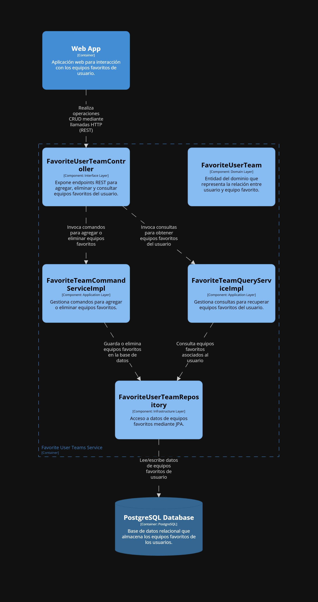

El diagrama muestra cómo *Favorite User Teams*, implementado en **Spring Boot**, se integra dentro de nuestra solución junto con la **Web App**, que actúa como interfaz de usuario para la gestión de equipos favoritos. En el interior del servicio, los componentes se estructuran por capas bien definidas como los **controladores REST** que exponen endpoints para agregar, eliminar o consultar equipos favoritos; los **servicios de aplicación** como `FavoriteTeamCommandServiceImpl` que manejan la lógica de negocio relacionada con los comandos y consultas; mientras que la **capa de infraestructura** gestiona la persistencia de datos a través del `FavoriteUserTeamRepository`. Finalmente, la base de datos **PostgreSQL** actúa como almacenamiento relacional que guarda la información de los equipos favoritos asociados a cada usuario, completando la vista integral del flujo de datos y dependencias dentro del bounded context.

### 5.6.7. Bounded Context Software Architecture Code Level Diagrams

En esta sección se presentan los **diagramas a nivel de código** para el *Bounded Context Favorite User Teams*, los cuales detallan la **implementación interna de los componentes** que conforman el servicio encargado de gestionar los equipos favoritos de los usuarios.  
Estos diagramas describen la **estructura de clases, interfaces y sus relaciones** dentro de las diferentes capas arquitectónicas **dominio, aplicación, infraestructura e interfaz**, proporcionando una visión técnica que facilita la comprensión del diseño, promueve la coherencia en la implementación de los módulos y apoya el mantenimiento evolutivo del sistema.

#### 5.6.7.1. Bounded Context Domain Layer Class Diagrams

El **diagrama de clases del Dominio** para el *Bounded Context Favorite User Teams* modela los elementos fundamentales encargados de representar la relación entre los **usuarios** y sus **equipos de fútbol favoritos**, junto con las operaciones que permiten su administración dentro del sistema.  
Incluye **Agregados**, **Commands**, **Queries** y **Domain Services**, además de las relaciones y responsabilidades que conectan estos elementos en el dominio.

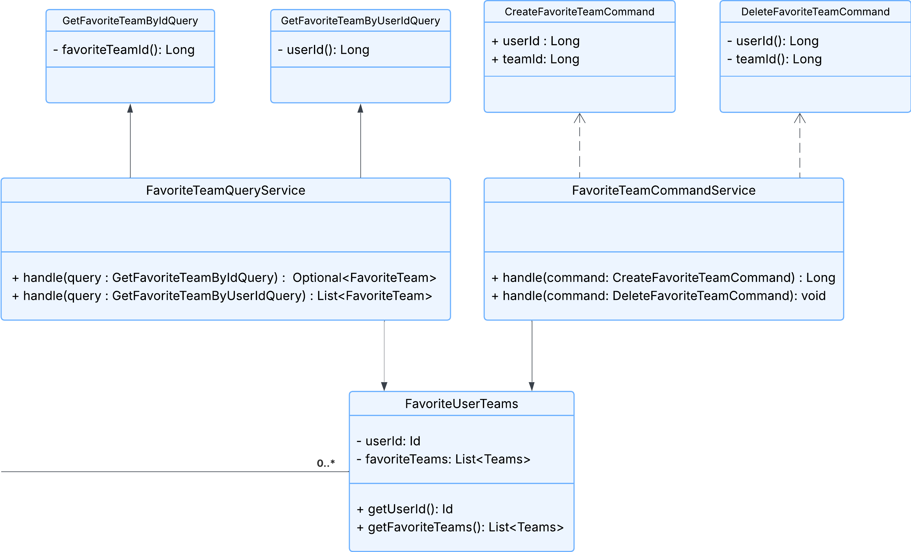

**Elementos del diagrama:**

- **Aggregate Root**

  - **FavoriteUserTeams:** Representa el agregado principal del dominio encargado de mantener la lista de equipos favoritos asociados a un usuario.

  - **Atributos:**
    - `private Id userId`: Identificador único del usuario propietario de los equipos favoritos.
    - `private List<Teams> favoriteTeams`: Lista de equipos de fútbol seleccionados como favoritos.

  - **Métodos:**
    - `public Id getUserId()`: Retorna el identificador del usuario.
    - `public List<Teams> getFavoriteTeams()`: Devuelve la lista de equipos favoritos del usuario.

- **Domain Services**

  - **FavoriteTeamCommandService:** Servicio de dominio responsable de manejar comandos que modifican el estado del sistema, permitiendo agregar o eliminar equipos favoritos de un usuario.

    - **Métodos:**
      - `public Long handle(CreateFavoriteTeamCommand command)`: Registra un nuevo equipo como favorito de un usuario.
      - `public void handle(DeleteFavoriteTeamCommand command)`: Elimina un equipo de la lista de favoritos del usuario.

  - **FavoriteTeamQueryService:** Servicio de dominio encargado de ejecutar consultas sobre los equipos favoritos registrados por los usuarios.

    - **Métodos:**
      - `public Optional<FavoriteTeam> handle(GetFavoriteTeamByIdQuery query)`: Recupera un equipo favorito específico según su identificador.
      - `public List<FavoriteTeam> handle(GetFavoriteTeamByUserIdQuery query)`: Recupera todos los equipos favoritos asociados a un usuario determinado.

**Relaciones:**
- `FavoriteUserTeams` **agrega** una colección de `Teams`, representando la relación entre el usuario y sus equipos favoritos.  
- `FavoriteTeamCommandService` **depende** de los comandos para ejecutar operaciones de creación y eliminación.  
- `FavoriteTeamQueryService` **utiliza** los queries para recuperar información desde el agregado.  
- `Commands` y `Queries` **interactúan** con el agregado `FavoriteUserTeams` a través de los servicios de dominio.


#### 5.6.7.2. Bounded Context Database Design Diagram

El diseño de base de datos del *Bounded Context Favorite User Teams* tiene la estructura conceptual del dominio a un modelo relacional orientado al almacenamiento y gestión de los **equipos favoritos de los usuarios** dentro del sistema, Cada tabla y atributo ha sido definido en función de las reglas del dominio, manteniendo una estructura clara y extensible para futuras relaciones con otros contextos.

<p align="center">
    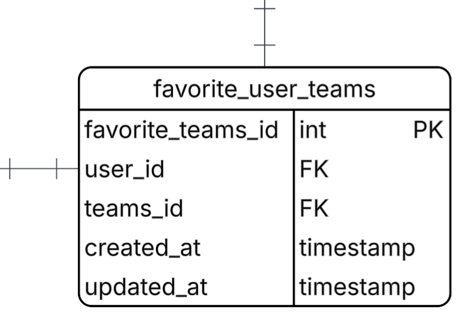
</p>

**Descripción:**

- **Tabla:** favorite_user_teams
- **Atributos:**
  - `favorite_teams_id`: Identificador único del registro de equipo favorito. Generado automáticamente.
  - `user_id`: Identificador del usuario que ha marcado el equipo como favorito. Actúa como **clave foránea** hacia la tabla de usuarios.
  - `teams_id`: Identificador del equipo de fútbol marcado como favorito. Actúa como **clave foránea** hacia la tabla de equipos.
  - `created_at`: Fecha y hora en que el registro fue creado, utilizada para auditoría y trazabilidad.
  - `updated_at`: Fecha y hora de la última actualización del registro, permitiendo controlar modificaciones en las preferencias del usuario.

<br>

---

# Capítulo VI: Solution UX Design

## 6.1. Style Guidelines

Después de investigar y recopilar información de nuestros usuarios objetivo apostadores frecuentes y fanáticos del fútbol, definiremos las pautas de estilo para nuestra aplicación. Estas guías servirán como un repositorio central y organizado para todo el equipo, garantizando una presentación consistente y coherente. 

Nuestro objetivo es crear una aplicación que mejore la experiencia del usuario al visualizar probabilidades y recibir alertas informativas. De esta manera, buscamos satisfacer las necesidades de nuestros usuarios y cumplir con los objetivos del proyecto.

<br>

### 6.1.1. General Style Guidelines

Nuestra solución, Betalyze, busca proporcionar a nuestros usuarios apostadores frecuentes y fanáticos del fútbol una aplicación accesible, usable y fácil de navegar. El diseño se enfoca en facilitar el acceso rápido y claro a la información esencial generada por nuestro Machine Learning: la predicción de resultados, la visualización de cuotas de valor, y los datos relevantes de partidos de fútbol. 

Para lograrlo, hemos definido cuidadosamente una guía de estilos que enfatiza los elementos visuales clave y un alto contraste, reforzando el enfoque en la objetividad y la ventaja estratégica. Nuestro diseño será minimalista y visualmente accesible en todos los productos, garantizando una experiencia coherente y de alta calidad. 

Los siguientes principios guiarán la experiencia del usuario tanto en web como en móvil, asegurando la consistencia y una apariencia profesional que refleja la seriedad de nuestro análisis de datos.

**Branding:**

- **Visión de Marca**

  Betalyze nace para llenar el vacío de soluciones especializadas en ofrecer predicciones objetivas y datos de partidos de fútbol impulsadas por Machine Learning. Nos centramos en la confiabilidad de los datos, su visualización clara y la información relevante de los encuentros. Nuestra propuesta integra atractivo visual con accesibilidad, adaptándose a las necesidades de apostadores y fanáticos. Buscamos ser la fuente de información más intuitiva y significativa para impulsar la toma de decisiones informadas y la rentabilidad a largo plazo.

- **Nombre: Betalyze**

  El nombre fusiona "Bet" (apuesta) con "Analyze" (analizar), reflejando nuestro enfoque central en el análisis de datos para apuestas de fútbol.

- **Logotipo:**

  El logotipo, diseñado por el equipo, expresa visualmente la fusión de análisis y predicción a través de la representación gráfica del nombre y los colores de la marca.

<p align="center">
    
</p>

- **Tipografía:**

  Hemos seleccionado la tipografía Roboto como fuente principal para todos los productos de Betalyze. Roboto es una tipografía moderna y profesional optimizada para interfaces digitales. Su claridad y legibilidad en diversos dispositivos y tamaños de pantalla garantizan una presentación coherente y un acceso a la información sin esfuerzo, lo cual es crucial para la visualización de datos. 
  A continuación, se especifican las pautas de tamaño, altura de línea y espaciado entre letras para componentes clave.

<p align="center">
    
</p>

- **Colores:**

  Utilizaremos una paleta de colores estratégicamente seleccionada para asegurar la accesibilidad y la coherencia de la marca. Los colores de Betalyze reforzarán la identidad visual enfocada en el dato y la objetividad, facilitando una navegación intuitiva y agradable. Los tonos serán clave para resaltar las "apuestas de valor" y las métricas importantes.

<p align="center">
    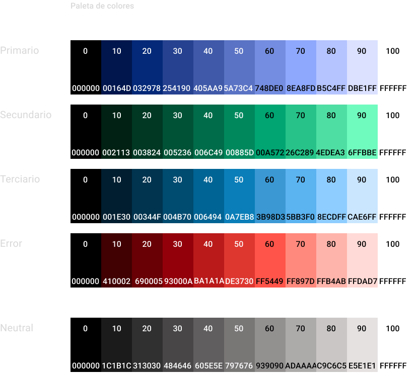
</p>

- **Iconografía:**

  Adoptaremos el set de Material Icons debido a su naturaleza minimalista, reconocible y su óptima adaptación a interfaces de datos. Los iconos serán utilizados para representar de forma clara elementos esenciales como estadísticas, partidos, equipos y perfil de usuario.

<p align="center">
    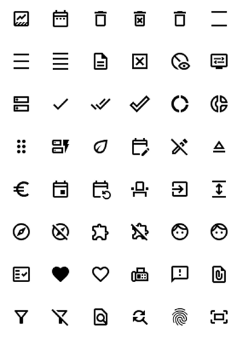
</p>

- **Dimensiones del tono de comunicación y lenguaje aplicado:**

  El lenguaje de Betalyze debe reflejar nuestro compromiso con la objetividad y la precisión del análisis de datos. Nuestro tono de comunicación se define como Serio y Entusiasta: 

  - Serio: Para generar confianza y credibilidad en el análisis que ofrecemos a los apostadores frecuentes. El lenguaje técnico (al explicar el modelo o las métricas) será preciso, pero siempre acompañado de claridad. 

  - Entusiasta: Para mantener la conexión con los fanáticos del fútbol. Esto se reflejará en la forma de presentar la información de partidos y las narrativas de los datos, manteniendo siempre un tono que invite al análisis objetivo. 

  Todos los productos mantendrán una estructura clara en la visualización de la información y expresarán las métricas en un lenguaje directo y accesible, apoyando de forma efectiva la toma de decisiones del usuario.

<br>

### 6.1.2. Web, Mobile & Devices Style Guidelines

**Diseño Visual:**

La coherencia visual en todas las plataformas es crucial para Betalyze. Nuestro Diseño Visual prioriza un layout limpio y modular con amplio espacio para reducir la carga cognitiva y asegurar que las métricas de Machine Learning y las cuotas de valor sean el foco principal. Las acciones clave deben ser inmediatas; por ello, los botones para funciones serán prominentes, y todos los elementos interactivos contarán con estados claros como hover, activo, deshabilitado para una interacción fluida.

**Web Style Guidelines:**

La interfaz web está diseñada para mostrar datos en profundidad y visualización eficiente de gran cantidad de datos. Utilizaremos un sistema de Grid de columnas, optimizando la visualización de Tablas y Cards que despliegan partidos, métricas y predicciones. El Header será Fijo para mantener la navegación principal y la búsqueda siempre accesibles, y ofreceremos una Sidebar para el acceso a funcionalidades adicionales. Los Puntos de Ruptura para un diseño responsivo eficaz se definen en: Móvil menor igual a 768px, Tableta de 769 a 1024px y Escritorio mayor a 1024px.

<p align="center">
    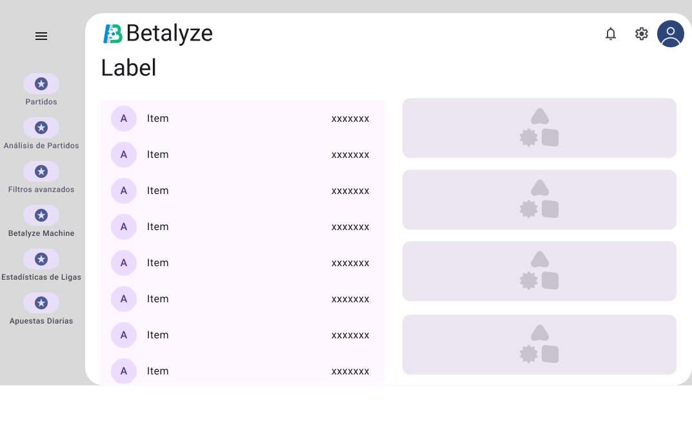
</p>

**Mobile Style Guidelines:**

La experiencia móvil se centra en la inmediatez y la consulta rápida, adhiriéndose a los principios del Material Design para un rendimiento nativo. La navegación se concentra en una Barra Fija, que da acceso directo a las secciones de Inicio, Predicciones, Alerrtas y Perfil. La información se presentará en Cards apilables de fácil acceso. Para optimizar la interacción táctil, se integrarán Gestos intuitivos, como el swipe down para actualizar datos o el swipe lateral para gestionar notificaciones y listas de partidos de forma ágil. 

<p align="center">
    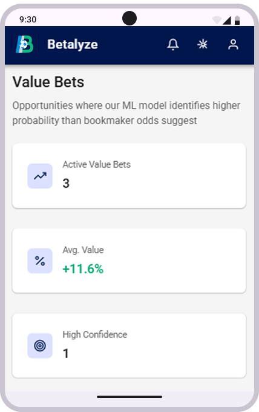
</p>

<br>

## 6.2. Information Architecture

En esta sección se exponen las decisiones y fundamentos que guían la organización del contenido en las experiencias web y móvil, abarcando tanto la Landing Page, Aplicación Web y Aplicación Móvil. El diseño se orienta a facilitar la navegación y el acceso intuitivo a las funcionalidades de cada producto, asegurando que nuestros usuarios puedan encontrar de manera rápida y sencilla la información y las herramientas que requieren para una experiencia eficiente y satisfactoria.

<br>

### 6.2.2. Labeling Systems

En Betalyze, la claridad y precisión en el lenguaje son fundamentales para un producto basado en datos. Utilizaremos etiquetas y símbolos que garanticen una navegación intuitiva y una comprensión inmediata de la información generada por nuestro Machine Learning. El etiquetado debe reflejar el objetivo de la aplicación: proporcionar una ventaja estratégica objetiva a los apostadores e información relevante a los fanáticos. 

El objetivo de la Landing Page es comunicar el valor de la **inteligencia artificial** de Betalyze y dirigir al usuario a la acción principal (Iniciar Análisis/Registro). 

| Componente | Etiqueta (Label) | Asociación (Función) |
|:---:|:---|:---|
| **Cabecera** | **Ventaja Estratégica en Apuestas** | Presenta el propósito central de la solución: ganar a largo plazo con datos. |
| **Botón (Nav)** | **Análisis** | Dirige a la sección intermedia sobre cómo funciona el Machine Learning. |
| **Botón (Nav)** | **Ventajas** | Dirige a la sección sobre los beneficios y características clave para el usuario. |
| **Botón (Nav)** | **Nosotros** | Dirige a la sección de la empresa, equipo o la tecnología. |
| **Botón (Nav)** | **Contacto** | Dirige al pie de página (Footer) para información de soporte. |
| **Sección Intermedia** | **Descubre las Apuestas de Valor** | Descripción concisa del problema que resuelve Betalyze y la detección de cuotas infladas. |
| **Título de Sección** | **Cómo Funciona Nuestro ML** | Presenta información y características clave sobre el modelo de Inteligencia Artificial. |
| **Botón CTA (Principal)** | **Comenzar a Ganar** / **Acceder al Análisis** | Presenta la propuesta de valor y dirige a la acción principal (Registro/Dashboard). |
| **Sección Desarrolladores**| **Detrás del Análisis** | Etiqueta que presenta al equipo y la tecnología. |
| **Subetiqueta** | **Nuestra Misión** | Presenta el compromiso con la objetividad y la rentabilidad del usuario. |
| **Footer (Nav)** | **Soporte y Ayuda** | Acceso a preguntas frecuentes o documentación. |
| **Footer (Nav)** | **Contacto** | Información de contacto y redes sociales. |

**Sistema de Etiquetado para la Aplicación Web/Móvil**

El sistema de etiquetado en la aplicación se basa en los principios de claridad y consistencia para la visualización de infomración, manteniendo una **jerarquía visual clara**. 

**Navegación Principal**

| Componente | Etiqueta (Label) |
|:---:|:---|
| **Botón (Nav)** | **Dashboard** | 
| **Botón (Nav)** | **Apuestas de Valor** | 
| **Botón (Nav)** | **Mi Perfil** |
| **Etiqueta** | **Partidos** |
| **Botón (Nav)** | **Estadísticas** |
| **Etiqueta** | **Alertas** | 

**Etiquetado por Segmento (Contenido y Funciones)**

El etiquetado se adapta para reflejar el beneficio clave para cada segmento, diferenciando entre la acción de apostar y el consumo de información. 

| Segmento | Etiqueta (Label) | Asociación (Función) |
|:---:|:---|:---|
| **Apostadores Frecuentes** | **Panel de Oportunidades** | Visualización directa de las "apuestas de valor" calculadas por el ML (Cuota vs. Probabilidad Real). |
| **Apostadores Frecuentes** | **Historial y Rentabilidad** | Seguimiento del rendimiento y las métricas clave de sus apuestas a largo plazo. |
| **Apostadores Frecuentes** | **Configurar Alertas** | Herramienta para personalizar notificaciones sobre oportunidades o partidos específicos. |
| **Fanáticos del Fútbol** | **Partidos del Día** | Exploración y visualización de todos los encuentros programados con datos pre-partido. |
| **Fanáticos del Fútbol** | **Estadísticas Avanzadas** | Acceso a datos detallados de equipos, jugadores, lesiones y tendencias históricas. |
| **Fanáticos del Fútbol** | **Informes de Tendencia** | Sección de análisis y resúmenes generados por el ML sobre ligas, equipos o tendencias. |

<br>

### 6.2.3. Searching Systems

A continuación, se describen los sistemas de búsqueda para las plataformas web y móvil de **Betalyze** para garantizar que tanto apostadores como fanáticos puedan acceder de forma rápida y eficiente a los de datos, partidos y predicciones. 

**Búsqueda Global y Filtros**

Una `Barra de Búsqueda Global` estará accesible de forma en el `Header` de la aplicación web y en el `Header` principal de la aplicación móvil. 

| Componente | Descripción y Funcionalidad |
|:---:|:---|
| **Búsqueda Global** | Permite a los usuarios buscar y acceder directamente a información. |
| **Filtros Avanzados** | Disponibles en secciones clave como *Apuestas de Valor* y *Partidos del Día*. Los filtros clave incluyen **Liga/Competición** y **Métricas de Oportunidad**. |
 

**Sistemas de Búsqueda por Segmento**

Los sistemas de búsqueda específicos están diseñados para optimizar el acceso a la información dentro de los flujos de cada usuario. 

- **Para Apostadores Frecuentes**

| Componente | Descripción y Funcionalidad |
|:---:|:---|
| **Panel de Oportunidades** | Incorpora una barra de búsqueda con **Opciones de Indexación** para localizar rápidamente funciones de análisis y otras secciones clave de la plataforma. |
| **Historial de Rentabilidad** | Dispone de una barra de búsqueda para indexar y localizar fácilmente por nombre de equipo, liga o fecha. | 

- **Para Fanáticos del Fútbol**

| Componente | Descripción y Funcionalidad |
|:---:|:----|
| **Estadísticas Avanzadas** | Incluye una barra de búsqueda con opciones de indexación para buscar métricas específicas, tablas de datos y herramientas de visualización. |
| **Partidos del Día** | Dispone de una barra de búsqueda para indexar y localizar fácilmente **encuentros programados** o **resultados pasados** dentro de la plataforma. |
| **Informes de Tendencia** | Incorpora una barra de búsqueda para indexar y acceder rápidamente a información sobre ligas o equipos específicos. |

<br>

### 6.2.4. SEO Tags and Meta Tags

A continuación, se especifican las etiquetas de optimización para motores de búsqueda **SEO Tags**, **Meta Tags** y los elementos de optimización de tiendas de aplicaciones **ASO Elements** para la aplicación móvil de Betalyze.

- **SEO Tags y Meta Tags para Landing Page y Web Application**

  Estas etiquetas están diseñadas para maximizar la visibilidad de Betalyze en motores de búsqueda como Google, enfocándose en **Machine Learning** y las **Apuestas de Valor**.

| Etiqueta | Aplicación | Valor Asignado |
|:---:|:---|:---|
| **Title Tag** | Landing Page | Betalyze, Fútbol, Encuentra Apuestas de Valor |
| **Meta Description** | Landing Page | **Betalyze** utiliza Machine Learning para identificar las mejores apuestas de valor en fútbol. Obtén probabilidades objetivas y mejora tu rentabilidad. |
| **Meta Keywords** | Landing Page | apuestas de futbol, machine learning, apuestas de valor, predicciones futbol, IA, estadisticas futbol, rentabilidad apuestas, cuotas |
| **Title Tag** | Web Application | Betalyze Dashboard, Análisis de Apuestas de Valor |
| **Meta Description** | Web Application | Accede al dashboard de Betalyze para análisis de partidos, cuotas y oportunidades de apuesta de valor generadas. |
| **Meta Keywords** | Web Application | dashboard apuestas, analisis futbol, panel apuestas, predicciones en vivo, herramientas apuestas |

- **ASO Elements (Optimización para App Stores)**

  Estos elementos están diseñados para mejorar la clasificación y la tasa de conversión en tiendas de aplicaciones como App Store y Google Play, atrayendo tanto a apostadores como a fanáticos.

| Elemento ASO | Valor Asignado | Segmento Objetivo Principal |
|:---:|:---|:---|
| **App Title** | Betalyze | Apostadores / Fanáticos |
| **App Subtitle** | Análisis de Valor por Machine Learning. Predicciones Objetivas. | Apostadores |
| **App Keywords** | apuestas futbol, machine learning, IA, predicciones, cuotas, valor, futbol, estadisticas, pronosticos, rentabilidad | Apostadores / Fanáticos |
| **App Description** | **Betalyze** es tu ventaja estratégica en las apuestas de fútbol. Nuestro modelo de machine learning analiza datos (lesiones, rendimiento, historial) para generar probabilidades más precisas, revelando las **"apuestas de valor"** donde las cuotas están infladas. Descarga la app para: <ul><li>Acceder a predicciones objetivas y estadísticas detalladas.</li><li>Identificar oportunidades para mejorar tu rentabilidad.</li><li>Obtener información relevante de partidos para tomar decisiones informadas.</li></ul> | Apostadores / Fanáticos |

<br>

### 6.2.5. Navigation Systems

Los sistemas de navegación están diseñados para guiar a los usuarios apostadores y fanáticos del fútbol de manera eficiente a través de nuestras plataformas de Betalyze, buscando ofrecer un acceso rápido y sencillo a información como predicciones, estadísticas y apuestas de valor.

- **Landing Page (Sitio Público):**

  La navegación de la Landing Page busca informar al usuario visitante sobre la propuesta de valor y dirigirlo a la acción principal de Registro y Acceso a la aplicación web. El recorrido es principalmente vertical y seccional.

| Componente | Técnica de Navegación | Recorrido y Objetivo |
|:---:|:---|:---|
| **Menú Fijo** | **Navegación Global Fija** con anclas internas | Permite saltar entre secciones principales como Ventajas, Nosotros, Contacto y mantiene el **Botón CTA** (Acceder o Descargar App) visible permanentemente. |
| **Secciones** | **Navegación Seccional Vertical** | El contenido se divide en bloques lógicos y secuenciales que explican Betalyze, los beneficiosel, el funcionamiento, la interfaz y el equipo. La progresión guía al usuario hacia la confianza en el producto. |
| **CTAs** | **Llamadas a la Acción Repetidas** | Botones destacados colocados en el *Hero* inicial y al final de secciones clave para impulsar la conversión hacia la aplicación. |

- **Aplicación Web (Web Application):**

  La aplicación web está diseñada para la visualización y el análisis, utilizando una estructura de navegación que optimiza la visualización de datos complejos en pantallas grandes.

| Componente | Técnica de Navegación | Recorrido y Objetivo |
|:---:|:---|:---|
| **Menú Principal**| **Barra de Navegación Lateral Fija** como Sidebar | Contiene los enlaces principales y secciones como **Dashboard**, **Apuestas de Valor**, **Partidos**, **Estadísticas**, **Alertas**. Es la herramienta primaria para el cambio de contexto y se mantiene visible para acceso rápido. |
| **Navegación Secundaria** | **Pestañas (Tabs)** | Se utilizan *Tabs* dentro de las páginas principales. |
| **Interacción** | **Filtros y Búsqueda Global** | Herramientas clave para reducir el contenido como filtrar por liga, fecha y localizar contenido específico sin cambiar de contexto. |

- **Aplicación Móvil (Mobile Application):**

  La aplicación móvil se enfoca en la inmediatez y el acceso rápido a la información, utilizando patrones de navegación para dispositivos táctiles y pantallas pequeñas.

| Componente | Técnica de Navegación | Recorrido y Objetivo |
|:---:|:---|:---|
| **Menú Principal**| **Barra de Navegación Inferior Fija** | Proporciona acceso directo e inmediato a las secciones más utilizadas y es el punto central de navegación rápida. |
| **Menú de Utilidades** | **Menú de Hamburguesa** | Aloja funciones y configuraciones secundarias o menos frecuentes, manteniendo la barra inferior despejada para las acciones primarias. |
| **Recorrido de Datos**| Cards Apilables y Vistas de Detalle | El usuario recorre las listas de partidos y oportunidades verticalmente y toca una card para acceder a más detalles, que luego puede cerrar o retroceder para volver a la lista. |

<br>

## 6.3. Landing Page UI Design

En esta sección, el equipo presenta la propuesta de Interfaz de Usuario UI para el Landing Page del proyecto. Para la creación de este diseño, hemos tomado como punto de partida las decisiones de diseño y arquitectura de información previamente establecidas. A través de este desarrollo, buscamos traducir la estructura lógica del contenido y las jerarquías definidas en la arquitectura a elementos visuales concretos, tangibles y funcionales. Esto garantiza que la experiencia del usuario (UX) sea intuitiva, coherente y que la navegación hacia la información clave se realice de la manera más eficiente posible.

### 6.3.1. Landing Page Wireframe

Este apartado presentamos los Wireframe de nuestra Landing Page que muestra cómo se organizan los principales contenidos y cómo navegará el usuario. En este diseño solo nos enfocamos en la lógica, la jerarquía y la disposición de la información, sin incluir elementos visuales como colores, imágenes o estilos gráficos.

<p align="center">
    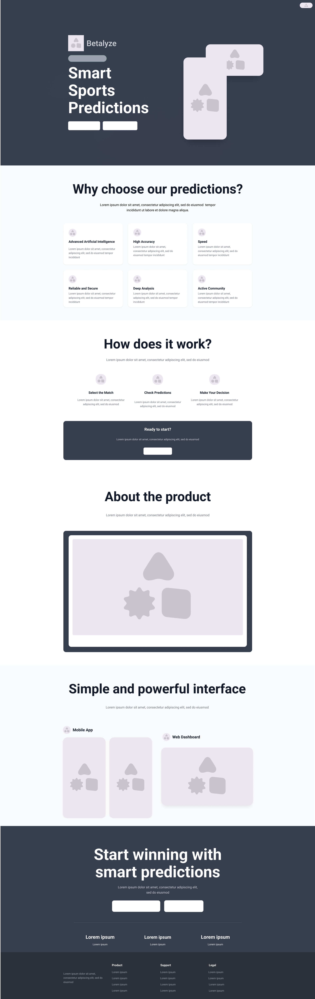
</p>

<br>

### 6.3.2. Landing Page Mock-up

Este apartado muestra los Mockups de la Landing Page de Betalyze, la culminación de nuestro diseño visual. Siguiendo las guías de estilo, aplicamos la paleta de colores y tipografía definidas para crear una experiencia coherente y profesional. La arquitectura de la información está optimizada para que el usuario comprenda rápidamente el valor de nuestra solución. El contenido se presenta de forma clara y secuencial, detallando características y funcionalidad, e incluye llamadas a la acción efectivas para facilitar el acceso a la solución.

<p align="center">
    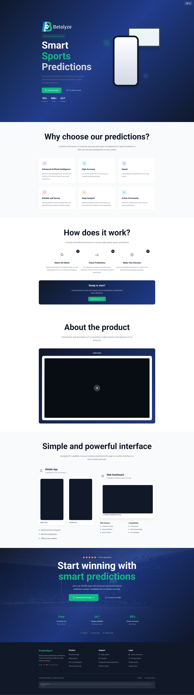
</p>

<br>

## 6.4. Applications UX/UI Design

### 6.4.1. Applications Wireframes

Se presentan las distintas maquetas de las vistas de nuestras aplicaciones. Estas son preliminares y se centran en eliminar la fatiga visual  que le producen las paginas llenas de cosas a los usuarios

**Aplicación web:**

- Dashboard

<p align="center">
    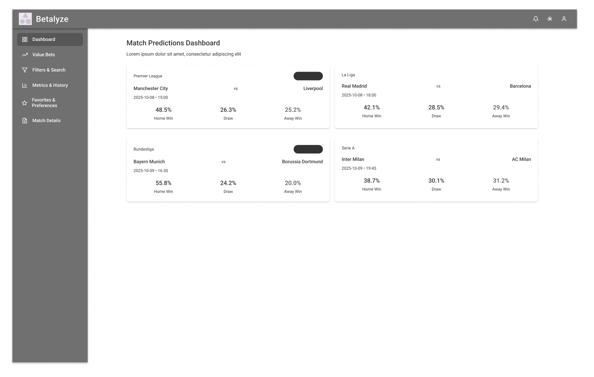
</p>

- Profile

<p align="center">
    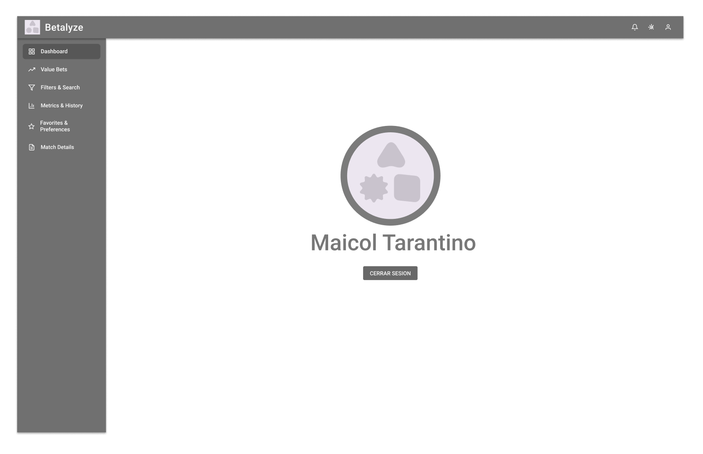
</p>

- ValueBets

<p align="center">
    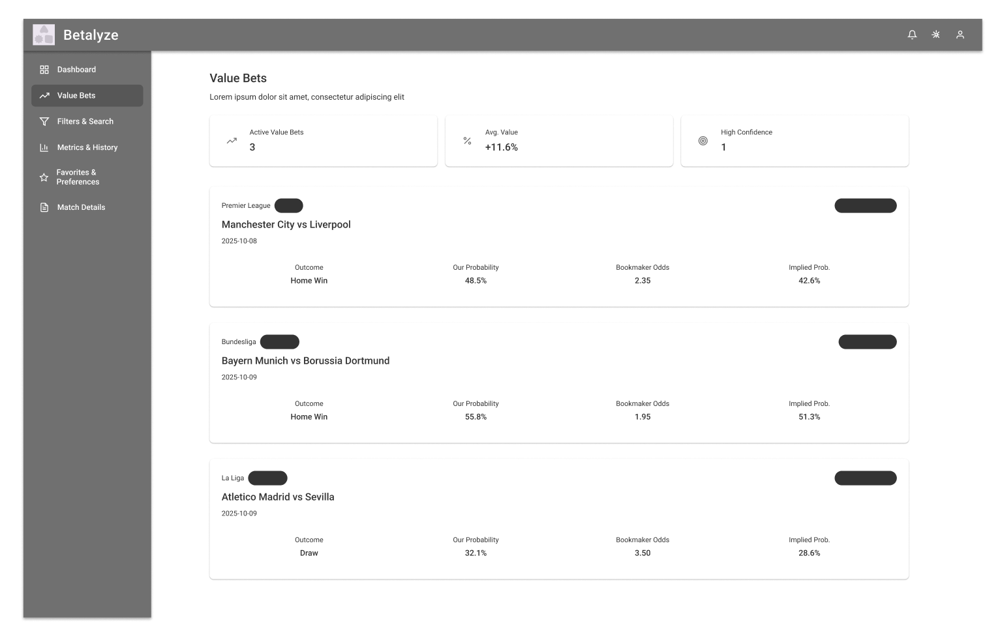
</p>

- Filters

<p align="center">
    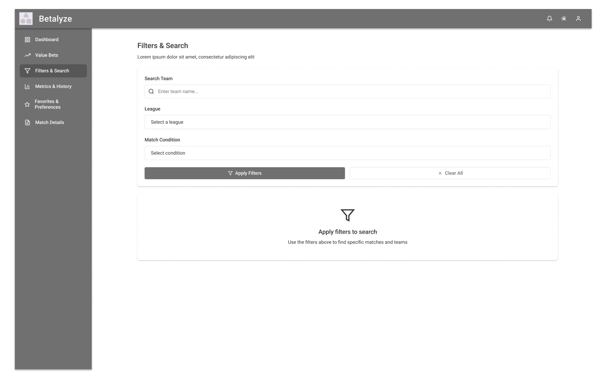
</p>

- MatchDetails

<p align="center">
    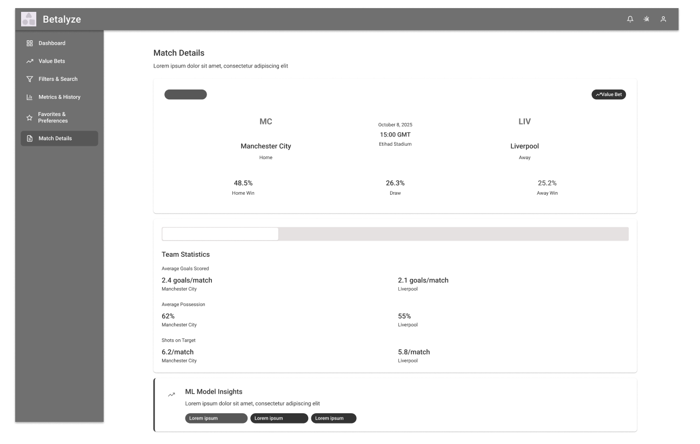
</p>

- PreferencesAndFavorites

<p align="center">
    
</p>

<br>

**Aplicación móvil**

- Apuestas de valor

<p align="center">
    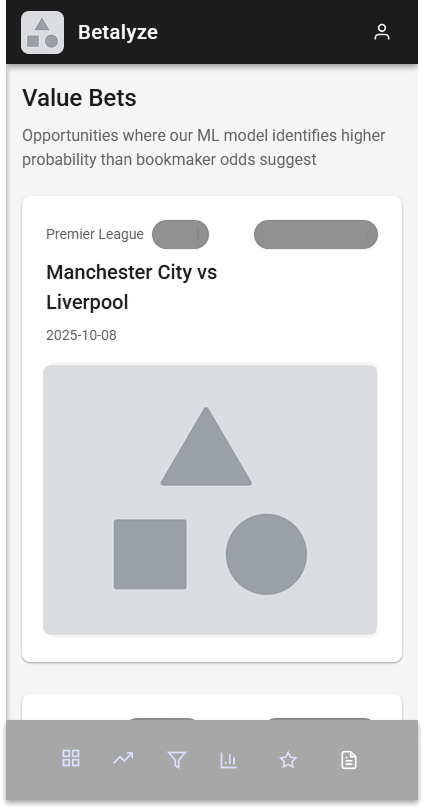
</p>

- Detalles de un encuentro

<p align="center">
    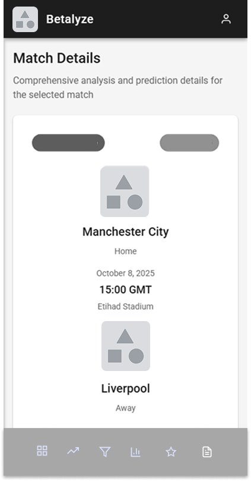
</p>

- Filtros y Búsqueda

<p align="center">
    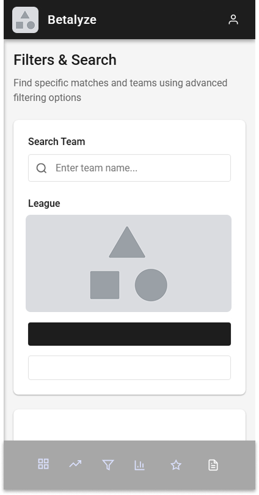
</p>

-  Favoritos y Preferencias

<p align="center">
    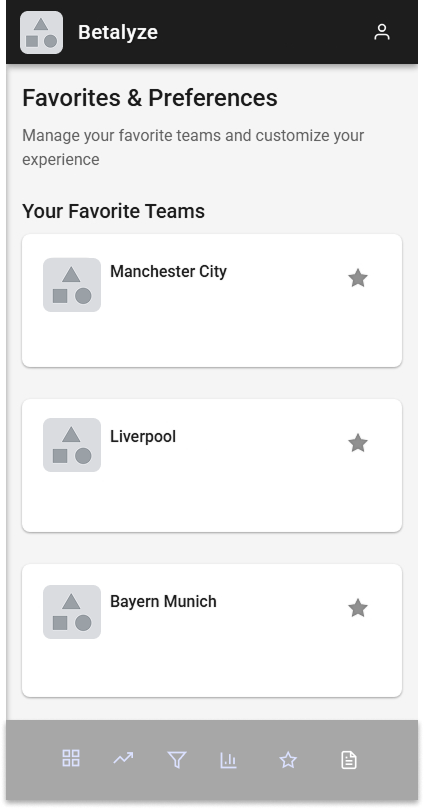
</p>

<br>

### 6.4.2. Applications Wireflow Diagrams

- Salir de la sesion

<p align="center">
    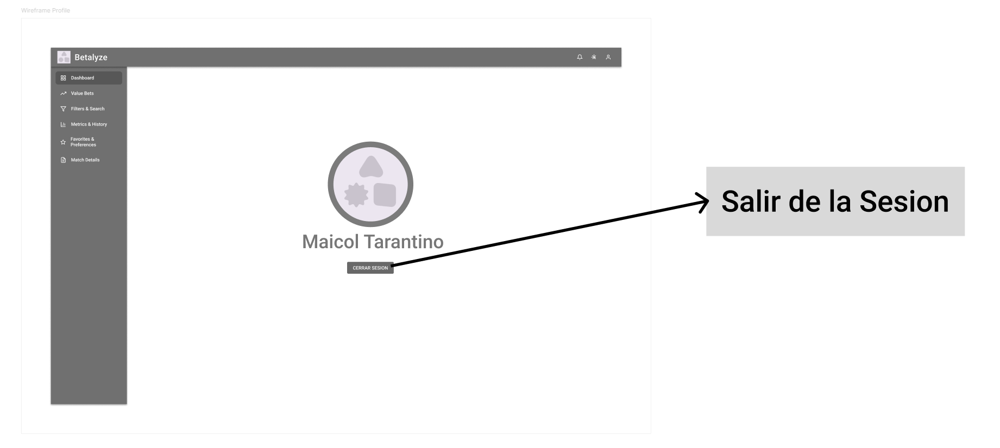
</p>

- Ver detalles del partido

<p align="center">
    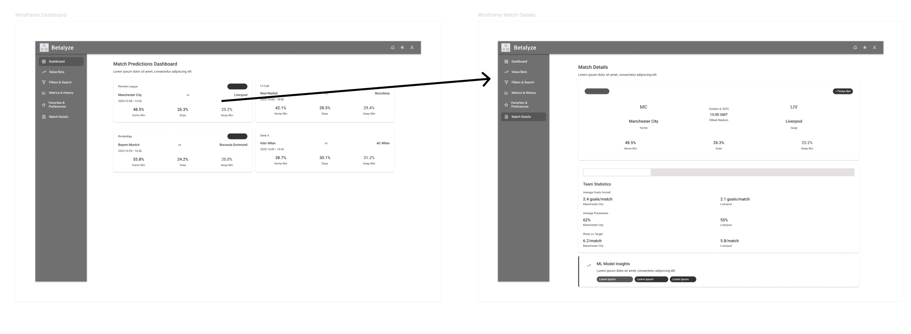
</p>

- Filter Matches

<p align="center">
    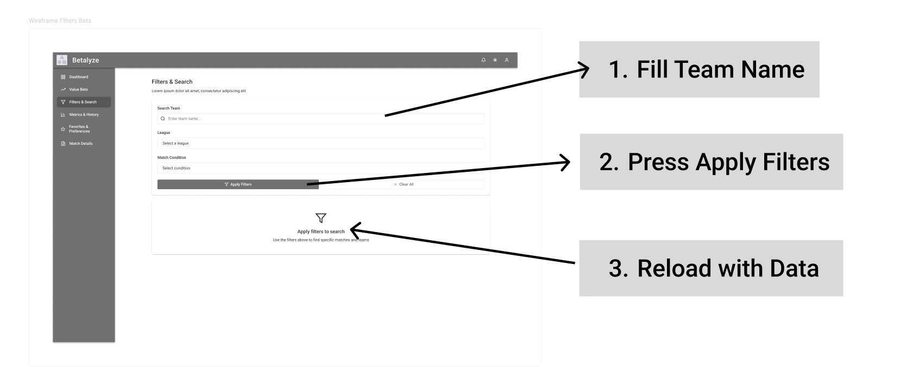
</p>

- Basic Navigation

<p align="center">
    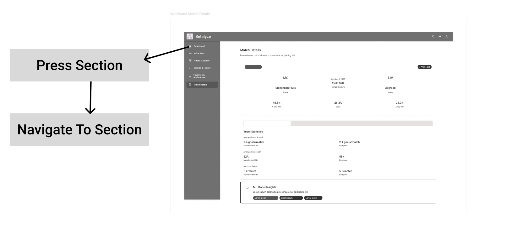
</p>

<br>

### 6.4.2. Applications Mock-ups

**Aplicación Web**

- Dashboard

<p align="center">
    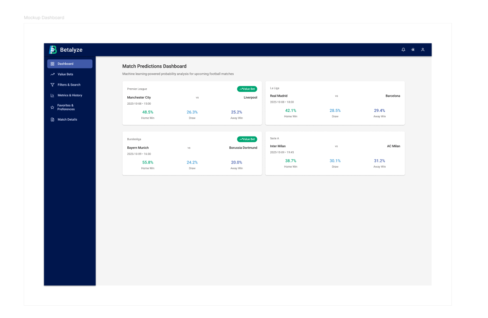
</p>

- Profile

<p align="center">
    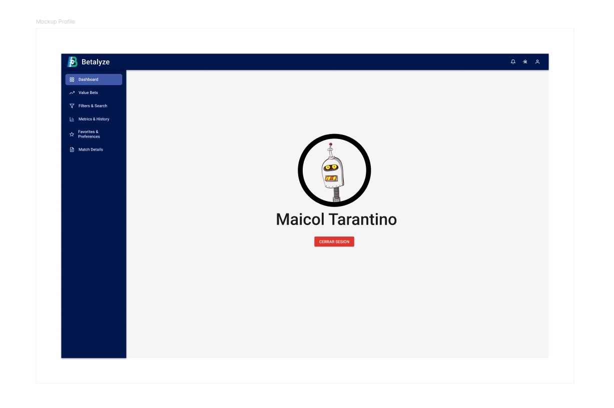
</p>

- ValueBets

<p align="center">
    
</p>

- Filters

<p align="center">
    
</p>

- MatchDetails

<p align="center">
    
</p>

- PreferencesAndFavorites

<p align="center">
    
</p>

<br>

**Aplicación móvil**

- Apuestas de valor

<p align="center">
    
</p>

- Detalles de un encuentro

<p align="center">
    
</p>

- Filtros y Búsqueda

<p align="center">
    
</p>

- Favoritos y Preferencias

<p align="center">
    
</p>


### 6.4.3. Applications User Flow Diagrams

- Basic Navigation

<p align="center">
    
</p>

- Salir de la sesion

<p align="center">
    
</p>

- Filter Matches

<p align="center">
    
</p>

## 6.5. Applications Prototyping

Se presenta los prototipos de Betalyze, donde se evidencia el resultado de las decisiones de diseño y arquitectura de información tomadas para las aplicaciones web y móvil. Este trabajo detallado asegura la correcta organización, navegación y accesibilidad del contenido, garantizando una experiencia de usuario intuitiva y eficiente en el uso de nuestra solución.

**Aplicación web:**

- **Screenshot de video:**

<p align="center">
  
</p>

- **Enlace de video subido a Microsoft Stream:**

  - <https://upcedupe-my.sharepoint.com/:v:/g/personal/u202114793_upc_edu_pe/EUQw1k_IWoFJrT_FutRdgOkBeDBJB0HZLVAgHrdHLBZCfw?e=ghy6wb&nav=eyJyZWZlcnJhbEluZm8iOnsicmVmZXJyYWxBcHAiOiJTdHJlYW1XZWJBcHAiLCJyZWZlcnJhbFZpZXciOiJTaGFyZURpYWxvZy1MaW5rIiwicmVmZXJyYWxBcHBQbGF0Zm9ybSI6IldlYiIsInJlZmVycmFsTW9kZSI6InZpZXcifX0%3D>

<br>

---

# Capítulo VII: Product Implementation, Validation & Deployment

## 7.1. Software Configuration Management

En esta sección se establece el proceso de implementación, comprobación, despliegue y validación de nuestra solución compuesta por los productos digitales definidos en nuestro alcance para Betalyze. Este capítulo, detalla la configuración del entorno de desarrollo, control de código fuente, guías de estilo de código y configuración de despliegue para **Landing Page**, **Web Application**, **Web Services** y **Mobile Application**.

<br/>

### 7.1.1. Software Development Environment Configuration

A continuación se especifica cada uno de los productos de software, que utilizamos para colaborar en el ciclo de vida y desarrollo de los productos para nuestra solución, considerando todas las herramientas utilizadas en la documentación, especificación de nuestra solución y desarrollo de software, respetando las restricciones indicadas sobre los productos de software y herramientas que debemos utilizar.

**Project Management**

| Producto de Software | Descripción | Ruta de referencia o de descarga |
|:--------------------:|:------------|:---------------------------------|
| Trello | Para el control del proyecto, asignación de tareas y actividades de cada integrante del equipo en base a nuestras User Stories. | https://www.trello.com/ |
| Discord | Plataforma virtual para realizar reuniones del grupo para coordinar y asignar actividades. | https://discord.com/ |

<br>

**Requirements Management**

| Producto de Software | Descripción | Ruta de referencia o de descarga |
|:--------------------:|:------------|:---------------------------------|
| UXPressia | Elaboración de User Personas, Empathy Maps, Journey Maps e Impact Maps. | https://uxpressia.com/ |
| Miro | Elaboración de As-Is y To-Be Scenario Maps | https://miro.com/ |
| Microsoft Stream | Publicación de videos que contienen las entrevistas y descripción sobre el producto | https://www.microsoft.com/es-es/microsoft-365/microsoft-stream |

<br>

**Product UX/UI Design**

| Producto de Software | Descripción | Ruta de referencia o de descarga |
|:--------------------:|:------------|:---------------------------------|
| Figma | Elaboración de Wireframes, Mock-ups y Prototypes. | https://www.figma.com |

<br>

**Software Development**

| Producto de Software | Descripción | Ruta de referencia o de descarga |
|:--------------------:|:------------|:---------------------------------|
| IntelliJ | Idea Entorno de Desarrollo Integrado (IDE) para codificación y desarrollo del lado Backend de nuestra solución. | https://www.jetbrains.com/idea/ |
| Visual Studio Code | Editor de código fuente para codificación y desarrollo de nuestra aplicación web y móvil. | https://code.visualstudio.com/ |
| GIT | Almacenamiento y control de versiones de nuestro código. | https://git-scm.com |
| GitHub | Plataforma para gestionar GIT en una ogranización con repositorios por producto. | https://github.com |

<br>

**Software Testing**

| Producto de Software | Descripción | Ruta de referencia o de descarga |
|:--------------------:|:------------|:---------------------------------|
| Gherkin | Lenguaje de especificación de pruebas utilizado para escribir nuestros Test. | https://cucumber.io/docs/gherkin/ |

<br>

**Software Deployment**

| Producto de Software | Descripción | Ruta de referencia o de descarga |
|:--------------------:|:------------|:---------------------------------|
| GitHub Pages | Despliegue de nuestra Landing Page. | https://pages.github.com/ |
| Firebase | Despliegue de nuestra aplicación web y móvil. | https://firebase.google.com/ |
| Microsoft Azure | Despliegue de servicios web. | https://azure.microsoft.com/ |

<br>

**Software Documentation**

| Producto de Software | Descripción | Ruta de referencia o de descarga |
|:--------------------:|:------------|:---------------------------------|
| Swagger | Documentación de Web Services usando OpenAPI Specification. | https://swagger.io |

<br>

### 7.1.2. Source Code Management

Para el seguimiento de modificaciones en el desarrollo de nuestra solución, utilizamos la plataforma GitHub para alojar tanto la documentación como el código de nuestros productos de software. Esta plataforma nos permite realizar seguimiento de las modificaciones en cada parte de los productos desarrollados. Para asegurar que todo el equipo pueda acceder a la plataforma, y que los repositorios que alojarán diferentes productos parte de nuestra solución, sean accesibles por una misma ruta, hemos creado una organización en GitHub con el nombre de nuestro producto.

| Organización | URL |
|:------------:|:----|
| upc-pre-202520-7295 | https://github.com/upc-pre-202520-7295 |

<br>

Dentro de nuestra organización en GitHub, se encuentran los repositorios correspondientes a cada uno de los productos a desarrollar.

| Producto | URL del Repositorio |
|:--------:|:--------------------|
| Landing Page | https://github.com/upc-pre-202520-7295/Landing-Page |
| Web Service | https://github.com/upc-pre-202520-7295/Backend |
| Web Application | https://github.com/upc-pre-202520-7295/Web-Application |
| Mobile Application | https://github.com/upc-pre-202520-7295/Mobile-Application |

<br>

**Implementación de GitFlow**

Para el desarrollo de nuestro proyecto, implementaremos GitFlow propuesto por Vincent Driessen en "A successful Git branching model". Utilizaremos este flujo de trabajo en todos los repositorios que integran nuestra solución.

Para implementar GitFlow crearemos las siguientes ramas de trabajo en cada repositorio:

| Rama | Descripción |
|:----:|:------------|
| main | La rama principal del repositorio contiene el código inicial y estable, y solo se actualizará con versiones estables del software. Cada cambio en esta rama deberá ser revisado por todos los integrantes del equipo. |
| develop | Esta rama contendrá el código más reciente desarrollado y servirá como base para futuras versiones. Se fusionará con ramas de características "feature" y principal "main" cuando sea necesario. Los miembros del equipo podrán realizar fusiones a esta rama si lo consideran conveniente. |
| feature | Ramas que pueden crear los integrantes del equipo para el desarrollo de nuevas funciones o características. Estas ramas existen mientras la funcionalidad esté en desarrollo, pero eventualmente se deben fusionar con la rama "develop" para añadir definitivamente la nueva funcionalidad a próximas versiones. La convención de nomenclatura para esta rama puede ser cualquier nombre excepto master, develop, release o hotfix. |
| release | Esta rama se utilizará para preparar el código que incluye varias características nuevas para una nueva versión. Podrá fusionarse con las ramas "develop" y "main" después de una revisión parcial por parte del equipo. La convención de nomenclatura para esta rama debe ser release-<número>, donde <número> debe ser una secuencia de dígitos y puntos. |
| hotfixes | Esta rama nos permitirá corregir errores en el código de la rama "main". Una vez realizadas las correcciones, éstas se fusionarán tanto en la rama "main" como en la rama "develop". La convención de nomenclatura para esta rama debe ser hotfix-<número>, donde <número> debe ser una secuencia de dígitos y puntos. |

<br>

<p align="center">
    
</p>

<br>

**Implementación de Conventional Commits**

Conventional Commits es una convención basada en los mensajes de commit en git. En nuestro contexto nos proporciona un conjunto de reglas para crear un historial de commits, ya que describe las características, correcciones y cambios importantes realizados en los mensajes de commit.

Aplicaremos Conventional Commits para los textos de mensajes de cada commit en todas las ramas de nuestros repositorio.

Los mensajes de commit deben tener la siguiente estructura:

```
<Tipo>[ámbito opcional]: <Descripción>
[Cuerpo opcional]
[pie de página opcional]
```

Durante el desarrollo de los productos asociados a nuestra solución establecemos que cada commit debe contener los siguientes elementos.

`fix`: Indica una corrección en el código base.<br>
`feat`: Introduce una nueva característica en el código base.<br>
Otros tipos basados en la convención Angular como `build:` , `chore:` , `ci:` , `docs:` , `style:` , `refactor:`, `perf:` , `test:` y otros.

Establecemos estas convenciones con el propósito de comunicar de manera clara y precisa la intención de todo lo realizado durante el desarrollo de nuestra solución, tanto a los consumidores de los repositorios como a los miembros del equipo.

<br>

### 7.1.3. Source Code Style Guide & Conventions

Para el desarrollo de nuestra propuesta de solución, el equipo utilizará las convenciones estándar para cada lenguaje durante todo el ciclo de vida del proyecto y en todos los repositorios de trabajo. A continuación, se presentan las referencias para la nomenclatura de los elementos en cada lenguaje, procurando utilizar nomenclatura en inglés y seguir buenas prácticas de programación.

| Lenguaje | Referencias y Convenciones |
|:--------:|:---------------------------|
| HTML | - Utilizar la estructura de documento propia de HTML, especificando el "DOCTYPE html". <br> - Cerrar siempre las etiquetas de autocierre con />. <br> - Utilizar minúsculas "lowercase" para los nombres de las etiquetas y atributos. <br> - Incluir atributos ALT en las imágenes para describir su contenido. <br> - Mantener una indentación consistente en el código. |
| CSS | - Utilizar unidades relativas para definir el tamaño de las imágenes. <br> - Separar las palabras con guiones en lugar de espacios o subrayados. <br> - Preferir el uso de propiedades abreviadas cuando sea posible. <br> - Emplear nombres descriptivos para las clases y los identificadores. |
| JavaScript | - Documentar el código de manera descriptiva. <br> - Utilizar nombres descriptivos para variables y funciones. <br> - Organizar el código en módulos y componentes. |
| TypeScript | - Definir explícitamente los tipos para variables, parámetros de función y valores de retorno. <br> - Utilizar interfaces o tipos para describir la forma de los objetos. <br> - Aplicar herencia y composición en clases para reutilizar código y mejorar la estructura. |
| Java | - Las clases e interfaces deben nombrarse con sustantivos en CamelCase. <br> - Organizar el código en módulos y componentes. <br> - Limitar la longitud de los métodos para que realicen una única función clara. <br> - Manejar adecuadamente las excepciones con mensajes o acciones concretas. |
| Dart | - Los nombres de variables, métodos y funciones deben comenzar con una letra minúscula y seguir la convención lowerCamelCase. <br> - Los nombres de clases, enumeraciones y tipos deben usar UpperCamelCase. <br> - Evitar crear objetos o instancias innecesarias; preferir constantes `const` cuando sea posible. <br> - Usar `late` o inicialización diferida solo cuando sea realmente necesario para optimizar recursos. <br> - Los nombres de archivos, bibliotecas y paquetes deben escribirse en minúsculas, usando guiones bajos `snake_case` para separar palabras. |
| Gherkin | Se usará la estructura "Given","When","Then","And" para escribir casos de prueba. <br> - Uso de archivos .feature para cada caso de prueba. <br> - Utilizar un Feature por funcionalidad del sistema. <br> - Describir escenarios de un uso único, lo más independiente posible de otras funcionalidades. |

<br>

### 7.1.4. Software Deployment Configuration

<!--
**Deployment Diagram C4 Model:**
-->
<br>

## 7.2. Solution Implementation

### 7.2.1. Sprint 1

#### 7.2.1.1. Sprint Planning 1

Este sprint se orientó a entregar la primera versión de los productos de nuestra solución Betalyze que comprende **Landing Page (HTML/CSS/JS)**, **Frontend Web (Angular)** y la **App Mobile (Flutter/Dart)**.

<table>
  <thead>
    <tr><th>Sprint #</th><th>Sprint 1</th></tr>
  </thead>
  <tbody>
    <tr><td colspan="2"><strong>Sprint Planning Background</strong></td></tr>
    <tr><td>Date</td><td>2025-10-27</td></tr>
    <tr><td>Time</td><td>22:00</td></tr>
    <tr><td>Location</td><td>Virtual</td></tr>
    <tr>
      <td>Prepared By</td>
      <td>Equipo BestWin</td>
    </tr>
    <tr>
      <td>Attendees (to planning meeting)</td>
      <td>
        Bernaola Pérez, André Arturo / Loli Ruiz, Renzo Javier / Soriano Medrano, Diego
      </td>
    </tr>
    <tr>
      <td><strong>Sprint 1 – 1 Review Summary</strong></td>
      <td><em> (Sprint 1) </em></td>
    </tr>
    <tr>
      <td><strong>Sprint 1 – 1 Retrospective Summary</strong></td>
      <td><em> (Sprint 1) </em></td>
    </tr>
    <tr><td colspan="2"><strong>Sprint Goal &amp; User Stories</strong></td></tr>
    <tr>
      <td>Sprint 1 Goal</td>
      <td>
        Nuestro foco es sentar las bases nuestra solución Betalyze al entregar un MVP que incluya las funcionalidades básicas del negocio como la visualización de métricas de equipos, alertas de partidos, la capacidad de guardar equipos favoritos en la plataforma móvil y web, junto con una base de servicios web. Creemos que esto entregará una experiencia inicial y tangible a los primeros usuarios que les permita interactuar con los datos deportivos clave y evaluar el potencial de la aplicación, obteniendo así feedback sobre las características principales. Esto será confirmado cuando podamos realizar una demostración exitosa de las funcionalidades básicas a los stakeholders y los usuarios utilicen activamente al menos dos de las funciones básicas en la plataforma móvil o web.
      </td>
    </tr>
    <tr>
      <td>Sprint 1 Velocity</td>
      <td><strong> 35 </strong></td>
    </tr>
    <tr>
      <td>Sum of Story Points</td>
      <td><strong> 35 </strong></td>
    </tr>
  </tbody>
</table>

<br>

#### 7.2.1.2. Sprint Backlog 1

Como primer Sprint de Betalyze, nos enfocamos en las historias de usuario que establecen el núcleo de nuestra propuesta de solución, permitiendo a los usuarios acceder a información relevante del negocio, métricas de equipos y alertas de partidos, mientras se completaba la primera fase del desarrollo de la aplicación móvil, la web, y los servicios de dominio centrales. Esto con la finalidad de demostrar las funciones básicas del MVP y podamos obtener las primeras impresiones sobre el valor entregado y la estabilidad de las aplicaciones.

[]()

**URL publico de trello:** <https://trello.com/b/xOXH5kca/betalyze>

<table border="1">
    <thead>
        <tr>
            <td>Sprint #</td>
            <td colspan="7" >Sprint 1</td>
        </tr>
        <tr>
            <td colspan="2" > User Story</td>
            <td colspan="6" > Work-Item / Task </td>
        </tr>
    </thead>
    <tbody>
      <tr>
        <td> Id </td>
        <td> Title </td>
        <td> Id </td>
        <td> Title </td>
        <td> Description </td>
        <td> Estimation (Hours) </td>
        <td> Assigned To </td>
        <td> Status (To-do / In-Process / To-Review / Done) </td>
      </tr>
      <tr>
        <td>US15</td>
        <td> Identificación de la Propuesta de Valor </td>
        <td>TA1</td>
        <td> Desarrollo de Hero section </td>
        <td> Implementación y verificación de textos clave (título, subtítulo, insignia ML) y estadísticas en la sección principal para comunicar la propuesta de valor. </td>
        <td>02</td>
        <td> Diego Soriano </td>
        <td> Done </td>
      </tr>
      <tr>
        <td></td><td></td>
        <td>TA2</td>
        <td> Desarrollo de Benefits section </td>
        <td> Implementación y verificación de los 6 "Benefit Cards" para detallar el valor de Betalyze. </td>
        <td>02</td>
        <td> Renzo Loli </td>
        <td> Done </td>
    </tr>
    <tr>
        <td>US16</td>
        <td> Validación del Funcionamiento </td>
        <td>TA1</td>
        <td> Desarrollo de How It Works section </td>
        <td> Implementación y verificación de los 3 pasos de funcionamiento (Seleccionar, Comprobar, Decidir) en la sección "How does it work?". </td>
        <td>03</td>
        <td> Renzo Loli </td>
        <td>Done</td>
    </tr>
    <tr>
        <td></td><td></td>
        <td>TA2</td>
        <td> Enlace del CTA del Proceso </td>
        <td> Conexión del botón "Try the app" en la sección "How It Works" con la acción o URL de acceso al producto/app. </td>
        <td>01</td>
        <td> André Bernaola </td>
        <td>Done</td>
    </tr>
    <tr>
        <td>US17</td>
        <td> Disponibilidad y Acceso Móvil </td>
        <td>TA1</td>
        <td> Inclusión de Mockups Móvil/Web en Hero </td>
        <td> Implementación de los mockups (Mobile Mockup y Desktop Mockup) en la Hero Section para mostrar la disponibilidad en ambos dispositivos. </td>
        <td>02</td>
        <td> André Bernaola </td>
        <td>Done</td>
    </tr>
    <tr>
        <td></td><td></td>
        <td>TA2</td>
        <td> Desarrollo de Sección CTA Principal </td>
        <td> Implementación y verificación de los botones de descarga de la aplicación móvil y acceso web en la sección CTA final. </td>
        <td>01</td>
        <td> André Bernaola </td>
        <td>Done</td>
    </tr>
    <tr>
        <td>US18</td>
        <td> Exploración de Acceso Gratuito </td>
        <td>TA1</td>
        <td> Revisión de Botones de Descarga/Acceso </td>
        <td> Verificación de que los botones de CTA principal incluyen texto que indique el acceso gratuito. </td>
        <td>02</td>
        <td> Diego Soriano </td>
        <td>Done</td>
    </tr>
    <tr>
        <td></td><td></td>
        <td>TA2</td>
        <td> Desarrollo de Indicadores de Confianza </td>
        <td> Implementación de las características de prueba en la sección CTA. </td>
        <td>02</td>
        <td> Renzo Loli </td>
        <td>Done</td>
    </tr>
    <tr>
        <td>US19</td>
        <td> Evaluación de Interfaz y Herramientas Avanzadas </td>
        <td>TA1</td>
        <td> Desarrollo de Screenshots section - Mobile </td>
        <td> Implementación de la galería de capturas de pantalla móviles y la lista de características específicas del móvil. </td>
        <td>02</td>
        <td> André Bernaola </td>
        <td>Done</td>
    </tr>
    <tr>
        <td></td><td></td>
        <td>TA2</td>
        <td> Desarrollo de Screenshots section - Web </td>
        <td> Implementación de la captura de pantalla del "Web Dashboard" y la lista de características avanzadas de la versión web. </td>
        <td>02</td>
        <td> Diego Soriano </td>
        <td>Done</td>
    </tr>
    <tr>
        <td>US01</td>
        <td> Visualizar probabilidades en el Dashboard </td>
        <td>TA1</td>
        <td> Desarrollo del Endpoint de Partidos </td>
        <td> Crear el servicio Backend para entregar los datos de partidos, hora, fecha y probabilidades al Dashboard. </td>
        <td>03</td>
        <td> Renzo Loli </td>
        <td>Done</td>
    </tr>
    <tr>
        <td></td><td></td>
        <td>TA2</td>
        <td> Implementación de Cards en Dashboard (Móvil/Web) </td>
        <td> Desarrollar la interfaz para mostrar las cards de partidos con hora, fecha y probabilidades en la sección Dashboard. </td>
        <td>02</td>
        <td> André Bernaola, Diego Soriano </td>
        <td>Done</td>
    </tr>
    <tr>
        <td>US04</td>
        <td> Buscar partidos por nombre </td>
        <td>TA1</td>
        <td> Desarrollo de Componente de Filtrado y Búsqueda (Móvil/Web) </td>
        <td> Implementar la página/sección Filters and Search con el formulario para filtrar y buscar partidos. </td>
        <td>03</td>
        <td> André Bernaola, Diego Soriano </td>
        <td>Done</td>
    </tr>
    <tr>
        <td></td><td></td>
        <td>TA2</td>
        <td> Lógica de Búsqueda por Nombre en Backend </td>
        <td> Implementar la lógica de filtrado en el servicio Backend (Spring Boot) para permitir buscar partidos por el nombre del equipo. </td>
        <td>03</td>
        <td> Renzo Loli </td>
        <td>Done</td>
    </tr>
    <tr>
        <td>US05</td>
        <td> Ver historial visual </td>
        <td>TA1</td>
        <td> Diseño y Desarrollo de Componente de Historial (Móvil/Web) </td>
        <td> Implementar la tabla de Metrics and History para mostrar el historial de partidos pasados con sus datos. </td>
        <td>02</td>
        <td> André Bernaola, Diego Soriano </td>
        <td>Done</td>
    </tr>
    <tr>
        <td></td><td></td>
        <td>TA2</td>
        <td> Integración de Datos Históricos con Frontend </td>
        <td> Desarrollar el servicio Backend para extraer y entregar datos históricos de partidos. </td>
        <td>03</td>
        <td> Renzo Loli </td>
        <td>Done</td>
    </tr>
    <tr>
        <td>US06</td>
        <td> Ver métricas de desempeño </td>
        <td>TA1</td>
        <td> Integración de Métricas en el Servicio de Detalles </td>
        <td> Modificar el servicio Backend de partidos para incluir detalles dentro de los datos de cada partido. </td>
        <td>02</td>
        <td> Renzo Loli </td>
        <td>Done</td>
    </tr>
    <tr>
        <td></td><td></td>
        <td>TA2</td>
        <td> Implementación de Visualización de Métricas en Detalle (Móvil/Web) </td>
        <td> Desarrollar el componente Match Details para mostrar los detalles del partido seleccionado. </td>
        <td>03</td>
        <td> André Bernaola, Diego Soriano </td>
        <td>Done</td>
    </tr>
    <tr>
        <td>US07</td>
        <td> Recibir alertas antes del partido </td>
        <td>TA1</td>
        <td> Desarrollo del Servicio de Generación de Notificaciones </td>
        <td> Crear un servicio en el Backend que genere notificaciones diarias basadas en los equipos favoritos del usuario. </td>
        <td>04</td>
        <td> Renzo Loli </td>
        <td>Done</td>
    </tr>
    <tr>
        <td></td><td></td>
        <td>TA2</td>
        <td> Implementación de la Interfaz de Notificaciones </td>
        <td> Desarrollar la página Notificaciones para mostrar la lista de alertas. </td>
        <td>03</td>
        <td> André Bernaola, Diego Soriano </td>
        <td>Done</td>
    </tr>
    <tr>
        <td>US08</td>
        <td> Configurar alertas personalizadas </td>
        <td>TA1</td>
        <td> Desarrollo de Lógica de Preferencias de Notificación </td>
        <td> Implementar la capacidad en el Backend para almacenar y aplicar preferencias de notificaciones. </td>
        <td>04</td>
        <td> Renzo Loli </td>
        <td>Done</td>
    </tr>
    <tr>
        <td></td><td></td>
        <td>TA2</td>
        <td> Implementación de Opciones de Configuración de Alertas (Web/Móvil) </td>
        <td> Desarrollar el formulario o sección de configuración donde el usuario pueda configurar las preferencias de notificaciones. </td>
        <td>03</td>
        <td> André Bernaola, Diego Soriano </td>
        <td>Done</td>
    </tr>
    <tr>
        <td>US09</td>
        <td> Guardar equipos favoritos </td>
        <td>TA1</td>
        <td> Desarrollo de la funcionalidad de Favoritos en Backend </td>
        <td> Crear un servicio Backend para gestionar el estado de "favorito" de un equipo y entregar las listas de equipos seguidos/no seguidos. </td>
        <td>04</td>
        <td> Renzo Loli </td>
        <td>Done</td>
    </tr>
    <tr>
        <td></td><td></td>
        <td>TA2</td>
        <td> Implementación de la Interfaz de Favoritos (Móvil/Web) </td>
        <td> Desarrollar la sección Favorites con las cards de equipos y el icono de estrella para marcar/desmarcar equipos. </td>
        <td>03</td>
        <td> André Bernaola, Diego Soriano </td>
        <td>Done</td>
    </tr>
    <tr>
        <td>US11</td>
        <td> Ver detalles de partido </td>
        <td>TA1</td>
        <td> Desarrollo del Enlace entre Listado y Detalle (Móvil/Web) </td>
        <td> Implementar la lógica que redirige y pasa el identificador del partido al seleccionar un card en la sección Filters and Search al Match Details. </td>
        <td>03</td>
        <td> André Bernaola, Diego Soriano </td>
        <td>Done</td>
    </tr>
    <tr>
        <td></td><td></td>
        <td>TA2</td>
        <td> Desarrollo de la Página de Detalles del Partido (Móvil/Web) </td>
        <td> Desarrollar el componente Match Details para visualizar todos los datos específicos del partido obtenidos del Backend. </td>
        <td>04</td>
        <td> André Bernaola, Diego Soriano </td>
        <td>Done</td>
    </tr>
    <tr>
        <td>US13</td>
        <td> Integración con API de casas de apuestas </td>
        <td>TA1</td>
        <td> Integración con API </td>
        <td> Configurar la integración en el Backend con API de terceros para obtener datos. </td>
        <td>03</td>
        <td> Renzo Loli </td>
        <td>Done</td>
    </tr>
    <tr>
        <td></td><td></td>
        <td>TA2</td>
        <td> Automatización de Tarea de Actualización Diaria </td>
        <td> Implementar un proceso programado para actualizar automáticamente las cuotas al menos una vez al día. </td>
        <td>03</td>
        <td> Renzo Loli </td>
        <td>Done</td>
    </tr>
    </tbody>
</table>

<br>

#### 7.2.1.3. Development Evidence for Sprint Review

Para el primer Sprint de Betalyze se desarrolló la base de los productos que comprende nuestra solución utilizando Flutter con Dart para la Aplicación Móvil, Angular para la Aplicación Web, y Spring Boot para los Servicios Backend. Las funcionalidades implementadas en ambas aplicaciones incluyen las páginas Dashboard, Value Bets, Filters and Search, Metrics and History, Favorites y Match Details. En el Backend, se lograron la integración y obtención de datos de APIs de terceros, y el desarrollo de servicios para proveer datos de partidos, favoritos y notificaciones.

- **Landign Page**

| Repository | Branch | Commit Id | Commit Message | Commit Message Body | Commited on (Date) |
|------------|--------|-----------|----------------|---------------------|--------------------|
| https://github.com/upc-pre-202520-7295/Landing-Page | main | 6002943 | feat: index.html | - | 12/11/2025 |
| https://github.com/upc-pre-202520-7295/Landing-Page | develop | b5b81f8 | chore: add logo | - | 12/11/2025 |
| https://github.com/upc-pre-202520-7295/Landing-Page | develop | 3f1e169 | feat: language-switcher | - | 12/11/2025 |
| https://github.com/upc-pre-202520-7295/Landing-Page | develop | ba85783 | feat: hero-section | - | 12/11/2025 |
| https://github.com/upc-pre-202520-7295/Landing-Page | develop | 9587831 | feat: images and styles | - | 12/11/2025 |
| https://github.com/upc-pre-202520-7295/Landing-Page | develop | d001bbe | feat: add screenshots and CTA sections to index.html | - | 13/11/2025 |
| https://github.com/upc-pre-202520-7295/Landing-Page | develop | cddf4b5 | feat: added benefits, about the product and how it works sections | - | 14/11/2025 |
| https://github.com/upc-pre-202520-7295/Landing-Page | develop | 26ba55c | feat: add script for landing page | - | 14/11/2025 |

- **Web Application**

| Repository | Branch | Commit Id | Commit Message | Commit Message Body | Commited on (Date) |
|------------|--------|-----------|----------------|---------------------|--------------------|
| https://github.com/upc-pre-202520-7295/Web-Application | master | 8a59e4d | chore: initial commit | - | 01/11/2025 |
| https://github.com/upc-pre-202520-7295/Web-Application | develop | d08da0f | chore: add logo | - | 12/11/2025 |
| https://github.com/upc-pre-202520-7295/Web-Application | develop | 0851794 | feat: project configuration | - | 12/11/2025 |
| https://github.com/upc-pre-202520-7295/Web-Application | develop | a1b322b | feat: add header | - | 12/11/2025 |
| https://github.com/upc-pre-202520-7295/Web-Application | develop | 5637599 | feat: add sidenav | - | 12/11/2025 |
| https://github.com/upc-pre-202520-7295/Web-Application | develop | 5afd3c4 | Merge branch 'layout' into develop | - | 12/11/2025 |
| https://github.com/upc-pre-202520-7295/Web-Application | develop | ae0f308 | feat: add and configure Page not found | - | 12/11/2025 |
| https://github.com/upc-pre-202520-7295/Web-Application | develop | dfe4e6a | feat: add user management page | - | 12/11/2025 |
| https://github.com/upc-pre-202520-7295/Web-Application | develop | 3f0c1bd | feat: add favorite user teams page | - | 12/11/2025 |
| https://github.com/upc-pre-202520-7295/Web-Application | develop | ec89196 | feat: add notifications bounded context | - | 13/11/2025 |
| https://github.com/upc-pre-202520-7295/Web-Application | develop | 1247f06 | feat: add betting insights bounded context | - | 13/11/2025 |
| https://github.com/upc-pre-202520-7295/Web-Application | develop | 2c1bed0 | feat: added data retrieval bounded context | - | 13/11/2025 |
| https://github.com/upc-pre-202520-7295/Web-Application | develop | faadebb | feat: added data retrieval bounded | - | 13/11/2025 |
| https://github.com/upc-pre-202520-7295/Web-Application | develop | 773b4db | feat: added predition and analytics bounded | - | 12/11/2025 |

- **Mobile Application**

| Repository | Branch | Commit Id | Commit Message | Commit Message Body | Commited on (Date) |
|------------|--------|-----------|----------------|---------------------|--------------------|
| https://github.com/upc-pre-202520-7295/Mobile-Application | main | de0a414 | first commit | - | 13/11/2025 |
| https://github.com/upc-pre-202520-7295/Mobile-Application | main | d43ad42 | chore: add initial setup | - | 13/11/2025 |
| https://github.com/upc-pre-202520-7295/Mobile-Application | develop | 7056ddb | feat: add favorite bc | - | 13/11/2025 |
| https://github.com/upc-pre-202520-7295/Mobile-Application | develop | 93db86e | feat: add notifications bc | - | 13/11/2025 |
| https://github.com/upc-pre-202520-7295/Mobile-Application | develop | 9fec5cf | feat: add shared files | - | 13/11/2025 |
| https://github.com/upc-pre-202520-7295/Mobile-Application | develop | 04408e4 | feat: implement Firebase messaging setup and token retrieval | - | 13/11/2025 |
| https://github.com/upc-pre-202520-7295/Mobile-Application | develop | 4dff076 | feat: add team model and entity for favorites bc | - | 13/11/2025 |
| https://github.com/upc-pre-202520-7295/Mobile-Application | develop | 18c211e | feat: add user entity and model with JSON serialization for IAM bc | - | 13/11/2025 |
| https://github.com/upc-pre-202520-7295/Mobile-Application | develop | f5d6cb5 | feat: add betting insights | - | 13/11/2025 |
| https://github.com/upc-pre-202520-7295/Mobile-Application | develop | 6816ab3 | feat: added data retrieval bounded | - | 13/11/2025 |

- **Web Services**

| Repository | Branch | Commit Id | Commit Message | Commit Message Body | Commited on (Date) |
|------------|--------|-----------|----------------|---------------------|--------------------|
| https://github.com/upc-pre-202520-7295/Backend | develop | 47c51ca | chore: added base of project | - | 13/11/2025 |
| https://github.com/upc-pre-202520-7295/Backend | develop | 4f2d9dc | feat: added shared kernel | - | 13/11/2025 |
| https://github.com/upc-pre-202520-7295/Backend | develop | 1ec2c05 | feat: add user management bounded context | - | 13/11/2025 |
| https://github.com/upc-pre-202520-7295/Backend | develop | 189048f | feat: add favorites | - | 13/11/2025 |
| https://github.com/upc-pre-202520-7295/Backend | develop | 8e13385 | feat: add notifications | - | 13/11/2025 |

<br>

#### 7.2.1.4. Testing Suite Evidence for Sprint Review

| Repository | Branch | Commit Id | Commit Message | Commit Message Body | Commited on (Date) |
|------------|--------|-----------|----------------|---------------------|--------------------|
|  |  |  |  |  |  |

<br>

#### 7.2.1.5. Execution Evidence for Sprint Review
<!-- 
Esta sección inicia con un resumen que explique lo alcanzado en este Sprint y presenta screenshots de las principales vistas implementadas, junto con un enlace a un video que ilustre y explique la visualización y navegación logrados en este Sprint. 

- **Landing Page**

- **Web Application**

- **Mobile Application**

-->

<br>

#### 7.2.1.6. Services Documentation Evidence for Sprint Review
**Introducción**

Durante este Sprint se logró implementar y documentar completamente la API REST de Betalyze utilizando el estándar OpenAPI 3.0.1. Se desarrollaron un total de 19 endpoints distribuidos en 5 bounded contexts funcionales: Users, DataRetrieval, Notifications, Favorites y Prediction & Analytics. Todos los endpoints fueron documentados con especificaciones detalladas incluyendo parámetros, esquemas de request/response y configuración de seguridad mediante JWT. Este trabajo establece la base completa de los servicios web que soportan nuestra plataforma de predicción y análisis deportivo.

A continuación, se presenta la relación de endpoints documentados con OpenAPI, dentro del alcance de nuestro Sprint:

- **Bounded Context: Users** 

| Endpoint | Acciones implementadas | Verbo HTTP | Sintaxis de Llamada | Parámetros |
|----------|------------------------|------------|---------------------|------------|
| /api/v1/auth/register | Registro de nuevos usuarios | POST | POST /api/v1/auth/register | Request body: email, password, fullName |
| /api/v1/auth/login | Autenticación de usuarios | POST | POST /api/v1/auth/login | Request body: email, password |
| /api/v1/users/user/{userId}/profile | Obtener perfil de usuario | GET | GET /api/v1/users/user/{userId}/profile | userId (path) \ Bearer token |

**Ejemplos de Ejecución y Respuesta:**

| Petición | Respuesta |
|----------|-----------|
| POST /api/v1/auth/register { "email": "usuario@ejemplo.com", "password": "Pass123!", "fullName": "Juan Pérez" } | 200 OK - Retorna los datos del usuario registrado con su token JWT en formato JSON. |
| POST /api/v1/auth/login { "email": "usuario@ejemplo.com", "password": "Pass123!" } | 200 OK - Retorna los datos del usuario autenticado con su token JWT en formato JSON. |
| GET /api/v1/users/user/550e8400-e29b-41d4-a716-446655440000/profile | 200 OK - Retorna el email y nombre completo del usuario en formato JSON. |

- **Bounded Context: DataRetrieval**

| Endpoint | Acciones implementadas | Verbo HTTP | Sintaxis de Llamada | Parámetros |
|----------|------------------------|------------|---------------------|------------|
| /api/v1/teams | Listar todos los equipos | GET | GET /api/v1/teams | Bearer token |
| /api/v1/teams/{teamId} | Obtener equipo por ID | GET | GET /api/v1/teams/{teamId} | teamId (path) \ Bearer token |
| /api/v1/matches/ | Listar todos los partidos | GET | GET /api/v1/matches/ | Bearer token |
| /api/v1/matches/today | Obtener partidos del día | GET | GET /api/v1/matches/today | Bearer token |
| /api/v1/matches/refresh/{season} | Actualizar partidos manualmente | POST | POST /api/v1/matches/refresh/{season} | season (path) \ Bearer token |

**Ejemplos de Ejecución y Respuesta:**

| Petición | Respuesta |
|----------|-----------|
| GET /api/v1/teams | 200 OK - Retorna la lista completa de equipos con id, nombre e imagen en formato JSON. |
| GET /api/v1/teams/550e8400-e29b-41d4-a716-446655440000 | 200 OK - Retorna los datos del equipo específico en formato JSON. |
| GET /api/v1/matches/ | 200 OK - Retorna todos los partidos con información de equipos, scores y fechas en formato JSON. |
| GET /api/v1/matches/today | 200 OK - Retorna los partidos programados para hoy en formato JSON. |
| POST /api/v1/matches/refresh/2025 | 200 OK - Actualiza los datos de partidos de la temporada especificada. |

- **Bounded Context: Notifications**

| Endpoint | Acciones implementadas | Verbo HTTP | Sintaxis de Llamada | Parámetros |
|----------|------------------------|------------|---------------------|------------|
| /api/v1/notifications/user/{userId}/notifications | Obtener todas las notificaciones | GET | GET /api/v1/notifications/user/{userId}/notifications | userId (path) \ Bearer token |
| /api/v1/notifications/user/{userId}/unread | Obtener notificaciones no leídas | GET | GET /api/v1/notifications/user/{userId}/unread | userId (path) \ Bearer token |
| /api/v1/notifications/user/{userId}/notification | Enviar notificación | POST | POST /api/v1/notifications/user/{userId}/notification | userId (path) \ Request body: title, message, imageUrl \ Bearer token |
| /api/v1/notifications/user/{userId}/notification/{id}/read | Marcar como leída | PUT | PUT /api/v1/notifications/user/{userId}/notification/{id}/read | userId (path), id (path) \ Bearer token |
| /api/v1/notifications/user/{userId}/fcm-token/{token} | Actualizar token FCM | PUT | PUT /api/v1/notifications/user/{userId}/fcm-token/{token} | userId (path), token (path) \ Bearer token |

**Ejemplos de Ejecución y Respuesta:**

| Petición | Respuesta |
|----------|-----------|
| GET /api/v1/notifications/user/550e8400-e29b-41d4-a716-446655440000/notifications | 200 OK - Retorna el historial completo de notificaciones del usuario en formato JSON. |
| GET /api/v1/notifications/user/550e8400-e29b-41d4-a716-446655440000/unread | 200 OK - Retorna las notificaciones no leídas en formato JSON. |
| POST /api/v1/notifications/user/550e8400-e29b-41d4-a716-446655440000/notification { "title": "Nuevo partido", "message": "Real Madrid vs Barcelona", "imageUrl": "..." } | 200 OK - Notificación enviada exitosamente. |
| PUT /api/v1/notifications/user/550e8400-e29b-41d4-a716-446655440000/notification/notification-id/read | 200 OK - Notificación marcada como leída. |
| PUT /api/v1/notifications/user/550e8400-e29b-41d4-a716-446655440000/fcm-token/fcm-token-123 | 200 OK - Token FCM actualizado correctamente. |

- **Bounded Context: Favorites**

| Endpoint | Acciones implementadas | Verbo HTTP | Sintaxis de Llamada | Parámetros |
|----------|------------------------|------------|---------------------|------------|
| /api/v1/teams/user/{userId}/favorite | Listar equipos favoritos | GET | GET /api/v1/teams/user/{userId}/favorite | userId (path) |
| /api/v1/teams/user/{userId}/favorite/{teamId} | Agregar equipo a favoritos | POST | POST /api/v1/teams/user/{userId}/favorite/{teamId} | userId (path), teamId (path) |
| /api/v1/teams/user/{userId}/favorite/{teamId} | Eliminar equipo de favoritos | DELETE | DELETE /api/v1/teams/user/{userId}/favorite/{teamId} | userId (path), teamId (path) |

**Ejemplos de Ejecución y Respuesta:**

| Petición | Respuesta |
|----------|-----------|
| GET /api/v1/teams/user/550e8400-e29b-41d4-a716-446655440000/favorite | 200 OK - Retorna la lista de equipos favoritos del usuario en formato JSON. |
| POST /api/v1/teams/user/550e8400-e29b-41d4-a716-446655440000/favorite/team-id-123 | 200 OK - Equipo agregado a favoritos exitosamente. |
| DELETE /api/v1/teams/user/550e8400-e29b-41d4-a716-446655440000/favorite/team-id-123 | 200 OK - Equipo eliminado de favoritos exitosamente. |

- **Bounded Context: Prediction & Analytics**

| Endpoint | Acciones implementadas | Verbo HTTP | Sintaxis de Llamada | Parámetros |
|----------|------------------------|------------|---------------------|------------|
| /api/v1/predictions/predict/{homeTeamId}/{awayTeamId} | Generar predicción de partido | POST | POST /api/v1/predictions/predict/{homeTeamId}/{awayTeamId} | homeTeamId (path), awayTeamId (path) \ Bearer token |
| /api/v1/predictions/train | Entrenar modelo ML | POST | POST /api/v1/predictions/train | Bearer token |

**Ejemplos de Ejecución y Respuesta:**

| Petición | Respuesta |
|----------|-----------|
| POST /api/v1/predictions/predict/team-001/team-002 | 200 OK - Retorna la predicción con ganador, precisión y goles estimados en formato JSON. |
| POST /api/v1/predictions/train | 200 OK - Modelo de Machine Learning reentrenado exitosamente. |

- **Imágenes y documentación:**


*Documentación OpenAPI de endpoints de autenticación y registro de usuarios*

<br>


*Documentación OpenAPI de endpoints del bounded context DataRetrieval (Teams)*

<br>


*Documentación OpenAPI de endpoints del bounded context DataRetrieval (Matches)*

<br>


*Documentación OpenAPI de endpoints del bounded context Notifications*

<br>


*Documentación OpenAPI de endpoints del bounded context Favorites*

<br>


*Documentación OpenAPI de endpoints del bounded context Prediction & Analytics*

<br>

- **Información del Repositorio**

**URL del Repositorio Backend:** 
```
https://github.com/upc-pre-202520-7295/Backend
```

**Commits Relacionados con la Documentación del Sprint:**

| Commit ID | Descripción | Autor | Fecha |
|-----------|-------------|-------|-------|
| `c9ed27b` | added data retrieval and predictions | 0renzo0loli0 | Nov 14, 2025 |
| `80de1b3` | Merge branch 'notifications' into develop | diego5m | Nov 13, 2025 |
| `8e13385` | feat: add notifications | diego5m | Nov 13, 2025 |
| `f395a6d` | Merge branch 'favorites' into develop | diego5m | Nov 13, 2025 |
| `189048f` | feat: add favorites | diego5m | Nov 13, 2025 |
| `1ec2c05` | feat: add user management bounded context | Andr0ita0 | Nov 13, 2025 |
| `4f2d9dc` | added shared kernel | 0renzo0loli0 | Nov 13, 2025 |
| `47e51ea` | added base of project | 0renzo0loli0 | Nov 13, 2025 |
#### 7.2.1.7. Software Deployment Evidence for Sprint Review
<!--
La sección inicia con una introducción explicando qué se ha realizado con respecto a despliegue durante este Sprint. 
Abarca actividades de creación de cuentas, configuración de recursos en cloud providers, configuración de proyectos de desarrollo para integración o automatización de labor de Deployment, entre otros. Se considera dentro del proceso de Deployment todos los productos digitales. Se debe adicionar capturas en imagen y explicaciones de los pasos realizados durante el Sprint.
-->
<br>

#### 7.2.1.8. Team Collaboration Insights during Sprint
<!--
explica cómo se han desarrollado las actividades de implementación y se presenta capturas en imagen de los analíticos de colaboración y commits en GitHub, realizados por los miembros del equipo. Todos los miembros del equipo deben tener participación en la implementación de cada uno de los productos según corresponda en el Sprint: Landing Page, Web Services y Aplicaciones

- **Landing Page**

- **Web Application**

- **Mobile Application**
-->
<br>

## 7.3. Validation Interviews

### 7.3.1. Diseño de Entrevistas

A continuación se establece la estructura para las entrevistas de validación, para los elementos y tareas especificas para nuestros productos Web y Móvil, incluyendo la visita a nuestra Landing Page.

**Información general requerida para ambos segmentos:**

- Nombres
- Apellidos
- Edad
- Distrito

**Validación de Propuesta de Valor (Landing Page)**

- Validación de los elementos en ambos segmentos:
  - Hero Section: ¿Con poco tiempo de visualización se puede entender qué hace Betalyze?.
  - Benefits Section: ¿Los beneficios listados resuelven los atienden a sus necesidades antes mencionadas?
  - How It Works: ¿Entienden de dónde salen los datos? (Transparencia del modelo ML).
  - CTA (Call to Action): ¿Sienten el impulso de hacer clic en "Descargar la aplicación" o "Probar la versión Web"?
  - Ver screenshots o demos del producto.
  - Navegar al footer para obtener datos de contacto o redes sociales.

- Preguntas adicionales:
  - ¿Basado en el contenido e información de la página, ¿para qué crees que sirve Betalyze?
  - ¿Qué sección te genera más confianza y cuál te genera dudas o cuál te gusta más?

**Validación de Solución y User Flows**

Continuamos con pedir a un usuario por cada segmento que realice tareas específicas usando las aplicaciones Web y Móvil.

**Tareas y preguntas para el segmento Apostadores frecuentes:**

- Tarea 1: Explorar las opciones y la interfaz de la aplicación
  - ¿Qué tan intuitiva te resulta la navegación en la app?
- Tarea 2: Visualizar dashboard con métricas.
  - ¿La información presentada es clara y fácil de entender?
- Tarea 3: Encontrar una "Value Bet" (Apuesta de valor)
  - ¿Entiende qué significa "Value Bet"?
- Tarea 4: Analizar la influencia de la intuición o pasión en las apuestas.
  - ¿Qué funcionalidades podrían ayudarte a controlar las apuestas emocionales?
- Tarea 5: Buscar partidos específicos con filtros en Filters and Search
  - ¿Los filtros que usaste te ayudaron a encontrar el partido correcto?
- Tarea 6: Seleccionar y ver detalles de un partido.
  - ¿La visualización de los datos es clara y comprensible?
- Tarea 7: Visualizar datos históricos de partidos
  - ¿Los datos son comprensibles?
- Tarea 8: Visualizar equipos y añadir a favoritos.
  - ¿Agregar equipos a favoritos resulta sencillo?
- Tarea 9: Revisar y Configurar notificaciones.
  - ¿Las notificaciones recibidas son relevantes y oportunas?

**Tareas y preguntas para el segmento Fanáticos del Fútbol:**

- Tarea 1: Buscar ligas, equipos o selecciones.
  - ¿Puedes visualizar fácilmente las ligas o equipos de tu interés?
- Tarea 2: Explorar las opciones y la interfaz de la aplicación
  - ¿Cómo te sientes con la facilidad de uso de la app?
- Tarea 3: Visualizar dashboard con métricas.
  - ¿La presentación de la información es clara y atractiva para ti?
- Tarea 4: Encontrar una "Value Bet" (Apuesta de valor)
  - ¿Te interesa esta función aunque no apuestes?
- Tarea 5: Analizar la influencia de la intuición o pasión en las apuestas.
  - Aunque no apuestes, ¿la pasión influye en cómo percibes las predicciones?
- Tarea 6: Buscar partidos específicos con filtros en Filters and Search.
  - ¿Los filtros usados te ayudan a encontrar partidos de interés?
- Tarea 7: Seleccionar y ver detalles de un partido.
  - ¿La información mostrada cumple con tus expectativas?
- Tarea 8: Visualizar datos históricos de partidos
  - ¿Los datos son comprensibles?
- Tarea 9: Visualizar equipos y añadir a favoritos.
  - ¿Qué tan útil te resulta marcar equipos como favoritos?
- Tarea 10: Revisar y Configurar notificaciones.
  - ¿Las notificaciones actuales captan tu atención y te aportan valor?

<br>

### 7.3.2. Registro de Entrevistas

**Segmento Apostadores Frecuentes:**

|     Entrevistado     |    Daniel Chipana    |
|:---------------------|----------------------|
| Edad                 | 25  |
| Distrito             | Magdalena  |
| Screenshot           |  |
| Inicio de entrevista | Minuto 0:00 |
| Duración             | 7:43 minutos |
| Resumen              | El entrevistado, valoró positivamente la aplicación en general, pero ofreció varias apreciaciones clave para mejorar la experiencia de usuario y la visualización de datos. En cuanto al diseño, sugirió que la diferenciación de equipos mediante colores y la inclusión de los logos/escudos, además de los nombres, sería mucho mejor para distinguir rápidamente a los participantes. Respecto a la usabilidad, encontró que la sección de "apuestas de valor" debería mostrar más partidos por pantalla para evitar tener que desplazarse demasiado. Finalmente, encontró muy bueno y útil el sistema de notificaciones y favoritos, ya que le avisarían sobre partidos de sus equipos predilectos, especialmente de ligas internacionales de las que no siempre se está al tanto. |
| URL del video       | <https://upcedupe-my.sharepoint.com/:v:/g/personal/u202114793_upc_edu_pe/IQCggn61UIjfR67O0y-asHOOASj5tKbCyxdciSz9LOPzINU?nav=eyJyZWZlcnJhbEluZm8iOnsicmVmZXJyYWxBcHAiOiJTdHJlYW1XZWJBcHAiLCJyZWZlcnJhbFZpZXciOiJTaGFyZURpYWxvZy1MaW5rIiwicmVmZXJyYWxBcHBQbGF0Zm9ybSI6IldlYiIsInJlZmVycmFsTW9kZSI6InZpZXcifX0%3D&e=TUEaDr> |

|     Entrevistado     |   Gerson Ambrosio    |
|:---------------------|----------------------|
| Edad                 | 20  |
| Distrito             | Callao  |
| Screenshot           |  |
| Inicio de entrevista | Minuto 7:44 |
| Duración             | 13:07 minutos |
| Resumen              | El segundo entrevistado demostró una comprensión clara del concepto de "Value Bet". Consideró la funcionalidad de los filtros como muy útil y práctica para segmentar rápidamente los partidos por equipo, liga o condición, eliminando la necesidad de buscar individualmente. En la sección de detalles del partido, el entrevistado enfatizó que los datos de probabilidad, el promedio de goles y el historial de los equipos son cruciales y muy comprensibles, siendo esta información de gran interés para él, que se enfoca en el mercado de goles. Además, calificó la función de favoritos como sencilla y útil, ya que le permitiría saltar pasos al recomendarle directamente los partidos de los equipos en los que confía y está acostumbrado a apostar. Por último, consideró que las notificaciones son relevantes y oportunas, sirviendo como un valioso historial para mantenerse informado sobre los resultados de otros encuentros mientras sigue un partido de interés principal. |
| URL del video       | <https://upcedupe-my.sharepoint.com/:v:/g/personal/u202114793_upc_edu_pe/IQCggn61UIjfR67O0y-asHOOASj5tKbCyxdciSz9LOPzINU?nav=eyJyZWZlcnJhbEluZm8iOnsicmVmZXJyYWxBcHAiOiJTdHJlYW1XZWJBcHAiLCJyZWZlcnJhbFZpZXciOiJTaGFyZURpYWxvZy1MaW5rIiwicmVmZXJyYWxBcHBQbGF0Zm9ybSI6IldlYiIsInJlZmVycmFsTW9kZSI6InZpZXcifX0%3D&e=TUEaDr> |

<br>

**Segmento Fanáticos del fútbol:**

|     Entrevistado     |    Sebastian Pacheco    |
|:---------------------|----------------------|
| Edad                 | 22  |
| Distrito             | Cercado de Lima  |
| Screenshot           |  |
| Inicio de entrevista | Minuto 20:52 |
| Duración             | 11:11 minutos |
| Resumen              | El entrevistado encontró que la Landing Page era descriptiva y clara, generando más intención de descargar la versión móvil que la web. Sintió que la aplicación satisface sus necesidades como fanático, confiando en los porcentajes de las predicciones, aunque le gustaría ver más contenido que solo listas en el Home. Consideró la aplicación fácil de usar, la presentación de la información clara y atractiva, y mostró interés en la función de "apuestas de valor" por su confianza en las probabilidades. Finalmente, consideró que la función de favoritos/notificaciones es excelente y muy útil para un fanático que sigue múltiples equipos. |
| URL del video       | <https://upcedupe-my.sharepoint.com/:v:/g/personal/u202114793_upc_edu_pe/IQCggn61UIjfR67O0y-asHOOASj5tKbCyxdciSz9LOPzINU?nav=eyJyZWZlcnJhbEluZm8iOnsicmVmZXJyYWxBcHAiOiJTdHJlYW1XZWJBcHAiLCJyZWZlcnJhbFZpZXciOiJTaGFyZURpYWxvZy1MaW5rIiwicmVmZXJyYWxBcHBQbGF0Zm9ybSI6IldlYiIsInJlZmVycmFsTW9kZSI6InZpZXcifX0%3D&e=TUEaDr> |

|     Entrevistado     |    Rodrigo Chirinos    |
|:---------------------|----------------------|
| Edad                 | 21  |
| Distrito             | Puente Piedra  |
| Screenshot           |  |
| Inicio de entrevista | Minuto 32:04 |
| Duración             | 6:25 minutos |
| Resumen              | El entrevistado percibió rápidamente que la plataforma se centra en análisis y predicciones de fútbol, y consideró los beneficios listados como relevantes. Comprendió el origen de los datos de probabilidades, aunque sugirió que la transparencia del modelo podría explicarse mejor de forma visual. Sintió que la aplicación es fácil de usar y la información del Dashboard es clara, concisa y atractiva. Afirmó que las funciones son interesantes y relevantes incluso sin ser un apostador. Consideró que los filtros, los detalles de partidos cumplen sus expectativas y las funciones de favoritos y notificaciones son útiles y aportan valor. |
| URL del video       | <https://upcedupe-my.sharepoint.com/:v:/g/personal/u202114793_upc_edu_pe/IQCggn61UIjfR67O0y-asHOOASj5tKbCyxdciSz9LOPzINU?nav=eyJyZWZlcnJhbEluZm8iOnsicmVmZXJyYWxBcHAiOiJTdHJlYW1XZWJBcHAiLCJyZWZlcnJhbFZpZXciOiJTaGFyZURpYWxvZy1MaW5rIiwicmVmZXJyYWxBcHBQbGF0Zm9ybSI6IldlYiIsInJlZmVycmFsTW9kZSI6InZpZXcifX0%3D&e=TUEaDr> |

|     Entrevistado     |    Daniel Ruiz    |
|:---------------------|----------------------|
| Edad                 | 20  |
| Distrito             | Cercado de Lima |
| Screenshot           |  |
| Inicio de entrevista | Minuto 38:31 |
| Duración             | 9:22 minutos |
| Resumen              | El entrevistado entendió claramente el apartado de "apuestas de valor", que muestra la probabilidad del equipo ganador, la cuota y el porcentaje de incremento potencial de la apuesta. Encontró el apartado de filtros muy interesante, ya que permite ver datos extra como las estadísticas de los últimos 5 partidos y la media de goles. La característica de favoritos y notificaciones le pareció muy buena y productiva, ya que asegura recibir anuncios inmediatos sobre los partidos de su equipo predilecto. Consideró que la aplicación es intuitiva, muy simple y fácil de usar, sintiendo que en el momento la navegación es óptima y no requiere más opciones. Además, afirmó que los datos influyen más que la pasión al considerar la conveniencia de una apuesta. |
| URL del video       | <https://upcedupe-my.sharepoint.com/:v:/g/personal/u202114793_upc_edu_pe/IQCggn61UIjfR67O0y-asHOOASj5tKbCyxdciSz9LOPzINU?nav=eyJyZWZlcnJhbEluZm8iOnsicmVmZXJyYWxBcHAiOiJTdHJlYW1XZWJBcHAiLCJyZWZlcnJhbFZpZXciOiJTaGFyZURpYWxvZy1MaW5rIiwicmVmZXJyYWxBcHBQbGF0Zm9ybSI6IldlYiIsInJlZmVycmFsTW9kZSI6InZpZXcifX0%3D&e=TUEaDr> |


<br>

### 7.3.3. Evaluaciones según heurísticas

Aplicación del Formato para Evaluación de User Experience según Heurísticas

- **SITE o APP A EVALUAR:**

  Aplicación Web y Móvil de Betalyze

- **Tareas a Evaluar:**

  1. Explorar la interfaz y navegación de la aplicación
  2. Visualizar dashboard con métricas
  3. Encontrar y comprender la función "Value Bet"
  4. Buscar partidos específicos con filtros
  5. Seleccionar y ver detalles de un partido
  6. Visualizar datos históricos de partidos
  7. Visualizar equipos y añadir a favoritos
  8. Revisar y configurar notificaciones 

- **Escala de Severidad:**

 Los errores serán puntuados tomando en cuenta la siguiente escala de severidad:

| Nivel | Descripción |
|-------|:------------|
| 1 | Problema superficial: puede ser fácilmente superador por el usuario ó ocurre con muy poco frecuencia. No necesita ser arreglado a no ser que exista disponibilidad de tiempo. |
| 2 | Problema menor: puede ocurrir un poco más frecuentemente o es un poco más difícil de superar para el usuario. Se le debería asignar una prioridad baja resolverlo de cara al siguiente reléase. |
| 3 | Problema mayor: ocurre frecuentemente o los usuarios no son capaces de resolverlos. Es importante que sean corregidos y se les debe asignar una prioridad alta. |
| 4 | Problema muy grave: un error de gran impacto que impide al usuario continuar con el uso de la herramienta. Es imperativo que sea corregido antes del lanzamiento.  |

- **Tabla Resumen:**

| # | Problema | Escala de severidad | Heurística/Principio violada(o) |
|---|:---------|---------------------|:--------------------------------|
| 1 | La visualización de equipos solo muestra nombres, sin colores ni logos, dificultando la diferenciación rápida. | 3 | Visibilidad del estado del sistema |
| 2 | La sección de "Value Bet" muestra solo un partido por fila, obligando a desplazarse mucho para ver más opciones. | 3 | Eficiencia de uso |
| 3 | La transparencia del origen de los datos de probabilidades y el modelo de predicción no es clara. | 3 | Ayuda y documentación |

- **Descripción De Problemas:**

    1. **Falta de diferenciación visual de equipos:**  
     Los usuarios encuentran difícil distinguir rápidamente entre equipos solo por el nombre, ya que no se muestran colores ni logos. Esto afecta la experiencia de navegación y la rapidez con la que se puede identificar los partidos de interés.  
     **Heurística: Visibilidad del estado del sistema**

  2. **Diseño poco eficiente en la sección de "Value Bet":**  
     Mostrar solo un partido por fila en la sección de "Value Bet" obliga a los usuarios a desplazarse mucho para ver más opciones, lo que reduce la eficiencia y la facilidad de uso.  
     **Heurística: Eficiencia de uso**

  3. **Falta de transparencia en el origen de los datos y modelo de predicción:**  
     Los usuarios no comprenden claramente cómo se generan las probabilidades y predicciones, y la explicación visual o textual del modelo es insuficiente. Esto puede generar desconfianza y limitar la utilidad de la función.  
     **Heurística: Ayuda y documentación**

<br>

## 7.4. Video About-the-Product

---
# Conclusiones

- Como fase inicial del proyecto, nos hemos descrito la problemática de nuestro producto y diseñado la arquitectura correspondiente siguiendo los métodos pertinentes centrandonos en los atributos de calidad más importantes para el negocio, como el rendimiento, la disponibilidad y la escalabilidad. Al aplicar el enfoque de Domain-Driven Design (DDD), pudimos modelar la complejidad del negocio de las apuestas en un sistema más manejable y robusto. Todo este proceso se comunicó de forma clara a diferentes niveles. Usamos un lenguaje técnico para el equipo de desarrollo, lo que permitió que todos entendieran la arquitectura y los objetivos de diseño. Al mismo tiempo, tradujimos estos conceptos considerando a nuestros stakeholders y segmentos objetivos, asegurando su apoyo y alineación con la propuesta de solución. En resumen, al planificar con el usuario y el negocio en mente y al comunicarnos de manera efectiva, logramos sentar las bases para un sistema que estará preparado para un correcto desarrollo e implementación.

- El trabajo realizado se ha centrado en realizar el diseño a nivel táctico y la experiencia de usuario de nuestra solución. Mediante el Diseño Táctico de Software se especificó la arquitectura interna de los Bounded Contexts, definiendo las capas de Dominio, Aplicación, Interfaz e Infraestructura, y documentando diagramas a nivel de componente y código. Com parte del diseño de los productos de nuestra solución, se establecieron las Guías de Estilo y la Arquitectura de Información como navegación, búsqueda y etiquetado que establecen la identidad visual de nuestra solución. Este proceso culminó con la elaboración y prototipado de los wireframes y mock-ups de la Landing Page y las Aplicaciones para Betalyze. En resumen, hemos elaborado los lineamientos y guías visuales detallados que aseguran el desarrollo e implementación de nuestra solución de forma estandarizada y centrada en el usuario.

- Durante el Sprint 1 de la implementación de Betalyze se estableció una base de los productos de nuestra solución, utilizando Angular para la Web, Flutter con Dart para la App Móvil, y Spring Boot para el Backend. Se desarrollaron las funcionalidades centrales para ambas plataformas como Dashboard, Value Bets, Filtros y Búsqueda, Métricas e Historial, Favoritos y Detalles de Partido. Por el lado de desarrollo de Servicios Web se logró la integración con APIs de terceros para obtener datos, y se desarrolló servicios para proveer los datos de partidos, favoritos y notificaciones. Finalmente, la validación de los productos Web y Móvil se realizó mediante entrevistas y evaluación según heurísticas.

<br>

---
# Bibliografía

- Angular. (s. f.). Angular. <https://angular.dev/>

- Betmines. (s. f.). FAQ. <https://betmines.com/es/faq>

- Canchari, D., & Canchari, D. (2025, 2 septiembre). Apuestas deportivas en Perú implican un gasto en promedio de S/82 por jugada. La República.pe. <https://larepublica.pe/economia/2025/09/02/apuestas-deportivas-en-peru-implican-un-gasto-en-promedio-de-s82-por-jugada-hnews-27230>

- Castro, A. P., & Castro, A. P. (2025, 2 septiembre). Cuatro de cada diez peruanos apuestan en deportes y gastan en promedio S/82 por jugada. Mercado Negro. <https://www.mercadonegro.pe/economia/cuatro-de-cada-diez-peruanos-apuestan-en-deportes-y-gastan-en-promedio-s-82-por-jugada/>

- CCR Cuore: Empresa de Investigación de Mercado en Perú. (s. f.). CCR – Cuore. <https://www.ccrlatam.com.pe/blog/estudio-sobre-casas-de-apuestas-online-y-fisicas-en-el-peru>

- Elcomercio. (2024, 14 marzo). Análisis del fenómeno de las apuestas deportivas en Perú. El Comercio Perú. <https://elcomercio.pe/publirreportaje/analisis-del-fenomeno-de-las-apuestas-deportivas-en-peru-noticia/>

- Forebet. (s. f.). ¿Qué es Forebet? <https://www.forebet.com/es/what-is-forebet>

- Nexos, R. (2025, 25 septiembre). ¿Diversión u obsesión?: el auge de las apuestas deportivas en los jóvenes - Nexos. Nexos. <https://nexos.ulima.edu.pe/2024/04/18/diversion-u-obsesion-el-auge-de-las-apuestas-deportivas-en-los-jovenes/>

- PredictZ. (s. f.). About PredictZ.com. <https://www.predictz.com/information/about/>

- Team, A. C. (s. f.). Angular material. Angular Material. <https://material.angular.dev/>

- Yogonet. (2025, 4 septiembre). Cuatro de cada diez peruanos realizan apuestas deportivas e invierten en promedio USD 23 por jugada | Yogonet Latinoamérica. Cuatro de Cada Diez Peruanos Realizan Apuestas Deportivas E Invierten En Promedio USD 23 Por Jugada. <https://www.yogonet.com/latinoamerica/noticias/2025/09/04/105685-cuatro-de-cada-diez-peruanos-realizan-apuestas-deportivas-e-invierten-en-promedio-usd-23-por-jugada>


<br>

---
# Anexos

- **URL video de entrevistas:**

  - <https://upcedupe-my.sharepoint.com/:v:/g/personal/u202114192_upc_edu_pe/Ef5DB_6fv8RJi2odu1mgzFYBugr47Cs1b4XkvWy6UbCYjA?e=yiuKEv&nav=eyJyZWZlcnJhbEluZm8iOnsicmVmZXJyYWxBcHAiOiJTdHJlYW1XZWJBcHAiLCJyZWZlcnJhbFZpZXciOiJTaGFyZURpYWxvZy1MaW5rIiwicmVmZXJyYWxBcHBQbGF0Zm9ybSI6IldlYiIsInJlZmVycmFsTW9kZSI6InZpZXcifX0%3D>

- **URL Desarrollo de Event Storming en Miro:**

  - <https://miro.com/app/board/uXjVM5kwB68=/?share_link_id=734768237007>

- **Web Application Prototyping:**
  
  - <https://upcedupe-my.sharepoint.com/:v:/g/personal/u202114793_upc_edu_pe/EUQw1k_IWoFJrT_FutRdgOkBeDBJB0HZLVAgHrdHLBZCfw?e=ghy6wb&nav=eyJyZWZlcnJhbEluZm8iOnsicmVmZXJyYWxBcHAiOiJTdHJlYW1XZWJBcHAiLCJyZWZlcnJhbFZpZXciOiJTaGFyZURpYWxvZy1MaW5rIiwicmVmZXJyYWxBcHBQbGF0Zm9ybSI6IldlYiIsInJlZmVycmFsTW9kZSI6InZpZXcifX0%3D>

- **Videos de Exposiciones**

  - TB1: <https://upcedupe-my.sharepoint.com/:v:/g/personal/u202114793_upc_edu_pe/EUFo42ngXedIsmeE3Vx9oKoBfPEjLXUTDkpKC4kjpuMcAw?nav=eyJyZWZlcnJhbEluZm8iOnsicmVmZXJyYWxBcHAiOiJTdHJlYW1XZWJBcHAiLCJyZWZlcnJhbFZpZXciOiJTaGFyZURpYWxvZy1MaW5rIiwicmVmZXJyYWxBcHBQbGF0Zm9ybSI6IldlYiIsInJlZmVycmFsTW9kZSI6InZpZXcifX0%3D&e=udaAU6>

  - Trabajo Parcial: <https://upcedupe-my.sharepoint.com/:v:/g/personal/u202114793_upc_edu_pe/EUFo42ngXedIsmeE3Vx9oKoBfPEjLXUTDkpKC4kjpuMcAw?nav=eyJyZWZlcnJhbEluZm8iOnsicmVmZXJyYWxBcHAiOiJTdHJlYW1XZWJBcHAiLCJyZWZlcnJhbFZpZXciOiJTaGFyZURpYWxvZy1MaW5rIiwicmVmZXJyYWxBcHBQbGF0Zm9ybSI6IldlYiIsInJlZmVycmFsTW9kZSI6InZpZXcifX0%3D&e=cwkzjf>

- **URL video de entrevistas de validación:**

  - <https://upcedupe-my.sharepoint.com/:v:/g/personal/u202114793_upc_edu_pe/IQCggn61UIjfR67O0y-asHOOASj5tKbCyxdciSz9LOPzINU?nav=eyJyZWZlcnJhbEluZm8iOnsicmVmZXJyYWxBcHAiOiJTdHJlYW1XZWJBcHAiLCJyZWZlcnJhbFZpZXciOiJTaGFyZURpYWxvZy1MaW5rIiwicmVmZXJyYWxBcHBQbGF0Zm9ybSI6IldlYiIsInJlZmVycmFsTW9kZSI6InZpZXcifX0%3D&e=TUEaDr>
