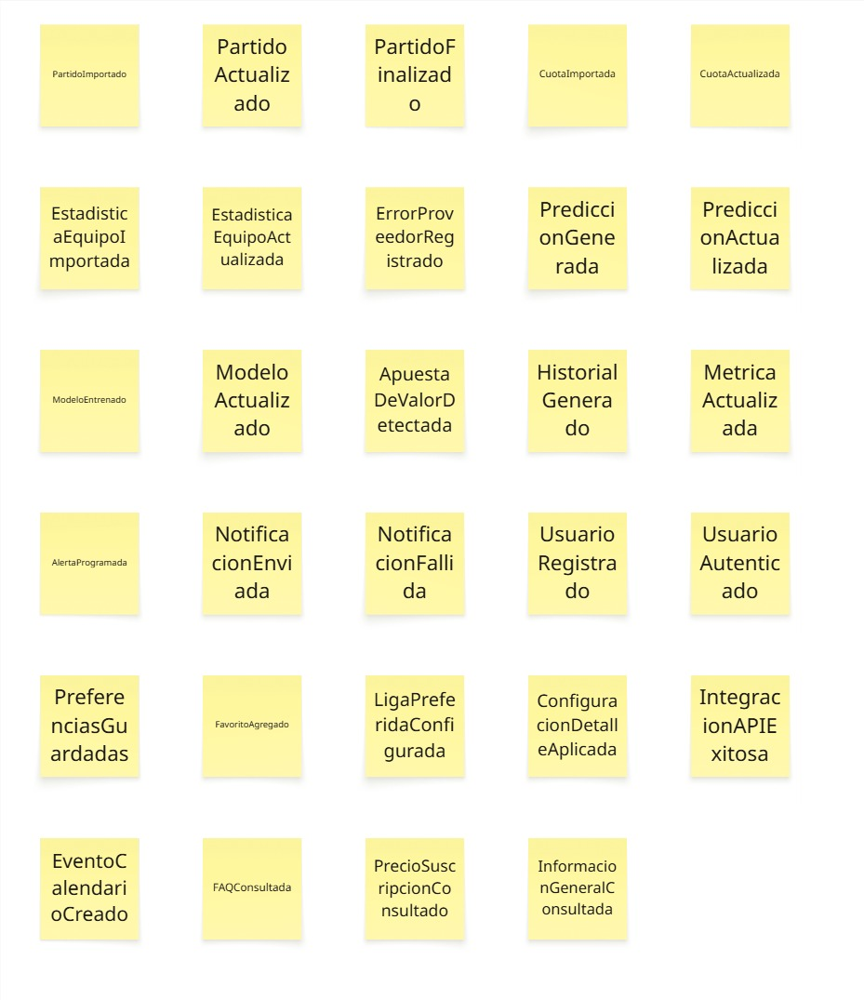
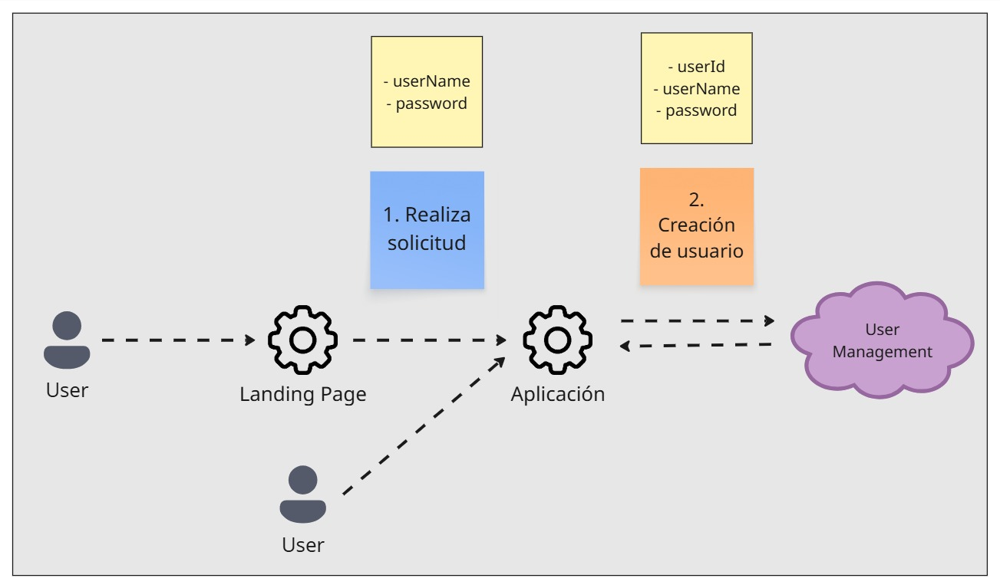

    <h3>Universidad Peruana de Ciencias Aplicadas</h3>
    </img> 
    <strong>Ingeniería de Software</strong>  
    <strong>2025-2</strong>  
    <strong>Arquitecturas De Software Emergentes</strong> 
    1ASI0728
     <strong>NRC: 7295</strong> 
     <strong>Profesor: Royer Edelwer Rojas Malasquez</strong> 
     <strong>"Informe de Trabajo Final"</strong> 
     <strong>BestWin Startup</strong> 
    <!--<strong>Nombre del Producto</strong>-->
     <h3> Integrantes: </h3>

| Member                              |    Code    |
| :---------------------------------- | :--------: |
| Bernaola Pérez, André Arturo        | U202114192 |
| Loli Ruiz Renzo, Javier             | U20161c993 |
| Soriano Medrano, Diego              | U202114793 |

<h3 align="center">Setiembre, 2025</h3>

  

## Registro de Versiones del Informe

En esta sección se resumen los avances y modificaciones realizadas durante el ciclo de vida de desarrollo del proyecto equivalente a un semestre.

<table>
  <thead>
    <tr>
      <th>Versión</th>
      <th>Fecha</th>
      <th>Autor</th>
      <th>Descripción de modificación</th>
    </tr>
  </thead>
  <tbody>
    <tr>
      <td>1.0</td>
      <td>10/09/2025</td>
      <td>BestWin</td>
      <td>Desarrollo de la primera versión del informe e inicio de la documentación para el desarrollo de nuestra solución elaborando la presentación, obtención de requisitos, especificación de requerimientos y diseño de nuestra solución. </td>
    </tr>
    <!--
    <tr>
      <td>2.0</td>
      <td>Fecha</td>
      <td>BestWin</td>
      <td>...</td>
    </tr>
    <tr>
      <td>3.0</td>
      <td>Fecha</td>
      <td>BestWin</td>
      <td>...</td>
    </tr>
    <tr>
      <td>4.0</td>
      <td>Fecha</td>
      <td>BestWin</td>
      <td>...</td>
    </tr>
    -->
  </tbody>
</table>
 

# Project Report Collaboration Insights

 

Se utilizaron Git y Github para el versionamiento y gestión del proyecto, lo cual permite una mejor colaboración y visualización de cambios en tiempo real. A continuación, se proporcionan los siguientes enlaces del proyecto:

| **Descripción**                  | **Enlace**                                                                 |
| :------------------------------: | :------------------------------------------------------------------------: |
| Organización del proyecto        | https://github.com/upc-pre-202520-7295             |
| Repositorio de la documentación  | https://github.com/upc-pre-202520-7295/Report      |

 

- Evidencia en imagen de los analíticos de colaboración y commits en GitHub:

  - **TB1:**
  
  

 

# Contenido

## Tabla de Contenidos

### [Registro de Versiones del Informe](#registro-de-versiones-del-informe)

### [Project Report Collaboration Insights](#project-report-collaboration-insights)

### [Contenido](#contenido)

### [Student Outcomes](#student-outcome)

### [Capítulo I: Introducción](#capítulo-i-introducción)
  - [1.1. Startup Profile](#11-startup-profile)
    - [1.1.1. Descripción de la Startup](#111-descripción-de-la-startup)
    - [1.1.2. Perfiles de integrantes del equipo](#112-perfiles-de-integrantes-del-equipo)
  - [1.2. Solution Profile](#12-solution-profile)
    - [1.2.1. Antecedentes y problemática](#121-antecedentes-y-problemática)
    - [1.2.2. Lean UX Process](#122-lean-ux-process)
      - [1.2.2.1. Lean UX Problem Statements](#1221-lean-ux-problem-statements)
      - [1.2.2.2. Lean UX Assumptions](#1222-lean-ux-assumptions)
      - [1.2.2.3. Lean UX Hypothesis Statements](#1223-lean-ux-hypothesis-statements)
      - [1.2.2.4. Lean UX Canvas](#1224-lean-ux-canvas)
  - [1.3. Segmentos objetivo](#13-segmentos-objetivo)

### [Capítulo II: Requirements Elicitation & Analysis](#capítulo-ii-requirements-elicitation--analysis)
- [2.1. Competidores](#21-competidores)
  - [2.1.1. Análisis competitivo](#211-análisis-competitivo)
  - [2.1.2. Estrategias y tácticas frente a competidores](#212-estrategias-y-tácticas-frente-a-competidores)
- [2.2. Entrevistas](#22-entrevistas)
  - [2.2.1. Diseño de entrevistas](#221-diseño-de-entrevistas)
  - [2.2.2. Registro de entrevistas](#222-registro-de-entrevistas)
  - [2.2.3. Análisis de entrevistas](#223-análisis-de-entrevistas)
- [2.3. Needfinding](#23-needfinding)
  - [2.3.1. User Personas](#231-user-personas)
  - [2.3.2. User Task Matrix](#232-user-task-matrix)
  - [2.3.3. Empathy Mapping](#234-empathy-mapping)
  - [2.3.4. As-is Scenario Mapping](#235-as-is-scenario-mapping)
- [2.4. Ubiquitous Language](#24-ubiquitous-language)

### [Capítulo III: Requirements Specification](#capítulo-iii-requirements-specification)
- [3.1. To-Be Scenario Mapping](#31-to-be-scenario-mapping)
- [3.2. User Stories](#32-user-stories)
- [3.3. Impact Mapping](#33-impact-mapping)
- [3.4. Product Backlog](#34-product-backlog)

### [Capítulo IV: Strategic-Level Software Design](#capítulo-iv-strategic-level-software-design)
- [4.1. Strategic-Level Attribute-Driven Design](#41-strategic-level-attribute-driven-design)
  - [4.1.1. Design Purpose](#411-design-purpose)
  - [4.1.2. Attribute-Driven Design Inputs](#412-attribute-driven-design-inputs)
    - [4.1.2.1. Primary Functionality (Primary User Stories)](#4121-primary-functionality-primary-user-stories)
    - [4.1.2.2. Quality attribute Scenarios](#4122-quality-attribute-scenarios)
    - [4.1.2.3. Constraints](#4123-constraints)
- [4.1.3. Architectural Drivers Backlog](#413-architectural-drivers-backlog)
  - [4.1.4. Architectural Design Decisions](#414-architectural-design-decisions)
  - [4.1.5. Quality Attribute Scenario Refinements](#415-quality-attribute-scenario-refinements)
- [4.2. Strategic-Level Domain-Driven Design](#42-strategic-level-domain-driven-design)
  - [4.2.1. EventStorming](#421-eventstorming)
  - [4.2.2. Candidate Context Discovery](#422-candidate-context-discovery)
  - [4.2.3. Domain Message Flows Modeling](#423-domain-message-flows-modeling)
  - [4.2.4. Bounded Context Canvases](#424-bounded-context-canvases)
  - [4.2.5. Context Mapping](#425-context-mapping)
- [4.3. Software Architecture](#43-software-architecture)
  - [4.3.1. Software Architecture System Landscape Diagram](#431-software-architecture-system-landscape-diagram)
  - [4.3.2. Software Architecture Context Level Diagrams](#432-software-architecture-context-level-diagrams)
  - [4.3.3. Software Architecture Container Level Diagrams](#433-software-architecture-container-level-diagrams)
  - [4.3.4. Software Architecture Deployment Diagrams](#434-software-architecture-deployment-diagrams)

 

### [Conclusiones](#conclusiones)
### [Bibliografía](#bibliografía)
### [Anexos](#anexos)

---

# Student Outcome

Criterio: Capacidad de comunicarse efectivamente con un rango de audiencias. En el siguiente cuadro se describe las acciones realizadas y enunciados de conclusiones por parte del grupo, que permiten sustentar el haber alcanzado el logro del ABET – EAC - Student Outcome 3.

| **Criterio específico** | **Acciones realizadas** | **Conclusiones** |
|---------------------|---------------------|--------------|
| Comunica oralmente sus ideas y/o resultados con objetividad a público de diferentes especialidades y niveles jerarquicos, en el marco del desarrollo de un proyecto en ingeniería. | **Bernaola Pérez, André Arturo** *TB1*   Durante el proyecto comuniqué de forma oral mis ideas y resultados al equipo, presentando los diagramas de arquitectura y explicando los hallazgos de las entrevistas. Esto permitió que todos comprendieran las decisiones técnicas y de análisis, facilitando la coordinación y el trabajo en conjunto.     **Loli Ruiz, Renzo Javier** *TB1*  En esta fase del proyecto comuniqué de forma oral las decisiones de diseño basadas en el proceso de DDD a todo el equipo detallando los contextos delimitados y los Lenguajes Ubicuos para modelar el dominio del negocio.    **Soriano Medrano, Diego** *TB1*   En esta primera fase del proyecto comuniqué en reuniones del equipo temas relacionados a los escenarios de atributos de calidad, permitiendo que el equipo pueda plantear el diseño arquitectónico.     | En el desarrollo de estos primeros capítulos, la comunicación oral fue fundamental para alinear al equipo y realizar el proceso de Domain-Driven Design (DDD) y detallar los escenarios de calidad clave. Explicar conceptos complejos como los Contextos Delimitados, el proceso de ADD y la elaboración de la arquitectura de nuestra solución aseguró que todos comprendieran y apoyaran el planteamiento de la solución, facilitando así una ejecución más fluida del proyecto.  |
| Comunica en forma escrita ideas y/o resultados con objetividad a público de diferentes especialidades y niveles jerarquicos, en el marco del desarrollo de un proyecto en ingeniería. | **Bernaola Pérez, André Arturo** *TB1*  Aporté en la comunicación escrita mediante la redacción de los primeros capítulos del informe, donde incluí el análisis del problema y el registro de entrevistas, además de documentar los diagramas de arquitectura. Con ello aseguré que la información se presentara de manera clara y objetiva para distintos públicos.    **Loli Ruiz, Renzo Javier** *TB1*  Aporté a la comunicación escrita en el proyecto redacción de los contextos delimitados y sus mapas de contexto, aporté con el equipo describiendo las entidades, agregados y servicios de cada módulo clave para el negocio.    **Soriano Medrano, Diego** *TB1*  Aporté en la documentación de los escenarios de calidad, redacté información relacionada y los cuadros necesarios para el análisis de atributos de calidad, aportando a las decisiones arquitectónicas.    | A través de una comunicación escrita clara y objetiva, se aseguró que el equipo comprenda la información más importante y crítica del nuestra solución. La documentación detallada de los escenarios de calidad y los mapas de contexto de DDD sirvieron como una referencia, garantizando que las desiciones arquitectónicas estuvieran alineadas con los objetivos de nuestra solución. |

 

---
# Capítulo I: Introducción

## 1.1. Startup Profile

### 1.1.1. Descripción de la Startup

Somos una startup tecnológica enfocada en el mundo de las apuestas deportivas de fútbol, que busca transformar la manera en que los usuarios toman decisiones al apostar. Desarrollamos una aplicación que ofrece probabilidades claras, precisas y fáciles de entender, generadas a partir de datos estadísticos y algoritmos y machine learning, para que cada usuario pueda evaluar mejor sus opciones antes de apostar. 
Nos dirigimos principalmente a apostadores frecuentes que buscan eficiencia en su análisis y a fanáticos del fútbol que desean una guía objetiva y rápida. Nuestra propuesta de valor se basa en la simplicidad, confiabilidad y enfoque exclusivo en el fútbol, garantizando que la experiencia sea directa, sin sobrecarga de información y optimizada para uso web y móvil.

Misión:

- Ofrecer a los apostadores de fútbol una herramienta simple y confiable que presente probabilidades claras basadas en estadísticas, ayudando a tomar mejores decisiones y elevando la experiencia de apostar de manera más informada.

Visión:

- Convertirnos en la plataforma líder de predicciones de fútbol en Latinoamérica, reconocida por su precisión, facilidad de uso y capacidad de generar confianza en los usuarios al momento de apostar.

### 1.1.2. Perfiles de integrantes del equipo

|   Photo   |   Description    |
| :-------: | :--------------: |
|  | **Bernaola Pérez, André Arturo**   Estoy cursando la carrera de Ingeniería de Software, me gusta jugar videojuegos y aprender cosas nuevas en mis ratos libres. Aspiro a trabajar como desarrollador fullstack y me interesa mantenerme actualizado en nuevas tecnologías, buenas prácticas de programación y metodologías ágiles. |
|  | **Loli Ruiz, Renzo Javier**    Soy Renzo Loli, tengo 26 años y soy de la carrera de Ingeniería de Software. Curso el 8vo ciclo. Tengo conocimientos en lenguages como javascript y python y base en arquitecturas cloud como aws. Me desemboco mejor en el ambito de identificar y resolver problemas. |
|  | **Soriano Medrano, Diego**    Estudio la carrera de ingeniería de software. Me considero una persona creativa y paciente. Tengo conocimiento en el uso de diferentes herramientas informáticas y lenguajes de programación. que ayudan a realizar distintos tipos de trabajo y a resolver problemas. Parte de mis habilidades blandas es siempre tomar en cuenta la opinión de mis compañeros, lo cual me facilita el poder trabajar en equipo, para agilizar diferentes actividades. |

## 1.2. Solution Profile

### 1.2.1. Antecedentes y problemática

**Aplicación de técnica The 5 'W's y 2'H's:**

- **What ¿Qué?** 
 El problema radica en que los apostadores frecuentes y fanáticos del fútbol en Perú toman decisiones de apuesta basadas en intuición, datos incompletos o fuentes poco confiables. Las plataformas disponibles ofrecen información dispersa, difícil de interpretar o enfocada en múltiples deportes, lo que genera sobrecarga de datos, baja precisión y mayor riesgo económico al apostar. 

- **When ¿Cuándo?**  
 El problema surge en el momento en que los usuarios deben decidir por quién apostar antes o durante los partidos de fútbol. En ese proceso, se enfrentan a información confusa, poco adaptada a su contexto y sin un análisis claro que facilite la toma de decisiones. 

- **Where ¿Dónde?** 
 El cliente suele usar estas plataformas desde su celular o computadora, en cualquier lugar donde tenga acceso a internet: en casa, en bares deportivos, en el estadio o mientras se traslada. El problema aparece principalmente en entornos cotidianos de apuesta, donde la rapidez y la claridad de la información son clave. 

- **Who ¿Quién?** 
 Los principales involucrados son los apostadores frecuentes (que buscan aumentar sus probabilidades de ganar y reducir pérdidas) y los fanáticos del fútbol, que buscan disfrutar más de su experiencia con predicciones confiables y fáciles de entender. 

- **Why ¿Por qué?** 
 Las causas del problema están en la falta de herramientas locales y especializadas que simplifiquen el análisis de datos deportivos. Aunque existen plataformas internacionales, estas suelen enfocarse en múltiples deportes, presentan interfaces complejas y no están adaptadas al contexto peruano. Esto provoca que muchos usuarios sigan confiando en corazonadas, rumores o grupos informales, lo que limita la eficiencia de sus apuestas. 

- **How ¿Cómo?** 
 Los clientes terminan usando las casas de apuestas en línea de forma directa o consultando páginas de estadísticas sin mayor procesamiento de datos. Estas condiciones dificultan que logren una estrategia informada y aumentan la dependencia de la suerte o de recomendaciones externas poco confiables. 

- **How much ¿Cuánto?** 
La magnitud del problema es alta. Según la Asociación Peruana de Apuestas Deportivas (APADELA), el mercado de apuestas deportivas en Perú mueve millones de soles cada mes, y el 70% de las apuestas se realizan en fútbol. Sin embargo, más del 60% de apostadores señala que no confía del todo en la información que consulta antes de apostar, lo que confirma la falta de soluciones confiables y adaptadas a sus necesidades reales. 

 

**Descripción de los antecedentes y problemática:**

En el mercado de apuestas deportivas en Perú, muchos fanáticos del fútbol toman decisiones basadas principalmente en la intuición o en datos fragmentados obtenidos de redes sociales, grupos informales o páginas poco especializadas. Esto genera un alto nivel de incertidumbre y deja a los usuarios expuestos a predicciones poco confiables que no responden de manera real a las dinámicas del deporte. 
A la vez, las plataformas internacionales ofrecen gran cantidad de información, pero de forma dispersa, compleja y sin un enfoque exclusivo en el fútbol, lo que provoca sobrecarga de datos y dificulta identificar qué es realmente útil. Esto lleva a que los apostadores enfrenten mayor riesgo económico y baja eficiencia al apostar, evidenciando la necesidad de una herramienta local y especializada que simplifique y fortalezca el proceso de decisión.

 

---
### 1.2.2. Lean UX Process

#### 1.2.2.1. Lean UX Problem Statements

- **Problem statement 1: Decisiones de apuesta poco informadas y baja confianza en las predicciones**

  Nuestra plataforma busca permitir que los apostadores frecuentes de fútbol tomen decisiones respaldadas por datos y análisis avanzados, maximizando su rentabilidad y minimizando los riesgos inherentes a las apuestas. Observamos que la mayoría de los usuarios confían en intuiciones, rumores o información fragmentada y poco confiable, lo que genera incertidumbre, pérdidas y menor satisfacción con la experiencia. Además, la variedad de información dispersa en plataformas internacionales contribuye a la sobrecarga y dificulta identificar oportunidades verdaderamente valiosas (“apuestas de valor”). 

  **¿Cómo podemos ofrecer a los usuarios una guía predictiva sencilla, confiable y respaldada por machine learning, para que su experiencia de apuesta sea más rentable, transparente y con mayor confianza en los resultados generados por la plataforma?**

 
 
- **Problem statement 2: Información complicada y poco adaptada al contexto local de los fanáticos del fútbol**

  Betalyze tiene como objetivo ayudar a los fanáticos del fútbol en Perú (incluyendo a fanáticos que no apuestan) a comprender el análisis y las proyecciones de los partidos, eliminando la complejidad de datos y terminología poco relevante. Vemos que los usuarios perciben las plataformas existentes como saturadas de información y difíciles de usar, lo que limita la adopción y el disfrute de los pronósticos deportivos. El enfoque en varios deportes y la falta de adaptación local provoca que la información no resulte relevante ni fácil de entender, restando valor a la experiencia. 

  **¿Cómo podemos brindar a los fanáticos peruanos de fútbol información predictiva clara, objetiva y contextualizada, para que cada usuario pueda visualizar rápidamente los factores clave de un partido y tomar decisiones informadas de forma sencilla ya sea que apuesten o solo busquen profundizar su experiencia futbolística?**

#### 1.2.2.2. Lean UX Assumptions

**Business Assumptions**

1. **Creo que mis clientes necesitan** herramientas efectivas para tomar decisiones informadas con datos precisos al memento de realizar apuestas por sus equipos favoritos. 

2. **Estas necesidades se pueden resolver con** el acceso a información accesible y entendible sobre estadísticas detalladas de jugadores y equipos, resultados de encuentros pasados, lesiones, y factores contextuales para generar mayor confiabilidad en los usuarios y mostrando esta información de manera adecuada. 

3. **Mis clientes iniciales serán** apostadores frecuentes de fútbol que buscan maximizar rentabilidad y minimizar riesgo y fanáticos del fútbol interesados en obtener predicciones objetivas y mejorar su experiencia, incluso si no realizan apuestas directamente. 

4. **El valor #1 que un cliente quiere de mi servicio es** identificar oportunidades de apuestas de valor, permitiéndoles apostar con mayor conocimiento y confianza que cualquier solución tradicional basada solo en cuotas del mercado, aumentando la rentabilidad de nuestros usuarios apostadores. 

5. **El cliente también puede obtener servicios adicionales como** información sobre sus equipos favoritos, recursos informativos sobre apuestas responsables, análisis de datos deportivos y visualización de estadísticas de parámetros específicos. 

6. **Voy a adquirir la mayoría de mis clientes a través de** la difusión de la reputación de Betalyze en redes de apostadores y comunidades futbolísticas, además del posicionamiento como solución especializada y fácil de usar para predicciones futbolísticas confiables 

7. **Haré dinero a través de** funciones premium de análisis, suscripciones mensuales, alertas personalizadas y ofreciendo un sistema predictivo funcional. 

8. **Mi competencia principal en el mercado son** plataformas internacionales que ofrecen estadísticas y pronósticos, pero suelen ser complejas, dispersas y carecen de adaptación local para los usuarios peruanos. 

9. **Los venceremos debido a que nuestro** valor agregado en nuestra solución será la capacidad de ofrecer análisis personalizados utilizando Machine Learning (ML), información relevante en un solo sitio, presentación clara, enfoque local y servicios adaptados a las necesidades de apostadores frecuentes y fanáticos del fútbol peruano. 

10. **Mi mayor riesgo de producto es** no lograr que la plataforma genere la confianza suficiente en los apostadores y fanáticos del fútbol, como su herramienta principal para tomar decisiones y disminuiría la cantidad de usuarios necesarios para garantizar la sostenibilidad del negocio a la vez que no obtener los datos necesarios para entrenar nuestro modelo basado en Machine Learning. 

11. **Resolveremos esto a través del** mediante el diseño de una interfaz intuitiva, la publicación de métricas de precisión de nuestro modelo predictivo, la generación de contenido educativo sobre apuestas de valor, posicionando a Betalyze como una plataforma confiable, clara y especializada en el deporte que más les interesa. 

12. **¿Qué otras suposiciones tenemos? ¿Eso, si se prueba que es falso, causará que nuestro negocio / proyecto no funcione?**

- Generar interés en apostadores frecuentes y fanáticos del fútbol en Perú, que confíen en los resultados generados por machine learning.
- Contar con suficientes datos históricos, estadísticas confiables y fuentes de información actualizadas para entrenar y mantener el modelo predictivo.
- Lograr que los usuarios perciban que nuestras predicciones mejoran significativamente sus decisiones frente a confiar solo en cuotas de mercado o intuición, así como su rentabilidad.  

  Si alguna de estas suposiciones resulta falsa, podría comprometer la viabilidad del proyecto, ya que la plataforma perdería su valor diferencial, no generaría la confianza necesaria y no se alcanzaría una masa crítica de usuarios que justifique el mantenimiento y evolución de la solución. 

 

**User Assumptions**

**¿Quién es el usuario?**

- Apostadores frecuentes de fútbol que buscan optimizar su rentabilidad, reducir riesgos y tomar decisiones informadas con respaldo de datos en lugar de intuición. En este contexto también considerando a fanáticos del fútbol que no necesariamente apuestan, pero que quieren comprender mejor el desempeño de equipos y jugadores, disfrutar de predicciones claras y enriquecer su experiencia futbolística. 

**¿Dónde encaja nuestro producto en su trabajo o vida?**

- Betalyze se integrará en la vida de los usuarios durante los momentos previos y durante los partidos, cuando vayan a necesitar información rápida, precisa y relevante para decidir en qué apostar o simplemente anticipar resultados. Para los apostadores frecuentes, la plataforma se convertirá herramienta de análisis confiable. Para los fanáticos, en una guía que complementa la emoción del juego con datos fáciles de interpretar. 

**¿Qué problemas tiene nuestro producto y cómo se pueden resolver?**

- Sobrecarga de información: algunos usuarios pueden sentirse abrumados si mostramos demasiados datos sin priorización. Solución: usar visualizaciones simples, resúmenes claros y permitir filtrar la información según nivel de detalle.
- Desconfianza en el modelo predictivo: los usuarios pueden dudar de la precisión de nuestras predicciones. Solución: mostrar métricas de precisión histórica, explicar de manera sencilla el funcionamiento del modelo y ofrecer transparencia en los resultados.
- Diferentes niveles de conocimiento: algunos usuarios son expertos en apuestas, otros son principiantes o solo fanáticos.

**¿Cuándo y cómo es usado nuestro producto?**

- Cuando: Antes de los partidos para planificar apuestas, durante los partidos para apuestas en vivo, y después de los partidos para analizar resultados y ajustar estrategias futuras.
- Cómo: Los usuarios ingresan desde sus celulares o computadoras, revisan las predicciones generadas por el modelo, consultan análisis de valor y toman decisiones informadas. Algunos usuarios pueden recibir alertas o notificaciones de oportunidades detectadas en tiempo real. 

**¿Qué características son importantes?**

- Predicciones basadas en machine learning, fáciles de entender y con métricas de precisión. 
- Detección automática de apuestas de valor frente a las cuotas del mercado. 
- Interfaz intuitiva, rápida y responsive (optimizada para web y móvil). 
- Segmentación de contenido para apostadores expertos y usuarios principiantes. 
- Información confiable y adaptada al contexto local. 
- Sistema de notificaciones para alertar sobre oportunidades en tiempo real. 

**¿Cómo debe verse nuestro producto y cómo debe comportarse?**

- Betalyze debe tener un diseño moderno, claro y centrado en datos, mostrando las predicciones de forma visual (porcentajes, indicadores de valor, gráficos simples). La plataforma debe comportarse de forma rápida, confiable y consistente, transmitiendo profesionalismo y confianza. El usuario deberá sentir que cada interacción lo acercará a tomar una mejor decisión, sin saturarlo con información innecesaria.

 

#### 1.2.2.3. Lean UX Hypothesis Statements

- **H1:** Creemos que si mostramos a los usuarios predicciones generadas por machine learning junto con métricas de precisión histórica y explicaciones simples de cómo funcionan, entonces confiarán más en los resultados y usarán Betalyze como su fuente de información principal. 

  **Sabremos que hemos tenido** éxito 

  **Cuando**
  - Más del 75% de los usuarios declara en encuestas que confía en las predicciones de Betalyze. 
  - El porcentaje de usuarios recurrentes que vuelven a usar la plataforma supera el 60% después de un mes. 

 

- **H2:** Creemos que si mostramos datos adecuados en base a detección automática de apuestas de valor y análisis claros de probabilidades frente a las cuotas de mercado, entonces los apostadores al utilizar la información proporcionada por nuestra solución tendrán la oportunidad de mejorar su rentabilidad y reducirán pérdidas. 

  **Sabremos que hemos tenido** éxito 

  **Cuando**
  - Aumenta el tiempo promedio de uso en las secciones de análisis de valor en un 20%. 
  - Al menos el 80 % de los usuarios califiquen las predicciones como “claras y útiles” dentro de la plataforma.

 

#### 1.2.2.4. Lean UX Canvas

 

## 1.3. Segmentos objetivo

**Segmento 1: Apostadores frecuentes**

Características demográficas:

- Edad: Adultos jóvenes y de mediana edad, entre 20 y 45 años.

- Uso tecnológico: Alta disposición a usar herramientas digitales y aplicaciones recurrentemente.

- Comportamiento: Apuestas constantes varias veces por semana, interesados en optimizar decisiones y reducir riesgos.

- Necesidades: Probabilidades claras y rápidas que faciliten el análisis eficiente y la identificación de valor en apuestas.

- Perfil socioeconómico: Probablemente activos laboralmente, con ingresos disponibles para apostar regularmente.

  **Detalle**: Son usuarios que realizan apuestas de manera constante, varias veces por semana, y buscan optimizar sus decisiones para reducir riesgos. Este segmento necesita probabilidades claras y rápidas que les permitan ahorrar tiempo en el análisis de partidos y encontrar valor en sus apuestas. Constituyen un público dispuesto a usar herramientas digitales de manera recurrente y a convertirse en usuarios activos de la aplicación.

**Segmento 2: Fanáticos del fútbol**

Características demográficas:

- Edad: Jóvenes adultos, entre 18 y 20 años.

- Perfil: Seguidores apasionados de equipos y ligas de fútbol, principalmente motivados por la pasión y el interés deportivo.

- Comportamiento de apuesta: Decisiones basadas en intuición, aunque valoran una referencia objetiva para complementar su criterio.

- Adopción tecnológica: Alta probabilidad de adoptar nuevas plataformas digitales, especialmente en un contexto deportivo nacional popular.

- Contexto cultural: Fútbol como deporte más popular en Perú, con alta concentración de apuestas entre este grupo juvenil.

  **Detalle**: Son hinchas que siguen de cerca a sus equipos y ligas favoritas, y que apuestan motivados por su pasión. Aunque suelen decidir en base a la intuición, valoran contar con una referencia objetiva que complemente su criterio. Este segmento asegura una alta adopción, dado que el fútbol es el deporte más popular en Perú y concentra la mayoría de las apuestas deportivas.

 

---

# Capítulo II: Requirements Elicitation & Analysis

## 2.1. Competidores

**Forebet**

- Es una aplicación web que ofrece predicciones de fútbol basadas en algoritmos estadísticos y modelos matemáticos que analizan grandes volúmenes de datos deportivos para generar pronósticos precisos. Cubre más de 1200 ligas en diversos deportes, especialmente fútbol, y provee estadísticas detalladas y análisis para ayudar a los usuarios a tomar decisiones informadas en apuestas. Opera desde 2009, destacándose por la precisión de sus modelos estadísticos.

  Características principales:
  - Cobertura de ligas a nivel mundial.
  - Tipos de apuestas: 1X2, over/under, hándicap, marcador exacto, etc.
  - Estadísticas históricas y comparaciones entre equipos.

  </img>

**Betmines**

- Es una aplicación enfocada en pronósticos y alertas en tiempo real para partidos de fútbol que combina estadísticas detalladas, filtros avanzados y algoritmos de inteligencia artificial para identificar oportunidades rentables en tiempo real, incluyendo alertas personalizadas via Telegram. 

  Características principales:   
  - Notificaciones push de resultados y cambios.
  - Interfaz móvil sencilla y personalizada.
  - Pronósticos y consejos de apuestas deportivos.

  </img>

**PredictZ**

- Es una aplicación web que proporciona predicciones gratuitas de fútbol, análisis y estadísticas que respaldan los pronósticos. Su enfoque es ofrecer datos y resultados para que los usuarios estudien y refuercen sus decisiones de apuestas. Aunque no garantiza apuestas seguras, se presenta como una herramienta de apoyo para apostadores y fanáticos que desean un respaldo analítico.

  Características principales:
  - Probabilidades rápidas y fáciles de entender.
  - Datos de forma reciente y enfrentamientos previos.
  - Opciones de visualización y personalización básica.

  </img>

### 2.1.1. Análisis competitivo

<table>
    <thead>
        <tr>
            <th colspan="6" style="text-align: center">Competitive Analysis Landscape</th>
        </tr>
        <tr>
            <th rowspan="2">¿Por qué llevar a cabo este análisis?</th>
            <th colspan="5">¿Qué características o funciones puedo implementar que mis competidores no tengan?</th>
        </tr>
        <tr>
            <th colspan="5">¿Qué debo tomar como ejemplo de mis competidores?</th>
        </tr>
        <tr>
            <th colspan="2">Empresa / APP</th>
            <th> 
 Betalyze   <!--</img>--> 
 </th>
            <th> 
 Forebet   </img> 
 </th>
            <th> 
 Betmines   </img> 
 </th>
            <th> 
 PredictZ   </img> 
 </th>
        </tr>
    </thead>
    <tbody>
        <tr>
            <th rowspan="3">Perfil</th>
            <tr>
                <td>Overview</td>
                <td> Plataforma web que usa modelos de Machine Learning para generar predicciones deportivas especializadas en fútbol, identificando apuestas de valor mediante análisis detallado de estadísticas, lesiones y factores contextuales. </td>
                <td> Plataforma con más de 15 años en el mercado que ofrece predicciones matemáticas basadas en algoritmos avanzados y machine learning, que cubre ligas y múltiples deportes, incluyendo fútbol, baloncesto y tenis. </td>
                <td> Plataforma que ofrece predicciones deportivas de fútbol usando algoritmos y AI, análisis en tiempo real, filtros y alertas mediante Telegram, centrada en optimizar apuestas con datos historicos. </td>
                <td> Sitio que ofrece predicciones gratuitas de fútbol, con análisis y estadísticas para apoyar decisiones de apuestas, sin garantía de resultados seguros, orientado a usuarios que buscan respaldo analítico accesible. </td>
            </tr>
            <tr>
                <td>Ventaja competitiva ¿Qué valor ofrece a los clientes?</td>
                <td> Predicciones más precisas y confiables en base a cuotas del mercado, ofreciendo una ventaja objetiva para mejorar la rentabilidad de apostadores, fanáticos del futbol y acceso a información clara. </td>
                <td> Buena cobertura deportiva global y acceso gratuito a predicciones basadas en datos y análisis estadístico. </td>
                <td> Fuerte enfoque en análisis en vivo, combinando predicciones automáticas con alertas para usuarios. </td>
                <td> Predicciones y datos gratuitos con alcance global, facilitando el análisis para usuarios que prefieren una base objetiva para realizar apuestas. </td>
            </tr>
        </tr>
        <tr>
            <th rowspan="3">Perfil de Marketing</th>
            <tr>
                <td>Mercado objetivo</td>
                <td> Apostadores frecuentes que buscan optimizar decisiones y fanáticos del fútbol entre 18 y 45 años en Perú, interesados en una combinación de análisis objetivo y pasión deportiva.</td>
                <td> Apostadores deportivos globales, interesados en predicciones gratuitas y análisis detallados de diferentes deportes. </td>
                <td> Apostadores de fútbol activos que buscan herramientas avanzadas y alertas para mejorar su toma de decisiones en tiempo real. </td>
                <td> Apostadores casuales y aficionados que valoran el acceso gratuito a análisis y predicciones deportivas, especialmente en fútbol. </td>
            </tr>
            <tr>
                <td>Estrategias de marketing</td>
                <td> Enfocadas en contenido digital, promoción en redes sociales, suscripciones premium, alertas personalizadas y posicionamiento como la herramienta confiable y local de referencia en Perú.</td>
                <td> Promoción gratuita con fuerte presencia en redes sociales, apps móviles, blogs deportivos y alianzas estratégicas para posicionamiento global. </td>
                <td> Uso de grupos VIP, bots de apuestas, suscripciones a funciones premium y comunidades en Telegram. </td>
                <td> Monetización basada en publicidad, alianzas comerciales y posicionamiento SEO para captar tráfico web. </td>
            </tr>
        </tr>
        <tr>
            <th rowspan="4">Perfil de Producto</th>
            <tr>
                <td>Productos & Servicios</td>
                <td> Plataforma web y móvil con predicciones, análisis de valor, métricas explicativas, alertas personalizadas y funciones premium de análisis avanzados.</td>
                <td> Predicciones, estadísticas, análisis detallados, live scores, tendencias y contenido complementario. </td>
                <td> Predicciones diarias, filtros en vivo, alertas, acceso gratuito y planes premium con análisis. </td>
                <td> Predicciones, estadísticas y análisis en formato gratuito, soporte básico. </td>
            </tr>
            <tr>
                <td>Precios y Costos</td>
                <td> Modelo freemium con suscripciones mensuales y funciones premium pagadas</td>
                <td> Acceso gratuito a la mayoría del contenido, monetización vía publicidad y funcionalidades en apps móviles. </td>
                <td> Modelo freemium con funciones básicas, gratuitas y servicios avanzados por suscripción. </td>
                <td> Totalmente gratuito, ingresos generados por publicidad y acuerdos comerciales. </td>
            </tr>
            <tr>
                <td>Canales de distribución (Web y/o Móvil)</td>
                <td> Web y aplicaciones móviles para acceso rápido y frecuente</td>
                <td> Web y aplicaciones móviles iOS y Android </td>
                <td> Web y plataforma de mensajería Telegram para alertas. </td>
                <td> Principalmente web. </td>
            </tr>
        </tr>        
    </tbody>
</table>

 
    
<table>
    <tbody>
        <tr>
            <th rowspan=10>Análisis SWOT</th>
            <tr>
                <th>Fortalezas</th>
                <td>
                  <ul>
                        <li> Uso de machine learning avanzado con datos específicos sobre fútbol en Perú. </li>
                        <li> Enfoque en apuestas de valor con explicaciones claras y visualización de métricas precisas. </li>
                        <li> Diseño enfocado en usuarios frecuentes y fanáticos locales, con funciones premium y alertas personalizadas. </li>
                  </ul>
                </td>
                <td>
                  <ul>
                        <li> Plataforma con más de 15 años en el mercado y gran reconocimiento global. </li>
                        <li> Cobertura de ligas y deportes, con acceso gratuito y modelos estadísticos. </li>
                        <li> Gran base de usuarios y presencia en apps móviles. </li>
                  </ul>
                </td>
                <td>
                  <ul>
                        <li> Enfoque en análisis en vivo y alertas personalizadas vía Telegram. </li>
                        <li> Combinación de IA con interacción en comunidades VIP y bots para apuestas de valor. </li>
                        <li> Modelo freemium que atrae y fideliza apostadores activos. </li>
                  </ul>
                </td>
                <td>
                  <ul>
                        <li> Acceso gratuito y fácil para usuarios casuales. </li>
                        <li> Base de datos accesible y orientada principalmente a fútbol. </li>
                        <li> Posicionamiento SEO que atrae tráfico web. </li>
                  </ul>
                </td>
            </tr>
            <tr>
                <th>Debilidades</th>
                <td>
                  <ul>
                        <li> Plataforma nueva con menor reconocimiento frente a competidores consolidados. </li>
                        <li> Mercado con limites geográficos por la concentración a nuestro segmento objetivo. </li>
                        <li> Dependencia en suscripciones para monetización y demostración rápida de valor rápidamente. </li>
                  </ul>
                </td>
                <td>
                  <ul>
                        <li> Predicciones generalistas con menor enfoque local específico en Perú. </li>
                        <li> Experiencia de usuario menos personalizada, sin funciones premium destacadas. </li>
                        <li> Modelo de negocio basado principalmente en publicidad, menos diversidad de ingresos. </li>
                  </ul>
                </td>
                <td>
                  <ul>
                        <li> Dependencia de plataformas externas como Telegram para alertas. </li>
                        <li> Puede resultar complejo para usuarios menos tecnológicos o principiantes. </li>
                        <li> Cobertura limitada a fútbol principalmente. </li>
                  </ul>
                </td>
                <td>
                  <ul>
                        <li> Falta de funciones premium o diferenciación de valor premium. </li>
                        <li> Menor precisión y soporte comparado con plataformas pagas. </li>
                        <li> Modelo de negocio dependiente de publicidad. </li>
                  </ul>
                </td>
            </tr>
            <tr>
                <th>Oportunidades</th>
                <td>
                  <ul>
                        <li> Creciente interés en apuestas deportivas y creciente adopción de Machine Learning aplicada. </li>
                        <li> Expansión de funciones y alcance a otros deportes o regiones. </li>
                        <li> Potenciar estrategias de marketing digital para fortalecerse como solución local confiable. </li>
                  </ul>
                </td>
                <td>
                  <ul>
                        <li> Ampliar servicios premium y personalización para captar nuevos segmentos. </li>
                        <li> Integrar funciones de machine learning más avanzadas para mejorar precisión. </li>
                        <li> Expandirse a mercados emergentes con soporte local. </li>
                  </ul>
                </td>
                <td>
                  <ul>
                        <li> Potenciar automatización y personalización para usuarios avanzados. </li>
                        <li> Integrar más deportes o implementar versiones más amigables para usuarios inexpertos. </li>
                        <li> Crecimiento de comunidades y marketing mediante contenido exclusivo. </li>
                  </ul>
                </td>
                <td>
                  <ul>
                        <li> Introducir funciones premium o planes de suscripción. </li>
                        <li> Expandir contenido analítico y personalización para usuarios más exigentes. </li>
                        <li> Alianzas con plataformas de apuestas para generar ingresos complementarios. </li>
                  </ul>
                </td>
            </tr>
            <tr>
                <th>Amenazas</th>
                <td>
                  <ul>
                        <li> Competencia consolidada con amplio mercado y recursos. </li>
                        <li> Cambios regulatorios en apuestas deportivas en Perú. </li>
                        <li> Usuarios escépticos a confiar en sistemas automatizados o nuevas plataformas sin historial. </li>
                  </ul>
                </td>
                <td>
                  <ul>
                        <li> Competencia local más especializada puede arrebatar usuarios exigentes. </li>
                        <li> Saturación del mercado con predicciones gratuitas que pueden reducir percepción de valor. </li>
                        <li> Cambios en políticas de apps o publicidad digital que afecten ingresos. </li>
                  </ul>
                </td>
                <td>
                  <ul>
                        <li> Competencia con plataformas todo en uno que no dependen de servicios externos. </li>
                        <li> Regulaciones en el uso de bots o mensajería para apuestas. </li>
                        <li> Cambios en accesibilidad o políticas de Telegram o canales similares. </li>
                  </ul>
                </td>
                <td>
                  <ul>
                        <li> Competencia con plataformas gratuitas más especializadas. </li>
                        <li> Cambios en políticas de publicidad digital que reduzcan ingresos. </li>
                        <li> Pérdida de usuarios por servicios pagos con mejor soporte. </li>
                  </ul>
                </td>
            </tr>
        </tr>
    </tbody>
</table>

 

### 2.1.2. Estrategias y tácticas frente a competidores

<table>
  <thead>
        <tr>
            <th>  </th>
            <th> 
 Estrategias 
 </th>
            <th> 
 Tácticas 
 </th>
        </tr>
    </thead>
    <tbody>
        <tr>
            <tr>
                <th>Fortalezas</th>
                <td>
                  <ul>
                        <li> Potenciar comunicación, descipción de predicciones y diferenciación local </li>
                        <li> Destacar funciones freemium y alertas personalizadas según el tipo de usuario </li>
                  </ul>
                </td>
                <td>
                  <ul>
                        <li> Explicar claramente el uso de Machine Learning y precisión que se puede lograr. Resaltar enfoque en fútbol peruano. </li>
                        <li> Promocionar funciones exclusivas y beneficios para nuestros usuarios más frecuentes. </li>
                  </ul>
                </td>
            </tr>
            <tr>
                <th>Debilidades</th>
                <td>
                  <ul>
                        <li> Intensificar promoción y publicidad digital local para ganar más base de usuarios </li>
                        <li> Validar con pilotos y testimonios en base a la experiencia de los usuarios al utilizar la plataforma </li>
                        <li> Ofrecer versiones pruebas gratuitas, funcione y predicciones destacables de la competencia </li>
                  </ul>
                </td>
                <td>
                  <ul>
                        <li> Campañas en redes sociales, publicidad, contenido educativo y descriptivo. </li>
                        <li> Pruebas de conceptos y uso para obtener feedback para generar confianza. </li>
                        <li> Invitar a probar funciones y personalización para fidelizar usuarios. </li>
                  </ul>
                </td>
            </tr>
            <tr>
                <th>Oportunidades</th>
                <td>
                  <ul>
                        <li> Alianzas estratégicas con comunidades deportivas y fanáticos del futbol </li>
                        <li> Comprobar los resultados de usuar Machine Learning y ampliar cobertura deportiva </li>
                        <li> Crear contenido descriptivo, enfocado y confiable </li>
                  </ul>
                </td>
                <td>
                  <ul>
                        <li> Negociar colaboraciones e iniciativas para promocionar el uso de predicciones descriptivas y accesibles. </li>
                        <li> Actualizar nuestro modelo con datos relevantes y explorar otros deportes. </li>
                        <li> Utilizar y mostrar guías y videos sobre uso de Machine Learning y apuestas responsables. </li>
                  </ul>
                </td>
            </tr>
            <tr>
                <th>Amenazas</th>
                <td>
                  <ul>
                        <li> Adaptación rapida y accesibilidad de la plataforma </li>
                        <li> Fortalecer soporte y enfoque en nuestros usuarios </li>
                        <li> Prestar atención en UX/UI para accesibilidad	y visualización de datos </li>
                  </ul>
                </td>
                <td>
                  <ul>
                        <li> Estar atentos a cambios legales y constante mantenimiento. </li>
                        <li> Soporte personalizado y descripciones claras para reducir dudas y escepticismo. </li>
                        <li> Priorizar una la plataforma intuitiva, simple y rápida frente a la competencia. </li>
                  </ul>
                </td>
            </tr>
        </tr>
    </tbody>
</table>

 

---

## 2.2. Entrevistas

### 2.2.1. Diseño de entrevistas

En esta sección se presenta la relación de preguntas principales y complementarias descritas para realizar las entrevistas, dirigidas a cada uno de los segmentos objetivos.

- **Información general requerida para ambos segmentos:**

  - Nombres
  - Apellidos
  - Edad
  - Distrito

- **Preguntas generales para ambos segmentos:**

1. ¿Qué tipo de información revisas antes de ver un partido (alineaciones, historial, noticias, lesiones, forma reciente)?
2. ¿Usas más el móvil o la web para seguir probabilidades y apuestas? ¿Cuál te resulta más cómodo?
3. ¿Qué tan satisfecho estás con las aplicaciones o webs actuales que usas para predicciones?
4. ¿Prefieres probabilidades expresadas como porcentajes o cuotas (ej. 65% vs cuota 1.55)?
5. ¿Te interesaría un historial visual de rendimiento de tu equipo (racha de victorias/derrotas, goles a favor y en contra)?

- **Preguntas para el segmento Apostadores frecuentes:**

1. ¿Qué deportes o equipos sigues más de cerca para apostar?
2. ¿Cuántas apuestas de fútbol realizas en promedio por semana?
3. ¿Qué tipo de apuestas prefieres (ganador, over/under, hándicap, combinadas)?
4. ¿Qué tan importante es para ti la rapidez en recibir pronósticos antes de un partido?
5. ¿Qué dificultades enfrentas al analizar varios partidos en poco tiempo? 
6. ¿Qué datos o métricas ayudan a mejorar tu presupuesto al momento de apostar y qué herramienta te ayudaría a controlarlo mejor?
7. ¿Qué mejorarías de las apps o servicios de predicciones que usas actualmente?
8. ¿Qué datos previos te interesan más (alineaciones, historial, noticias, lesiones)?
9. ¿Qué tan seguido apuestas solo por intuición o pasión, sin ver estadísticas

- **Preguntas para el segmento Fanáticos del futbol:**

1. ¿Qué ligas, equipos o selecciones sigues más de cerca?
2. ¿Qué tan interesante te resulta conocer probabilidades de victoria o rendimiento de tu equipo, aunque no apuestes?
3. ¿Cómo reaccionas cuando los datos o predicciones muestran que tu equipo tiene pocas chances de ganar?
4. ¿Te interesa ver probabilidades en ligas menores o prefieres solo las más populares?
5. ¿Prefieres probabilidades objetivas, aunque contradigan lo que sientes como hincha?

 

### 2.2.2. Registro de entrevistas

**Segmento Apostadores frecuentes:**

|     Entrevistado     |    Daniel Chipana    |
|:---------------------|----------------------|
| Edad                 | N/A  |
| Distrito             | N/A  |
| Screenshot           |  |
| Inicio de entrevista | Minuto 0:00 |
| Duración             | 3:19 minutos |
| Resumen              |  Prefiere apuestas combinadas. Considera fundamental la rapidez de pronósticos. Usa móvil como principal canal, consulta alineaciones y estadísticas previas. Personalidad racional y metódica.  |
| URL del video       | [https://upcedupe-my.sharepoint.com/:v:/g/personal/u202114192_upc_edu_pe/Ef5DB_6fv8RJi2odu1mgzFYBugr47Cs1b4XkvWy6UbCYjA?e=yiuKEv&nav=eyJyZWZlcnJhbEluZm8iOnsicmVmZXJyYWxBcHAiOiJTdHJlYW1XZWJBcHAiLCJyZWZlcnJhbFZpZXciOiJTaGFyZURpYWxvZy1MaW5rIiwicmVmZXJyYWxBcHBQbGF0Zm9ybSI6IldlYiIsInJlZmVycmFsTW9kZSI6InZpZXcifX0%3D](https://upcedupe-my.sharepoint.com/:v:/g/personal/u202114192_upc_edu_pe/Ef5DB_6fv8RJi2odu1mgzFYBugr47Cs1b4XkvWy6UbCYjA?e=yiuKEv&nav=eyJyZWZlcnJhbEluZm8iOnsicmVmZXJyYWxBcHAiOiJTdHJlYW1XZWJBcHAiLCJyZWZlcnJhbFZpZXciOiJTaGFyZURpYWxvZy1MaW5rIiwicmVmZXJyYWxBcHBQbGF0Zm9ybSI6IldlYiIsInJlZmVycmFsTW9kZSI6InZpZXcifX0%3D) |

|     Entrevistado     |    Gerson Chanel     |
|:---------------------|----------------------|
| Edad                 | 20  |
| Distrito             | Callao  |
| Screenshot           |  |
| Inicio de entrevista | Minuto 3:19 |
| Duración             | 11:23 minutos |
| Resumen              |  Apuesta 3-4 veces por semana, en fútbol y basket. Prefiere combinadas, revisa alineaciones, usa móvil y PC pero prioriza móvil. Prefiere cuotas sobre porcentajes. Valora apps rápidas y simples.   |
| URL del video       | [https://upcedupe-my.sharepoint.com/:v:/g/personal/u202114192_upc_edu_pe/Ef5DB_6fv8RJi2odu1mgzFYBugr47Cs1b4XkvWy6UbCYjA?e=yiuKEv&nav=eyJyZWZlcnJhbEluZm8iOnsicmVmZXJyYWxBcHAiOiJTdHJlYW1XZWJBcHAiLCJyZWZlcnJhbFZpZXciOiJTaGFyZURpYWxvZy1MaW5rIiwicmVmZXJyYWxBcHBQbGF0Zm9ybSI6IldlYiIsInJlZmVycmFsTW9kZSI6InZpZXcifX0%3D](https://upcedupe-my.sharepoint.com/:v:/g/personal/u202114192_upc_edu_pe/Ef5DB_6fv8RJi2odu1mgzFYBugr47Cs1b4XkvWy6UbCYjA?e=yiuKEv&nav=eyJyZWZlcnJhbEluZm8iOnsicmVmZXJyYWxBcHAiOiJTdHJlYW1XZWJBcHAiLCJyZWZlcnJhbFZpZXciOiJTaGFyZURpYWxvZy1MaW5rIiwicmVmZXJyYWxBcHBQbGF0Zm9ybSI6IldlYiIsInJlZmVycmFsTW9kZSI6InZpZXcifX0%3D) |

|     Entrevistado     |    Angelo Carrasco    |
|:---------------------|----------------------|
| Edad                 | 19  |
| Distrito             | Villa El Salvador  |
| Screenshot           |  |
| Inicio de entrevista | Minuto 14:42 |
| Duración             | 3:41 minutos |
| Resumen              |  Realiza 3-4 apuestas semanales, evalúa rápido, no siente gran dificultad en análisis. Usa móvil. Prefiere porcentajes. Apasionado, apuesta por intuición en algunos casos.  |
| URL del video       | [https://upcedupe-my.sharepoint.com/:v:/g/personal/u202114192_upc_edu_pe/Ef5DB_6fv8RJi2odu1mgzFYBugr47Cs1b4XkvWy6UbCYjA?e=yiuKEv&nav=eyJyZWZlcnJhbEluZm8iOnsicmVmZXJyYWxBcHAiOiJTdHJlYW1XZWJBcHAiLCJyZWZlcnJhbFZpZXciOiJTaGFyZURpYWxvZy1MaW5rIiwicmVmZXJyYWxBcHBQbGF0Zm9ybSI6IldlYiIsInJlZmVycmFsTW9kZSI6InZpZXcifX0%3D](https://upcedupe-my.sharepoint.com/:v:/g/personal/u202114192_upc_edu_pe/Ef5DB_6fv8RJi2odu1mgzFYBugr47Cs1b4XkvWy6UbCYjA?e=yiuKEv&nav=eyJyZWZlcnJhbEluZm8iOnsicmVmZXJyYWxBcHAiOiJTdHJlYW1XZWJBcHAiLCJyZWZlcnJhbFZpZXciOiJTaGFyZURpYWxvZy1MaW5rIiwicmVmZXJyYWxBcHBQbGF0Zm9ybSI6IldlYiIsInJlZmVycmFsTW9kZSI6InZpZXcifX0%3D) |

 

**Segmento Fanáticos del fútbol:**

|     Entrevistado     |    David Rivas    |
|:---------------------|----------------------|
| Edad                 | 22  |
| Distrito             | San Martín de Porres  |
| Screenshot           |  |
| Inicio de entrevista | Minuto 18:23 |
| Duración             | 4:46 minutos |
| Resumen              |  Usa Inkabet y Stake. Quiere métricas objetivas e historial visual. Busca estadísticas detalladas de equipos. Usa móvil para análisis.  |
| URL del video       | [https://upcedupe-my.sharepoint.com/:v:/g/personal/u202114192_upc_edu_pe/Ef5DB_6fv8RJi2odu1mgzFYBugr47Cs1b4XkvWy6UbCYjA?e=yiuKEv&nav=eyJyZWZlcnJhbEluZm8iOnsicmVmZXJyYWxBcHAiOiJTdHJlYW1XZWJBcHAiLCJyZWZlcnJhbFZpZXciOiJTaGFyZURpYWxvZy1MaW5rIiwicmVmZXJyYWxBcHBQbGF0Zm9ybSI6IldlYiIsInJlZmVycmFsTW9kZSI6InZpZXcifX0%3D](https://upcedupe-my.sharepoint.com/:v:/g/personal/u202114192_upc_edu_pe/Ef5DB_6fv8RJi2odu1mgzFYBugr47Cs1b4XkvWy6UbCYjA?e=yiuKEv&nav=eyJyZWZlcnJhbEluZm8iOnsicmVmZXJyYWxBcHAiOiJTdHJlYW1XZWJBcHAiLCJyZWZlcnJhbFZpZXciOiJTaGFyZURpYWxvZy1MaW5rIiwicmVmZXJyYWxBcHBQbGF0Zm9ybSI6IldlYiIsInJlZmVycmFsTW9kZSI6InZpZXcifX0%3D) |

|     Entrevistado     |    Daniel Sebastián    |
|:---------------------|----------------------|
| Edad                 | N/A  |
| Distrito             | Lima  |
| Screenshot           |  |
| Inicio de entrevista | Minuto 23:09 |
| Duración             | 4:46 minutos |
| Resumen              |  No apuesta frecuentemente, pero quiere probabilidades objetivas y simples. Usa móvil. Considera las plataformas actuales complejas. Busca datos claros y alineaciones antes de ver un partido.  |
| URL del video       | [https://upcedupe-my.sharepoint.com/:v:/g/personal/u202114192_upc_edu_pe/Ef5DB_6fv8RJi2odu1mgzFYBugr47Cs1b4XkvWy6UbCYjA?e=yiuKEv&nav=eyJyZWZlcnJhbEluZm8iOnsicmVmZXJyYWxBcHAiOiJTdHJlYW1XZWJBcHAiLCJyZWZlcnJhbFZpZXciOiJTaGFyZURpYWxvZy1MaW5rIiwicmVmZXJyYWxBcHBQbGF0Zm9ybSI6IldlYiIsInJlZmVycmFsTW9kZSI6InZpZXcifX0%3D](https://upcedupe-my.sharepoint.com/:v:/g/personal/u202114192_upc_edu_pe/Ef5DB_6fv8RJi2odu1mgzFYBugr47Cs1b4XkvWy6UbCYjA?e=yiuKEv&nav=eyJyZWZlcnJhbEluZm8iOnsicmVmZXJyYWxBcHAiOiJTdHJlYW1XZWJBcHAiLCJyZWZlcnJhbFZpZXciOiJTaGFyZURpYWxvZy1MaW5rIiwicmVmZXJyYWxBcHBQbGF0Zm9ybSI6IldlYiIsInJlZmVycmFsTW9kZSI6InZpZXcifX0%3D) |

|     Entrevistado     |    Rodrigo Chirinos    |
|:---------------------|----------------------|
| Edad                 | 21  |
| Distrito             | Puente Piedra  |
| Screenshot           |  |
| Inicio de entrevista | Minuto 27:55 |
| Duración             | 4:66 minutos |
| Resumen              |  Sigue ligas europeas principales. Prefiere cuotas. Usa móvil para consumir datos. Quiere historial visual de desempeño.  |
| URL del video       | [https://upcedupe-my.sharepoint.com/:v:/g/personal/u202114192_upc_edu_pe/Ef5DB_6fv8RJi2odu1mgzFYBugr47Cs1b4XkvWy6UbCYjA?e=yiuKEv&nav=eyJyZWZlcnJhbEluZm8iOnsicmVmZXJyYWxBcHAiOiJTdHJlYW1XZWJBcHAiLCJyZWZlcnJhbFZpZXciOiJTaGFyZURpYWxvZy1MaW5rIiwicmVmZXJyYWxBcHBQbGF0Zm9ybSI6IldlYiIsInJlZmVycmFsTW9kZSI6InZpZXcifX0%3D](https://upcedupe-my.sharepoint.com/:v:/g/personal/u202114192_upc_edu_pe/Ef5DB_6fv8RJi2odu1mgzFYBugr47Cs1b4XkvWy6UbCYjA?e=yiuKEv&nav=eyJyZWZlcnJhbEluZm8iOnsicmVmZXJyYWxBcHAiOiJTdHJlYW1XZWJBcHAiLCJyZWZlcnJhbFZpZXciOiJTaGFyZURpYWxvZy1MaW5rIiwicmVmZXJyYWxBcHBQbGF0Zm9ybSI6IldlYiIsInJlZmVycmFsTW9kZSI6InZpZXcifX0%3D) |

 

### 2.2.3. Análisis de entrevistas

En esta sección se presenta el análisis basado en las entrevistas registradas para cada segmento objetivo. Se identifican los porcentajes que reflejan las características más comunes según los datos obtenidos, las cuales son fundamentales para la construcción de los arquetipos.

| Característica                                     | % por entrevistados |   Observación   |
|----------------------------------------------------|:--------------------|-----------------|
| Deporte principal: Fútbol                          | 100%                | Algunos también siguen el básquet (Gerson) |
| Frecuencia de apuestas: 3-4 veces por semana       | 60%                 | Segmento “apostadores frecuentes” muy consistente. |
| Tipo de apuesta preferida: combinadas / over-under | 60%                 | Confirman preferencia por pronósticos complejos pero rentables. |
| Uso principal de móvil                             | 80%                 | PC usado solo para análisis más detallado. |
| Necesidad de rapidez en pronósticos                | 80%                 | Mencionado como factor decisivo. |
| Frustración por sobrecarga de información          | 60%                 | UX y simplicidad deben ser prioridad. |
| Datos más valorados: alineaciones y lesiones       | 80                  | Se confirma que es el input principal antes de apostar. |
| Preferencia de formato: cuotas                     | 60%                 | Aunque un 40% prefiere porcentajes. |
| Interés en historial visual de equipos             | 80%                 | Sugiere incluir dashboard simple de rachas. |

 

**Patrones Identificados:**

- Deporte principal: 100% fútbol (con algunos interesados en básquet en torneos relevantes).
- Frecuencia de apuestas: 60% apuesta entre 3-4 veces por semana.
- Tipo de apuesta preferida: 60% combinadas y over/under; 20% ganador; 20% no apuesta frecuentemente.
- Importancia de la rapidez de pronósticos: 80% considera muy importante recibir pronósticos rápido.
- Dificultades principales: 60% menciona sobrecarga de información en apps/webs, 40% indica poco tiempo para analizar partidos.
- Datos más valorados: 80% alineaciones y lesiones; 60% estadísticas de partidos pasados (tiros, córners, goles).
- Uso de tecnología: 80% prefiere móvil como principal dispositivo; 40% usa también web en PC.
- Formato de probabilidades preferido: 60% cuotas, 40% porcentajes.
- Necesidades detectadas: 80% quiere historial visual de rendimiento de equipos, 60% desea interfaz simple y directa.

**Insights Clave**

- Experiencia de Usuario (UX): Se requiere una interfaz simple, rápida y sin sobrecarga de información, con filtros contextuales que muestren solo lo relevante (local/visita, ligas, equipos).
- Velocidad de Acceso: La rapidez en la entrega de pronósticos y datos es crítica para que los usuarios tomen decisiones a tiempo.
- Visualización de Datos: Los usuarios quieren historial visual de desempeño, métricas de rachas y datos clave presentados en gráficos claros y fáciles de interpretar.
- Confianza y Transparencia: Es fundamental mostrar métricas objetivas, precisión histórica del modelo de machine learning y explicar de forma sencilla cómo se generan las probabilidades.
- Valor para Apostadores y Fanáticos: Tanto los apostadores como los fanáticos valoran información confiable y objetiva que complemente su intuición y enriquezca su experiencia.
- Oportunidad de Innovación: Existe una brecha para superar plataformas internacionales con una solución enfocada al 100 % en fútbol, con diseño minimalista, optimizada para móvil y adaptada al contexto peruano. 

 

## 2.3. Needfinding

### 2.3.1. User Personas

Para Betalyze, se elaboraron dos User Personas en UXPressia: una para los apostadores frecuentes, quienes buscan optimizar su rentabilidad y requieren rapidez y claridad en los pronósticos, y otra para los fanáticos del fútbol, que valoran información objetiva y visual para enriquecer su experiencia, incluso si no apuestan. Estas representaciones son fundamentales para alinear las funcionalidades de la plataforma con las expectativas de los usuarios y asegurar que la experiencia propuesta sea relevante, simple y confiable.

**Segmento Apostadores frecuentes:**

- Arquetipo de usuario que apuesta varias veces por semana, utiliza principalmente su móvil y busca pronósticos rápidos, datos confiables y visualización clara de estadísticas para optimizar sus decisiones.

 

**Segmento Fanáticos del fútbol:**

- Arquetipo de hincha apasionado que sigue activamente ligas y selecciones, consulta estadísticas y probabilidades para entender el rendimiento de su equipo y enriquecer su experiencia, aunque no realice apuestas frecuentes.

 

 

### 2.3.2. User Task Matrix

Para la elaboración de nuestra solución se consideran dos segmentos objetivos con afinidad en el uso de plataformas de predicciones, ya recurren a los datos de estas plataformas para realizar apuestas informadas:

- **Apostadores frecuentes:** Usuarios que apuestan varias veces por semana, usan principalmente móviles y buscan pronósticos rápidos y claros para optimizar decisiones.
- **Fanáticos del fútbol:** Hinchas que siguen activamente el fútbol para entender mejor el rendimiento de sus equipos, consultan estadísticas y probabilidades, pero apuestan poco o no frecuentemente.

**User Task Matrix para Segmento 1: Apostadores frecuentes**

<table>
  <tr>
    <th rowspan=2> Task Matrix </th>
    <th colspan=2> Jerson Ambrosio </th>
  </tr>
  <tr>
    <th> Frecuencia </th>
    <th> Importancia </th>
  </tr>
  <tr>
    <td> Consultar pronósticos rápidos </td>
    <td> SIEMPRE </td>
    <td> ALTA </td>
  </tr>
  <tr>
    <td> Analizar visualizaciones de estadísticas </td>
    <td>SIEMPRE</td>
    <td>ALTA</td>
  </tr>
  <tr>
    <td> Revisar alineaciones y lesiones </td>
    <td>SIEMPRE</td>
    <td>ALTA</td>
  </tr>
  <tr>
    <td> Comparar cuotas y porcentajes </td>
    <td>USUALMENTE</td>
    <td>ALTA</td>
  </tr>
  <tr>
    <td> Realizar apuestas combinadas o over/under </td>
    <td>SIEMPRE</td>
    <td>ALTA</td>
  </tr>
  <tr>
    <td> Consultar historial visual de rendimiento </td>
    <td>SIEMPRE</td>
    <td>ALTA</td>
  </tr>
  <tr>
    <td> Navegar interfaz simple y directa </td>
    <td>SIEMPRE</td>
    <td>ALTA</td>
  </tr>
  <tr>
    <td> Gestionar tiempo limitado para análisis </td>
    <td>A VECES</td>
    <td>ALTA</td>
  </tr>
</table>

 

**User Task Matrix para Segmento 2: Fanáticos del fútbol**

<table>
  <tr>
    <th rowspan=2> Task Matrix </th>
    <th colspan=2> Rodrigo Chinos </th>
  </tr>
  <tr>
    <th> Frecuencia </th>
    <th> Importance </th>
  </tr>
  <tr>
    <td> Consultar pronósticos rápidos </td>
    <td> USUALMENTE </td>
    <td> ALTA </td>
  </tr>
  <tr>
    <td> Revisar estadísticas de partidos pasados </td>
    <td>SIEMPRE</td>
    <td>ALTA</td>
  </tr>
  <tr>
    <td> Consultar alineaciones y lesiones </td>
    <td>USUALMENTE</td>
    <td>ALTA</td>
  </tr>
  <tr>
    <td> Entender rendimiento del equipo </td>
    <td>SIEMPRE</td>
    <td>ALTA</td>
  </tr>
  <tr>
    <td> Explorar visualización de rendimiento </td>
    <td>USUALMENTE</td>
    <td>MEDIA</td>
  </tr>
  <tr>
    <td> Navegar en la interfas de los servicios </td>
    <td>USUALMENTE</td>
    <td>ALTA</td>
  </tr>
  <tr>
    <td> Usar móvil y web para consulta </td>
    <td>USUALMENTE</td>
    <td>MEDIA</td>
  </tr>
</table>

 

**Descripción de principales diferencias y coincidencias:**

- Las tareas con mayor frecuencia e importancia para Apostadores frecuentes son consultar pronósticos rápidos, analizar estadísticas visuales, revisar datos como alineaciones o lesiones, y realizar apuestas enfocadas en combinadas y over/under. Estos usuarios valoran mucho la rapidez y simplicidad para optimizar su toma de decisiones durante la semana.
- Los Fanáticos del fútbol se concentran en entender el rendimiento del equipo y revisar datos históricas y alineaciones con mayor frecuencia, aunque no realizan apuestas frecuentemente. Prefieren utilizar sus teléfonos móviles y apoyarse en plataformas web y que tengan una interfaz simple que no complique su experiencia al visualizar estos datos.
- Ambos segmentos tienen en común consultar alineaciones, lesiones, estadísticas y recibir pronósticos rápidos, pero difieren en la frecuencia y prioridad de tener como actividad principal realizar apuestas. La preferencia por interfaz simple y uso móvil también es fuerte en ambos, aunque el fanático del fútbol puede utilizar la web más como complemento.

 

### 2.3.3. Empathy Mapping

El Empathy Map es una herramienta que permite profundizar en la comprensión de cada segmento de usuario, sintetizando lo que ven, escuchan, piensan, sienten, dicen y hacen en relación con el problema identificado. Para Betalyze, se elaboraron mapas de empatía en la herramienta UXPressia, tomando como punto central a cada User Persona y discutiendo en equipo la información recolectada en el registro y análisis de entrevistas, así como en el análisis competitivo. Este ejercicio ayudó a identificar Pains  y Gains de los usuarios, los cuales guiarán la priorización de funcionalidades y decisiones de diseño de la solución.

**Empathy Mapping Segmento 1: Apostadores frecuentes**

 

 

**Empathy Mapping Segmento 2: Fanáticos del fútbol**

 

### 2.3.4. As-is Scenario Mapping

En esta etapa, el equipo realizó un mapeo de escenarios actuales para ambos segmentos objetivo: apostadores frecuentes y fanáticos del fútbol. El proceso comenzó con una lluvia de ideas individual para identificar cómo los usuarios viven actualmente la experiencia de buscar información, analizar datos y tomar decisiones relacionadas con apuestas o seguimiento de partidos. Luego se organizaron las fases de la experiencia en columnas y se agruparon observaciones sobre lo que hacen, piensan y sienten en cada etapa. Finalmente, se identificaron los puntos de fricción, emociones negativas y vacíos de información que dificultan la experiencia actual.

**As-is Scenario Mapping Segmento 1: Apostadores frecuentes**

 

- Actualmente, el apostador frecuente se enfrenta a una experiencia fragmentada y saturada. Debe consultar múltiples fuentes de datos, comparar manualmente cuotas y estadísticas, y tomar decisiones en un entorno de presión de tiempo. Esto genera frustración, inseguridad y ansiedad, lo que impacta en la eficiencia de sus apuestas.

 

**As-is Scenario Mapping Segmento 2: Fanáticos del fútbol**

 

- Para el fanático del fútbol, informarse antes de un partido implica revisar múltiples sitios y redes sociales sin una estructura clara. La experiencia se siente desordenada y poco amigable, lo que dificulta interpretar datos relevantes. Esto genera confusión, baja motivación y pérdida de oportunidad para enriquecer su experiencia antes y durante el partido.

 

## 2.4. Ubiquitous Language

| **Término (Inglés)**  | **Término (Español)**   | **Definición**   |
|:----------------------|:------------------------|:-----------------|
| Predictive Model      | Modelo Predictivo       | Algoritmo de machine learning que analiza datos históricos y factores contextuales para generar probabilidades. |
| Machine Learning      | Aprendizaje Automático  | Rama de la inteligencia artificial que permite a los sistemas aprender y mejorar a partir de datos sin ser programados explícitamente. |
| Value Bets            | Apuestas de Valor       | Oportunidades de apuesta donde la cuota ofrecida es mayor que la probabilidad real calculada por el modelo.  |
| Odds                  | Cuotas                  | Número que representa la probabilidad implícita de un resultado en una apuesta deportiva, también puede ser expresado en porcentaje. |
| Dashboard             | Panel de Control        | Vista central donde se muestran probabilidades, partidos y datos relevantes en tiempo real para el usuario.  |
| Filtering             | Filtrado                | Proceso de seleccionar cierta información basada en criterios específicos, como liga, hora o condición de juego. |
| Sorting               | Ordenamiento            | Modo de organizar datos, por ejemplo, por hora de partido o probabilidad, para facilitar la priorización. |
| Notifications         | Notificaciones          | Alertas enviadas al usuario para informar sobre eventos importantes, como apuestas de valor o inicio de partidos.  |
| User Favorites        | Equipos Favoritos       | Selección personalizada de equipos preferidos para acceso rápido y filtrado en la plataforma. |
| Performance Metrics   | Métricas de Desempeño   | Datos calculados que muestran promedios o tendencias de goles, tiros, córners y otros indicadores relevantes. |
| Injury Updates        | Actualizaciones de Lesiones | Información sobre jugadores lesionados que impacta en las predicciones y decisiones de apuesta. |
| Lineups               | Alineaciones            | Listado oficial de jugadores que participan en un partido.       |
| Betting Frequency     | Frecuencia de Apuestas  | Medida del número de veces que un usuario realiza apuestas en un período determinado.  |
| Over/Under Bets       | Apuestas Over/Under     | Tipo de apuesta basada en si la suma total de goles en un partido será superior o inferior a un número establecido.  |
| Combined Bets         | Apuestas Combinadas     | Apuestas que integran varios resultados en un solo ticket para aumentar el potencial retorno o riesgo. |
| Web Application       | Aplicación Web          | Versión accesible vía navegador para consulta y gestión de apuestas y estadísticas. |
| Accuracy Metrics      | Métricas de Precisión   | Indicadores del porcentaje de aciertos históricos del modelo predictivo con el fin de evaluar su confiabilidad. |
| Push Notifications    | Notificaciones Push     | Alertas enviadas automáticamente a dispositivos para informar eventos importantes, como apuestas de valor detectadas.|
| Error Handling        | Manejo de Errores       | Protocolos para informar al usuario cuando ocurren fallas de conexión, carga o sincronización en la plataforma.  |
| User Interface (UI)   | Interfaz de Usuario     | Diseño visual y funcionalidad del sistema con enfoque en simplicidad, accesibilidad y experiencia de usuario. |
| League Filter         | Filtro de Liga          | Herramienta para seleccionar y visualizar partidos de ligas o torneos específicos según preferencia del usuario. |

 

---

# Capítulo III: Requirements Specification

## 3.1. To-Be Scenario Mapping

El equipo generó un escenario ideal para cada segmento, partiendo de los hallazgos del As-Is. Para lograrlo, se reorganizaron las fases de interacción pensando en un flujo simplificado, rápido y confiable. Se buscó que los usuarios tengan toda la información en un solo lugar, con visualizaciones claras y herramientas que reduzcan la sobrecarga cognitiva. El To-Be enfatiza en una experiencia positiva, emociones de confianza y satisfacción, así como puntos de valor agregados que facilitan la adopción de Betalyze.

**To-Be Scenario Mapping Segmento 1: Apostador frecuente**

 

- El escenario ideal del apostador frecuente centraliza todas las herramientas en una sola plataforma, con pronósticos en tiempo real, filtros intuitivos y métricas de precisión que fortalecen la confianza. El usuario puede enfocarse en decisiones estratégicas en lugar de invertir tiempo en recopilar información manualmente. 

 

**To-Be Scenario Mapping Mapping Segmento 2: Fanático del fútbol**

- El To-Be del fanático del fútbol se enfoca en convertir la consulta de información en una experiencia simple y atractiva. Desde una sola plataforma puede ver el historial de rendimiento, las probabilidades y datos clave en formatos visuales, lo que lo motiva y mejora su disfrute del partido con mayor contexto y participación informada.

 

## 3.2. User Stories

| **Epic / User Story ID** | **Título** | **Descripción** | **Criterios de Aceptación** | **Relacionado con (Epic ID)** |
|:-------------------------|:-----------|:----------------|:----------------------------|:------------------------------|
| **EP01** | Dashboard y Probabilidades | Contiene todas las funcionalidades relacionadas con la visualización de partidos, cuotas y probabilidades en un solo lugar. |  |  |
| US01 | Visualizar probabilidades en el Dashboard | Como apostador frecuente quiero ver en un solo lugar las probabilidades de los partidos del día para ahorrar tiempo en mi análisis.            | Scenario 1: Carga exitosa – Dado que estoy en el dashboard, cuando se cargan los partidos, entonces veo probabilidades en tiempo real.  Scenario 2: Falla de conexión – Dado que no hay conexión, cuando intento cargar datos, entonces se muestra mensaje de error. | EP01 |
| US02                     | Identificar apuestas de valor    | Como apostador frecuente quiero que el sistema marque las apuestas de valor para detectar oportunidades de mayor rentabilidad.                | Scenario 1: Detección correcta – Dado que hay cuotas con valor, cuando abro el dashboard, entonces se resaltan los partidos.  Scenario 2: Sin datos – Dado que no se pueden calcular, cuando entro, entonces aparece aviso de “sin información disponible”. | EP01 |
| **EP02** | Filtros y Búsqueda  | Incluye filtros y herramientas de búsqueda que permiten al usuario encontrar rápidamente partidos según su interés (liga, local/visitante, equipo). |  |  |
| US03                     | Ordenar partidos                 | Como usuario quiero ordenar los partidos por hora o probabilidad para priorizar en qué apostar primero.                                       | Scenario 1: Orden exitoso – Dado que selecciono ordenar por hora, cuando confirmo, entonces se lista cronológicamente.  Scenario 2: Falla de orden – Dado que no hay datos, cuando aplico orden, entonces aparece mensaje de error. | EP02 |
| US04                     | Filtrar por condición de juego   | Como apostador quiero filtrar partidos por local/visitante para enfocarme en los que me interesan.                                              | Scenario 1: Filtro aplicado – Dado que selecciono “local”, cuando confirmo, entonces solo aparecen partidos en casa.  Scenario 2: Sin resultados – Dado que no hay partidos locales, cuando aplico el filtro, entonces aparece mensaje de vacío. | EP02 |
| US05                     | Filtrar por liga o torneo        | Como usuario quiero filtrar partidos por liga para ver solo los torneos que sigo.                                                               | Scenario 1: Filtro exitoso – Dado que elijo una liga, cuando confirmo, entonces veo solo esos partidos.  Scenario 2: Liga vacía – Dado que no hay partidos en la liga, cuando aplico el filtro, entonces se muestra “sin partidos programados”. | EP02 |
| US06                     | Buscar partidos por nombre       | Como usuario quiero escribir el nombre del equipo para ubicar rápido el partido que me interesa.                                                | Scenario 1: Resultados encontrados – Dado que escribo un nombre válido, cuando presiono buscar, entonces aparecen partidos relacionados.  Scenario 2: Sin resultados – Dado que el equipo no existe, cuando busco, entonces se muestra mensaje “no se encontró información”. | EP02 |
| **EP03** | Historial y Métricas | Abarca la visualización de historial de rendimiento, métricas y estadísticas clave de equipos y partidos. |  |  |
| US07                     | Ver historial visual             | Como fanático del fútbol quiero ver un gráfico con los últimos resultados para analizar el estado de forma.                                    | Scenario 1: Historial cargado – Dado que abro el historial, cuando carga, entonces veo gráfico con resultados recientes.  Scenario 2: Sin datos – Dado que no hay historial disponible, cuando abro la sección, entonces aparece mensaje de vacío. | EP03 |
| US08                     | Ver métricas de desempeño        | Como usuario quiero ver métricas de goles, tiros y córners para entender el rendimiento.                                                        | Scenario 1: Métricas mostradas – Dado que selecciono últimos partidos, cuando carga, entonces se muestran promedios.  Scenario 2: Datos no encontrados – Dado que no hay métricas, cuando abro la sección, entonces aparece alerta. | EP03 |
| **EP04** | Alertas y Notificaciones  | Reúne las funciones de alertas y notificaciones en tiempo real para recordar partidos, alineaciones y oportunidades de apuestas de valor.  |  |  |
| US09                     | Recibir alertas antes del partido | Como usuario quiero recibir notificaciones 15 min antes para revisar alineaciones y probabilidades.                                             | Scenario 1: Alerta recibida – Dado que tengo alertas activas, cuando faltan 15 min, entonces recibo notificación push.  Scenario 2: Alerta no enviada – Dado que estoy sin conexión, cuando llega la hora, entonces se muestra alerta pendiente al reconectar. | EP04 |
| US10                     | Notificación de apuestas de valor | Como usuario quiero que me avisen de apuestas de valor en mis equipos favoritos para no perder oportunidades.                                  | Scenario 1: Notificación enviada – Dado que hay apuesta de valor, cuando se detecta, entonces recibo aviso en tiempo real.  Scenario 2: Falla de sistema – Dado que el sistema está en mantenimiento, cuando debería llegar la alerta, entonces recibo mensaje de indisponibilidad.| EP04 |
| US11                     | Configurar alertas personalizadas | Como usuario quiero configurar alertas por tipo de apuesta para recibir solo notificaciones relevantes.                                      | Scenario 1: Configuración guardada – Dado que activo solo over/under, cuando guardo, entonces recibo solo esas alertas.  Scenario 2: Error de guardado – Dado que falla el servidor, cuando guardo, entonces aparece mensaje de error. | EP04 |
| **EP05** | Personalización y Experiencia  | Funcionalidades que permiten personalizar el dashboard, elegir ligas/equipos favoritos y mejorar la experiencia visual.  |  |  |
| US12                     | Guardar equipos favoritos        | Como usuario quiero marcar equipos como favoritos para acceder rápido a sus partidos.                                                         | Scenario 1: Favorito guardado – Dado que selecciono un equipo, cuando confirmo, entonces aparece en mi lista de favoritos.  Scenario 2: Error de guardado – Dado que el servidor falla, cuando confirmo, entonces aparece mensaje de error. | EP05 |
| US13                     | Configurar ligas preferidas      | Como usuario quiero elegir mis ligas preferidas para personalizar mi dashboard.                                                                | Scenario 1: Configuración aplicada – Dado que selecciono ligas, cuando guardo, entonces se filtra mi inicio.  Scenario 2: Error de sincronización – Dado que no se guardó, cuando recargo, entonces vuelvo a ver todas las ligas. | EP05 |
| **EP06** | Confianza y Transparencia | Muestra información que genera confianza: explicaciones del modelo de ML, métricas de precisión y datos de validación. |  |  |
| US14                     | Ver explicaciones del modelo     | Como usuario quiero entender cómo se generan las probabilidades para confiar en la plataforma.                                                  | Scenario 1: Info mostrada – Dado que presiono “info”, cuando carga, entonces se despliega explicación breve.  Scenario 2: Error de carga – Dado que el contenido no está disponible, cuando presiono “info”, entonces aparece mensaje de error. | EP06 |
| US15                     | Ver métricas de precisión         | Como apostador quiero ver el histórico de aciertos para evaluar si confiar en la predicción.                                                    | Scenario 1: Datos mostrados – Dado que entro a métricas, cuando carga, entonces veo % de acierto por liga.  Scenario 2: Sin información – Dado que no hay suficientes datos, cuando abro, entonces se muestra “no disponible”. | EP06 |
| **EP07** | Información Relevante | Centraliza noticias, alineaciones oficiales y comparativas de cuotas para brindar contexto útil antes de apostar. |  |  |
| US16                     | Consultar alineaciones oficiales  | Como usuario quiero ver alineaciones confirmadas en para ajustar mi apuesta. | Scenario 1: Datos cargados – Dado que se publican alineaciones, cuando abro, entonces veo formación oficial.  Scenario 2: Error de proveedor – Dado que la API falla, cuando abro, entonces aparece mensaje de error. | EP07 |
| US17                     | Comparar cuotas de distintas casas | Como apostador quiero ver comparativa de cuotas para elegir la más rentable.                                                                   | Scenario 1: Comparativa exitosa – Dado que hay varias casas, cuando abro la sección, entonces veo tabla comparativa.  Scenario 2: Faltan datos – Dado que una casa no responde, cuando cargo, entonces aparece nota “datos incompletos”. | EP07 |
| US18                     | Ver detalles de partido          | Como usuario quiero abrir ficha de partido para ver datos específicos.                                                                         | Scenario 1: Ficha cargada – Dado que selecciono partido, cuando abro, entonces veo historial, cuotas y alineaciones.  Scenario 2: Error de carga – Dado que falla la API, cuando abro, entonces aparece mensaje de error. | EP07 |
| **EP08** | Experiencia Avanzada  | Engloba funcionalidades para usuarios avanzados como guardar pronósticos, simular combinadas y ajustar nivel de detalle. |  |  |
| US19                     | Exportar dashboard de predicciones | Como usuario quiero exportar dashboard de probabilidades en CSV o Excel para analizar mis resultados de manera externa.                                     | Scenario 1: Exportación exitosa – Dado que presiono exportar, cuando confirmo, entonces se descarga el archivo.  Scenario 2: Falla de exportación – Dado que hay error, cuando intento exportar, entonces se muestra alerta. | EP08 |
| US20                     | Configurar nivel de detalle     | Como usuario quiero elegir si ver solo datos básicos o estadísticas avanzadas para personalizar la experiencia.                             | Scenario 1: Nivel aplicado – Dado que selecciono avanzado, cuando confirmo, entonces se muestran métricas extra.  Scenario 2: Error de configuración – Dado que falla, cuando guardo, entonces no se aplican cambios. | EP08 |
| US21                     | Simular combinadas              | Como apostador quiero simular apuestas combinadas para estimar posibles ganancias antes de apostar.                                           | Scenario 1: Simulación exitosa – Dado que selecciono 3 partidos, cuando confirmo, entonces veo cuota total combinada.  Scenario 2: Error de cálculo – Dado que hay falla en API, cuando simulo, entonces aparece mensaje de error. | EP08 |
| **EP09** | Integración & Datos  | Maneja la conexión con APIs externas, Google Calendar y reportes de datos incorrectos. |  |  |
| US22                     | Integración con API de casas de apuestas | Como usuario quiero que las cuotas se actualicen automáticamente al menos una vez al día.                                     | Scenario 1: Actualización automática – Dado que hay cambio, cuando recargo, entonces se reflejan nuevas cuotas.  Scenario 2: Falla de API – Dado que la API no responde, cuando cargo, entonces se muestra mensaje de error. | EP09 |
| US23                     | Conexión con Google Calendar   | Como usuario quiero agregar partidos importantes a mi calendario para recibir recordatorios.                                                  | Scenario 1: Evento creado – Dado que presiono añadir, cuando confirmo, entonces aparece en mi calendario.  Scenario 2: Error de integración – Dado que la conexión falla, cuando confirmo, entonces se muestra error. | EP09 |
| **EP10** | Landing Page | Reúne las secciones públicas del sitio: información general, precios, FAQ y contacto para nuevos usuarios.  |  |  |
| US24                     | Ver información general        | Como visitante quiero ver información de qué es Betalyze para entender el valor de la plataforma.                                           | Scenario 1: Página cargada – Dado que entro a la landing, cuando carga, entonces veo sección “qué es Betalyze”.  Scenario 2: Error de carga – Dado que el servidor falla, cuando entro, entonces aparece mensaje de error. | EP10 |
| US25                     | Ver precios de suscripción     | Como visitante quiero ver planes y precios de suscripción para considerar la adquisición.                                                | Scenario 1: Precios mostrados – Dado que abro la sección de precios, cuando carga, entonces veo planes detallados.  Scenario 2: Información no disponible – Dado que hay error, cuando entro, entonces aparece mensaje de “temporalmente no disponible”. | EP10 |
| US26                     | Consultar FAQ y contacto       | Como visitante quiero acceder a FAQ y datos de contacto para resolver dudas antes de comprar.                                                  | Scenario 1: FAQ mostrada – Dado que abro sección FAQ, cuando carga, entonces veo preguntas y respuestas.  Scenario 2: Contacto no disponible – Dado que falla el formulario, cuando envío mensaje, entonces aparece alerta de error. | EP10 |

 

## 3.3. Impact Mapping

<!-- Contenido de Impact Mapping -->

## 3.4. Product Backlog

|  # Orden  |  User Story Id  |  Título  |  Descripción  |  Story Points (1/2/3/5/8)  |
|:----------|:----------------|:---------|:--------------|:---------------------------|
| 1 | US24 | Ver información general | Como visitante quiero ver información de qué es Betalyze para entender el valor de la plataforma. | 1 |
| 2 | US25 | Ver precios de suscripción | Como visitante quiero ver planes y precios de suscripción para considerar la adquisición. | 1 |
| 3 | US26 | Consultar FAQ y contacto | Como visitante quiero acceder a FAQ y datos de contacto para resolver dudas antes de comprar. | 1 |
| 4 | US01 | Visualizar probabilidades en el Dashboard | Como apostador frecuente quiero ver en un solo lugar las probabilidades de los partidos del día para ahorrar tiempo en mi análisis. | 5 |
| 5 | US02 | Identificar apuestas de valor | Como apostador frecuente quiero que el sistema marque las apuestas de valor para detectar oportunidades de mayor rentabilidad. | 8 |
| 6 | US22 | Integración con API de casas de apuestas | Como usuario quiero que las cuotas se actualicen automáticamente al menos una vez al día. | 5 |
| 7 | US17 | Comparar cuotas de distintas casas | Como apostador quiero ver comparativa de cuotas para elegir la más rentable. | 8 |
| 8 | US12 | Guardar equipos favoritos | Como usuario quiero marcar equipos como favoritos para acceder rápido a sus partidos. | 3 |
| 9 | US13 | Configurar ligas preferidas | Como usuario quiero elegir mis ligas preferidas para personalizar mi dashboard. | 3 |
| 10 | US03 | Ordenar partidos | Como usuario quiero ordenar los partidos por hora o probabilidad para priorizar en qué apostar primero. | 2 |
| 11 | US05 | Filtrar por liga o torneo | Como usuario quiero filtrar partidos por liga para ver solo los torneos que sigo. | 2 |
| 12 | US06 | Buscar partidos por nombre | Como usuario quiero escribir el nombre del equipo para ubicar rápido el partido que me interesa. | 2 |
| 13 | US18 | Ver detalles de partido | Como usuario quiero abrir ficha de partido para ver datos específicos. | 5 |
| 14 | US07 | Ver historial visual | Como fanático del fútbol quiero ver un gráfico con los últimos resultados para analizar el estado de forma. | 5 |
| 15 | US08 | Ver métricas de desempeño | Como usuario quiero ver métricas de goles, tiros y córners para entender el rendimiento. | 5 |
| 16 | US09 | Recibir alertas antes del partido | Como usuario quiero recibir notificaciones 15 min antes para revisar alineaciones y probabilidades. | 5 |
| 17 | US10 | Notificación de apuestas de valor | Como usuario quiero que me avisen de apuestas de valor en mis equipos favoritos para no perder oportunidades. | 5 |
| 18 | US11 | Configurar alertas personalizadas | Como usuario quiero configurar alertas por tipo de apuesta para recibir solo notificaciones relevantes. | 3 |
| 19 | US14 | Ver explicaciones del modelo | Como usuario quiero entender cómo se generan las probabilidades para confiar en la plataforma. | 2 |
| 20 | US15 | Ver métricas de precisión | Como apostador quiero ver el histórico de aciertos para evaluar si confiar en la predicción. | 5 |
| 21 | US16 | Consultar alineaciones oficiales | Como usuario quiero ver alineaciones confirmadas en para ajustar mi apuesta. | 3 |
| 22 | US04 | Filtrar por condición de juego | Como apostador quiero filtrar partidos por local/visitante para enfocarme en los que me interesan. | 2 |
| 23 | US20 | Configurar nivel de detalle | Como usuario quiero elegir si ver solo datos básicos o estadísticas avanzadas para personalizar la experiencia. | 3 |
| 24 | US21 | Simular combinadas | Como apostador quiero simular apuestas combinadas para estimar posibles ganancias antes de apostar. | 8 |
| 25 | US19 | Exportar dashboard de predicciones | Como usuario quiero exportar dashboard de probabilidades en CSV o Excel para analizar mis resultados de manera externa. | 3 |
| 26 | US23 | Conexión con Google Calendar | Como usuario quiero agregar partidos importantes a mi calendario para recibir recordatorios. | 3 |

 

---

# Capítulo IV: Strategic-Level Software Design

## 4.1. Strategic-Level Attribute-Driven Design

### 4.1.1. Design Purpose

El diseño arquitectónico de Betalyze busca definir un sistema robusto, escalable y de alta disponibilidad que soporte el procesamiento de datos requerido utilizando un modelo de Machine Learning, garantizando la entrega de probabilidades y alertas para nuestros segmentos objetivos apostadores frecuentes y fanáticos del fútbol, además también considerando un equilibrio entre rendimiento y facilidad de mantenimiento en el proceso de diseño de nuestra arquitectura, al mismo tiempo de asegurar entregar una interfaz intuitiva.

 

### 4.1.2. Attribute-Driven Design Inputs

El proceso ADD comienza con la recopilación y análisis de atributos de calidad y requisitos funcionales, identificando la prioridad de atributos como escalabilidad para procesar grandes volúmenes de datos, disponibilidad para entrega de probabilidades y alertas, seguridad para protección de datos del usuario, y usabilidad para brindar una experiencia óptima a ambos segmentos de usuarios. A partir de estos recursos, se identifican decisiones arquitectónicas claves que guiarán la construcción del sistema.

 

#### 4.1.2.1. Primary Functionality (Primary User Stories)

- Las historias de usuario identificadas a continuación representan la funcionalidad principal del sistema y tienen un impacto directo en la arquitectura de la solución. Abordan la recolección y procesamiento de datos, la lógica central de negocio y la entrega de la información relevante a los usuarios, elementos que se consideran importantes para complir con el propósito de diseño de arquitectura de Betalyze.

| **Epic / User Story ID** | **Título** | **Descripción** | **Criterios de Aceptación** | **Relacionado con (Epic ID)** |
|:-------------------------|:-----------|:----------------|:----------------------------|:------------------------------|
| US01 | Visualizar probabilidades en el Dashboard | Como apostador frecuente quiero ver en un solo lugar las probabilidades de los partidos del día para ahorrar tiempo en mi análisis.            | Scenario 1: Carga exitosa – Dado que estoy en el dashboard, cuando se cargan los partidos, entonces veo probabilidades en tiempo real.  Scenario 2: Falla de conexión – Dado que no hay conexión, cuando intento cargar datos, entonces se muestra mensaje de error. | EP01 |
| US02                     | Identificar apuestas de valor    | Como apostador frecuente quiero que el sistema marque las apuestas de valor para detectar oportunidades de mayor rentabilidad.                | Scenario 1: Detección correcta – Dado que hay cuotas con valor, cuando abro el dashboard, entonces se resaltan los partidos.  Scenario 2: Sin datos – Dado que no se pueden calcular, cuando entro, entonces aparece aviso de “sin información disponible”. | EP01 |
| US08                     | Ver métricas de desempeño        | Como usuario quiero ver métricas de goles, tiros y córners para entender el rendimiento.                                                        | Scenario 1: Métricas mostradas – Dado que selecciono últimos partidos, cuando carga, entonces se muestran promedios.  Scenario 2: Datos no encontrados – Dado que no hay métricas, cuando abro la sección, entonces aparece alerta. | EP03 |
| US10                     | Notificación de apuestas de valor | Como usuario quiero que me avisen de apuestas de valor en mis equipos favoritos para no perder oportunidades.                                  | Scenario 1: Notificación enviada – Dado que hay apuesta de valor, cuando se detecta, entonces recibo aviso en tiempo real.  Scenario 2: Falla de sistema – Dado que el sistema está en mantenimiento, cuando debería llegar la alerta, entonces recibo mensaje de indisponibilidad.| EP04 |
| US15                     | Ver métricas de precisión         | Como apostador quiero ver el histórico de aciertos para evaluar si confiar en la predicción.                                                    | Scenario 1: Datos mostrados – Dado que entro a métricas, cuando carga, entonces veo % de acierto por liga.  Scenario 2: Sin información – Dado que no hay suficientes datos, cuando abro, entonces se muestra “no disponible”. | EP06 |
| US17                     | Comparar cuotas de distintas casas | Como apostador quiero ver comparativa de cuotas para elegir la más rentable.                                                                   | Scenario 1: Comparativa exitosa – Dado que hay varias casas, cuando abro la sección, entonces veo tabla comparativa.  Scenario 2: Faltan datos – Dado que una casa no responde, cuando cargo, entonces aparece nota “datos incompletos”. | EP07 |
| US22                     | Integración con API de casas de apuestas | Como usuario quiero que las cuotas se actualicen automáticamente al menos una vez al día.                                     | Scenario 1: Actualización automática – Dado que hay cambio, cuando recargo, entonces se reflejan nuevas cuotas.  Scenario 2: Falla de API – Dado que la API no responde, cuando cargo, entonces se muestra mensaje de error. | EP09 |

 

#### 4.1.2.2. Quality attribute Scenarios

- En esta sección realizamos la descripción de los escenarios de atributos de calidad que tienen un impacto significativo en la arquitectura, identificados a partir de las historias de usuario clave. Estos escenarios, centrados en el rendimiento, la disponibilidad y la modificabilidad, servirán como guía para la toma de decisiones de diseño. 

|  Atributo      |  Fuente  |  Estímulo  |  Artefacto  |  Entorno  |  Respuesta  |  Medida  |
|:---------------|:---------|:-----------|:------------|:----------|:------------|:---------|
| Rendimiento    | Usuario apostador frecuente | Solicitud de visualización de probabilidades | Sistema de procesamiento de probabilidades | Plataforma en operación continua | Responde con probabilidades actualizadas en máximo 9 segundos | Tiempo de respuesta ≤ 9 segundos |
| Disponibilidad | Usuario y sistema | Fallo en la conexión a API externa de cuotas | Módulo de integración API | Durante uso normal | Continúa operando con datos de otros proveedores y alerta al usuario sobre la interrupción | El sistema sigue operativo en un 99.9% del tiempo |
| Mantenibilidad | Un desarrollador. | Cambios en algoritmos de Machine Learning y UI | Módulo de Machine Learning (ML) y la base de datos de entrenamiento. | Entorno de desarrollo y despliegue | Cambios aplicados con mínimo impacto | Tiempo de despliegue ≤ 2 horas |
| Seguridad | Usuario | Intento de acceso no autorizado o manipulación de datos | Servicios de autenticación y base de datos | Cualquier acceso al sistema | Deniega acceso no autorizado | 0 incidentes de acceso no autorizado |
| Usabilidad | Usuarios | Interacción para visualizar probabilidades y cuotas | Interfaz de usuario | Uso en dispositivos móviles y web | Interfaz clara, accesible y responsiva, con notificaciones visibles | Nivel de satisfacción usuario > 80% |
| Robustez | Plataforma en producción | Fallas temporales en APIs externas | Todo el sistema | Uso regular y alta demanda | Maneja fallos sin caída total y recupera datos cuando posible | Tiempo medio de resputas a solicitudes < 1 minuto |
| Escalabilidad | Usuarios | Incremento en volumen de partidos y usuarios | Todo el sistema | Carga pico de usuarios y datos | Escala horizontal para atender carga adicional sin degradación perceptible | Capacidad de aumentar usuarios en x2 |

 

#### 4.1.2.3. Constraints

- Para el desarrollo de Betalyze, las restricciones definen los límites no negociables dentro de los cuales debe operar la solución, en nuestro contexto son impuestas por las necesidades del negocio. Las principales restricciones que consideramos son la obligatoriedad de operar en plataformas web y móviles, el tiempo de respuesta en el módulo de probabilidades y la necesidad para asegurar la disponibilidad de nuestra solución. A continuación se describe la especificación de las restricciones identificadas.

| Constraint ID | Título | Descripción | Criterios de Aceptación | Relacionado con (Epic ID) |
|:--------------|:-------|:------------|:------------------------|:--------------------------|
| CON-1 | Topología de la red | La arquitectura debe garantizar baja latencia y alta disponibilidad mediante una red distribuida en la nube, con balanceadores de carga y redundancia geográfica para evitar cuellos de botella y garantizar atender todas las solicitudes. | Dado que la plataforma Betalyze está operando bajo una alta carga de usuarios simultáneos, cuando un usuario solicita la visualización de probabilidades, entonces la red dirige la solicitud a un servidor disponible, garantizando una respuesta en menos de 9 segundos y manteniendo la disponibilidad. | EP01, EP04 |
| CON-2 | Desarrollo | Uso de Angular Framework del lado frontend web, Flutter para el desarrollo móvil y Spring Boot y servicios de terceros del lado backend, por la afinidad del equipo de desarrollo con estas tecnologías y las necesidades para la implementación que nos aseguren cumplir procesos del negocio. | Dado que el equipo de desarrollo necesita implementar una nueva funcionalidad, cuando se inicia la fase de codificación, entonces se utilizará Angular para la interfaz web, Flutter para la aplicación móvil y Spring Boot para los servicios del backend. | EP03, EP04, EP06, EP08 |
| CON-3 | Base de datos | PostgreSQL para la implementación de nuestra base de datos relacional, dada la afinidad del equipo de desarrollo y que nos permita asegurar el almacenamiento y consulta de datos de forma práctica. | Dado que una nueva funcionalidad requiere persistencia de datos relacionales, cuando el equipo de desarrollo diseña el modelo de datos, entonces la implementación debe realizarse exclusivamente sobre una base de datos PostgreSQL. | EP08 |
| CON-4 | Servidores | Uso de Servicios en la nube para montar nuestra infraestructura, que tenga las características y rendimiento necesario para garantizar la disponibilidad de la aplicación. | Dado que la aplicación Betalyze debe ser desplegada para producción, cuando el equipo de operaciones configura el entorno, entonces toda la infraestructura de servidores debe ser provisionada utilizando un proveedor de servicios en la nube. | EP08 |
| CON-5 | Software o servicios de terceros | Integración con APIs de terceros y uso de servicios de terceros para realizar el scrapeo de datos necesarios para cumplir con la adecuada actualización de la información y recolección de datos necesarios de fuentes externas. | Dado que el sistema requiere datos actualizados de cuotas y partidos, cuando el módulo de recolección de datos se ejecuta, entonces debe integrarse con las APIs de proveedores externos y servicios de web scraping definidos. | EP01, EP08, EP09 |
| CON-6 | Cumplimiento de normas | La aplicación debe cumplir con regulaciones y normativas legales para la protección de datos, publicidad y tratamiento de información. | Dado que la plataforma maneja datos personales de los usuarios, cuando se diseña o modifica cualquier funcionalidad que procese esta información, entonces se deben implementar todos los controles de seguridad y privacidad. | EP06, EP09 |

 

### 4.1.3. Architectural Drivers Backlog

- Para diseñar la arquitectura de Betalyze, el primer paso es identificar y priorizar los Architectural Drivers. Estos son los requisitos funcionales, atributos de calidad y restricciones técnicas que más influirán en las decisiones de diseño. El proceso consiste en analizar las historias de usuario clave, los escenarios de atributos de calidad y las restricciones impuestas por el negocio. Luego, cada uno de los drivers se evalúa según su importancia para los stakeholders y su impacto en la complejidad técnica de la arquitectura. A continuación, se presenta el backlog priorizado que sirve para asegurar que el diseño arquitectónico se centre en resolver los problemas más críticos y de mayor valor para nuestra solución.

| Driver ID | Título de Driver | Descripción | Importancia para Stakeholders (High, Medium, Low) | Impacto en Architecture Technical Complexity (High, Medium, Low) |
|:----------|:-----------------|:------------|:--------------------------------------------------|:-----------------------------------------------------------------|
| AD-01 | Rendimiento | El sistema debe responder con probabilidades actualizadas en tiempo definido tras la solicitud de un usuario. | High | High |
| AD-02 | Identificar apuestas de valor | El sistema debe procesar datos y usar Machine Learning para responder con la identificación de apuestas de valor. | High | High |
| AD-03 | Disponibilidad | El sistema debe mantenerse disponible y operativo la mayor parte del tiempo del tiempo, incluso si falla la conexión con APIs externas. | High | High |
| AD-04 | Integración con API y datos de terceros | El sistema debe ser capaz de recolectar datos y actualizar automáticamente las cuotas desde múltiples fuentes externas. | High | High |
| AD-05 | Topología de la red | La arquitectura debe usar una red en la nube que permita garantizar baja latencia y alta disponibilidad. | High | High |
| AD-06 | Escalabilidad | La arquitectura debe poder escalar horizontalmente para soportar el doble de usuarios y solicitudes de información sin decaer en el rendimiento. | High | Medium |
| AD-07 | Mantenibilidad | Los cambios en los algoritmos de Machine Learning o en la UI deben poder desplegarse en producción en un tiempo definido. | Medium | High |
| AD-08 | Desarrollo | El uso de Angular, Flutter y Spring Boot como tecnologías para la implementación de la solución. | Medium | High |
| AD-09 | Seguridad | El sistema debe ser capaz de mitigar intentos de acceso no autorizado y gestionar el acceso por roles. | Medium | Medium |

 

### 4.1.4. Architectural Design Decisions

**Iteración 1:**

- Como primera iteración para el diseño de arquitectura para Betalyze nos efocamos en definir la base para la primera versión de la solución. Teniendo como objetivo tomar decisiones que equilibren velocidad de desarrollo, simplicidad para la primera fase de implementación y alineación con los drivers más críticos de negocio y calidad, sentando las bases para futuras iteraciones del sistema.

- **Drivers Considerados** 
En esta fase inicial se consideran los siguientes drivers identificados con mayor relevancia para nuestra solución, tomando la identificación realizada en el Architectural Drivers Backlog:

  - AD-01 Rendimiento: Interacciones rápidas para una experiencia de usuario fluida.
  - AD-02 Identificar apuestas de valor: Núcleo de la lógica del sistema, basado en modelos de Machine Learning.
  - AD-03 Disponibilidad: El sistema debe ser tolerante a fallos, particularmente en componentes de terceros.
  - AD-04 Integración con APIs y datos de terceros: La plataforma depende de datos externos.
  - AD-05 Topología de red: Requiere desplegarse en una infraestructura cloud.
  - AD-06 Escalabilidad: Capacidad para manejar más carga sin degradar el rendimiento.

- **Tácticas y Patrones Evaluados** 
Para el la arquitectura de Betalyze hemos considerado dos estilos arquitectónicos principales:

  - Arquitectura Monolítica:
    - Toda la lógica del sistema como procesamiento, Machine Learning, recolección de datos y notificaciones reside en una base de código.
    - Considerar la modularidad y desacoplamiento interno.
    - Se despliega como una única unidad.

  - Arquitectura de Microservicios:
    - Se plantea dividir el sistema en servicios especializados.
    - Cada servicio se comunica de forma sincrónica a través de APIs REST.
    - Infraestructura más compleja, con múltiples bases de datos y despliegues.

 

**Candidate Pattern Evaluation Matrix**

<table>
  <tr>
    <th> Driver ID </th>
    <th> Título de Driver </th>
    <th colspan=2> Pattern 1:   <b>Monolito<b> </th>
    <th colspan=2> Pattern 2:   <b>Microservicios<b> </th>
  </tr>
  <tr>
    <td> AD-01, AD-03 </td>
    <td> Rendimiento y Disponibilidad </td>
    <td> Pro:   - Comunicación directa sin sobrecarga de red.   - Simplicidad de monitoreo y desarrollo en etapas iniciales. </td>
    <td> Con:   - Fallo de un componente afecta a todo el sistema.   - Escalado implica duplicar toda la aplicación. </td>
    <td> Pro:   - Fallos aislados por servicio.   - Servicios críticos pueden escalarse individualmente. </td>
    <td> Con:   - Comunicación sincrónica entre servicios puede introducir latencia.   - Mayor complejidad operativa y de despliegue. </td>
  </tr>
  <tr>
    <td> AD-02, AD-07 </td>
    <td> Machine Learning y Mantenibilidad </td>
    <td> Pro:   - Acceso directo a datos y lógica de negocio en una misma base.   - Permite colaboración más sencilla entre equipos. </td>
    <td> Con:   - El cambio en lógica de ML requiere desplegar todo.   - Dificultad para escalar la lógica de ML por separado. </td>
    <td> Pro:   - El servicio de ML puede desplegarse de forma independiente.   - Aislamiento promueve separación por equipos específicos. </td>
    <td> Con:   - Mayor complejidad en coordinación de cambios entre servicios.   - Necesita estrategia clara de gestión de comunicación entre APIs. </td>
  </tr>
  <tr>
    <td> AD-04, AD-05 </td>
    <td> Integración con APIs externas </td>
    <td> Pro:   Manejo de fallos centralizado en una misma base accesible al equipo. </td>
    <td> Con:   Fallo de una integración afecta a todo el sistema. </td>
    <td> Pro:   Cada integración puede implementarse y escalarse por separado. </td>
    <td> Con:   Riesgo de fallos en cascada si una API dependiente falla. </td>
  </tr>
  <tr>
    <td> AD-06 </td>
    <td> Escalabilidad </td>
    <td> Pro:   Puede escalar verticalmente o por réplicas completas. </td>
    <td> Con:   No es eficiente escalar solo una parte del sistema. </td>
    <td> Pro:   Escalado granular por servicio. </td>
    <td> Con:   Aumenta la complejidad de despliegue y monitoreo. </td>
  </tr>
</table>

- **Criterios de Decisión** 
Como primera iteración para la definición del diseño de arquitectura para Betalyze como equipo se optó por una arquitectura monolítica como punto de partida para el desarrollo, debido a que nos permite agilizar la primera fase de desarrollo MVP, disminuye la complejidad y facilita el desarrollo colaborativo en etapas tempranas del producto.

 

### 4.1.5. Quality Attribute Scenario Refinements

En el contexto de desarrollo de Betalyze, las decisiones tomadas al finalizar el Quality Attribute Workshop se centraron en refinar los escenarios de calidad para asegurar que la arquitectura del sistema estuviera alineada con los objetivos de negocio y las expectativas de los usuarios. Se priorizaron los atributos de rendimiento, disponibilidad y escalabilidad siendo parte de la primera iteración en los drivers considerados para las decisiones de diseño de arquitectura. A continuación, se presenta la versión final de los escenarios refinados.

1. **QAS: Rendimiento**

<table>
  <tr>
    <th colspan=3> Scenario Refinement for Scenario Rendimiento </th>
  </tr>
  <tr>
    <td colspan=2> Scenario(s): </td>
    <td> El usuario apostador frecuente solicita visualizar las probabilidades de un partido, y el sistema responde en un tiempo máximo de 9 segundos. </td>
  </tr>
  <tr>
    <td colspan=2> Business Goals: </td>
    <td> Asegurar la satisfacción del cliente y la competitividad del sistema al ofrecer información actualizada de manera rápida y eficiente. </td>
  </tr>
  <tr>
    <td colspan=2> Relevant Quality Attributes:  </td>
    <td> Rendimiento (tiempo de respuesta). </td>
  </tr>
  <tr>
    <td rowspan=7> Scenario Components </td>
  </tr>
  <tr>
    <td> Stimulus: </td>
    <td> Solicitud de visualización de probabilidades. </td>
  </tr>
  <tr>
    <td> Stimulus Source: </td>
    <td> Usuario apostador frecuente. </td>
  </tr>
  <tr>
    <td> Environment: </td>
    <td> La plataforma se encuentra en operación continua. </td>
  </tr>
  <tr>
    <td> Artifact (if Known) </td>
    <td> Módulo de procesamiento de probabilidades. </td>
  </tr>
  <tr>
    <td> Response: </td>
    <td> El sistema responde con las probabilidades actualizadas en un tiempo máximo de 9 segundos. </td>
  </tr>
  <tr>
    <td> Response Measure:  </td>
    <td> Tiempo de respuesta ≤ 9 segundos. </td>
  </tr>
  <tr>
    <td colspan=2> Questions:  </td>
    <td> ¿Cuál es la carga máxima esperada? ¿Qué factores pueden afectar la latencia? </td>
  </tr>
  <tr>
    <td colspan=2> Issues:  </td>
    <td> La latencia de las API externas y la optimización de la base de datos son puntos importantes a considerar. </td>
  </tr>
</table>

 

2. **QAS: Disponibilidad**

<table>
  <tr>
    <th colspan=3> Scenario Refinement for Scenario Disponibilidad </th>
  </tr>
  <tr>
    <td colspan=2> Scenario(s): </td>
    <td> Un fallo en la conexión a una API externa de cuotas provoca que el sistema siga operando con datos de otros proveedores. </td>
  </tr>
  <tr>
    <td colspan=2> Business Goals: </td>
    <td> Mantener la continuidad del servicio y la confiabilidad del sistema, minimizando el impacto de los fallos externos. </td>
  </tr>
  <tr>
    <td colspan=2> Relevant Quality Attributes:  </td>
    <td> Disponibilidad (tolerancia a fallos). </td>
  </tr>
  <tr>
    <td rowspan=7> Scenario Components </td>
  </tr>
  <tr>
    <td> Stimulus: </td>
    <td> Fallo en la conexión a una API externa de cuotas. </td>
  </tr>
  <tr>
    <td> Stimulus Source: </td>
    <td> Usuario y el propio sistema. </td>
  </tr>
  <tr>
    <td> Environment: </td>
    <td> Durante el uso normal del sistema. </td>
  </tr>
  <tr>
    <td> Artifact (if Known) </td>
    <td> El módulo de integración de API y datos. </td>
  </tr>
  <tr>
    <td> Response: </td>
    <td> El sistema continúa operando con datos de otros proveedores. </td>
  </tr>
  <tr>
    <td> Response Measure:  </td>
    <td> El sistema sigue operativo, sin presentar una mayor interrupción en su funcionamiento. </td>
  </tr>
  <tr>
    <td colspan=2> Questions:  </td>
    <td> ¿Se necesita un sistema de monitoreo? ¿Cómo se gestionará la redundancia de datos entre los proveedores? </td>
  </tr>
  <tr>
    <td colspan=2> Issues:  </td>
    <td> La dependencia de terceros y la sincronización de datos entre múltiples fuentes son los principales desafíos. </td>
  </tr>
</table>

 

3. **QAS: Escalabilidad**

<table>
  <tr>
    <th colspan=3> Scenario Refinement for Scenario Escalabilidad </th>
  </tr>
  <tr>
    <td colspan=2> Scenario(s): </td>
    <td> Un incremento en el volumen de usuarios durante un evento pico hace que el sistema escale. </td>
  </tr>
  <tr>
    <td colspan=2> Business Goals: </td>
    <td> Apoyar el crecimiento de la solución manteniendo un rendimiento estable en alta demanda. </td>
  </tr>
  <tr>
    <td colspan=2> Relevant Quality Attributes:  </td>
    <td> Escalabilidad </td>
  </tr>
  <tr>
    <td rowspan=7> Scenario Components </td>
  </tr>
  <tr>
    <td> Stimulus: </td>
    <td> Incremento en el volumen de partidos y usuarios. </td>
  </tr>
  <tr>
    <td> Stimulus Source: </td>
    <td> Usuarios </td>
  </tr>
  <tr>
    <td> Environment: </td>
    <td> Carga pico de usuarios y datos. </td>
  </tr>
  <tr>
    <td> Artifact (if Known) </td>
    <td> Todo el sistema. </td>
  </tr>
  <tr>
    <td> Response: </td>
    <td> El sistema escala horizontalmente para atender la carga adicional sin una degradación notable del servicio. </td>
  </tr>
  <tr>
    <td> Response Measure:  </td>
    <td> Capacidad para soportar el doble de la cantidad de usuarios habituales. </td>
  </tr>
  <tr>
    <td colspan=2> Questions:  </td>
    <td> ¿Qué componentes son más susceptibles a la carga? ¿Cómo se distribuirán las solicitudes? </td>
  </tr>
  <tr>
    <td colspan=2> Issues:  </td>
    <td> La gestión de sesiones y la coherencia de la base de datos en nuestro contexto. </td>
  </tr>
</table>

 

## 4.2. Strategic-Level Domain-Driven Design
El objetivo de este capítulo es documentar de manera formal el **descubrimiento de dominio** realizado para la plataforma Betalyze, orientada a proporcionar predicciones, métricas y alertas de apuestas deportivas en tiempo real.  
Se describe el proceso seguido, los eventos de dominio identificados, los contextos delimitados y la forma en que interactúan, así como las relaciones de dependencia y los mensajes que circulan entre ellos.

### 4.2.1. EventStorming
<!-- Contenido de EventStorming -->
Se realizaron varias sesiones colaborativas de **EventStorming**, en las cuales se convocó a expertos de negocio, analistas de datos, desarrolladores y representantes de operaciones.  
El objetivo fue **capturar todos los eventos significativos** que ocurren dentro del sistema, sin filtrar ni priorizar en la primera etapa.  
Estos eventos constituyen la materia prima para identificar los *bounded contexts* y las integraciones necesarias.

Los eventos detectados se agrupan a continuación según la naturaleza del proceso que representan:

| Categoría | Eventos Identificados |
|-----------|-----------------------|
| **Adquisición de Datos** | PartidoImportado, PartidoActualizado, PartidoFinalizado, CuotaImportada, CuotaActualizada, EstadisticaEquipoImportada, EstadisticaEquipoActualizada, ErrorProveedorRegistrado |
| **Análisis y Predicción** | PrediccionGenerada, PrediccionActualizada, ModeloEntrenado, ModeloActualizado |
| **Alertas y Métricas** | ApuestaDeValorDetectada, HistorialGenerado, MetricaActualizada |
| **Comunicación** | AlertaProgramada, NotificacionEnviada, NotificacionFallida |
| **Gestión de Usuario** | UsuarioRegistrado, UsuarioAutenticado, PreferenciasGuardadas, FavoritoAgregado, LigaPreferidaConfigurada, ConfiguracionDetalleAplicada |
| **Servicios Complementarios** | IntegracionAPIExitosa, EventoCalendarioCreado, FAQConsultada, PrecioSuscripcionConsultado, InformacionGeneralConsultada |

 

 

### 4.2.2. Candidate Context Discovery
<!-- Contenido de Candidate Context Discovery -->
A partir del mapeo de eventos se evaluó la criticidad de cada uno en la cadena de valor.  
Se priorizaron aquellos que impactan directamente la experiencia del usuario y la capacidad predictiva del sistema:

* **PartidoImportado / CuotaImportada**: Entrada primaria de datos, sin ellos no existe predicción.  
* **PrediccionGenerada**: Resultado central de la plataforma, motor de todas las métricas.  
* **ApuestaDeValorDetectada**: Determina las oportunidades más rentables.  
* **NotificacionEnviada**: Entrega la propuesta de valor al usuario en tiempo real.  
* **UsuarioRegistrado / PreferenciasGuardadas**: Permiten personalización y filtrado.  
* **MetricaActualizada / ModeloEntrenado**: Garantizan transparencia y calidad del algoritmo.

La segmentación resultante generó los **Bounded Contexts** principales:

1. **Data Retrieval** – adquisición de datos externos de partidos, cuotas y estadísticas.  
2. **Prediction & Analytics** – entrenamiento de modelos y generación de predicciones.  
3. **Betting Insights** – cálculo de métricas y detección de apuestas de valor.  
4. **Notification Context** – envío de alertas y notificaciones.  
5. **User Management** – registro, autenticación y manejo de preferencias.  
6. **Transparency & Trust** – exposición de métricas de precisión y explicaciones del modelo.

 

 

### 4.2.3. Domain Message Flows Modeling
<!-- Contenido de Domain Message Flows Modeling -->
Los eventos y comandos se organizaron en **flujos de mensajes** que describen cómo la información se mueve entre contextos.  
Cada fila indica origen, destino y el mensaje que dispara la interacción.

| Origen | Destino | Mensaje | Propósito |
|-------|---------|---------|-----------|
| Data Retrieval | Prediction & Analytics | PartidoImportado, CuotaImportada, EstadisticaEquipoImportada | Alimentar datos crudos para el motor de predicciones |
| Prediction & Analytics | Betting Insights | PrediccionGenerada | Permitir el cálculo de métricas y apuestas de valor |
| Betting Insights | Notification Context | ApuestaDeValorDetectada | Generar notificaciones de oportunidades |
| Prediction & Analytics | Transparency & Trust | ModeloEntrenado, MetricaActualizada | Publicar métricas de desempeño y evolución del modelo |
| User Management | Notification Context | PreferenciasGuardadas | Configurar filtros y canales de notificación |
| User Management | Todos | UsuarioAutenticado | Autorización de consultas y acciones |
| Notification Context | Dispositivos de Usuario | NotificacionEnviada | Entrega de alertas en tiempo real |

 

- **User Management**

    

 

### 4.2.4. Bounded Context Canvases
<!-- Contenido de Bounded Context Canvases -->
Cada contexto se detalla en un **Context Canvas**, que documenta sus responsabilidades, mensajes y lenguaje ubicuo.

- **Data Retrieval**

| Campo | Descripción |
|------|-------------|
| **Responsabilidad** | Recolectar, validar y almacenar datos de partidos, cuotas y estadísticas desde proveedores externos. |
| **Mensajes Entrantes** | Command: `FetchMatches`, `FetchOdds`. |
| **Mensajes Salientes** | Event: `PartidoImportado`, `CuotaImportada`, `EstadisticaEquipoImportada`. |
| **Decisiones Clave** | Políticas de frecuencia de actualización, manejo de inconsistencias de API. |
| **Lenguaje Ubicuo** | Partido, Cuota, Estadística, Proveedor. |
| **Relaciones** | Proveedor de datos → Customer–Supplier con Prediction & Analytics. |

 

- **Prediction & Analytics**

| Campo | Descripción |
|------|-------------|
| **Responsabilidad** | Entrenar modelos de Machine Learning y generar predicciones de probabilidad de resultados. |
| **Mensajes Entrantes** | Event: `PartidoImportado`, `CuotaImportada`. |
| **Mensajes Salientes** | Event: `PrediccionGenerada`, `ModeloEntrenado`. |
| **Decisiones Clave** | Selección de variables, criterios de reentrenamiento. |
| **Lenguaje Ubicuo** | Predicción, Modelo, Probabilidad. |
| **Relaciones** | Customer de Data Retrieval; Supplier de Betting Insights y Transparency & Trust. |

 

- **Betting Insights**

| Campo | Descripción |
|------|-------------|
| **Responsabilidad** | Evaluar predicciones y calcular métricas de valor esperado para identificar apuestas rentables. |
| **Mensajes Entrantes** | Event: `PrediccionGenerada`. |
| **Mensajes Salientes** | Event: `ApuestaDeValorDetectada`, `MetricaActualizada`. |
| **Decisiones Clave** | Algoritmos de valor esperado, reglas de filtrado. |
| **Lenguaje Ubicuo** | Apuesta de Valor, Métrica, Historial. |
| **Relaciones** | Customer de Prediction & Analytics; Supplier de Notification Context y Transparency & Trust. |

 

- **Notification Context**

| Campo | Descripción |
|------|-------------|
| **Responsabilidad** | Enviar notificaciones en tiempo real según las preferencias de usuario y la detección de oportunidades. |
| **Mensajes Entrantes** | Event: `ApuestaDeValorDetectada`, `PreferenciasGuardadas`. |
| **Mensajes Salientes** | Event: `NotificacionEnviada`, `NotificacionFallida`. |
| **Decisiones Clave** | Priorización de alertas, selección de canal (push, correo). |
| **Lenguaje Ubicuo** | Alerta, Notificación, Canal, Preferencia. |
| **Relaciones** | Publisher–Subscriber con Betting Insights; Shared Kernel con User Management. |

 

- **User Management**

| Campo | Descripción |
|------|-------------|
| **Responsabilidad** | Gestionar el ciclo de vida del usuario, autenticación y almacenamiento de preferencias. |
| **Mensajes Entrantes** | Command: `RegisterUser`, `UpdatePreferences`. |
| **Mensajes Salientes** | Event: `UsuarioRegistrado`, `PreferenciasGuardadas`. |
| **Decisiones Clave** | Validación de identidad, políticas de privacidad. |
| **Lenguaje Ubicuo** | Usuario, Preferencia, Suscripción. |
| **Relaciones** | ACL hacia todos los contextos para autenticación. |

 

- **Transparency & Trust**

| Campo | Descripción |
|------|-------------|
| **Responsabilidad** | Publicar métricas de precisión y explicaciones del modelo para generar confianza en las predicciones. |
| **Mensajes Entrantes** | Event: `MetricaActualizada`, `ModeloEntrenado`. |
| **Mensajes Salientes** | Event: `ExplicacionPublicada`. |
| **Decisiones Clave** | Nivel de detalle de las métricas, retención de información histórica. |
| **Lenguaje Ubicuo** | Métrica de Precisión, Explicación de Modelo. |
| **Relaciones** | Open Host Service de Prediction & Analytics y Betting Insights. |

 

### 4.2.5. Context Mapping

- Para esta fase del proyecto, creamos mapas visuales que nos ayudaron a entender cómo se conectan las diferentes áreas del sistema. A partir de estos mapas, exploramos y evaluamos varias opciones de diseño, probando diferentes formas de organizar, dividir o agrupar las funcionalidades. Finalmente, para elegir la mejor arquitectura para Betalyze, analizamos cada propuesta usando estrategias de diseño conocidas, como la Capa Anticorrupción. A continuación, mostramos las alternativas que consideramos.

- **Opción 1:**

  

 

- **Opción 2:**

  

 

- El siguiente cuadro resume las **relaciones estratégicas** entre los contextos.

| Downstream | Upstream | Tipo de Relación | Observaciones |
|------------|----------|------------------|---------------|
| Prediction & Analytics | Data Retrieval | Customer–Supplier | Dependencia directa de datos externos. |
| Betting Insights | Prediction & Analytics | Customer–Supplier | Consumo de predicciones como contrato. |
| Transparency & Trust | Prediction & Analytics | Open Host Service | Exposición pública de métricas. |
| Transparency & Trust | Betting Insights | Open Host Service | Publicación de métricas de valor. |
| Notification Context | Betting Insights | Publisher–Subscriber | Comunicación asíncrona de alertas. |
| Notification Context | User Management | Shared Kernel | Uso compartido de esquema de preferencias. |
| Todos | User Management | ACL | Control de acceso a operaciones. |

 

## 4.3. Software Architecture

### 4.3.1. Software Architecture System Landscape Diagram

Este diagrama muestra la arquitectura general de Betalyze, destacando los principales componentes del sistema, como el motor de predicciones basado en Machine Learning, la base de datos de estadísticas deportivas y la interfaz de usuario. También ilustra cómo estos interactúan con servicios externos, como APIs deportivas y plataformas de mensajería.

### 4.3.2. Software Architecture Context Level Diagrams

El diagrama de nivel de contexto de Betalyze detalla las interacciones entre el sistema y sus actores externos, como apostadores frecuentes, fanáticos del fútbol, y proveedores de datos deportivos. Este nivel ayuda a identificar las dependencias clave y los límites del sistema.

### 4.3.3. Software Architecture Container Level Diagrams

El diagrama de nivel de contenedores de Betalyze describe los principales contenedores de software, como el backend para procesamiento de predicciones, el frontend para visualización de datos y el módulo de notificaciones. También muestra cómo estos contenedores se comunican entre sí y con servicios externos.

### 4.3.4. Software Architecture Deployment Diagrams

El diagrama de despliegue de Betalyze ilustra cómo los contenedores de software se asignan a la infraestructura, como servidores en la nube, contenedores Docker y servicios de mensajería. Este diagrama es crucial para planificar la implementación y garantizar la escalabilidad del sistema.

 

---
# Conclusiones

- Como fase inicial del proyecto, nos hemos descrito la problemática de nuestro producto y diseñado la arquitectura correspondiente siguiendo los métodos pertinentes centrandonos en los atributos de calidad más importantes para el negocio, como el rendimiento, la disponibilidad y la escalabilidad. Al aplicar el enfoque de Domain-Driven Design (DDD), pudimos modelar la complejidad del negocio de las apuestas en un sistema más manejable y robusto. Todo este proceso se comunicó de forma clara a diferentes niveles. Usamos un lenguaje técnico para el equipo de desarrollo, lo que permitió que todos entendieran la arquitectura y los objetivos de diseño. Al mismo tiempo, tradujimos estos conceptos considerando a nuestros stakeholders y segmentos objetivos, asegurando su apoyo y alineación con la propuesta de solución. En resumen, al planificar con el usuario y el negocio en mente y al comunicarnos de manera efectiva, logramos sentar las bases para un sistema que estará preparado para un correcto desarrollo e implementación.

 

---
# Bibliografía

<!-- Contenido de la bibliografía -->

 

---
# Anexos

- **URL video de entrevistas:**

  - [https://upcedupe-my.sharepoint.com/:v:/g/personal/u202114192_upc_edu_pe/Ef5DB_6fv8RJi2odu1mgzFYBugr47Cs1b4XkvWy6UbCYjA?e=yiuKEv&nav=eyJyZWZlcnJhbEluZm8iOnsicmVmZXJyYWxBcHAiOiJTdHJlYW1XZWJBcHAiLCJyZWZlcnJhbFZpZXciOiJTaGFyZURpYWxvZy1MaW5rIiwicmVmZXJyYWxBcHBQbGF0Zm9ybSI6IldlYiIsInJlZmVycmFsTW9kZSI6InZpZXcifX0%3D](https://upcedupe-my.sharepoint.com/:v:/g/personal/u202114192_upc_edu_pe/Ef5DB_6fv8RJi2odu1mgzFYBugr47Cs1b4XkvWy6UbCYjA?e=yiuKEv&nav=eyJyZWZlcnJhbEluZm8iOnsicmVmZXJyYWxBcHAiOiJTdHJlYW1XZWJBcHAiLCJyZWZlcnJhbFZpZXciOiJTaGFyZURpYWxvZy1MaW5rIiwicmVmZXJyYWxBcHBQbGF0Zm9ybSI6IldlYiIsInJlZmVycmFsTW9kZSI6InZpZXcifX0%3D)
